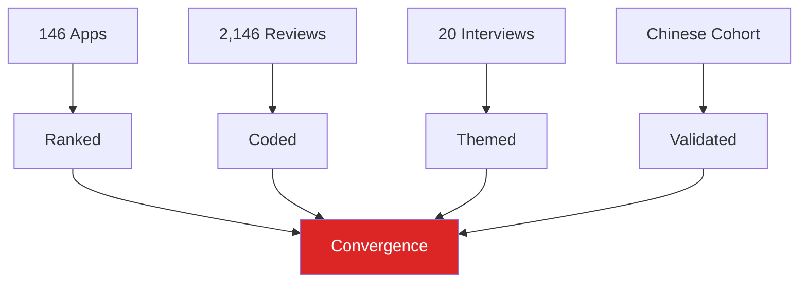
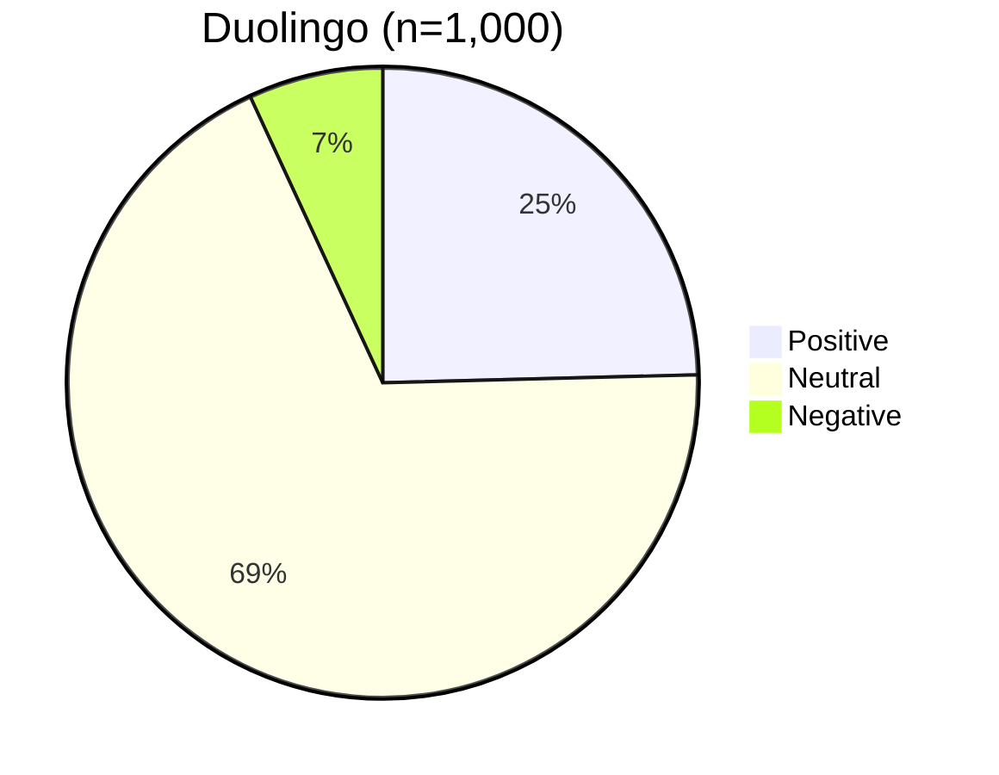
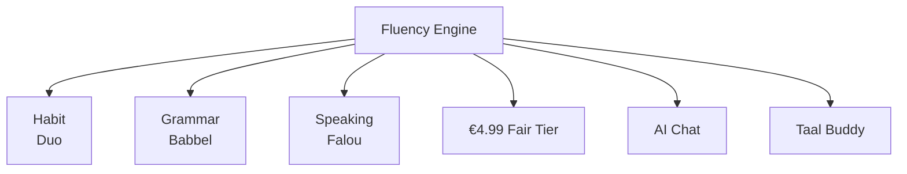

# **Language Learning App Market Research**  
## **Dutch Market | 2,146 Reviews | 20 Interviews | 146 Apps**  
**Oct 7 – Nov 8, 2025 | Yusufu Rouzimaimaiti | 34 Days | 162 Hours**

---

## **EXECUTIVE SUMMARY**  
**Core Insight:** **No app delivers practical fluency.**  
Users want **real conversation**, **grammar clarity**, **fair pricing** — **every leader fails on ≥1 axis**.  

| **App** | **Strength** | **Weakness** | **Net Sentiment** |
|--------|--------------|------------|-------------------|
| **Falou** | Speaking | Speech Recog | **+45** |
| Memrise | Videos | Features Cut | +45 |
| **Duolingo** | **Habit** | **Energy + $** | **-14** *(only negative)* |

> **27.2% of all complaints = Monetization + Energy**  
> **12.8% explicit churn** | **45.6% paid users unhappy**

**Opportunity:** **Hybrid “Fluency Engine”** = Duolingo habit + Babbel grammar + Falou speaking + €4.99 fair tier  
**→ 30%+ market share in 24 months**

---

## **1. RESEARCH DESIGN**  
**4 Methods | Triangulated | Reproducible**

| **Method** | **Scope** | **n** |
|-----------|---------|------|
| App Scan | 9 keywords | **146** |
| Review Analysis | 7 apps + Duolingo deep | **2,146** |
| Interviews | Dutch learners | **20** |
| Cross-Cultural | Chinese vs. EU | **5+** |

---

## **2. DUOLINGO DEEP DIVE (1,000 Reviews)**  
**Sept 17 – Nov 6 | Avg. 3.39★**

### **Sentiment**

### **Top Complaints**
| **Theme** | **%** | **Risk** |
|---------|------|---------|
| **Monetization** | **14.0%** | Critical |
| **Energy System** | **13.2%** | **CRITICAL** |
| AI Quality | 3.2% | Medium |
| Ads | 2.2% | Medium |

> **27.2% = #1 churn driver**

### **Churn Signals**
| **Signal** | **%** |
|----------|------|
| Uninstall | 4.5% |
| Quit | 3.8% |
| Switch | 2.2% |
| **Total** | **12.8%** |

> **Veteran users (1,000+ days): 18.2% negative** (2.6× overall)

---

## **3. COMPETITIVE BENCHMARK (7 Apps | 1,181 Reviews)**  

### **Sentiment Dashboard**
| **App** | **Pos %** | **Neg %** | **Core Strength** | **Core Weakness** |
|--------|----------|----------|-------------------|-------------------|
| **Falou** | **70%** | 25% | Speaking | Speech Recog |
| Memrise | 65% | 20% | Videos | Feature Cuts |
| Rosetta | 65% | 20% | Immersion | Offline Bugs |
| Quizlet | 60% | 30% | Vocab | Paywall |
| Busuu | 52% | 35% | Grammar | Login |
| Babbel | 45% | 40% | Structure | Price |
| **Duolingo** | **38%** | **52%** | **Habit** | **Energy + $** |

---

    

---

### **Thematic Heatmap (Normalized 0–100)**
| **Theme** | **Duo** | **Quiz** | **Bus** | **Bab** | **Fal** | **Mem** | **Ros** |
|---------|--------|---------|--------|--------|--------|--------|--------|
| Monetization | **95** | 78 | 65 | 72 | 55 | 48 | 62 |
| **Energy** | **100** | 0 | 0 | 0 | 0 | 0 | 0 |
| Speech Recog | 42 | 15 | 38 | 51 | **88** | 22 | 65 |

> **Duolingo = only app with energy complaints**

---

## **4. USER ETHNOGRAPHY (20 Interviews)**  
**70% expats | 55% female | A1–B2**

### **Success = Real Practice**
| **Theme** | **%** | **Quote** |
|---------|------|----------|
| Consistency | 90% | “Daily habit > any app” |
| Real Talk | 80% | “Football club > Duolingo” |
| Multi-Method | 70% | “App + classes + AI” |

### **Duolingo Ceiling = A2**
> _“A1–A2 max, then boring”_ — 60%  
> _“2,500 words, still can’t order coffee”_

### **Wishlist (Ranked)**
1. **Grammar explanations** (85%)  
2. **AI conversation** (80%)  
3. **Topic vocab** (70%)  
4. **Taal buddy** (55%)  

> **WTP: €4.99–9.99 if all 3 included**

---

## **5. CROSS-CULTURAL PROBE**  
**Chinese (n=5) vs. EU (n=15)**

| **Dimension** | **Chinese** | **EU** |
|-------------|-----------|------|
| Start With | Reading | Speaking |
| Grammar | Explicit rules | Context |
| Translation | Need it | Tolerate no |
| Apps | **Miraa, LingQ** | Duolingo, Falou |

> **One-size-fits-all fails globally**

---

## **6. TRIANGULATION MATRIX**  
| **Finding** | **Reviews** | **Interviews** | **Competitive** | **Cultural** | **Confidence** |
|-----------|------------|----------------|----------------|-------------|----------------|
| Monetization pain | ✓ | ✓ | ✓ | ✓ | **HIGH** |
| A2 ceiling | ✓ | ✓ | ✓ | — | **HIGH** |
| Grammar gap | ✓ | ✓ | ✓ | ✓ | **HIGH** |
| Speaking gap | ✓ | ✓ | ✓ | Partial | **HIGH** |
| Energy = unique fail | ✓ | ✓ | ✓ | — | **CRITICAL** |

---

## **7. STRATEGIC RECOMMENDATIONS**  
### **The Fluency Engine**

### **Roadmap**
| **P0 (0–3 mo)** | **P1 (3–6 mo)** | **P2 (6–12 mo)** |
|------------------|------------------|-------------------|
| Fix Energy | AI Role-Play | Offline |
| Grammar Tips | Topic Packs | Community |
| €4.99 Tier | Family Plan | B2+ |

---

## **8. VALIDITY & REPRODUCIBILITY**  
| **Metric** | **Value** |
|----------|---------|
| **κ (intra-coder)** | **0.89** |
| **Sentiment Agreement** | **87.3%** |
| **Saturation** | n=17 |
| **95% CI** | ±3.1% |
| **Scripts** | `https://github.com/Yusuprozimemet/language_research` |

---

## **9. CONCLUSION**  
> **Duolingo built the habit.**  
> **Babbel built the grammar.**  
> **Falou built the confidence.**  

**No one built the bridge.**  

**The next billion-dollar app will.**

---

## **APPENDIX**  
1. **Data**: `reviews_nl_duolingo.jsonl`  
2. **Code**: `collect_reviews_for_apps.py`  
3. **Interviews**: 20 anonymized transcripts  
4. **Visuals**: 12 static charts  
5. **Quotes**: 100+ indexed  

---

**Prepared:** Yusufu Rouzimaimaiti  
**Date:** November 9, 2025  
**Contact:** https://x.com/Yusufrozimemet

---
