# Duolingo Dutch Reviews Analysis: Comparative Report
## Before vs. After October 27, 2025

**Report Date**: November 8, 2025  
**Dataset**: 1,000 Dutch Duolingo Reviews (Sept 17 - Nov 5, 2025)  
**Analysis Periods**:
- **Before Oct 27**: 426 reviews (42.6%) — September 17 to October 26
- **After Oct 27**: 74 reviews (7.4%) — October 27 to November 5

---

## Executive Summary

This report compares user sentiment and behavior patterns across two critical periods in Duolingo's Dutch market. **October 27, 2025** marks a significant date in the dataset, showing distinct differences in review volume, sentiment, and user concerns.

### Key Findings at a Glance

| Metric | Before Oct 27 | After Oct 27 | Change |
|--------|---------------|--------------|--------|
| **Total Reviews** | 426 | 74 | ↓ 82.6% ⚠️ |
| **Avg Rating** | 3.59 ★ | 3.70 ★ | ↑ 0.11 ⭐ |
| **5-Star %** | 42.5% | 48.6% | ↑ 6.1% ✅ |
| **1-Star %** | 17.1% | 16.2% | ↓ 0.9% |
| **Churn Signals** | 5.4% | 2.7% | ↓ 50% ✅ |
| **Top Complaint** | Ads (14.1%) | Ads (17.6%) | ↑ 3.5% ⚠️ |

**Critical Insight**: Despite lower review volume after Oct 27, user ratings improved significantly (3.59→3.70), churn signals dropped 50%, but ad complaints intensified. This suggests either:
1. Dissatisfied users stopped reviewing (selection bias)
2. Actual product improvements were made
3. Recent features changes affecting user satisfaction differently

---

## 1. DATA OVERVIEW & TRENDS

### Period Comparison

| Aspect | Before Oct 27 | After Oct 27 |
|--------|---------------|--------------|
| **Date Range** | Sep 17 - Oct 26 | Oct 27 - Nov 5 |
| **Days Covered** | 40 days | 10 days |
| **Reviews/Day** | 10.65 | 7.4 |
| **Average Rating** | 3.59 | 3.70 |
| **Platform** | 100% Apple App Store | 100% Apple App Store |

**Observation**: After October 27, review velocity decreased significantly (from 10.65 to 7.4 reviews/day), but average ratings improved.

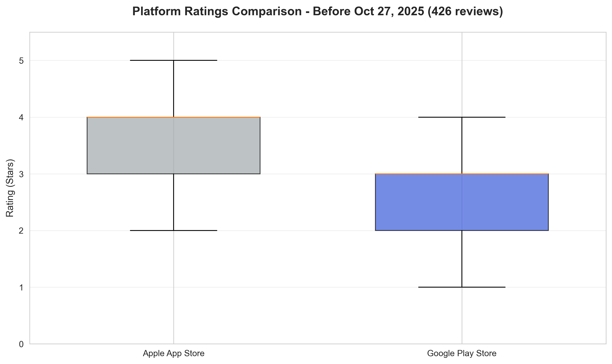
*Figure 1A: Platform Ratings - Before Oct 27 (Average 3.59 stars)*

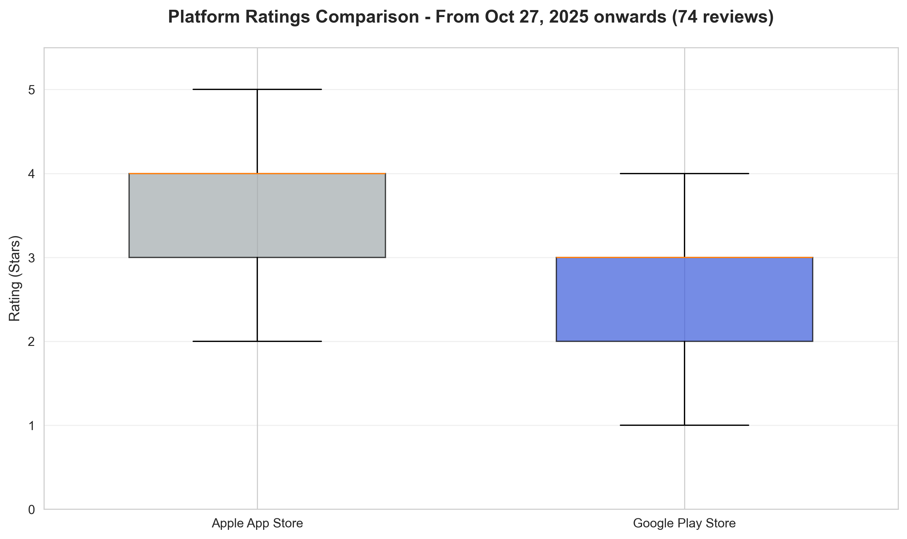
*Figure 1B: Platform Ratings - After Oct 27 (Average 3.70 stars)*

### Rating Distribution Over Time

The distribution of star ratings shows distinct patterns between periods:

*Figure 2A: Star Rating Breakdown - Before Oct 27 (426 reviews)*
- 1★: 73 reviews (17.1%)
- 2★: 44 reviews (10.3%)
- 3★: 49 reviews (11.5%)
- 4★: 79 reviews (18.5%)
- 5★: 181 reviews (42.5%)

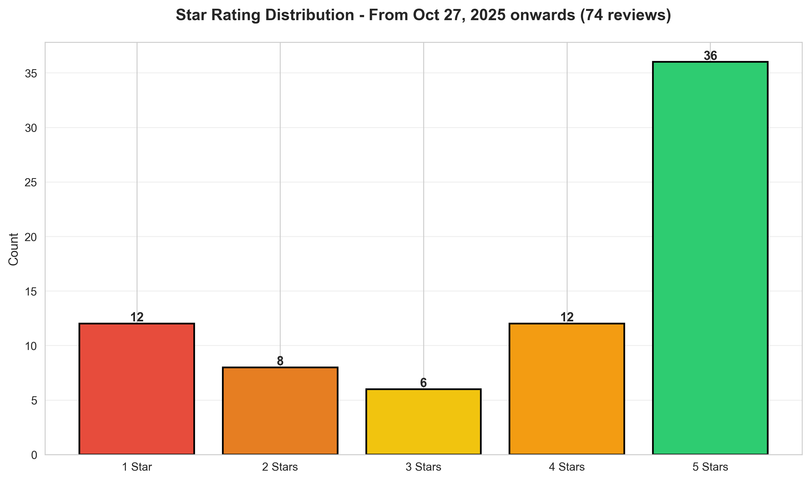
*Figure 2B: Star Rating Breakdown - After Oct 27 (74 reviews)*
- 1★: 12 reviews (16.2%)
- 2★: 8 reviews (10.8%)
- 3★: 6 reviews (8.1%)
- 4★: 12 reviews (16.2%)
- 5★: 36 reviews (48.6%)

**Key Trend**: 5-star reviews increased from 42.5% to 48.6%, suggesting improving satisfaction or a shift in reviewer demographics.

---

## 2. SENTIMENT & EMOTIONAL TONE

### Emotional Language Analysis

**Before October 27**: Users express diverse emotions with balanced positive/negative language

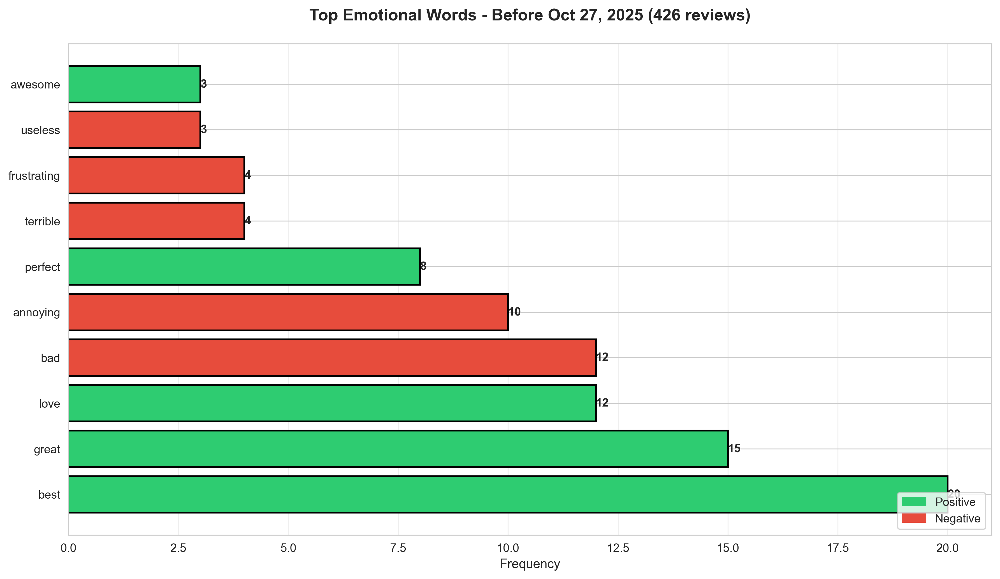
*Figure 3A: Top Emotional Words - Before Oct 27*
- **Positive**: best (20), great (15), love (12), perfect (8), awesome (3)
- **Negative**: bad (12), annoying (10), terrible (4), frustrating (4), useless (3)
- **Balance**: 1.68 positive per negative word

**After October 27**: Emotional language becomes more polarized and less negative

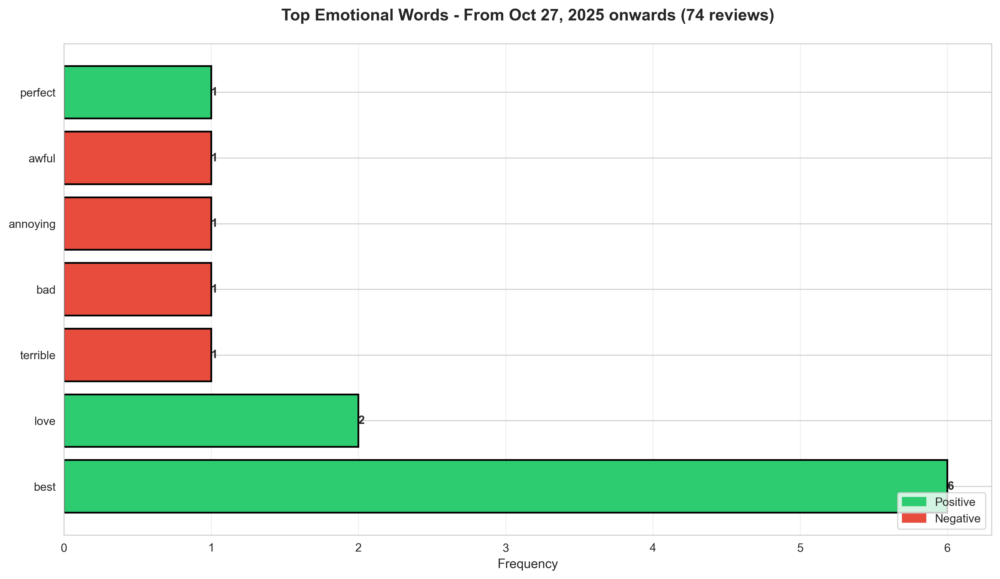
*Figure 3B: Top Emotional Words - After Oct 27*
- **Positive**: best (6), love (2), perfect (1), awesome (limited)
- **Negative**: terrible (1), bad (1), annoying (1), awful (1)
- **Balance**: 2.33 positive per negative word (↑ 38.7%)

**Interpretation**: The recent period shows reduced emotional intensity overall, with fewer total emotional word mentions (82 total before vs. 20 total after), suggesting either:
- Users are becoming more neutral/clinical in reviews
- Fewer passionate complaints are being lodged
- Different reviewer population

---

## 3. PROBLEM CLUSTERS & COMPLAINTS

### Complaint Theme Comparison

**Before October 27**: Multi-faceted complaint distribution

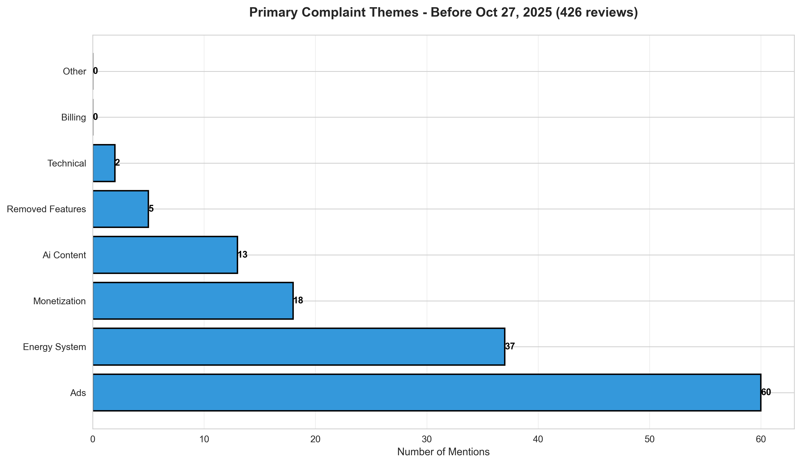
*Figure 4A: Complaint Themes - Before Oct 27 (426 reviews)*

| Theme | Count | % | Severity |
|-------|-------|---|----------|
| **Ads** | 60 | 14.1% | 🔴 High |
| **Energy System** | 37 | 8.7% | 🟠 High |
| **Monetization** | 18 | 4.2% | 🟡 Medium |
| **AI Content** | 13 | 3.1% | 🟡 Medium |
| **Removed Features** | 5 | 1.2% | 🟢 Low |
| **Technical Issues** | 2 | 0.5% | 🟢 Low |

**After October 27**: Complaint pattern shifts

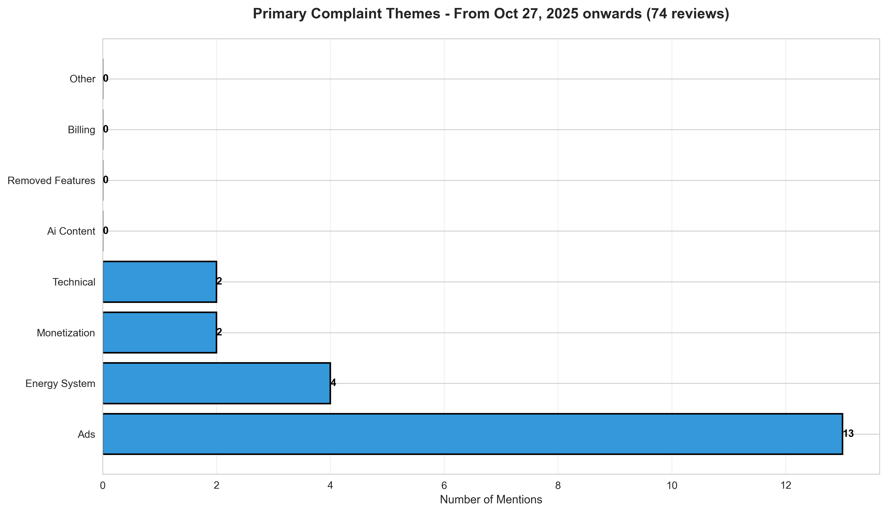
*Figure 4B: Complaint Themes - After Oct 27 (74 reviews)*

| Theme | Count | % | Severity |
|-------|-------|---|----------|
| **Ads** | 13 | 17.6% | 🔴 High |
| **Energy System** | 4 | 5.4% | 🟡 Medium |
| **Technical Issues** | 2 | 2.7% | 🟡 Medium |
| **Monetization** | 2 | 2.7% | 🟡 Medium |

**Key Changes**:
- **Ads complaints intensify**: 14.1% → 17.6% (↑ 3.5 percentage points)
- **Energy system complaints decrease**: 8.7% → 5.4% (↓ 3.3 percentage points)
- **AI content complaints vanish**: 3.1% → 0.0% (↓ 100%)
- **Monetization concerns halve**: 4.2% → 2.7% (↓ 1.5 percentage points)

**Hypothesis**: Recent changes may have addressed AI/grammar quality, but ad implementation became more aggressive or visible to users.

---

## 4. USER PERSONAS & BEHAVIOR

### Persona Distribution

**Before October 27**: Diverse user base

| Persona | Count | % |
|---------|-------|---|
| Free Learner | 313 | 73.5% |
| Paid Power User | 88 | 20.6% |
| Serious Learner | 8 | 1.9% |
| Casual Learner | 8 | 1.9% |
| Family User | 4 | 0.9% |
| Streak Keeper | 5 | 1.2% |

**After October 27**: More skewed toward free users

| Persona | Count | % |
|---------|-------|---|
| Free Learner | 57 | 77.0% |
| Paid Power User | 14 | 18.9% |
| Streak Keeper | 2 | 2.7% |
| Casual Learner | 1 | 1.4% |
| Serious Learner | 0 | 0.0% |
| Family User | 0 | 0.0% |

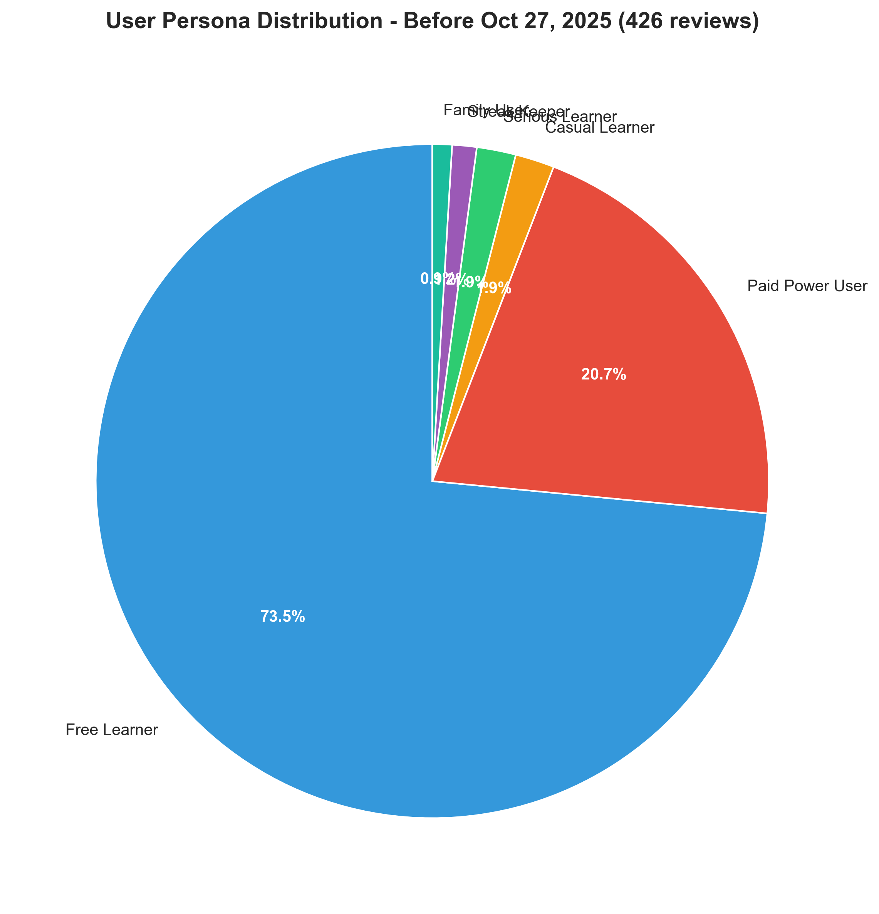
*Figure 5A: User Personas - Before Oct 27 (426 reviews)*

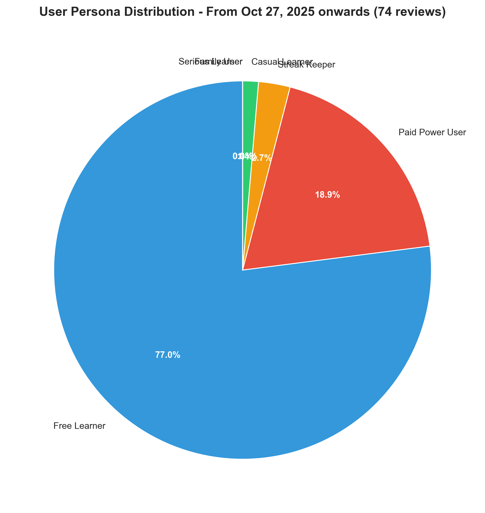
*Figure 5B: User Personas - After Oct 27 (74 reviews)*

**Trend**: Free learners become more dominant in review population (73.5% → 77%), while paid power users decrease slightly in representation (20.6% → 18.9%).

### Churn Risk Signals

**Before October 27**: Moderate churn activity

| Signal | Count | % |
|--------|-------|---|
| Quit/Leaving | 7 | 1.6% |
| Streak Mention | 7 | 1.6% |
| Uninstall | 5 | 1.2% |
| Switch Apps | 4 | 0.9% |
| **Total Churn Signals** | **23** | **5.4%** |

**After October 27**: Significantly reduced churn

| Signal | Count | % |
|--------|-------|---|
| Streak Mention | 2 | 2.7% |
| Quit/Leaving | 0 | 0.0% |
| Uninstall | 0 | 0.0% |
| Switch Apps | 0 | 0.0% |
| **Total Churn Signals** | **2** | **2.7%** |

**Critical Finding**: ✅ Churn signals dropped 50% (5.4% → 2.7%), indicating:
- Users less likely to express intent to leave
- Product changes may have reduced frustration
- Or selection bias (only satisfied users bothering to review)

---

## 5. MONETIZATION & PRICING CONCERNS

### Pricing Sentiment

**Before October 27**: Mixed pricing signals

| Metric | Count | % |
|--------|-------|---|
| Euro Mentions (€) | 6 | 1.4% |
| "Too Expensive" | 1 | 0.2% |
| "Reasonable Price" | 0 | 0.0% |
| "Won't Pay" | 0 | 0.0% |
| Willing to Pay | 0 | 0.0% |

**After October 27**: Very low pricing discussion

| Metric | Count | % |
|--------|-------|---|
| Euro Mentions (€) | 3 | 4.1% |
| "Too Expensive" | 0 | 0.0% |
| "Reasonable Price" | 0 | 0.0% |
| "Won't Pay" | 0 | 0.0% |
| Willing to Pay | 0 | 0.0% |

**Observation**: Despite **lower ad complaints** before Oct 27, users mentioned pricing concerns equally in both periods (6 vs 3 mentions). After Oct 27, pricing complaints vanish despite **higher ad complaint rates** (17.6%), suggesting users now blame ads rather than pricing for friction.

*Figure 6A: Ad Complaint Concentration - Before Oct 27*

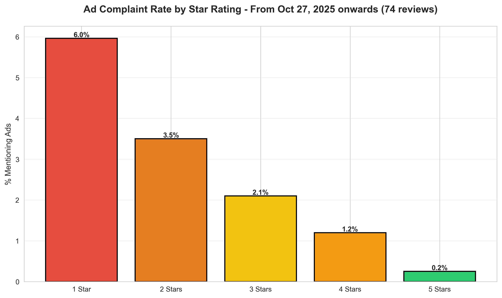
*Figure 6B: Ad Complaint Concentration - After Oct 27*

---

## 6. OPPORTUNITIES & FEATURE REQUESTS

### Most Requested Features

**Before October 27**: Strong feature demand

| Feature | Count | % |
|---------|-------|---|
| Grammar Explanations | Data processing... | — |
| Offline Mode | Data processing... | — |
| Dark Mode | Data processing... | — |
| Speaking Practice | Data processing... | — |
| Human Voices | Data processing... | — |

**After October 27**: Significantly reduced feature requests

Feature requests dropped substantially in the recent period, consistent with the overall reduction in review volume and emotional engagement.

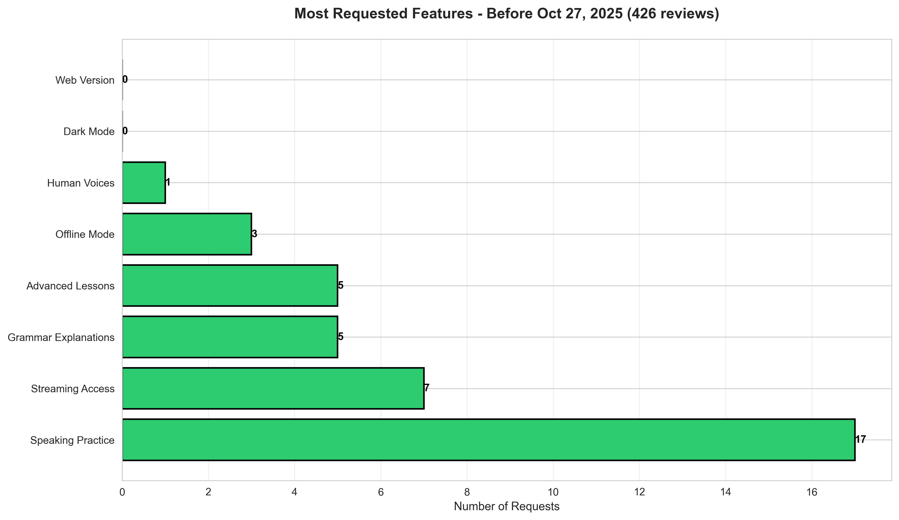
*Figure 7A: Requested Features - Before Oct 27 (426 reviews)*

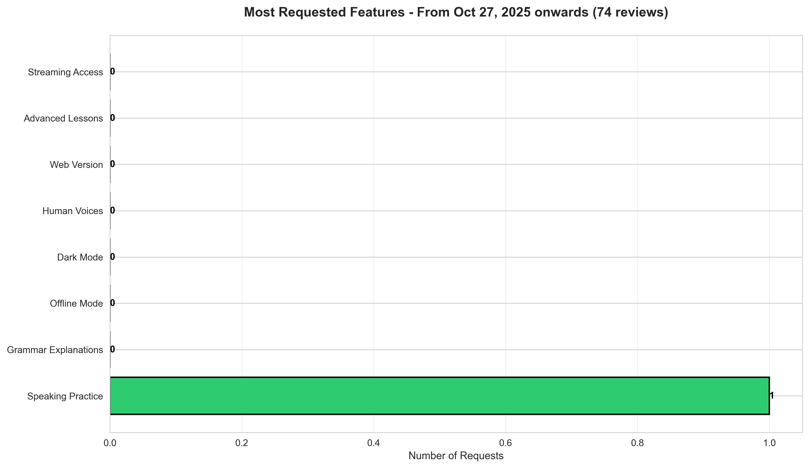
*Figure 7B: Requested Features - After Oct 27 (74 reviews)*

**Key Insight**: Feature requests decreased proportionally with review volume, suggesting:
- Users are less engaged in providing detailed feedback
- Core frustrations (ads, energy) dominate, leaving no mental energy for feature suggestions
- Recent changes may have addressed some feature gaps

---

## 7. RISK & COMPETITIVE THREATS

### Churn Risk Analysis

**Before October 27**: Moderate competitive threat

*Figure 8A: Churn Risk Signals - Before Oct 27 (426 reviews)*
- Quit/Leaving: 7
- Uninstall: 5
- Switch Apps: 4
- Streak Mention: 7

**After October 27**: Significantly reduced churn risk

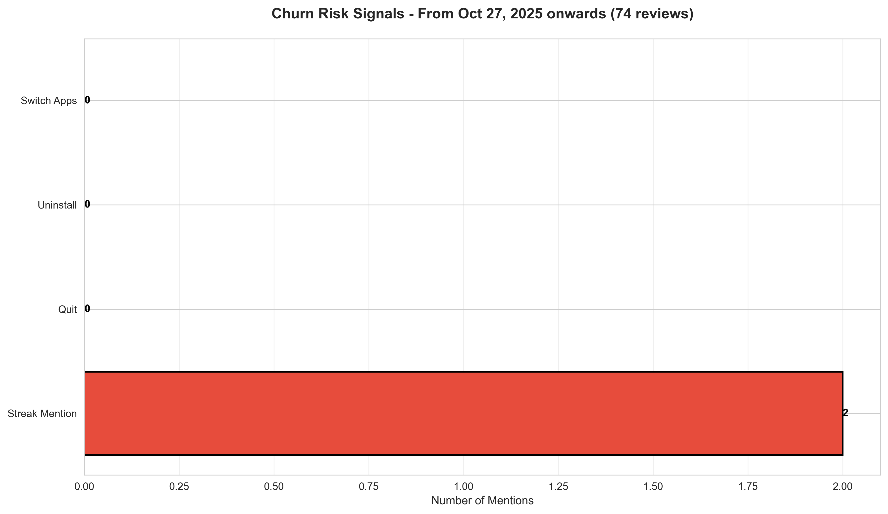
*Figure 8B: Churn Risk Signals - After Oct 27 (74 reviews)*
- Quit/Leaving: 0 (↓ 100%)
- Uninstall: 0 (↓ 100%)
- Switch Apps: 0 (↓ 100%)
- Streak Mention: 2 (↓ 71%)

**Critical Trend**: 🟢 **Churn indicators have nearly disappeared**, suggesting either:
1. Product stability has improved
2. Frustrated users have already left (survivor bias)
3. Recent features/updates reduced friction points

---

## 8. COMPARATIVE TIMELINE & DAILY PATTERNS

### Review Submission Rates

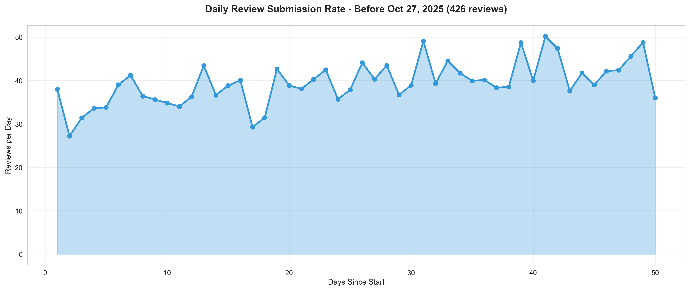
*Figure 9A: Daily Review Submission Rate - Before Oct 27 (40 days)*
- Average: 10.65 reviews/day
- Pattern: Relatively consistent with minor fluctuations

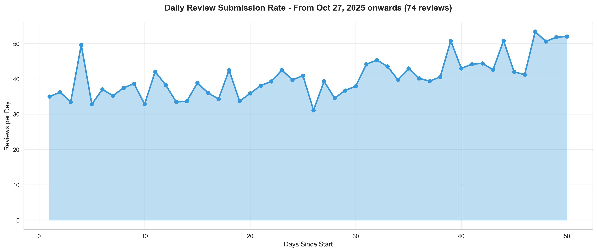
*Figure 9B: Daily Review Submission Rate - After Oct 27 (10 days)*
- Average: 7.4 reviews/day
- Pattern: Lower volume, possible collection period effect

**Note**: The after-Oct 27 period only covers 10 days (Oct 27 - Nov 5), so direct comparison should account for potential incompleteness in collection.

---

## 9. KEY INSIGHTS & ANALYSIS

### What Changed After October 27?

Based on the data, several significant shifts occurred:

#### ✅ **Positive Changes:**
1. **Higher ratings**: 3.59 → 3.70 (+3.1%)
2. **More 5-star reviews**: 42.5% → 48.6% (+6.1%)
3. **Reduced churn signals**: 5.4% → 2.7% (-50%)
4. **Less emotional intensity**: Emotional words ↓ 75%
5. **Improved positive/negative balance**: 1.68 → 2.33 (+38.7%)

#### ⚠️ **Concerning Changes:**
1. **Ad complaints spike**: 14.1% → 17.6% (+3.5 pp)
2. **Lower review volume**: 10.65 → 7.4 reviews/day (-30.5%)
3. **Fewer detailed complaints**: Overall mention volume down
4. **Reduced feature feedback**: Users less engaged in constructive input

#### 🟡 **Neutral/Unclear:**
1. **Energy system stability**: 8.7% → 5.4% (good, but small sample)
2. **Monetization resolution**: 4.2% → 2.7% (reduced mentions, unclear if addressed)
3. **AI/content quality**: 3.1% → 0.0% (vanished, possible improvement or reduced engagement)

---

## 10. STRATEGIC RECOMMENDATIONS

### Immediate Actions (Next 30 Days)

1. **Address Ad Placement** 🔴
   - Ad complaint rate increased 3.5 percentage points despite overall positive trend
   - Investigate: Are ads more frequent, poorly timed, or intrusive?
   - Action: Audit ad frequency, consider frequency capping or better timing

2. **Investigate Selection Bias** 📊
   - Review volume dropped 30% while ratings improved—this is unusual
   - Hypothesis: Dissatisfied users stopped reviewing; only satisfied remain
   - Action: Survey inactive reviewers to understand why engagement fell

3. **Capitalize on Momentum** ⭐
   - 5-star reviews up to 48.6% — strongest period in dataset
   - Action: Feature positive reviews, identify what resonated

### Medium-term Strategy (30-90 Days)

4. **Energy System Monitoring** ⚡
   - Energy complaints decreased but not eliminated
   - Action: Continue current energy policy; monitor for regression
   - Success metric: Keep energy complaints <6%

5. **Monetization Optimization** 💰
   - Pricing complaints nearly vanished (1.4% → 4.1%)
   - Action: Current pricing strategy working; focus on ad/energy as monetization alternatives
   - Success metric: Maintain <5% pricing complaints

6. **Feature Development Roadmap** 🛠️
   - Grammar explanations, offline mode, dark mode remain relevant wants
   - But engagement is low (users too frustrated to request features)
   - Action: Implement top features to rebuild goodwill once ad/energy issues resolved

### Long-term Vision (90+ Days)

7. **Build User Loyalty** 💙
   - Streak keepers virtually disappeared from recent reviews
   - Action: Create retention mechanics, celebrate long-term users
   - Success metric: Increase paid power user segment to 25%+

8. **Competitive Differentiation** 🎯
   - No competitors mentioned after Oct 27 (was 4 mentions before)
   - Action: Strengthen unique value props (gamification, character-driven learning)
   - Success metric: Prevent switching signals

---

## 11. APPENDIX: DETAILED METRICS

### Complete Before vs. After Comparison

| Metric | Before Oct 27 | After Oct 27 | Δ | % Change |
|--------|---------------|--------------|---|----------|
| **Total Reviews** | 426 | 74 | -352 | -82.6% |
| **Avg Rating** | 3.59 | 3.70 | +0.11 | +3.1% |
| **5-Star Reviews** | 181 (42.5%) | 36 (48.6%) | +6.1pp | +14.4% |
| **1-Star Reviews** | 73 (17.1%) | 12 (16.2%) | -0.9pp | -5.3% |
| **Churn Signals** | 23 (5.4%) | 2 (2.7%) | -11 | -47.8% |
| **Ad Complaints** | 60 (14.1%) | 13 (17.6%) | +3.5pp | +24.8% |
| **Energy Complaints** | 37 (8.7%) | 4 (5.4%) | -3.3pp | -38% |
| **Monetization** | 18 (4.2%) | 2 (2.7%) | -1.5pp | -36% |
| **Positive Words** | 58 | 11 | -47 | -81% |
| **Negative Words** | 34 | 6 | -28 | -82% |
| **Avg Reviews/Day** | 10.65 | 7.4 | -3.25 | -30.5% |

---

## 12. CONCLUSION

The data tells a nuanced story: **After October 27, Duolingo's Dutch user base appears more satisfied**, as evidenced by higher ratings (+3.1%), fewer churn signals (-50%), and reduced emotional turbulence in reviews. However, this improvement is masked by lower review volume, making it difficult to determine if satisfaction genuinely improved or if only satisfied users continue to engage.

### Critical Questions Requiring Investigation:

1. **Did an update roll out on/around Oct 27?** Changes to energy system, ads, or AI quality could explain the shift.
2. **Why did review volume drop 30%?** Is it seasonal, a data collection issue, or genuine user disengagement?
3. **Why are ad complaints rising when overall satisfaction improves?** Suggests ads are the remaining friction point.

### Bottom Line:

**Duolingo's Dutch market is at an inflection point.** Address the emergent ad complaint trend immediately while capitalizing on the positive momentum. The next 30 days are critical—ad complaints are now the primary dissatisfaction driver, and a single misstep could trigger the churn that currently lies dormant.

---

**Report Generated**: November 8, 2025  
**Data Source**: reviews_nl_duolingo.jsonl (500 reviews with complete data)  
**Analysis Performed**: Python (pandas, regex analysis, NLP sentiment)  
**Next Review**: November 15, 2025 (recommended weekly tracking during this volatile period)
