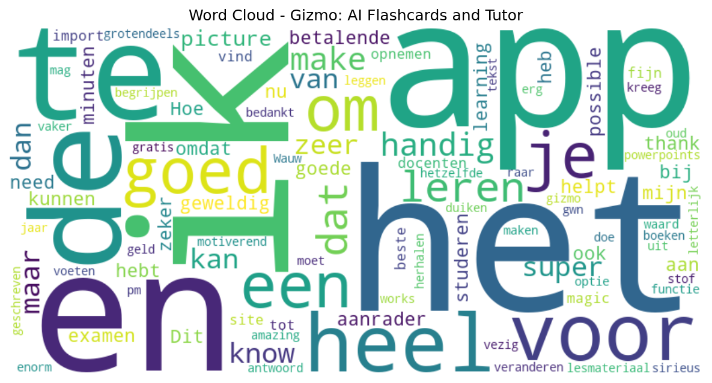

# Gizmo: AI Flashcards and Tutor

## 📱 App Information

| **Attribute** | **Google Play** | **App Store** |
|---------------|-----------------|---------------|
| **Title** | Gizmo: AI Flashcards and Tutor | N/A |
| **Package/ID** | ai.saveall.app | N/A |
| **Rating** | 4.6742425 | N/A |
| **Total Ratings** | 86,623 | N/A |
| **Installs** | 1,000,000+ | N/A |
| **Genre** | Education | N/A |

## 📝 Description

Gizmo is the easiest way to learn. Its AI quizzes can help you learn and remember anything

AI Flashcard maker: Turns youtube videos, PDFs, notes powerpoints into flashcards - just click import.

AI Tutor: Teaches you anything, solves homework problems, and teaches you how to answer exam questions

## 📊 Reviews Analytics

**Total Reviews:** 28 (28 analyzed)
**Rating Distribution:** 26 positive (4-5★), 0 neutral (3★), 2 negative (1-2★)
**Average Sentiment:** 0.20 (-1=very negative, +1=very positive)
**Primary Language:** nl
**Key Insights:** Average rating: 4.6/5.0 | Overall sentiment: positive (score: 0.20) | Reviews in 5 languages, primarily nl (15 reviews) | Reviews from 1 platform(s): google | Key themes: app, ik, het


### 🔑 Key Themes & Phrases

- **app** (relevance: 0.109)
- **ik** (relevance: 0.098)
- **het** (relevance: 0.068)
- **en** (relevance: 0.064)
- **zeer** (relevance: 0.061)
- **know** (relevance: 0.060)
- **een** (relevance: 0.059)
- **make** (relevance: 0.057)

### ⭐ Rating Breakdown

- **5 ★★★★★**: 22 reviews (78.6%)
- **4 ★★★★☆**: 4 reviews (14.3%)
- **2 ★★☆☆☆**: 1 reviews (3.6%)
- **1 ★☆☆☆☆**: 1 reviews (3.6%)

### 🌍 Languages in Reviews

- **nl**: 15 reviews
- **en**: 6 reviews
- **unknown**: 4 reviews
- **af**: 2 reviews
- **no**: 1 reviews

### 📱 Platform Distribution

- **google**: 28 reviews

## 📈 Visualizations

### Analytics Charts


### Word Cloud


## 💬 Sample Reviews

**Review 1** (★★★★★ - google - 2025-11-03T20:26:33)
> beste app tot nu

**Review 2** (★★★★★ - google - 2025-08-22T08:02:04)
> Wauw een aanrader!

**Review 3** (★★★★★ - google - 2025-05-21T10:58:07)
> je bn super duper leuk en hier kan ik snel leren💚💚💚💚💚tyyyyy🙈💯👍

**Review 4** (★★★★★ - google - 2024-12-02T14:37:07)
> echt het helpt zo goed voor het voorbereiden van toetsen

**Review 5** (★★★★ - google - 2022-11-16T18:11:24)
> Hi your app is great!! I do have a suggestion namely to save time. Would it be possible to take a picture of your sheet and that the app then makes it for you and that it's possible to adjust it. And how can the app know what you need to know? After you have taken that picture, you can select what y...

## 🔧 Raw JSON Data

<details>
<summary>Click to expand raw app data</summary>

```json
{
  "name": "Gizmo: AI Flashcards and Tutor",
  "google_package": "ai.saveall.app",
  "google": {
    "title": "Gizmo: AI Flashcards and Tutor",
    "description": "Gizmo is the easiest way to learn. Its AI quizzes can help you learn and remember anything\r\n\r\nAI Flashcard maker: Turns youtube videos, PDFs, notes powerpoints into flashcards - just click import.\r\n\r\nAI Tutor: Teaches you anything, solves homework problems, and teaches you how to answer exam questions",
    "rating": 4.6742425,
    "rating_text": null,
    "ratings_total": 86623,
    "ratings_histogram": [
      594,
      1914,
      5876,
      7856,
      70183
    ],
    "installs": "1,000,000+",
    "genre": "Education"
  },
  "apple": null,
  "reviews": [
    {
      "platform": "google",
      "rating": 5,
      "review": "beste app tot nu",
      "date": "2025-11-03T20:26:33"
    },
    {
      "platform": "google",
      "rating": 5,
      "review": "ik vind de app en site heel goed om te leren en de magic import is heel fijn omdat ik mijn docenten kan opnemen en powerpoints kan veranderen in lesmateriaal het is ook grotendeels gratis",
      "date": "2025-10-30T16:43:53"
    },
    {
      "platform": "google",
      "rating": 4,
      "review": "super motiverend! goed bij herhalen van de stof. Dit doe ik vaker dan dat ik me boeken moet in duiken.",
      "date": "2025-10-29T22:14:30"
    },
    {
      "platform": "google",
      "rating": 5,
      "review": "heel goed vezig",
      "date": "2025-10-25T12:44:41"
    },
    {
      "platform": "google",
      "rating": 5,
      "review": "sirieus een aanrader. de functie pm het uit te leggen voor een 5 jaar oud is geweldig. het helpt enorm om te tekst goed te kunnen begrijpen. heel erg bedankt voor me 10, gizmo",
      "date": "2025-10-12T19:34:05"
    },
    {
      "platform": "google",
      "rating": 5,
      "review": "it works amazing 👏",
      "date": "2025-09-23T08:50:17"
    },
    {
      "platform": "google",
      "rating": 2,
      "review": "omdat ik maar 5 voeten mag maken en dat is gwn raar",
      "date": "2025-09-03T08:20:47"
    },
    {
      "platform": "google",
      "rating": 5,
      "review": "Wauw een aanrader!",
      "date": "2025-08-22T08:02:04"
    },
    {
      "platform": "google",
      "rating": 5,
      "review": "een zeer goede app",
      "date": "2025-08-21T17:09:25"
    },
    {
      "platform": "google",
      "rating": 5,
      "review": "heb nu de betalende optie maar zeker geld waard",
      "date": "2025-08-14T16:08:09"
    },
    {
      "platform": "google",
      "rating": 1,
      "review": "ik heb letterlijk hetzelfde antwoord geschreven en ik kreeg een -hart? dat is toch niet eerlijk",
      "date": "2025-06-30T22:43:03"
    },
    {
      "platform": "google",
      "rating": 4,
      "review": "Super handig voor het leren!",
      "date": "2025-06-12T06:56:39"
    },
    {
      "platform": "google",
      "rating": 5,
      "review": "it has helped alot",
      "date": "2025-06-11T21:23:12"
    },
    {
      "platform": "google",
      "rating": 5,
      "review": "supper",
      "date": "2025-05-26T01:40:39"
    },
    {
      "platform": "google",
      "rating": 5,
      "review": "je bn super duper leuk en hier kan ik snel leren💚💚💚💚💚tyyyyy🙈💯👍",
      "date": "2025-05-21T10:58:07"
    },
    {
      "platform": "google",
      "rating": 4,
      "review": "Heel goede app om makkelijk te kunnen studeren. Het is handig voor onderweg, maar zeker ook voor gewoon aan je bureau. Ik raad aan om in blokkken van 30-50 minuten te studeren en dan als \"pauze\" deze app te spelen. Hoe beter je gestudeerd hebt hoe langer je kunt doorspelen door het beperkte levels die hersteld worden na 10 minuten. 1 minpuntje dat je enkel bij de betalende versie alles unlimited hebt.",
      "date": "2025-05-08T18:40:14"
    },
    {
      "platform": "google",
      "rating": 5,
      "review": "handig om te leren ik ben 12 dus ik gebruik het tijdens de examens en het is zeer handig",
      "date": "2025-03-22T14:24:29"
    },
    {
      "platform": "google",
      "rating": 5,
      "review": "If you make pictures from your notes they make perfect questions from it, no ads, and no payments best way of learning tbh.",
      "date": "2025-03-16T13:24:54"
    },
    {
      "platform": "google",
      "rating": 5,
      "review": "it's nice if you know how to use it",
      "date": "2025-03-03T20:42:41"
    },
    {
      "platform": "google",
      "rating": 5,
      "review": "zeer gebruiksvriendelijk",
      "date": "2025-02-17T18:48:12"
    },
    {
      "platform": "google",
      "rating": 5,
      "review": "you guys make learning sp much better than in a class thank you so muchh🤍💕",
      "date": "2024-12-03T19:49:06"
    },
    {
      "platform": "google",
      "rating": 5,
      "review": "echt het helpt zo goed voor het voorbereiden van toetsen",
      "date": "2024-12-02T14:37:07"
    },
    {
      "platform": "google",
      "rating": 5,
      "review": "Gyat",
      "date": "2024-11-28T08:11:13"
    },
    {
      "platform": "google",
      "rating": 5,
      "review": "geweldig ik kende mijn heel examen in minder dan 30 min",
      "date": "2024-11-12T18:45:29"
    },
    {
      "platform": "google",
      "rating": 5,
      "review": "good app",
      "date": "2024-11-12T07:33:24"
    },
    {
      "platform": "google",
      "rating": 5,
      "review": "👍",
      "date": "2024-11-01T20:05:50"
    },
    {
      "platform": "google",
      "rating": 5,
      "review": "dit maakt studeer veel makkelijker",
      "date": "2024-10-09T15:59:02"
    },
    {
      "platform": "google",
      "rating": 4,
      "review": "Hi your app is great!! I do have a suggestion namely to save time. Would it be possible to take a picture of your sheet and that the app then makes it for you and that it's possible to adjust it. And how can the app know what you need to know? After you have taken that picture, you can select what you need and what you don't. Hopefully you'll be okay with it? Thanks in advance for reading this think about it. With kind regards of a very happy student",
      "date": "2022-11-16T18:11:24"
    }
  ]
}
```

</details>

---
*Report generated on 2025-11-08 13:48:29 using advanced analytics*
