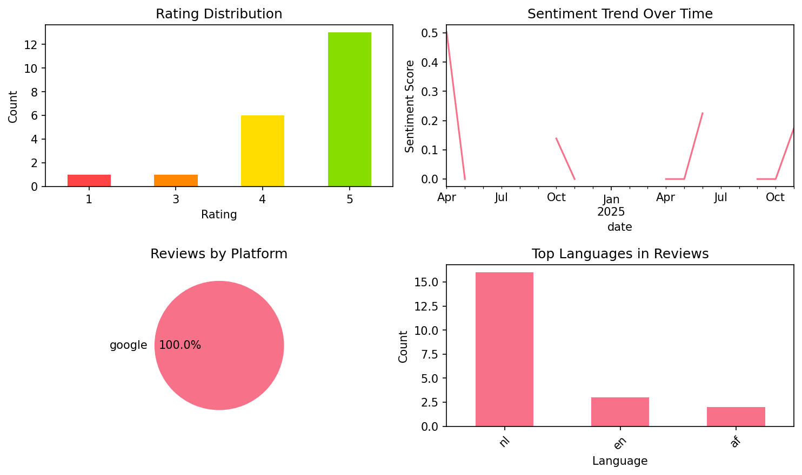

# Flashcard maker

## 📱 App Information

| **Attribute** | **Google Play** | **App Store** |
|---------------|-----------------|---------------|
| **Title** | Flashcard maker | N/A |
| **Package/ID** | com.alpaca.flashcardsmaker | N/A |
| **Rating** | 4.6346154 | N/A |
| **Total Ratings** | 9,052 | N/A |
| **Installs** | 100,000+ | N/A |
| **Genre** | Tools | N/A |

## 📝 Description

Features

- Quickly create cards with easy operation
Easy to use and made with a thorough focus on ease of use. Quickly create cards.

- Customize it to fit your needs
You can customize it to suit yourself by displaying only the cards you have difficulty with or rearranging them in any order you like. You can also search for words, copy cards, and more.

- Speech-reading function
Text-to-speech reading of cards is supported. The cards can be read out loud, not only in English, but also in several other languages, making it ideal for listening comprehension. The cards can also be played back repeatedly, making it useful in a variety of situations, such as listening while on the move. The reading speed can also be adjusted, so if you have difficulty understanding the text, you can slow down the speed of the reading.

- Support for attaching images and sounds
Images and sounds can be attached to the card. You can launch the camera or voice recorder from within the app and quickly attach them to the card.

- Test mode
A test mode with four choices is provided to play with the flashcards you have created. The test mode is a fun way to learn through audio and animations. You can freely set the scope of the test, for example, to test only the cards you have difficulty with.

- Edit flashcards on PC
CSV file output and import are supported. You can output a template from the application and import it to your PC to register cards at once using your PC.

- Share created flashcards with friends
The app is equipped with a function for outputting flashcards, allowing you to easily share card data.

- Study only the cards you are weak in
You can set the memorization level for each card. You can also display and test only the cards you have difficulty with.

- Beautiful App Design
We aimed to create an app with a beautiful and sophisticated design that makes you want to touch it.

## 📊 Reviews Analytics

**Total Reviews:** 21 (21 analyzed)
**Rating Distribution:** 19 positive (4-5★), 1 neutral (3★), 1 negative (1-2★)
**Average Sentiment:** 0.11 (-1=very negative, +1=very positive)
**Primary Language:** nl
**Key Insights:** Average rating: 4.4/5.0 | Overall sentiment: positive (score: 0.11) | Reviews in 3 languages, primarily nl (16 reviews) | Reviews from 1 platform(s): google | Key themes: app, en, een


### 🔑 Key Themes & Phrases

- **app** (relevance: 0.191)
- **en** (relevance: 0.142)
- **een** (relevance: 0.095)
- **om** (relevance: 0.095)
- **je** (relevance: 0.092)
- **te** (relevance: 0.092)
- **great** (relevance: 0.086)
- **ik** (relevance: 0.086)

### ⭐ Rating Breakdown

- **5 ★★★★★**: 13 reviews (61.9%)
- **4 ★★★★☆**: 6 reviews (28.6%)
- **3 ★★★☆☆**: 1 reviews (4.8%)
- **1 ★☆☆☆☆**: 1 reviews (4.8%)

### 🌍 Languages in Reviews

- **nl**: 16 reviews
- **en**: 3 reviews
- **af**: 2 reviews

### 📱 Platform Distribution

- **google**: 21 reviews

## 📈 Visualizations

### Analytics Charts


### Word Cloud


## 💬 Sample Reviews

**Review 1** (★★★★ - google - 2025-11-04T00:06:06)
> Simple and to the point om met flashcards te oefenen (ik leer Italiaans). Betaalbaar. Ik mis wel de mogelijkheid om mijn eigen woorden in te typen bij de spellingtest en ook een veel makkelijker manier om bestanden door te sturen.

**Review 2** (★★★★★ - google - 2025-10-01T14:56:44)
> ik vind het heel makkelijk om hier mee te werken!

**Review 3** (★★★★★ - google - 2025-05-05T08:25:16)
> zeer.goede app en makkelijk in gebruik

**Review 4** (★★★★★ - google - 2024-10-12T20:09:16)
> Super goeie app!

**Review 5** (★★★★★ - google - 2024-04-10T15:57:35)
> Works great, the beter you get with a word the hghr level the word is and you can learn certain levels, you can also practice writing the words, works great for me!

## 🔧 Raw JSON Data

<details>
<summary>Click to expand raw app data</summary>

```json
{
  "name": "Flashcard maker",
  "google_package": "com.alpaca.flashcardsmaker",
  "google": {
    "title": "Flashcard maker",
    "description": "Features\r\n\r\n- Quickly create cards with easy operation\r\nEasy to use and made with a thorough focus on ease of use. Quickly create cards.\r\n\r\n- Customize it to fit your needs\r\nYou can customize it to suit yourself by displaying only the cards you have difficulty with or rearranging them in any order you like. You can also search for words, copy cards, and more.\r\n\r\n- Speech-reading function\r\nText-to-speech reading of cards is supported. The cards can be read out loud, not only in English, but also in several other languages, making it ideal for listening comprehension. The cards can also be played back repeatedly, making it useful in a variety of situations, such as listening while on the move. The reading speed can also be adjusted, so if you have difficulty understanding the text, you can slow down the speed of the reading.\r\n\r\n- Support for attaching images and sounds\r\nImages and sounds can be attached to the card. You can launch the camera or voice recorder from within the app and quickly attach them to the card.\r\n\r\n- Test mode\r\nA test mode with four choices is provided to play with the flashcards you have created. The test mode is a fun way to learn through audio and animations. You can freely set the scope of the test, for example, to test only the cards you have difficulty with.\r\n\r\n- Edit flashcards on PC\r\nCSV file output and import are supported. You can output a template from the application and import it to your PC to register cards at once using your PC.\r\n\r\n- Share created flashcards with friends\r\nThe app is equipped with a function for outputting flashcards, allowing you to easily share card data.\r\n\r\n- Study only the cards you are weak in\r\nYou can set the memorization level for each card. You can also display and test only the cards you have difficulty with.\r\n\r\n- Beautiful App Design\r\nWe aimed to create an app with a beautiful and sophisticated design that makes you want to touch it.",
    "rating": 4.6346154,
    "rating_text": null,
    "ratings_total": 9052,
    "ratings_histogram": [
      429,
      85,
      171,
      953,
      7392
    ],
    "installs": "100,000+",
    "genre": "Tools"
  },
  "apple": null,
  "reviews": [
    {
      "platform": "google",
      "rating": 4,
      "review": "Simple and to the point om met flashcards te oefenen (ik leer Italiaans). Betaalbaar. Ik mis wel de mogelijkheid om mijn eigen woorden in te typen bij de spellingtest en ook een veel makkelijker manier om bestanden door te sturen.",
      "date": "2025-11-04T00:06:06"
    },
    {
      "platform": "google",
      "rating": 3,
      "review": "I bought the app and it’s ok. I just have one downside: you can’t organize the flashcards into categories, and you also can’t change the font style or size — it’s often too large, which most other flashcard apps allow. Also, the option to mute the audio doesn’t work; I’ve tested this on multiple devices. If you could fix these issues in the app, it would be perfect.",
      "date": "2025-11-02T06:43:43"
    },
    {
      "platform": "google",
      "rating": 5,
      "review": "een hele fijne app om te gebruiken. complimenten aan de makers van deze app.",
      "date": "2025-10-27T10:50:58"
    },
    {
      "platform": "google",
      "rating": 4,
      "review": "handig soms advertenties wel irritant en de maximum",
      "date": "2025-10-08T22:20:43"
    },
    {
      "platform": "google",
      "rating": 5,
      "review": "Een geweldige app.",
      "date": "2025-10-04T17:15:15"
    },
    {
      "platform": "google",
      "rating": 5,
      "review": "ik vind het heel makkelijk om hier mee te werken!",
      "date": "2025-10-01T14:56:44"
    },
    {
      "platform": "google",
      "rating": 5,
      "review": "handige en veelzijdige app",
      "date": "2025-09-09T18:01:56"
    },
    {
      "platform": "google",
      "rating": 5,
      "review": "Fijn studeren zo, help wel echt om dingen te memoriseren. Soms wat jammer van de reclame, haalt me uit m'n focus.",
      "date": "2025-09-08T16:17:33"
    },
    {
      "platform": "google",
      "rating": 4,
      "review": "deze app is echt geweldig voor leren. Ik heb hierdoor veel meer voldoendes gehaald Plus punten: ik kan op mijn pc/ laptop de woorden in een bestand maken en dan terugsturen naar mijn telefoon. Het hele systeem werkt probleem loos en erg soepel Min punten: Je hebt bovenin je scherm erg vervelende reclames die steeds flikkeren. de spellingstests zijn ook vrijwel waardeloos maar daar had ik het toch niet voor gedownload. de test jezelf daarin tegen werkt wel fantastisch. Kortom, geweldige app.",
      "date": "2025-06-30T08:31:30"
    },
    {
      "platform": "google",
      "rating": 5,
      "review": "honestly don't know why I didn't find this earlier this is so cool and it has built in audios for your flash cards which means you don't even have to do it yourself. THANK YOU FOR THIS APP ITS A GREAT DEAL :)))",
      "date": "2025-06-08T16:04:06"
    },
    {
      "platform": "google",
      "rating": 5,
      "review": "zeer.goede app en makkelijk in gebruik",
      "date": "2025-05-05T08:25:16"
    },
    {
      "platform": "google",
      "rating": 4,
      "review": "geweldig ik kan nu beter frans het helpt om te studeren maar het kost geld om meer dan 30 te doen maar anders zou ik het 5 sterren geven aanrader voor studeren",
      "date": "2025-04-23T17:02:07"
    },
    {
      "platform": "google",
      "rating": 5,
      "review": "de beste app! goed doorontwikkeld en goed over nagedacht!",
      "date": "2025-04-17T21:36:26"
    },
    {
      "platform": "google",
      "rating": 5,
      "review": "Werkt een stuk beter dan vele andere apps, het is recht naar het doel!",
      "date": "2024-11-20T19:49:13"
    },
    {
      "platform": "google",
      "rating": 4,
      "review": "Jammer dat je niet zoveel kan oefenen als je wilt en je daarvoor moet betalen voor de rest een goede app",
      "date": "2024-10-15T23:02:21"
    },
    {
      "platform": "google",
      "rating": 5,
      "review": "Super goeie app!",
      "date": "2024-10-12T20:09:16"
    },
    {
      "platform": "google",
      "rating": 4,
      "review": "Blijft om een recensie vragen ook al heb je een recensie geplaatst.",
      "date": "2024-10-11T16:53:23"
    },
    {
      "platform": "google",
      "rating": 5,
      "review": "Echt een hele fijne app. Je wordt niet platgegooid met reclame. Ik kan niet vinden waar je moet betalen, maar voor deze app betaal ik graag een kleine bijdrage. Ik gebruik het om mijn kinderen te helpen met leren. Dank jullie wel.",
      "date": "2024-07-08T15:14:49"
    },
    {
      "platform": "google",
      "rating": 1,
      "review": "Zonder Premium is deze app nutteloos, je kan per dag maar 30 flashcards gebruiken, anders moet je betalen...",
      "date": "2024-05-29T19:30:56"
    },
    {
      "platform": "google",
      "rating": 5,
      "review": "Super goeie app je kan zelfs jezelf testen goeie app om begrippen of andere zaken op te schrijven en te kennen",
      "date": "2024-04-27T16:03:07"
    },
    {
      "platform": "google",
      "rating": 5,
      "review": "Works great, the beter you get with a word the hghr level the word is and you can learn certain levels, you can also practice writing the words, works great for me!",
      "date": "2024-04-10T15:57:35"
    }
  ]
}
```

</details>

---
*Report generated on 2025-11-08 13:48:40 using advanced analytics*
