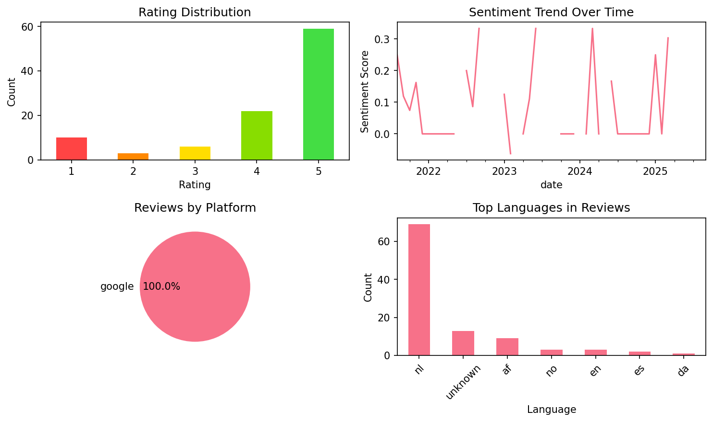
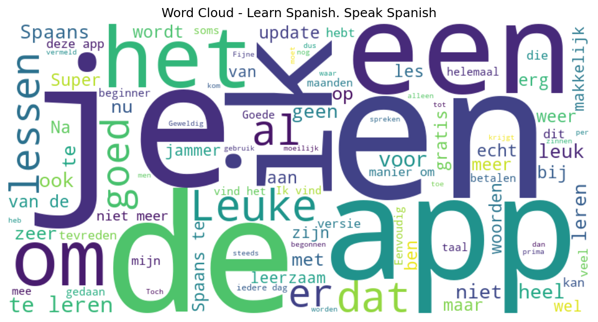

# Learn Spanish. Speak Spanish

## 📱 App Information

| **Attribute** | **Google Play** | **App Store** |
|---------------|-----------------|---------------|
| **Title** | Learn Spanish. Speak Spanish | N/A |
| **Package/ID** | com.atistudios.italk.es | N/A |
| **Rating** | 4.5752897 | N/A |
| **Total Ratings** | 83,548 | N/A |
| **Installs** | 1,000,000+ | N/A |
| **Genre** | Education | N/A |

## 📝 Description

<b>Speak Spanish faster</b> than you ever imagined with Mondly’s proprietary ILA-method. How? The secret is to make it simple. Have you ever heard a song in the radio which had you bopping your head and wanting to sing along? 

<b>The first step of learning Spanish</b> is pretty similar. You listen to the sound of native Spanish speakers and repeat some of their words.

Mondly’s state-of-the-art speech recognition shows you how well you already speak and where you can improve. It’s fun and doesn’t even feel like learning. Especially because Mondly uses your mother language so you never get lost in translation.

<b>The second step is even easier</b>. Take a break. Your lesson is never more than 9 minutes long and here is why: Your brain needs a rest to store the new information. And while you’re busy with your life, Spanish words and sentences get anchored in your long-term memory.

<b>The result:</b> You find yourself effortlessly knowing what to say and when. Don’t worry about the exact timing. Mondly gives you control over the entire process. You receive friendly reminders exactly when your brain is set for the next dose of knowledge.

<b>The third step is all about you.</b> Because now you’re ready to create your own phrases and adding your individual touch and personality back into the conversation. And when you want to practice, Mondly’s interactive chat-bot becomes your pocket tutor. 

There are over 40 practical, real-life situations which take you to the restaurant, shopping, exploring the city and many more.
But that’s not the only reason why Mondly gives you the confidence to speak Spanish. Because the HandsFree mode lets you practice without looking at the screen. Just connect your headphones and you’re in Paris, chatting away with the locals.

<b>Need a quick boost of motivation?</b> Check your progress with the advanced statistics and intelligent reporting. It shows you how far you have come in your journey to master the 5,000 words and phrases Mondly offers you.

<b>We all learn in different ways so here are some of the other highlights Mondly offers:</b>
• Well-structured grammar drills which integrate seamlessly into the content of the lessons
• Verb conjugations to show you the underlining structure and further boost your confidence
• Reading and writing games to complete your skills and give you full independence

So what does the ILA-Method stand for? It’s Immersive Language Acquisition and it means with Mondly you pick up Spanish in the most natural way possible. But don’t trust the over 50 million users who have given the app a 4.7/5.0 rating. 

<b>Here’s what the press had to say:</b>

» “The new and sexier way to learn languages” - Huffington Post
» “Closest thing to actual immersion” - TNW
» “A practical approach to language learning likely to be widely adopted.” - Forbes
» “The new way to learn languages” - Inc.com

Join the revolution and speak Spanish now! There’s a new free lesson every day and no ads.

## 📊 Reviews Analytics

**Total Reviews:** 100 (100 analyzed)
**Rating Distribution:** 81 positive (4-5★), 6 neutral (3★), 13 negative (1-2★)
**Average Sentiment:** 0.08 (-1=very negative, +1=very positive)
**Primary Language:** nl
**Key Insights:** Average rating: 4.2/5.0 | Overall sentiment: neutral (score: 0.08) | Reviews in 7 languages, primarily nl (69 reviews) | Reviews from 1 platform(s): google | Key themes: app, en, te


### 🔑 Key Themes & Phrases

- **app** (relevance: 0.103)
- **en** (relevance: 0.094)
- **te** (relevance: 0.063)
- **leuke** (relevance: 0.057)
- **je** (relevance: 0.056)
- **ik** (relevance: 0.054)
- **leren** (relevance: 0.051)
- **het** (relevance: 0.051)

### ⭐ Rating Breakdown

- **5 ★★★★★**: 59 reviews (59.0%)
- **4 ★★★★☆**: 22 reviews (22.0%)
- **3 ★★★☆☆**: 6 reviews (6.0%)
- **2 ★★☆☆☆**: 3 reviews (3.0%)
- **1 ★☆☆☆☆**: 10 reviews (10.0%)

### 🌍 Languages in Reviews

- **nl**: 69 reviews
- **unknown**: 13 reviews
- **af**: 9 reviews
- **no**: 3 reviews
- **en**: 3 reviews

### 📱 Platform Distribution

- **google**: 100 reviews

## 📈 Visualizations

### Analytics Charts


### Word Cloud


## 💬 Sample Reviews

**Review 1** (★★★★★ - google - 2025-09-29T21:02:38)
> zit heel goed in elkaar, goede mix van spreken en schrijven.

**Review 2** (★★★★★ - google - 2024-02-14T09:45:38)
> Functioneel, leerzaam. Korte lessen

**Review 3** (★★★★★ - google - 2022-08-07T20:46:33)
> Esta es muy bien , app works good and teaches me quick

**Review 4** (★★★★★ - google - 2021-12-29T21:45:51)
> Goed voor beginners Zeer fijn om te leren spreken Heel leerzaam

**Review 5** (★★★★★ - google - 2021-08-13T11:02:11)
> Ik vind het een leuke applicatie :).

## 🔧 Raw JSON Data

<details>
<summary>Click to expand raw app data</summary>

```json
{
  "name": "Learn Spanish. Speak Spanish",
  "google_package": "com.atistudios.italk.es",
  "google": {
    "title": "Learn Spanish. Speak Spanish",
    "description": "<b>Speak Spanish faster</b> than you ever imagined with Mondly’s proprietary ILA-method. How? The secret is to make it simple. Have you ever heard a song in the radio which had you bopping your head and wanting to sing along? \r\n\r\n<b>The first step of learning Spanish</b> is pretty similar. You listen to the sound of native Spanish speakers and repeat some of their words.\r\n\r\nMondly’s state-of-the-art speech recognition shows you how well you already speak and where you can improve. It’s fun and doesn’t even feel like learning. Especially because Mondly uses your mother language so you never get lost in translation.\r\n\r\n<b>The second step is even easier</b>. Take a break. Your lesson is never more than 9 minutes long and here is why: Your brain needs a rest to store the new information. And while you’re busy with your life, Spanish words and sentences get anchored in your long-term memory.\r\n\r\n<b>The result:</b> You find yourself effortlessly knowing what to say and when. Don’t worry about the exact timing. Mondly gives you control over the entire process. You receive friendly reminders exactly when your brain is set for the next dose of knowledge.\r\n\r\n<b>The third step is all about you.</b> Because now you’re ready to create your own phrases and adding your individual touch and personality back into the conversation. And when you want to practice, Mondly’s interactive chat-bot becomes your pocket tutor. \r\n\r\nThere are over 40 practical, real-life situations which take you to the restaurant, shopping, exploring the city and many more.\r\nBut that’s not the only reason why Mondly gives you the confidence to speak Spanish. Because the HandsFree mode lets you practice without looking at the screen. Just connect your headphones and you’re in Paris, chatting away with the locals.\r\n\r\n<b>Need a quick boost of motivation?</b> Check your progress with the advanced statistics and intelligent reporting. It shows you how far you have come in your journey to master the 5,000 words and phrases Mondly offers you.\r\n\r\n<b>We all learn in different ways so here are some of the other highlights Mondly offers:</b>\r\n• Well-structured grammar drills which integrate seamlessly into the content of the lessons\r\n• Verb conjugations to show you the underlining structure and further boost your confidence\r\n• Reading and writing games to complete your skills and give you full independence\r\n\r\nSo what does the ILA-Method stand for? It’s Immersive Language Acquisition and it means with Mondly you pick up Spanish in the most natural way possible. But don’t trust the over 50 million users who have given the app a 4.7/5.0 rating. \r\n\r\n<b>Here’s what the press had to say:</b>\r\n\r\n» “The new and sexier way to learn languages” - Huffington Post\r\n» “Closest thing to actual immersion” - TNW\r\n» “A practical approach to language learning likely to be widely adopted.” - Forbes\r\n» “The new way to learn languages” - Inc.com\r\n\r\nJoin the revolution and speak Spanish now! There’s a new free lesson every day and no ads.",
    "rating": 4.5752897,
    "rating_text": null,
    "ratings_total": 83548,
    "ratings_histogram": [
      4344,
      1442,
      2572,
      8547,
      66609
    ],
    "installs": "1,000,000+",
    "genre": "Education"
  },
  "apple": null,
  "reviews": [
    {
      "platform": "google",
      "rating": 5,
      "review": "zit heel goed in elkaar, goede mix van spreken en schrijven.",
      "date": "2025-09-29T21:02:38"
    },
    {
      "platform": "google",
      "rating": 4,
      "review": "Heel ander system om te leren",
      "date": "2025-06-10T14:03:00"
    },
    {
      "platform": "google",
      "rating": 4,
      "review": "Is een leuke leerrijke app",
      "date": "2025-03-14T00:08:23"
    },
    {
      "platform": "google",
      "rating": 5,
      "review": "very very very good",
      "date": "2025-03-13T15:51:54"
    },
    {
      "platform": "google",
      "rating": 5,
      "review": "Fijne app, gebruik hem af en aan al jaren.",
      "date": "2025-03-08T13:31:53"
    },
    {
      "platform": "google",
      "rating": 4,
      "review": "zins het is vernieuwd gaat het laden makkelijk alleen de spreek lessen hebben soms moeite om je te verstaan ..verder prima app...",
      "date": "2025-02-19T12:18:22"
    },
    {
      "platform": "google",
      "rating": 5,
      "review": "De beste app om een taal te leren .Ik ben zeer tevreden !",
      "date": "2025-02-17T11:48:20"
    },
    {
      "platform": "google",
      "rating": 5,
      "review": "Dat men kan horen en spreken",
      "date": "2025-01-17T13:19:51"
    },
    {
      "platform": "google",
      "rating": 2,
      "review": "12/10/'24 Nieuwe update valt eigenlijk tegen, de layout maar vooral ook de 'globe' op het einde van de les. Bij omgekeerd vertalen van Spaans naar het Nederlands krijgt men nu Spaans.., is misschien net de bedoeling..(?) 23/12/'24 Het wordt blijkbaar steeds erger met jullie updates, nu ook nog ongevraagde pop-up schermen. Ben ook ongevraagd uitgelogd na update! Best dus (op Google Play) automatische updates uitschakelen indien je een versie hebt die behoorlijk werkt..",
      "date": "2025-01-05T13:37:36"
    },
    {
      "platform": "google",
      "rating": 1,
      "review": "In de lesjes zitten keiharde fouten. Een correctie doorgeven is sinds kort ook onmogelijk, dus geen terugkoppeling. Al vaker heb ik opmerkingen geplaatst, maar er wordt niets mee gedaan. Je krijgt hierdoor wel minder punten en om deze reden zal ik niet meer de betaalde versie nemen. Na de laatste update worden de zinnen niet meer helemaal uitgesproken, dan hoor je het woord van de volgende vraag er doorheen. Dit is geen verbetering.",
      "date": "2024-12-19T09:30:59"
    },
    {
      "platform": "google",
      "rating": 3,
      "review": "De laatste update heeft nog enkele bugs in de programmering. Daarnaast is een irritante popup ingebouwd die telkens voor een paar seconden in beeld verschijnt als je 5 punten hebt verdient. Totaal zinloze toevoeging in de app.",
      "date": "2024-12-17T09:27:29"
    },
    {
      "platform": "google",
      "rating": 5,
      "review": "Leuk om Spaans te leren. Vlot en gemakkelijk",
      "date": "2024-11-27T07:36:25"
    },
    {
      "platform": "google",
      "rating": 5,
      "review": "Na de vernieuwing van de site is het niet meer mogelijk om aan de gratis lessen deel te nemen. Heel erg jammer als je al bij les 17 van de 18 lessen bent",
      "date": "2024-11-15T15:33:20"
    },
    {
      "platform": "google",
      "rating": 5,
      "review": "fantastisch programma maar voor de zoveelste keer heb ik weer geen geluid",
      "date": "2024-10-27T23:30:05"
    },
    {
      "platform": "google",
      "rating": 5,
      "review": "Leuke en overzichtelijke app waar je op ieder niveau kunt instappen.",
      "date": "2024-10-19T19:54:29"
    },
    {
      "platform": "google",
      "rating": 2,
      "review": "Jammer dat er nergens vermeld wordt dat je 10 euro per maand moet betalen. Zet dat er gewoon bij. Dan weet je waar je aan toe bent voor je het installeerd.",
      "date": "2024-09-20T19:40:19"
    },
    {
      "platform": "google",
      "rating": 5,
      "review": "al een hele tijd niet meer gebruikt, nu weer begonnen en tot mijn verrassing ook een handsfree mogelijkheid, helemaal geweldig!! nu kan ik gewoon tijdens het autorijden mijn lessen doen, ik ben hier echt heel blij mee",
      "date": "2024-08-24T23:22:46"
    },
    {
      "platform": "google",
      "rating": 5,
      "review": "Leuke manier om Spaans te leren",
      "date": "2024-08-21T22:33:50"
    },
    {
      "platform": "google",
      "rating": 1,
      "review": "Na twee of drie maanden leren kom je geen stap vooruit. Woorden als aqua of té krijg ik vandaag weer te leren pfffff voor beginners. Alweer elke dag kom ik weer dezelfde woorden tegen pfff Na 6 maanden leren mag ik vandaag alweer de woordjes dos, tres en cuatro leren. Geweldig moeilijk toch na 6 maanden. Waardeloos deze app. Weer oude simpele woorden leren pffff",
      "date": "2024-08-21T12:00:29"
    },
    {
      "platform": "google",
      "rating": 5,
      "review": "leuke manier om spaans te oefenen, zeer gevarieerd",
      "date": "2024-07-08T01:35:06"
    },
    {
      "platform": "google",
      "rating": 4,
      "review": "Veel herhalingen, dat onthoud je beter",
      "date": "2024-07-01T21:36:10"
    },
    {
      "platform": "google",
      "rating": 5,
      "review": "Super handig en makkelijk en eenvoudig te snappen",
      "date": "2024-06-27T13:17:03"
    },
    {
      "platform": "google",
      "rating": 5,
      "review": "👍",
      "date": "2024-06-27T07:50:18"
    },
    {
      "platform": "google",
      "rating": 4,
      "review": "Leuke app om je Spaanse gevoel en woordenschat bij te spijkeren. Maar echt de taal goed begrijpen voel ik tot nu toe nog niet echt gezien er weinig uitleg is over de grammatica.",
      "date": "2024-04-01T12:27:40"
    },
    {
      "platform": "google",
      "rating": 5,
      "review": "Ik vind het super om te doen",
      "date": "2024-03-10T22:51:04"
    },
    {
      "platform": "google",
      "rating": 5,
      "review": "Functioneel, leerzaam. Korte lessen",
      "date": "2024-02-14T09:45:38"
    },
    {
      "platform": "google",
      "rating": 5,
      "review": "Duidelijke les en uitspraak",
      "date": "2023-12-07T07:23:20"
    },
    {
      "platform": "google",
      "rating": 4,
      "review": "Fijne app om Spaans te leren. Ik mis alleen een woorden- en zinnenlijst van de lessen die je gedaan hebt. Dat zou heel erg handig zijn! Nu moet ik steeds terug zoeken in welke les een bepaald woord of zin ook al weer werd behandeld. Hoe meer lessen je gedaan hebt, hoe lastiger dat wordt.",
      "date": "2023-11-29T21:37:03"
    },
    {
      "platform": "google",
      "rating": 5,
      "review": "Als beginner voorlopig heel tevreden over de app.",
      "date": "2023-11-05T13:07:46"
    },
    {
      "platform": "google",
      "rating": 5,
      "review": "Leuke app om snel Spaans te leren.",
      "date": "2023-10-14T20:22:25"
    },
    {
      "platform": "google",
      "rating": 5,
      "review": "Leuke manier om Spaans te leren. ik vind het echt super leuk. Erg leerzaam. Jammer dat er geen nieuwe lessen meer worden toegevoegd",
      "date": "2023-06-08T13:56:55"
    },
    {
      "platform": "google",
      "rating": 5,
      "review": "Gevonden! Een goed en degelijk alternatief voor het met advertenties overladen Duolingo. Mooie mix van woorden en zinnen leren met passende afbeeldingen en stimulerende manier om (uit)spraak te oefenen. In het aanbod ook links met overzichtelijke achtergrondinformatie over werkwoord vervoegingen. De chatbot is een zinnige uitbreiding.",
      "date": "2023-05-31T18:40:33"
    },
    {
      "platform": "google",
      "rating": 4,
      "review": "Net begonnen, lijkt veelbelovend. Kom er later op terug, want als er goed en boeiend aandacht wordt besteed aan grammatica en werkwoordvervoegingen, mogelijk 5 sterren!",
      "date": "2023-05-18T08:20:15"
    },
    {
      "platform": "google",
      "rating": 5,
      "review": "Super app",
      "date": "2023-05-06T18:10:44"
    },
    {
      "platform": "google",
      "rating": 5,
      "review": "Goede duidelijke app",
      "date": "2023-04-21T19:51:08"
    },
    {
      "platform": "google",
      "rating": 3,
      "review": "When you need to write a word, the first letter stays. This makes that the word is wrong.",
      "date": "2023-02-19T08:16:42"
    },
    {
      "platform": "google",
      "rating": 4,
      "review": "Uitspraak moeilijk door tandproblemen. Dat is het!",
      "date": "2023-02-11T16:59:26"
    },
    {
      "platform": "google",
      "rating": 3,
      "review": "Te veel herhaling. Je leert er wel goed spaans mee. Maar soms verstaat de app je niet goed als je het inspreekt. Terwijl je echt hetzelfde zegt.",
      "date": "2023-01-30T15:59:08"
    },
    {
      "platform": "google",
      "rating": 4,
      "review": "Leuke leren",
      "date": "2023-01-18T18:37:24"
    },
    {
      "platform": "google",
      "rating": 5,
      "review": "Leuk om iedere dag even iets Spaans te leren",
      "date": "2023-01-03T17:30:54"
    },
    {
      "platform": "google",
      "rating": 3,
      "review": "Mannelijke stem moeilijk verstaanbaar en slechte articulatie, vrouwelijke stem top , waarom krijg je bij herhalingen soms maar 1 puntje, er zit geen lijn in .Veel woorden die je m.i. korrekt vertaald, worden foutief beoordeeld b.v. paraguas= paraplu ,regenscherm zou foutief zijn , idem voor sobre, vertaling briefomslag zou foutief zijn, zo zijn er tientallen voorbeelden.",
      "date": "2023-01-01T16:06:27"
    },
    {
      "platform": "google",
      "rating": 5,
      "review": "Goede app die er voor zorgt dat je iedere dag je lessen doet, zodat je met reeksen meer lesstof krijgt. Als je namelijk iedere dag je lessen volgt ontgrendel je wekelijkse lessen, als je iedere week ook afrondt ontgrendel je maandelijkse lessen. Voor mij werkt dit erg goed! Ik gebruik de gratis variant van de app.",
      "date": "2022-11-22T08:54:19"
    },
    {
      "platform": "google",
      "rating": 5,
      "review": "Práctica con mondly es fácil.",
      "date": "2022-11-09T13:43:36"
    },
    {
      "platform": "google",
      "rating": 3,
      "review": "Goed",
      "date": "2022-11-05T18:18:27"
    },
    {
      "platform": "google",
      "rating": 5,
      "review": "Super app je leert veel en ook snel raad het zeker aan",
      "date": "2022-09-27T19:18:40"
    },
    {
      "platform": "google",
      "rating": 5,
      "review": "Makkelijk leren",
      "date": "2022-08-24T16:35:45"
    },
    {
      "platform": "google",
      "rating": 5,
      "review": "Zeer goed",
      "date": "2022-08-13T18:40:44"
    },
    {
      "platform": "google",
      "rating": 4,
      "review": "Ben op bezoek bij me ouders in Spanje. En wou meer de taal leren. Wel prijzig 10euro/p maar goeie app. Zinnen en woorden door elkaar, en herhaling op verschillende manieren. Toch wel al mijn Spaanse woordenschat uitgebreid.",
      "date": "2022-08-12T14:40:12"
    },
    {
      "platform": "google",
      "rating": 5,
      "review": "Goede leerervaring",
      "date": "2022-08-10T08:45:21"
    },
    {
      "platform": "google",
      "rating": 5,
      "review": "Tot nu toe bevalt de app prima, hopelijk leer ik met deze app eindelijk Spaans",
      "date": "2022-08-09T23:31:49"
    },
    {
      "platform": "google",
      "rating": 5,
      "review": "Esta es muy bien , app works good and teaches me quick",
      "date": "2022-08-07T20:46:33"
    },
    {
      "platform": "google",
      "rating": 5,
      "review": "Nice app",
      "date": "2022-07-27T20:34:27"
    },
    {
      "platform": "google",
      "rating": 4,
      "review": "Gratis Mondly voor de beginners en medium versie erg leuk en leerzaam, een aanrader! Hier en daar wordt wat vrij vertaald of een werkwoord niet helemaal goed vertaald en de gevorderde versie is niet echt moeilijker alleen alles uittypen. Toch zijn de 1ste 2 versies zeer de moeite waard!",
      "date": "2022-07-22T07:39:08"
    },
    {
      "platform": "google",
      "rating": 4,
      "review": "Zeer leuke spaanse les",
      "date": "2022-07-15T13:43:06"
    },
    {
      "platform": "google",
      "rating": 4,
      "review": "leuke app, wel jammer dat je meteen naar betalen word geleid. Ik wil graag eerst even ontdekken of deze app leuk is i.p.v. duo lingo. Groot voordeel dat deze app Nederlands Spaans is.",
      "date": "2022-05-28T14:03:41"
    },
    {
      "platform": "google",
      "rating": 1,
      "review": "Hola, gracias, café, té, meer is er niet echt om gratis te leren...jammer weer.",
      "date": "2022-05-27T02:22:28"
    },
    {
      "platform": "google",
      "rating": 1,
      "review": "Na update geen kinds mondy meer wegens , brug, . Wil uitleg geven om dit op te lossen aub",
      "date": "2022-05-13T16:47:07"
    },
    {
      "platform": "google",
      "rating": 4,
      "review": "Leuke app om mee te leren",
      "date": "2022-05-02T08:11:23"
    },
    {
      "platform": "google",
      "rating": 5,
      "review": "Ben heel tevreden over de app",
      "date": "2022-04-25T08:25:33"
    },
    {
      "platform": "google",
      "rating": 4,
      "review": "Ik gaf het verkeerde niveau in bij het opstarten van de app. Kan ik dit ergens aanpassen?",
      "date": "2022-04-22T16:06:27"
    },
    {
      "platform": "google",
      "rating": 5,
      "review": "Duidelijk en leuk",
      "date": "2022-04-20T18:50:33"
    },
    {
      "platform": "google",
      "rating": 4,
      "review": "Duidelijk en leerzaam",
      "date": "2022-04-11T14:22:55"
    },
    {
      "platform": "google",
      "rating": 5,
      "review": "Opnieuw een abonnement genomen, dit keer lifetime (eenmalig via de website). Geen spijt, superleuke manier van het leren van een taal",
      "date": "2022-04-10T19:52:05"
    },
    {
      "platform": "google",
      "rating": 3,
      "review": "Heel goed",
      "date": "2022-03-19T08:22:07"
    },
    {
      "platform": "google",
      "rating": 5,
      "review": "Ik spreek al aardig spaans bedankt",
      "date": "2022-03-01T19:27:32"
    },
    {
      "platform": "google",
      "rating": 5,
      "review": "Ik ben zeer tevreden ermee",
      "date": "2022-02-19T19:40:29"
    },
    {
      "platform": "google",
      "rating": 5,
      "review": "Geweldig om zo mijn Spaans op peil te houden!",
      "date": "2022-02-19T19:14:51"
    },
    {
      "platform": "google",
      "rating": 5,
      "review": "Ik gebruik deze app (premium) nu 2.5 maanden. Ik ben erg tevreden. Soms zijn de vragen te makkelijk, dan zet ik express het geluid uit. Het blijft erg leuk om dagelijks even wat tijd aan te besteden! Ook je vooruitgang is inzichtelijk.",
      "date": "2022-02-14T09:32:37"
    },
    {
      "platform": "google",
      "rating": 5,
      "review": "Lekker bezig met spaans",
      "date": "2022-02-08T15:19:43"
    },
    {
      "platform": "google",
      "rating": 4,
      "review": "Leuke app",
      "date": "2022-02-07T01:08:11"
    },
    {
      "platform": "google",
      "rating": 5,
      "review": "Leuke manier van werken. Omvat alles wat het hoort",
      "date": "2022-01-22T11:35:53"
    },
    {
      "platform": "google",
      "rating": 5,
      "review": "👍",
      "date": "2022-01-14T08:51:43"
    },
    {
      "platform": "google",
      "rating": 5,
      "review": "Claramente pronunciado y divertido de aprender de esta aplicación. Recomendar 👍🏼🍀",
      "date": "2022-01-12T11:23:37"
    },
    {
      "platform": "google",
      "rating": 4,
      "review": "😘 Thnx.",
      "date": "2022-01-09T11:52:19"
    },
    {
      "platform": "google",
      "rating": 5,
      "review": "Eenvoudig en duidelijk!👍",
      "date": "2022-01-08T16:37:32"
    },
    {
      "platform": "google",
      "rating": 5,
      "review": "Goed voor beginners Zeer fijn om te leren spreken Heel leerzaam",
      "date": "2021-12-29T21:45:51"
    },
    {
      "platform": "google",
      "rating": 5,
      "review": "Eenvoudig en doeltreffend. 1 nadeel: blijkbaar kan men een vorige les niet meer raadplegen.",
      "date": "2021-12-24T08:32:49"
    },
    {
      "platform": "google",
      "rating": 5,
      "review": "Perfect om te beginnen",
      "date": "2021-11-30T09:04:20"
    },
    {
      "platform": "google",
      "rating": 1,
      "review": "Waardeloos.. Ik wilde mijn Spaans ophalen. Ik heb 2 cursusdelen gedaan en vervolgens kreeg ik steeds en pop-up waarbij vermeld werd dat ik maandelijks of jaarlijk moest betalen en kwam ik totaal niet meer verder... datgene dat vermeld wordt...gratis...is dus gelogen...",
      "date": "2021-11-25T22:35:40"
    },
    {
      "platform": "google",
      "rating": 5,
      "review": "Eenvoudig en makkelijk te volgen",
      "date": "2021-11-19T06:42:42"
    },
    {
      "platform": "google",
      "rating": 4,
      "review": "Laagdrempelig jammer dat je niet met terugwerkende kracht een vergeten les kan inhalen",
      "date": "2021-11-15T07:59:22"
    },
    {
      "platform": "google",
      "rating": 1,
      "review": "Zemmers",
      "date": "2021-11-11T21:03:08"
    },
    {
      "platform": "google",
      "rating": 5,
      "review": "Juist begonnen",
      "date": "2021-11-04T20:20:38"
    },
    {
      "platform": "google",
      "rating": 5,
      "review": "Zeer goed te begrijpen",
      "date": "2021-11-02T17:55:21"
    },
    {
      "platform": "google",
      "rating": 4,
      "review": "Fun...",
      "date": "2021-11-01T08:02:05"
    },
    {
      "platform": "google",
      "rating": 5,
      "review": "Super handige app en fijne methode.",
      "date": "2021-10-30T17:09:21"
    },
    {
      "platform": "google",
      "rating": 4,
      "review": "Leuke lessen mogen wel meer herhalingen in zitten",
      "date": "2021-10-29T15:59:44"
    },
    {
      "platform": "google",
      "rating": 1,
      "review": "Geen gratis app!",
      "date": "2021-10-10T19:46:30"
    },
    {
      "platform": "google",
      "rating": 1,
      "review": "Slecht product. Helemaal niet gratis. Per onderwerp 10 euro per maand!!!",
      "date": "2021-10-08T20:38:24"
    },
    {
      "platform": "google",
      "rating": 5,
      "review": "Leuk en leerzaam",
      "date": "2021-10-04T22:45:06"
    },
    {
      "platform": "google",
      "rating": 1,
      "review": "I installed this app because it advertised that it's free, but this is not true. I don't like that they're trying to trick people like that",
      "date": "2021-10-03T19:23:36"
    },
    {
      "platform": "google",
      "rating": 2,
      "review": "Klopt niet altijd. Korte lessen waar je niet heel veel aan hebt.",
      "date": "2021-09-30T19:51:13"
    },
    {
      "platform": "google",
      "rating": 5,
      "review": "Iedere dag een beetje, prima! Een aanrader.",
      "date": "2021-09-27T07:35:59"
    },
    {
      "platform": "google",
      "rating": 5,
      "review": "Top",
      "date": "2021-09-25T18:23:18"
    },
    {
      "platform": "google",
      "rating": 4,
      "review": "Leuke en simpele manier om Italiaans te leren.",
      "date": "2021-09-13T23:23:13"
    },
    {
      "platform": "google",
      "rating": 5,
      "review": "Super fijn en makkelijk te gebruiken.",
      "date": "2021-09-13T19:18:18"
    },
    {
      "platform": "google",
      "rating": 5,
      "review": "Leuk!",
      "date": "2021-09-05T08:30:40"
    },
    {
      "platform": "google",
      "rating": 5,
      "review": "Prachtig voor uit zicht",
      "date": "2021-09-04T18:03:03"
    },
    {
      "platform": "google",
      "rating": 1,
      "review": "Ik vind het een slechte leermethode en je moet overal voor betalen",
      "date": "2021-08-21T17:57:57"
    },
    {
      "platform": "google",
      "rating": 5,
      "review": "Ik vind het een leuke applicatie :).",
      "date": "2021-08-13T11:02:11"
    }
  ]
}
```

</details>

---
*Report generated on 2025-11-08 13:48:56 using advanced analytics*
