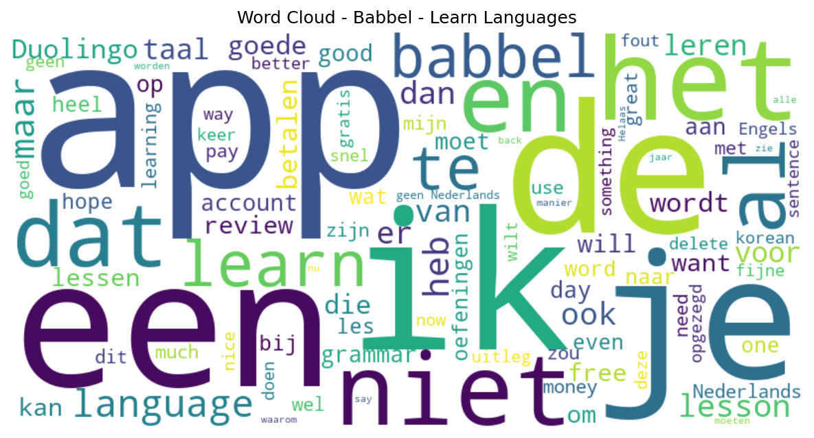

# Babbel - Learn Languages

## 📱 App Information

| **Attribute** | **Google Play** | **App Store** |
|---------------|-----------------|---------------|
| **Title** | Babbel - Learn Languages | N/A |
| **Package/ID** | com.babbel.mobile.android.en | N/A |
| **Rating** | 4.615082 | N/A |
| **Total Ratings** | 1,100,550 | N/A |
| **Installs** | 50,000,000+ | N/A |
| **Genre** | Education | N/A |

## 📝 Description

Millions of people learn languages with Babbel — the app built by language learning experts. Our short, interactive lessons rethink old-school language education to get you speaking a new language with confidence.

<b>LEARN SPANISH OR 13 OTHER LANGUAGES IN 15 MIN/DAY</b>

We're not just a Spanish learning app! Want to learn French, learn Italian or speak German like a local? You can learn:

Spanish 🇪🇸🇲🇽 | French 🇫🇷 | Italian 🇮🇹 | German 🇩🇪 | Portuguese 🇧🇷 | Russian 🇷🇺 | Polish 🇵🇱 | 
Turkish 🇹🇷 | Norwegian 🇳🇴 | Danish 🇩🇰 | Swedish 🇸🇪 | Dutch 🇳🇱 | Indonesian 🇮🇩 | English 🇬🇧🇺🇸

Babbel is great for beginners but even experienced language learners have proven to advance their conversation skills!*

======

<b>BABBEL WORKS!</b>
★ Effectiveness backed by researchers at Yale University:
100% of study participants improved their oral proficiency in 3 months*

<i>*Based on a study conducted with Babbel users learning Spanish. Available at http://bit.ly/BabbelYale.</i>

★ After 10 hours with Babbel, Michigan State University researchers found:
96% of learners saw better test scores on grammar and vocabulary**

<i>**Based on a study conducted with Babbel users learning Spanish. Available: http://bit.ly/BabbelMSU.</i>

★ PCMagazine says the Babbel language app “exceeds expectations” 

======

Babbel is the best language-learning app.

Our language learning experts build every course tailored to your native language. So whether you want to learn Spanish, learn Italian or learn French — or even German, Portuguese, Russian, Polish, Turkish, Norwegian, Danish, Swedish, Dutch, Indonesian or English — you’ll learn quickly and effectively.

<b>BITE-SIZE, INTERACTIVE LESSONS</b> - Easily fit language learning into your busy schedule with lessons that take only 10-15 minutes to complete (some Spanish lessons are even shorter).

LANGUAGES FOR ANY SITUATION - Find language lessons for travel, work, everyday life and much, much more

LISTEN, SPEAK, READ, WRITE - Practice all the elements of language learning and start speaking real-life conversations 

IMPROVE YOUR PRONUNCIATION - Babbel’s speech recognition technology helps you sound like a native speaker

REMEMBER WHAT YOU LEARN -  Use the review feature so the previous lessons stick, and understand grammar (including Spanish conjugation)

LEARN LANGUAGES IN CONTEXT - Enhance your language learning with tips & tricks that guide you throughout lessons

<b>OVER 6,000 LANGUAGE COURSES</b> - Learn Spanish and 13 other languages with in-depth content, including more than 60,000 language lessons

With Babbel, you’ll be on your way to mastering the ultimate goal of language learning — having real-life conversations with confidence. Whether you need a Spanish learning app or a French learning app, you’ve always wanted to learn Italian, you’re looking to dive into German language learning or improve your English, Babbel is the choice of millions of people looking to enhance their language education.

Make learning a habit. Go beyond language 101 and you'll <b>learn a language you can use to talk in real-life situations</b>.

=====

Subscriptions:

You’ll need a subscription to use Babbel fully. Your subscription will be renewed unless auto-renew is turned off at least 24 hours before the end of the current payment period.

DOWNLOAD BABBEL AND TRY FOR FREE – Your first lesson is on us. Babbel is completely ad-free.

Privacy policy: https://about.babbel.com/en/privacy/
Terms of use: https://about.babbel.com/en/terms/

Not a native speaker but want to talk just like one? Download Babbel and improve your German language learning, learn English or discover how to speak Spanish. Take your language education to new levels — whether you want to learn French, Italian, Mexican Spanish, German or any of the 14 languages we offer!

Contact us:
Questions, comments or feedback about language learning with Babbel? Email us at support-mobile@babbel.com.

## 📊 Reviews Analytics

**Total Reviews:** 100 (100 analyzed)
**Rating Distribution:** 48 positive (4-5★), 15 neutral (3★), 37 negative (1-2★)
**Average Sentiment:** 0.11 (-1=very negative, +1=very positive)
**Primary Language:** en
**Key Insights:** Average rating: 3.1/5.0 | Overall sentiment: positive (score: 0.11) | Reviews in 9 languages, primarily en (47 reviews) | Reviews from 1 platform(s): google | Key themes: app, learn, je


### 🔑 Key Themes & Phrases

- **app** (relevance: 0.103)
- **learn** (relevance: 0.060)
- **je** (relevance: 0.053)
- **ik** (relevance: 0.051)
- **een** (relevance: 0.049)
- **niet** (relevance: 0.045)
- **het** (relevance: 0.043)
- **babbel** (relevance: 0.041)

### ⭐ Rating Breakdown

- **5 ★★★★★**: 29 reviews (29.0%)
- **4 ★★★★☆**: 19 reviews (19.0%)
- **3 ★★★☆☆**: 15 reviews (15.0%)
- **2 ★★☆☆☆**: 4 reviews (4.0%)
- **1 ★☆☆☆☆**: 33 reviews (33.0%)

### 🌍 Languages in Reviews

- **en**: 47 reviews
- **nl**: 40 reviews
- **af**: 5 reviews
- **unknown**: 3 reviews
- **de**: 1 reviews

### 📱 Platform Distribution

- **google**: 100 reviews

## 📈 Visualizations

### Analytics Charts


### Word Cloud


## 💬 Sample Reviews

**Review 1** (★★★ - google - 2025-11-04T10:40:46)
> I prefer this app over others when it comes to context and challenge. However, there is one reason why I wanted to write a 'negative' review and that is regarding the voice recognition. This is horrible, even when I exaggerate the word(s) it does not register the word correctly making me want to ski...

**Review 2** (★★★ - google - 2025-06-23T16:05:18)
> as of yesterday, my reviews aren't registered, leading me to have streak freezes to be used... this will make me lose my streak.. can that be fixed?

**Review 3** (★ - google - 2024-12-14T13:37:49)
> No free version

**Review 4** (★★★★★ - google - 2024-07-04T17:22:08)
> Fijne app met een goede opbouw en uitleg van de grammatica

**Review 5** (★★★★ - google - 2023-12-20T13:11:19)
> Adult version of Duolingo!

## 🔧 Raw JSON Data

<details>
<summary>Click to expand raw app data</summary>

```json
{
  "name": "Babbel - Learn Languages",
  "google_package": "com.babbel.mobile.android.en",
  "google": {
    "title": "Babbel - Learn Languages",
    "description": "Millions of people learn languages with Babbel — the app built by language learning experts. Our short, interactive lessons rethink old-school language education to get you speaking a new language with confidence.\r\n\r\n<b>LEARN SPANISH OR 13 OTHER LANGUAGES IN 15 MIN/DAY</b>\r\n\r\nWe're not just a Spanish learning app! Want to learn French, learn Italian or speak German like a local? You can learn:\r\n\r\nSpanish 🇪🇸🇲🇽 | French 🇫🇷 | Italian 🇮🇹 | German 🇩🇪 | Portuguese 🇧🇷 | Russian 🇷🇺 | Polish 🇵🇱 | \r\nTurkish 🇹🇷 | Norwegian 🇳🇴 | Danish 🇩🇰 | Swedish 🇸🇪 | Dutch 🇳🇱 | Indonesian 🇮🇩 | English 🇬🇧🇺🇸\r\n\r\nBabbel is great for beginners but even experienced language learners have proven to advance their conversation skills!*\r\n\r\n======\r\n\r\n<b>BABBEL WORKS!</b>\r\n★ Effectiveness backed by researchers at Yale University:\r\n100% of study participants improved their oral proficiency in 3 months*\r\n\r\n<i>*Based on a study conducted with Babbel users learning Spanish. Available at http://bit.ly/BabbelYale.</i>\r\n\r\n★ After 10 hours with Babbel, Michigan State University researchers found:\r\n96% of learners saw better test scores on grammar and vocabulary**\r\n\r\n<i>**Based on a study conducted with Babbel users learning Spanish. Available: http://bit.ly/BabbelMSU.</i>\r\n\r\n★ PCMagazine says the Babbel language app “exceeds expectations” \r\n\r\n======\r\n\r\nBabbel is the best language-learning app.\r\n\r\nOur language learning experts build every course tailored to your native language. So whether you want to learn Spanish, learn Italian or learn French — or even German, Portuguese, Russian, Polish, Turkish, Norwegian, Danish, Swedish, Dutch, Indonesian or English — you’ll learn quickly and effectively.\r\n\r\n<b>BITE-SIZE, INTERACTIVE LESSONS</b> - Easily fit language learning into your busy schedule with lessons that take only 10-15 minutes to complete (some Spanish lessons are even shorter).\r\n\r\nLANGUAGES FOR ANY SITUATION - Find language lessons for travel, work, everyday life and much, much more\r\n\r\nLISTEN, SPEAK, READ, WRITE - Practice all the elements of language learning and start speaking real-life conversations \r\n\r\nIMPROVE YOUR PRONUNCIATION - Babbel’s speech recognition technology helps you sound like a native speaker\r\n\r\nREMEMBER WHAT YOU LEARN -  Use the review feature so the previous lessons stick, and understand grammar (including Spanish conjugation)\r\n\r\nLEARN LANGUAGES IN CONTEXT - Enhance your language learning with tips & tricks that guide you throughout lessons\r\n\r\n<b>OVER 6,000 LANGUAGE COURSES</b> - Learn Spanish and 13 other languages with in-depth content, including more than 60,000 language lessons\r\n\r\nWith Babbel, you’ll be on your way to mastering the ultimate goal of language learning — having real-life conversations with confidence. Whether you need a Spanish learning app or a French learning app, you’ve always wanted to learn Italian, you’re looking to dive into German language learning or improve your English, Babbel is the choice of millions of people looking to enhance their language education.\r\n\r\nMake learning a habit. Go beyond language 101 and you'll <b>learn a language you can use to talk in real-life situations</b>.\r\n\r\n=====\r\n\r\nSubscriptions:\r\n\r\nYou’ll need a subscription to use Babbel fully. Your subscription will be renewed unless auto-renew is turned off at least 24 hours before the end of the current payment period.\r\n\r\nDOWNLOAD BABBEL AND TRY FOR FREE – Your first lesson is on us. Babbel is completely ad-free.\r\n\r\nPrivacy policy: https://about.babbel.com/en/privacy/\r\nTerms of use: https://about.babbel.com/en/terms/\r\n\r\nNot a native speaker but want to talk just like one? Download Babbel and improve your German language learning, learn English or discover how to speak Spanish. Take your language education to new levels — whether you want to learn French, Italian, Mexican Spanish, German or any of the 14 languages we offer!\r\n\r\nContact us:\r\nQuestions, comments or feedback about language learning with Babbel? Email us at support-mobile@babbel.com.",
    "rating": 4.615082,
    "rating_text": null,
    "ratings_total": 1100550,
    "ratings_histogram": [
      39867,
      15566,
      30732,
      155958,
      858406
    ],
    "installs": "50,000,000+",
    "genre": "Education"
  },
  "apple": null,
  "reviews": [
    {
      "platform": "google",
      "rating": 3,
      "review": "I prefer this app over others when it comes to context and challenge. However, there is one reason why I wanted to write a 'negative' review and that is regarding the voice recognition. This is horrible, even when I exaggerate the word(s) it does not register the word correctly making me want to skip those lessons by default. I hope it will get better, but I am not getting my hopes up.",
      "date": "2025-11-04T10:40:46"
    },
    {
      "platform": "google",
      "rating": 4,
      "review": "het is een goede leer app maar ik heb die al 5 manden geleden verwijderd en ik krijg nog steeds meldingen van babbel",
      "date": "2025-11-01T19:37:38"
    },
    {
      "platform": "google",
      "rating": 3,
      "review": "Leuke app, maar het niveau van de oefeningen verschilt nogal binnen de les van heel eenvoudig naar ineens heel (te) moeilijk. Of misschien worden goede antwoorden ten onrechte fout gerekend? In ieder geval is niet duidelijk wat er fout is, en helpt niks anders dan of dom doorgaan of de les afbreken. inmiddels zie ik in een ander commetaar dat er inderdaad iets fout gaat bij antwoorden bestaande uit meer dan één woord. Dat hadden ze dan ook even in de app zelf mogen melden...",
      "date": "2025-10-31T18:22:49"
    },
    {
      "platform": "google",
      "rating": 3,
      "review": "ik ben nederlands, waarom niet Nederlandse setting op babbel. heel jammer dit",
      "date": "2025-10-31T11:27:29"
    },
    {
      "platform": "google",
      "rating": 3,
      "review": "Babbel is een zeer goede app maar het is te duur ... 50 euro per jaar is een maximum...",
      "date": "2025-10-23T11:40:22"
    },
    {
      "platform": "google",
      "rating": 5,
      "review": "goed maar niet in het Nederlands",
      "date": "2025-10-20T15:33:46"
    },
    {
      "platform": "google",
      "rating": 5,
      "review": "Babbel maakt taal leren leuk !",
      "date": "2025-10-18T18:34:15"
    },
    {
      "platform": "google",
      "rating": 3,
      "review": "Ongestructureerd, onduidelijk wat de volgorde zou moeten zijn...",
      "date": "2025-10-09T18:36:08"
    },
    {
      "platform": "google",
      "rating": 1,
      "review": "I strongly advise not to create an account, they can respond quicker on the appstore than on their actual help page. needs a paid subscription and only tells you after you made an account. unable to delete my account in the app, button does nothing. unable to delete my account on the website, I did not get the confirmation mail to delete my account but after half a day I received a mail, clicking the big button to delete my account takes me back to the app. Nice private info selling scam.",
      "date": "2025-10-08T19:54:27"
    },
    {
      "platform": "google",
      "rating": 4,
      "review": "eigentlich eine gute app. Aber seit einer Woche werden durchgehend alle Antworten mit mehr als einem Wort als falsch bewertet, auch sind sie noch so richtig! Danke für die schnelle Antwort. Gut zu wissen, dass an dem Problem gearbeitet wird.",
      "date": "2025-10-07T14:54:31"
    },
    {
      "platform": "google",
      "rating": 2,
      "review": "meestal wel een fijne app maar nu ook al doe ik de dingen op de juiste manier dan blijft hij het fout rekenen. dit stoort buitengewoon in het gebruikersgemak",
      "date": "2025-10-01T21:02:13"
    },
    {
      "platform": "google",
      "rating": 1,
      "review": "there is something wrong, i do my lessens but the app said that i missed the day.",
      "date": "2025-09-17T08:48:05"
    },
    {
      "platform": "google",
      "rating": 5,
      "review": "I'd be lying when I say duolingo is better",
      "date": "2025-09-14T18:04:02"
    },
    {
      "platform": "google",
      "rating": 3,
      "review": "Helaas geen Nederlands als eigen taal. Alleen Engels als optie",
      "date": "2025-08-27T20:48:53"
    },
    {
      "platform": "google",
      "rating": 1,
      "review": "you telling us that babbel is for FREE, IT IS NOT FOR FREE!! BABBEL ARE LIARS!!! first it said on the app: babbel learn languages free. then now i look and it says babbel learn languages.next time i get an app and get asked to pay after giving all my info. i will screenshot everything first. its a sneeky way of marketing your stuff. i think asking for money to learn languages or any study at all should be forbidden, one should be thankfull ppl wanna learn stuff and give praise for it. not ask 🤑",
      "date": "2025-08-25T13:27:07"
    },
    {
      "platform": "google",
      "rating": 5,
      "review": "Its very good 👍 easy and fun way to learn.",
      "date": "2025-08-17T19:22:07"
    },
    {
      "platform": "google",
      "rating": 4,
      "review": "Zonde dat je voor lessen moet betalen",
      "date": "2025-08-17T14:28:29"
    },
    {
      "platform": "google",
      "rating": 5,
      "review": "werkt erg fijn",
      "date": "2025-08-12T20:20:51"
    },
    {
      "platform": "google",
      "rating": 4,
      "review": "i really want to learn korean hopefully they will put it in the language learning thing but im sure it's very good ❤️ (PLS PUT KOREAN I THERE OR ELSE IN PUT YOU IN THE AIRFRYER FOR 20 MINS AT 180 DEGREES❤️❤️)",
      "date": "2025-08-03T00:19:54"
    },
    {
      "platform": "google",
      "rating": 1,
      "review": "everything costs money, I could only do one lesson.",
      "date": "2025-07-22T10:48:59"
    },
    {
      "platform": "google",
      "rating": 1,
      "review": "No clear oversight of the app. No slow build up exercises to help you understand grammar but instead exercises not in logical order and too many technical terms to explaine grammar without explaining the terminology without repeating simmilar sentences. Not many native languages to learn from. A waste of money.",
      "date": "2025-07-18T14:24:42"
    },
    {
      "platform": "google",
      "rating": 5,
      "review": "Good, but does need more spatial recognition options. To set it manually to practice X amount when I want it (not when app decides)",
      "date": "2025-07-17T16:04:43"
    },
    {
      "platform": "google",
      "rating": 5,
      "review": "soooo much better than Duolingo.. my god, recommend everyone who realy want to learn something to get Babbel.",
      "date": "2025-07-15T22:32:12"
    },
    {
      "platform": "google",
      "rating": 5,
      "review": "much potential, hope to see a future expansion of other languages towards B2.",
      "date": "2025-07-14T18:55:29"
    },
    {
      "platform": "google",
      "rating": 1,
      "review": "uhm bc i doesnt have korean",
      "date": "2025-07-02T12:45:25"
    },
    {
      "platform": "google",
      "rating": 3,
      "review": "as of yesterday, my reviews aren't registered, leading me to have streak freezes to be used... this will make me lose my streak.. can that be fixed?",
      "date": "2025-06-23T16:05:18"
    },
    {
      "platform": "google",
      "rating": 1,
      "review": "Veel onzinnige oefeningen die je taalniveau amper vooruit doen gaan. Te snel, zinloze oefeningen.",
      "date": "2025-06-07T21:20:08"
    },
    {
      "platform": "google",
      "rating": 3,
      "review": "Het is een zeer goede app, maar om hem te gebruiken heb moet je wel betalen. Je kan maar 1 proef les doen. Het is duur maar ook waar voor je geld denk ik.",
      "date": "2025-05-31T12:11:39"
    },
    {
      "platform": "google",
      "rating": 1,
      "review": "there is not a language that I want to learn and I can't open it if I don't have internet pls babbel can you add some Korean yapanees or Chinese hear me outt!.",
      "date": "2025-05-29T11:26:07"
    },
    {
      "platform": "google",
      "rating": 1,
      "review": "it works but i deleted it cus it didn't helped me but after Deleting it i keep getting messages from the app in my email",
      "date": "2025-05-27T18:49:29"
    },
    {
      "platform": "google",
      "rating": 4,
      "review": "grammar explained, all I needed.",
      "date": "2025-05-24T12:58:37"
    },
    {
      "platform": "google",
      "rating": 5,
      "review": "love it more than duolingo",
      "date": "2025-05-09T14:19:07"
    },
    {
      "platform": "google",
      "rating": 4,
      "review": "Best way to learn Swedish from far away. It's easy to use and understand.",
      "date": "2025-04-02T21:44:09"
    },
    {
      "platform": "google",
      "rating": 5,
      "review": "really great app, uses a structured and logical learning method.",
      "date": "2025-04-02T11:39:51"
    },
    {
      "platform": "google",
      "rating": 5,
      "review": "goed te doen",
      "date": "2025-03-29T18:38:03"
    },
    {
      "platform": "google",
      "rating": 5,
      "review": "talen leren, inclusief grammatica",
      "date": "2025-03-21T20:57:15"
    },
    {
      "platform": "google",
      "rating": 1,
      "review": "niet alle talen om te leren",
      "date": "2025-03-16T15:31:43"
    },
    {
      "platform": "google",
      "rating": 3,
      "review": "Voor een app die betaalt is niet gebruiksvriendelijk genoeg. Zonder internet opent de app niet, wat is dan het nut van lessen downloaden? Bijhouden progressie als je een stuk terug wilt van waar je bent is niet te doen, springt steeds naar het einde dus handmatig bijhouden.",
      "date": "2025-03-10T17:43:13"
    },
    {
      "platform": "google",
      "rating": 1,
      "review": "Everything costs money you can only do 1 lesson",
      "date": "2025-03-03T16:52:25"
    },
    {
      "platform": "google",
      "rating": 1,
      "review": "Heeft niet de taal die ik wil leren",
      "date": "2025-02-24T09:19:45"
    },
    {
      "platform": "google",
      "rating": 5,
      "review": "parfait",
      "date": "2025-02-20T19:26:32"
    },
    {
      "platform": "google",
      "rating": 5,
      "review": "I've had a great experience with Babbel over the past 6 months & about 40 hours total so far doing 10-15 mins per day learning Dutch! I'm still pretty much a \"beginner\" or A1 but something about the more realistic approach that Babbel uses keeps me coming back each day for a lesson & some vocabulary review! I tried Duolingo in the past but couldn't get into it despite the classic aggressive reminders. I don't need to know how to say \"The boy has bread\" lol...",
      "date": "2025-02-17T04:36:45"
    },
    {
      "platform": "google",
      "rating": 1,
      "review": "Its a cool app but unfortunately I learn the Brazilian language and not Portugese. I would like to get my money back.",
      "date": "2025-02-15T21:00:00"
    },
    {
      "platform": "google",
      "rating": 1,
      "review": "It's not free",
      "date": "2025-02-01T15:38:13"
    },
    {
      "platform": "google",
      "rating": 1,
      "review": "Ik kon in deze reviews de mijne niet meer vinden maar kennelijk omdat ik een slechte review had gegeven over mijn voortdurende inlog problemen kreeg ik een bericht dat ik wel in aanmerking kwam voor een 7 daagse gratis 'trial'. Die heb ik opgestart en toen heb ik 10 minuten zitten kijken naar paarse, oranje, groene en gele vlakjes die elkaar afwisselden. Dan heb ik dus echt het idee dat ondertussen mijn hele telefoon naar de andere kant wordt gedownload. Met vriendelijke groet Frits Bouwens",
      "date": "2025-01-09T15:07:27"
    },
    {
      "platform": "google",
      "rating": 1,
      "review": "Het lijkt erop dat je eigenlijk alleen maar met Gmail of Facebook kunt inloggen. Elke andere poging wordt niks. Ik wil deze app geen inzicht geven in mijn Facebook- of Gmail gegevens. Ik hou het wel bij Duolingo.",
      "date": "2025-01-08T11:07:12"
    },
    {
      "platform": "google",
      "rating": 4,
      "review": "zou beter de vertaling naar nederlands ook als optie moeten zijn.",
      "date": "2025-01-07T17:39:28"
    },
    {
      "platform": "google",
      "rating": 1,
      "review": "Je kan geen grieks leren",
      "date": "2025-01-04T08:46:22"
    },
    {
      "platform": "google",
      "rating": 5,
      "review": "very usefull and fun to do",
      "date": "2024-12-29T08:28:30"
    },
    {
      "platform": "google",
      "rating": 1,
      "review": "Only one free lesson",
      "date": "2024-12-16T15:43:31"
    },
    {
      "platform": "google",
      "rating": 1,
      "review": "No free version",
      "date": "2024-12-14T13:37:49"
    },
    {
      "platform": "google",
      "rating": 4,
      "review": "The lessons are made with care but I miss structure.",
      "date": "2024-11-24T12:32:18"
    },
    {
      "platform": "google",
      "rating": 5,
      "review": "Would be nice to add words and sentences to the review section. Now I've to use another app",
      "date": "2024-11-20T22:05:32"
    },
    {
      "platform": "google",
      "rating": 4,
      "review": "je leert iedere keer een paar woorden, zowel schrijven als spreken. de kracht zit hem in de herhaling, hoeveel er herhaald wordt moet ik nog ontdekken",
      "date": "2024-11-08T12:58:08"
    },
    {
      "platform": "google",
      "rating": 1,
      "review": "Forced to pay",
      "date": "2024-11-03T23:01:48"
    },
    {
      "platform": "google",
      "rating": 1,
      "review": "er werd geschreven dat app kon opgezegd worden en een terugbetaling zou gebeuren van de niet gebruikte maanden. ik heb de app 1 week geprobeerd en deze is niet mijn ding. heb ook geen testperiode gehad. nu heb ik opgezegd en zie ik dat mijn abo pas word opgezegd binnen 1 jaar. alsook had ik begrepen dat ik maandelijks zou betalen en niet dat het volledig bedrag ineens zou verrekend worden.",
      "date": "2024-10-31T22:24:56"
    },
    {
      "platform": "google",
      "rating": 1,
      "review": "Not the best app. There is no Ukrainian to learn? But russian, a language nobody wants to learn anymore, can be studied here. Bit of a shambles.",
      "date": "2024-10-31T22:03:05"
    },
    {
      "platform": "google",
      "rating": 1,
      "review": "Ik wil de app proberen zonder eerst een abonnement te moeten kopen, maar dat kan niet. Ik zie niet dat het leren van een taal met en niveautest start. Een positief puntje dan toch ook: als basistaal kan je British English kiezen in plaats van dat vreselijke Amerikaans in Duo Lingo. Maar helaas ik ga niet zomaar strooien met een creditcard nummer.",
      "date": "2024-10-23T07:13:29"
    },
    {
      "platform": "google",
      "rating": 1,
      "review": "Geen Nederlands als moeder taal",
      "date": "2024-10-22T09:42:56"
    },
    {
      "platform": "google",
      "rating": 3,
      "review": "No Dutch course available EDIT: Updated to 3 stars for the quick reply :) I hope you can add a Dutch course for learning German :)",
      "date": "2024-10-14T11:41:44"
    },
    {
      "platform": "google",
      "rating": 5,
      "review": "Beste app om een taal goed onder de knie te krijgen. Ik leer Frans, vanuit Engels. Uitgebreide oefeningen in luisteren, spreken en schrijven. Er zijn podcasts en spelletjes voor de afwisseling. De lessen geven goede uitleg. Veel lessen, je leert alle niveaus van de taal. Als je dat wilt, tenminste. In het begin geef je aan wat je wilt bereiken. Er zijn online live lessen beschikbaar, zowel gratis als betaalde.",
      "date": "2024-10-13T21:06:02"
    },
    {
      "platform": "google",
      "rating": 2,
      "review": "Most behind paywall...",
      "date": "2024-09-15T21:36:34"
    },
    {
      "platform": "google",
      "rating": 3,
      "review": "It would have been five stars if I would not have felt tricked into a paid subscription. I went for the 7 day trail after installing the app, but afterwards I could not find the option to cancel after these seven days. Babbel may point out it is my own responsibility for not reading or looking up things right, but with other apps these things are much more transparent. For as far as the content of the app itself, I think its top notch.",
      "date": "2024-09-15T08:50:35"
    },
    {
      "platform": "google",
      "rating": 5,
      "review": "Good to learn languages, nice to begin on various levels. From beginners to more skiled ones.",
      "date": "2024-09-06T14:31:11"
    },
    {
      "platform": "google",
      "rating": 5,
      "review": "very great",
      "date": "2024-09-03T10:46:24"
    },
    {
      "platform": "google",
      "rating": 5,
      "review": "i've been using this app for years! amazing work",
      "date": "2024-08-31T05:45:40"
    },
    {
      "platform": "google",
      "rating": 5,
      "review": "Ik ben er een paar dagen mee bezig en het bevalt heel goed. Aan te raden",
      "date": "2024-08-20T08:50:32"
    },
    {
      "platform": "google",
      "rating": 3,
      "review": "Lacking is an overview of useful grammar. Like an overview of most used tenses. Vocabulary gets repeated but also no usefull overview. The lessons are quite long timewise for a small amount of learning (they always pronounce the entire sentence before you can fill something in). It is still an ok price for a language app but I expected more. I hope they will improve and then offcourse I will change my rating.",
      "date": "2024-08-19T22:43:02"
    },
    {
      "platform": "google",
      "rating": 1,
      "review": "Lessen zijn niet vanuit het Nederlands te volgen. Na een free trial zit je aan een abonnement vast als je het niet op tijd stop zet.",
      "date": "2024-08-11T21:53:14"
    },
    {
      "platform": "google",
      "rating": 4,
      "review": "Its a Great app and with 1 lesson i already knew the very basics of Swedish i would love to learn further but sadly i need to end up paying but i do recommend for people who can pay!",
      "date": "2024-08-09T21:15:54"
    },
    {
      "platform": "google",
      "rating": 1,
      "review": "This app lures into a paid subscription.",
      "date": "2024-07-30T16:21:43"
    },
    {
      "platform": "google",
      "rating": 1,
      "review": "There was no arabic Disapointing and not many languages",
      "date": "2024-07-20T20:06:58"
    },
    {
      "platform": "google",
      "rating": 5,
      "review": "very nice",
      "date": "2024-07-15T19:12:50"
    },
    {
      "platform": "google",
      "rating": 4,
      "review": "Jammer dat de basis taal enkel Engels is.",
      "date": "2024-07-11T18:21:28"
    },
    {
      "platform": "google",
      "rating": 3,
      "review": "Great app but in the picture of babbel screenshot, there is a Japanese flag, but you can't lean Japanese. I was disappointed. 😔",
      "date": "2024-07-09T09:18:54"
    },
    {
      "platform": "google",
      "rating": 5,
      "review": "Fijne app met een goede opbouw en uitleg van de grammatica",
      "date": "2024-07-04T17:22:08"
    },
    {
      "platform": "google",
      "rating": 1,
      "review": "Er is geen Nederlands, bij I speak.",
      "date": "2024-06-20T23:47:33"
    },
    {
      "platform": "google",
      "rating": 3,
      "review": "Als je een uitspraak voor de 2e keer aantikt wordt dit vertraagd uitgesproken, dan snel, dan weer langzaam enz. Dit was zo irritant dat ik heb opgezegd. Maak vertraagde uitspraak optioneel (d.m.v langklik). Als dit wordt opgelost schaf ik weer een abo aan.",
      "date": "2024-06-19T22:33:37"
    },
    {
      "platform": "google",
      "rating": 4,
      "review": "goede app, gaat soms een beetje snel",
      "date": "2024-06-13T09:15:33"
    },
    {
      "platform": "google",
      "rating": 3,
      "review": "Verraderlijke betalingsopties Als het mogelijk was maandelijks te betalen, dan had ik de cursus Spaans gevolgd. Omdat ik geen zin heb om 12 maanden in een keer te betalen, heb ik de app verwijderd.",
      "date": "2024-06-02T13:02:09"
    },
    {
      "platform": "google",
      "rating": 1,
      "review": "Je moet ervoor betalen",
      "date": "2024-05-23T15:51:34"
    },
    {
      "platform": "google",
      "rating": 5,
      "review": "tot nu toe (les 7) vind ik deze beter dan Duolingo, omdat hier ook uit wordt gelegd hoe je iets uitspreekt en waarom dat zo is. Hier krijg je ook grammatica, wat ik miste bij duo.",
      "date": "2024-05-15T20:36:50"
    },
    {
      "platform": "google",
      "rating": 1,
      "review": "Niet gratis, na 7 dagen abonnement kopen",
      "date": "2024-05-15T15:45:48"
    },
    {
      "platform": "google",
      "rating": 4,
      "review": "Het werkt prettig. Het programma geeft vooraf aan de oefeningen een korte uitleg. Helaas is die uitleg niet in het Nederlands. Ik heb gekozen voor Engels.",
      "date": "2024-05-15T09:51:04"
    },
    {
      "platform": "google",
      "rating": 4,
      "review": "Mooie manier om in je eigen tijd de taal te leren, op een manier dat je in de praktijk zult gebruiken en dat je zowel leert schrijven, verstaan en spreken. Je wordt door de app ook herinnerd om weer een les te volgen, zodat het er niet bij inschiet. Enige minpunt is dat het snel moeilijker wordt.",
      "date": "2024-04-20T20:17:12"
    },
    {
      "platform": "google",
      "rating": 4,
      "review": "Problem is solved",
      "date": "2024-04-18T17:40:09"
    },
    {
      "platform": "google",
      "rating": 4,
      "review": "Het lijkt me een goede/fijne app.ik heb betaald voor een jaar. Maar ik kan de app niet gebruiken en klantenservice reageert niet op men emails! Het probleem is na 4 dagen toch opgelost super fijne app als je er 1 keer kan beginnen 😁",
      "date": "2024-04-11T20:33:53"
    },
    {
      "platform": "google",
      "rating": 2,
      "review": "Would learn spanisch but He only proposes German",
      "date": "2024-03-30T07:45:09"
    },
    {
      "platform": "google",
      "rating": 1,
      "review": "Slechte app je moet ervoor betalen Duolingo is gratis en een Duits boek is permanent",
      "date": "2024-03-17T09:57:16"
    },
    {
      "platform": "google",
      "rating": 4,
      "review": "This app is very well thought out. The way you're introduced to a new concept and then practise with it makes it stick better. The conversations give you an idea how native people speak. The grammar explanations are very good. However there are some quality of life changes I'd like to see. When I want to review a certain grammar rule or concept explained in a course it isn't found too easily. When I find it I have to re do the entire lesson. Also reviewing words should be easier.",
      "date": "2024-03-15T12:13:13"
    },
    {
      "platform": "google",
      "rating": 1,
      "review": "got scammed lol, payed a year for this app cause customer support told be i could learn more then 1 lenguage... now its seems i need to pay for every different lenguage???? now they dont even react when i asked for my refund....",
      "date": "2024-02-11T19:51:22"
    },
    {
      "platform": "google",
      "rating": 5,
      "review": "Laat me op me eigen",
      "date": "2024-02-08T20:41:50"
    },
    {
      "platform": "google",
      "rating": 1,
      "review": "Mag wel even aan geven of je de voor moet betalen of niet!",
      "date": "2024-01-20T22:03:17"
    },
    {
      "platform": "google",
      "rating": 4,
      "review": "Super",
      "date": "2024-01-11T20:30:49"
    },
    {
      "platform": "google",
      "rating": 5,
      "review": "Waarom geen Nederlands",
      "date": "2024-01-11T16:23:42"
    },
    {
      "platform": "google",
      "rating": 2,
      "review": "Good app that explains the language well and so doesn't stick to just drilling fixed sentences. However, some languages don't have a lot of levels, so don't pay for too much time at once. I just finished the only 2 levels they have for Russian, and they didn't even teach all the forms of adjectives of the different declensions. I also finished all vocabulary lessons. Will not extend my membership as I'm at the end. PS Useless response of Babbel: there are no lessons left so nothing to recommend.",
      "date": "2024-01-03T23:05:23"
    },
    {
      "platform": "google",
      "rating": 5,
      "review": "leerzaam 👍👍",
      "date": "2024-01-02T14:19:33"
    },
    {
      "platform": "google",
      "rating": 5,
      "review": "handig om mee te leren en heel fijn dat je ook in kan stellen wanneer en hoe je wilt leren",
      "date": "2023-12-31T11:50:16"
    },
    {
      "platform": "google",
      "rating": 5,
      "review": "A wonderful app. I use it to rekindle and extend my knowledge and practice of my youth loves: German and French. Going fine! Furthermore I listen to audio tekst en books in those languages. I'm 76 years of age.",
      "date": "2023-12-22T18:10:14"
    },
    {
      "platform": "google",
      "rating": 4,
      "review": "Adult version of Duolingo!",
      "date": "2023-12-20T13:11:19"
    }
  ]
}
```

</details>

---
*Report generated on 2025-11-08 13:49:09 using advanced analytics*
