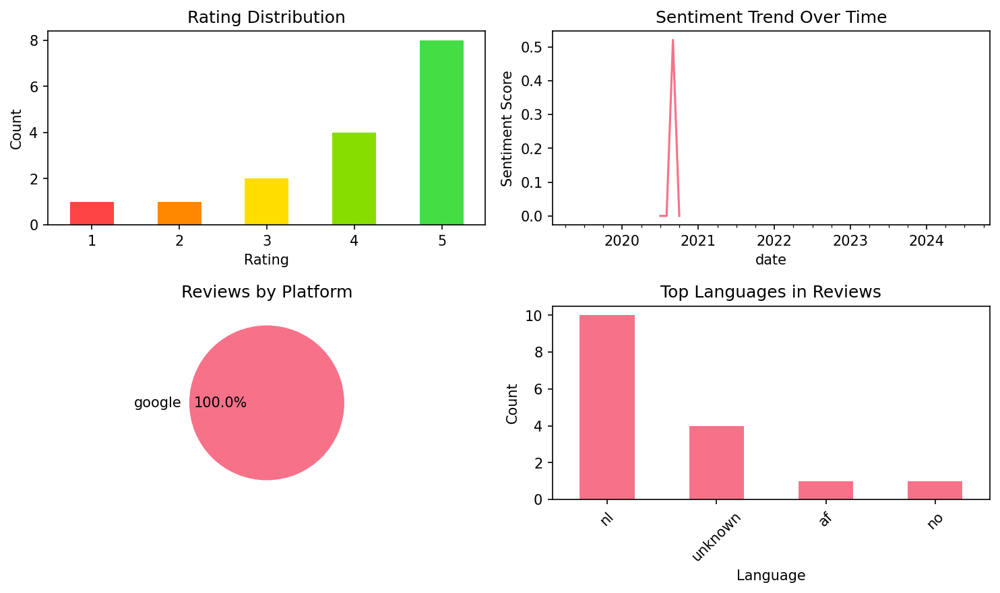
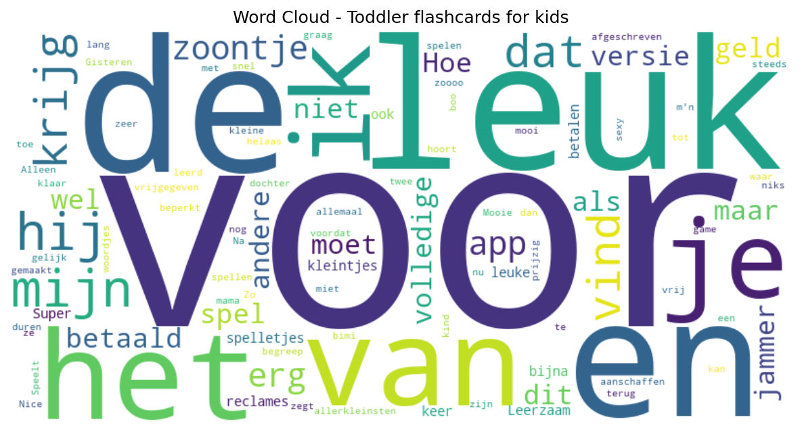

# Toddler flashcards for kids

## 📱 App Information

| **Attribute** | **Google Play** | **App Store** |
|---------------|-----------------|---------------|
| **Title** | Toddler flashcards for kids | N/A |
| **Package/ID** | com.bimiboo.firstwords | N/A |
| **Rating** | 4.27 | N/A |
| **Total Ratings** | 10,479 | N/A |
| **Installs** | 1,000,000+ | N/A |
| **Genre** | Educational | N/A |

## 📝 Description

Bimi Boo Flashcards for Kids is best preschool application for your baby designed for learning first words.

Kindergarten and preschool children will enjoy the baby flash cards game. The flashcards for kids have many educational advantages.

Toddler Flashcards for Kids are both entertaining and learning game. This game for kids includes the most common first words for children. Learn first words with this easy to play game. A baby will also enjoy the sounds in this fun learning game.

It is no secret that toddler educational games such as first words flash cards are intended to help developing skills for preschool child. A preschool game gives your baby lots of interactive learning time.

First words for kids can make memorization studies fun! Toddler flashcards give your baby independent learning ability while keeping the attention longer and in a more focused way. By playing first word flash cards, your toddler can study independently. Toddler learning games will be enjoyed by both girls and boys.
 
Features:
- 12 interesting topics to learn first words: farm animals, wildlife, fruits, vegetables, food, bathroom, home, clothes, toys, transport, shapes and colors.
- Toddler games app supports 25 languages: English, Spanish, French, German, Italian, Russian, Portuguese, Turkish, Greek, Dutch, Danish, Swedish, Norwegian, Finnish, Chinese, Japanese, Korean, Czech, Polish, Romanian, Hungarian, Ukrainian, Indian, Croatian and Slovenian.
- Toddler educational and learning games run flawlessly without Wi-Fi.
- Designed for children aged 2-5.
 
About Bimi Boo apps:
Highest quality. Bimi Boo games help toddlers to have their own experience, develop logical thinking and step up their education.
If you are looking for the best educational games for your child – apps by Bimi Boo Kids are the way to go.
No third-party ads. You will never find annoying ads in our apps. Nothing will disturb your child from playing and learning.
Safe for kids. All our games are COPPA and GDPR compliant. We put safety in our games for toddlers above everything else.

## 📊 Reviews Analytics

**Total Reviews:** 16 (16 analyzed)
**Rating Distribution:** 12 positive (4-5★), 2 neutral (3★), 2 negative (1-2★)
**Average Sentiment:** 0.09 (-1=very negative, +1=very positive)
**Primary Language:** nl
**Key Insights:** Average rating: 4.1/5.0 | Overall sentiment: neutral (score: 0.09) | Reviews in 4 languages, primarily nl (10 reviews) | Reviews from 1 platform(s): google | Key themes: leuk, voor, het


### 🔑 Key Themes & Phrases

- **leuk** (relevance: 0.141)
- **voor** (relevance: 0.116)
- **het** (relevance: 0.088)
- **leerzaam** (relevance: 0.082)
- **hij** (relevance: 0.077)
- **super** (relevance: 0.076)
- **van** (relevance: 0.075)
- **en** (relevance: 0.074)

### ⭐ Rating Breakdown

- **5 ★★★★★**: 8 reviews (50.0%)
- **4 ★★★★☆**: 4 reviews (25.0%)
- **3 ★★★☆☆**: 2 reviews (12.5%)
- **2 ★★☆☆☆**: 1 reviews (6.2%)
- **1 ★☆☆☆☆**: 1 reviews (6.2%)

### 🌍 Languages in Reviews

- **nl**: 10 reviews
- **unknown**: 4 reviews
- **af**: 1 reviews
- **no**: 1 reviews

### 📱 Platform Distribution

- **google**: 16 reviews

## 📈 Visualizations

### Analytics Charts


### Word Cloud


## 💬 Sample Reviews

**Review 1** (★ - google - 2024-11-11T19:45:52)
> Gisteren betaald voor de volledige versie maar helaas wel geld afgeschreven en tot nu toe nog steeds niks vrijgegeven. Hoe lang moet het duren voordat je krijg waar je voor betaald? Of Hoe krijg ik m'n geld terug als ik dit spel niet krijg?

**Review 2** (★★★ - google - 2022-08-16T22:56:57)
> jammer dat je voor andere spelletjes miet betalen. zeer beperkt

**Review 3** (★★★★★ - google - 2020-10-04T23:27:56)
> Na 2 keer spelen begreep me zoontje het gelijk hij is 2 en leerd ook de woordjes erg snel

**Review 4** (★★★★ - google - 2019-09-10T18:03:52)
> Leuk

**Review 5** (★★★★★ - google - 2019-02-11T14:56:34)
> kindvriendelijke app voor kleintjes. geen reclames die elke keer op komen! ik ben hier heel tevreden over en mijn zoontje van bijna 2 beleeft er veel leer en plezier van.

## 🔧 Raw JSON Data

<details>
<summary>Click to expand raw app data</summary>

```json
{
  "name": "Toddler flashcards for kids",
  "google_package": "com.bimiboo.firstwords",
  "google": {
    "title": "Toddler flashcards for kids",
    "description": "Bimi Boo Flashcards for Kids is best preschool application for your baby designed for learning first words.\r\n\r\nKindergarten and preschool children will enjoy the baby flash cards game. The flashcards for kids have many educational advantages.\r\n\r\nToddler Flashcards for Kids are both entertaining and learning game. This game for kids includes the most common first words for children. Learn first words with this easy to play game. A baby will also enjoy the sounds in this fun learning game.\r\n\r\nIt is no secret that toddler educational games such as first words flash cards are intended to help developing skills for preschool child. A preschool game gives your baby lots of interactive learning time.\r\n\r\nFirst words for kids can make memorization studies fun! Toddler flashcards give your baby independent learning ability while keeping the attention longer and in a more focused way. By playing first word flash cards, your toddler can study independently. Toddler learning games will be enjoyed by both girls and boys.\r\n \r\nFeatures:\r\n- 12 interesting topics to learn first words: farm animals, wildlife, fruits, vegetables, food, bathroom, home, clothes, toys, transport, shapes and colors.\r\n- Toddler games app supports 25 languages: English, Spanish, French, German, Italian, Russian, Portuguese, Turkish, Greek, Dutch, Danish, Swedish, Norwegian, Finnish, Chinese, Japanese, Korean, Czech, Polish, Romanian, Hungarian, Ukrainian, Indian, Croatian and Slovenian.\r\n- Toddler educational and learning games run flawlessly without Wi-Fi.\r\n- Designed for children aged 2-5.\r\n \r\nAbout Bimi Boo apps:\r\nHighest quality. Bimi Boo games help toddlers to have their own experience, develop logical thinking and step up their education.\r\nIf you are looking for the best educational games for your child – apps by Bimi Boo Kids are the way to go.\r\nNo third-party ads. You will never find annoying ads in our apps. Nothing will disturb your child from playing and learning.\r\nSafe for kids. All our games are COPPA and GDPR compliant. We put safety in our games for toddlers above everything else.",
    "rating": 4.27,
    "rating_text": null,
    "ratings_total": 10479,
    "ratings_histogram": [
      613,
      613,
      723,
      1777,
      6702
    ],
    "installs": "1,000,000+",
    "genre": "Educational"
  },
  "apple": null,
  "reviews": [
    {
      "platform": "google",
      "rating": 1,
      "review": "Gisteren betaald voor de volledige versie maar helaas wel geld afgeschreven en tot nu toe nog steeds niks vrijgegeven. Hoe lang moet het duren voordat je krijg waar je voor betaald? Of Hoe krijg ik m'n geld terug als ik dit spel niet krijg?",
      "date": "2024-11-11T19:45:52"
    },
    {
      "platform": "google",
      "rating": 5,
      "review": "🥰🥰🥰😍😍😍😘😘😘🤑🤑🤗🤗😋😋🤔🤔🤫🤫🤭🤭😁😁😁",
      "date": "2024-05-05T14:46:57"
    },
    {
      "platform": "google",
      "rating": 5,
      "review": "kleine vind het leuk",
      "date": "2023-12-07T11:47:53"
    },
    {
      "platform": "google",
      "rating": 3,
      "review": "mijn kind vind het zoooo leuk sexy met mama dat zegt hij dan als hij klaar is",
      "date": "2022-08-21T08:53:04"
    },
    {
      "platform": "google",
      "rating": 3,
      "review": "jammer dat je voor andere spelletjes miet betalen. zeer beperkt",
      "date": "2022-08-16T22:56:57"
    },
    {
      "platform": "google",
      "rating": 2,
      "review": "Leuk spel maar je moet betalen voor de volledige versie",
      "date": "2020-12-29T11:56:50"
    },
    {
      "platform": "google",
      "rating": 4,
      "review": "Nice game",
      "date": "2020-12-21T19:07:02"
    },
    {
      "platform": "google",
      "rating": 5,
      "review": "Mijn zoontje vind dit erg leuk. De andere spellen van bimi boo. Speelt hij ook graag. Alleen jammer dat ik ze niet allemaal kan aanschaffen",
      "date": "2020-10-12T20:37:04"
    },
    {
      "platform": "google",
      "rating": 5,
      "review": "Na 2 keer spelen begreep me zoontje het gelijk hij is 2 en leerd ook de woordjes erg snel",
      "date": "2020-10-04T23:27:56"
    },
    {
      "platform": "google",
      "rating": 5,
      "review": "Super! Zo hoort een app te zijn voor de allerkleinsten!",
      "date": "2020-09-13T23:50:35"
    },
    {
      "platform": "google",
      "rating": 4,
      "review": "Leerzaam",
      "date": "2020-08-30T19:54:03"
    },
    {
      "platform": "google",
      "rating": 4,
      "review": "Mooie en leuke app voor de kleintjes , wel prijzig",
      "date": "2020-07-19T23:25:29"
    },
    {
      "platform": "google",
      "rating": 4,
      "review": "Leuk",
      "date": "2019-09-10T18:03:52"
    },
    {
      "platform": "google",
      "rating": 5,
      "review": "mooi gemaakt. vrij van reclames. leerzaam. mijn dochter van bijna twee vindt het erg leuk!",
      "date": "2019-04-27T09:17:04"
    },
    {
      "platform": "google",
      "rating": 5,
      "review": "super leuke spelletjes voor peuters",
      "date": "2019-04-06T08:59:11"
    },
    {
      "platform": "google",
      "rating": 5,
      "review": "kindvriendelijke app voor kleintjes. geen reclames die elke keer op komen! ik ben hier heel tevreden over en mijn zoontje van bijna 2 beleeft er veel leer en plezier van.",
      "date": "2019-02-11T14:56:34"
    }
  ]
}
```

</details>

---
*Report generated on 2025-11-08 13:49:12 using advanced analytics*
