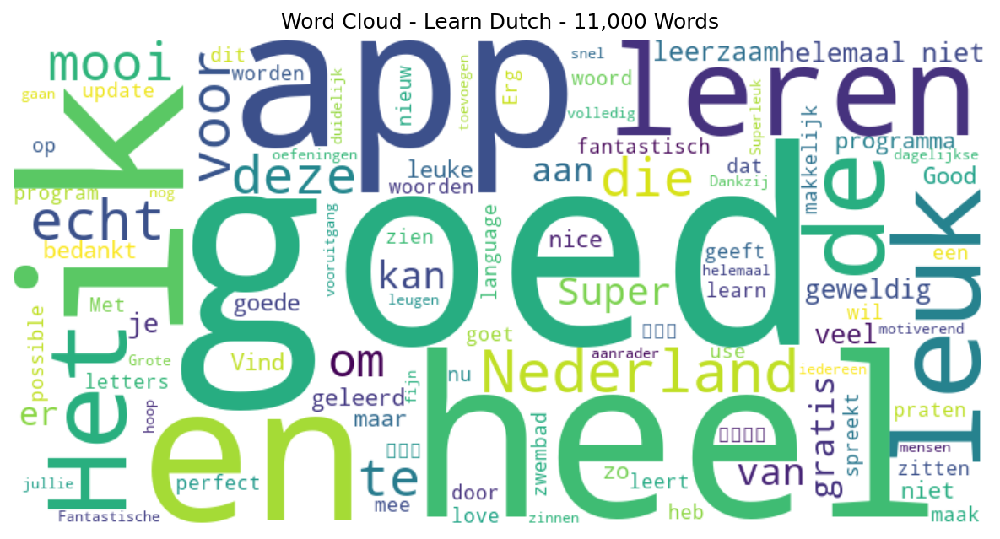

# Learn Dutch - 11,000 Words

## 📱 App Information

| **Attribute** | **Google Play** | **App Store** |
|---------------|-----------------|---------------|
| **Title** | Learn Dutch - 11,000 Words | N/A |
| **Package/ID** | com.funeasylearn.dutch | N/A |
| **Rating** | 4.2727275 | N/A |
| **Total Ratings** | 8,804 | N/A |
| **Installs** | 500,000+ | N/A |
| **Genre** | Education | N/A |

## 📝 Description

<b>Learn Dutch</b> from 61 native languages, for free & offline, with FunEasyLearn.

Learn to <b>READ 📖 WRITE ✍ and SPEAK Dutch 💬</b>
Discover the fun & easy way to learn all the reading rules, all the words you’ll ever need and all the useful phrases in the Dutch language.

🚀 <b>Contents</b>
• <b>6,000 Dutch words</b> (constantly growing): the most common nouns, verbs, adjectives, etc., categorized into 7 levels and 200 topics;
• <b>5,000 Dutch phrases</b> (frequently used): the most important phrases for daily conversations and travelling, categorized into 10 levels and 120 topics.

Enhance your vocabulary by learning words, sentences and expressions for beginner, intermediate and advanced learners. 

🔔 <b>Why learn Dutch with FunEasyLearn?</b>
FunEasyLearn reinvents language learning. Our team of linguists and teachers have developed a unique language learning strategy. The secret lies in combining an alphabet with all the reading rules, all the necessary words and a practical phrasebook into one app. This allows our users to read a word or phrase, pronounce it correctly, associate it with an illustration and practice it with listening, writing and speaking games. 

🏆 <b>Top features</b>
<b>Hand-drawn illustrations</b> – memorize the new vocabulary faster with intuitive illustrations;
<b>Professional audio recordings</b> – listen to audios recorded by native speakers;
<b>Detailed statistics</b> – analyze your results and track your progress;
<b>Review manager</b> – review everything you learn;
<b>Smart search</b> – find quickly the words and phrases you need;
<b>Hide what you know</b> – hide the content you already know;
<b>Speech recognition</b> – improve your pronunciation;
<b>Offline</b> – use the app anywhere in the world, with no internet connection.

💼 <b>Dutch for business</b>
Get access to special Dutch lessons created for your business. We provide specialized courses for taxi drivers, hotel & restaurant staffs, flight-attendants, shop-assistants, etc.

✈ <b>Dutch for travelling</b>
Learn how to book a hotel room, order a meal in a restaurant, ask for directions, carry out a conversation and speak confidently with the native speakers.

🙌 <b>Dutch for adults</b>
We adapt the contents depending on the age of the learner. Both you and your kid can learn Dutch and have fun.

<b>FunEasyLearn Free Subscription</b>
<b>Subscribe for FREE</b>, with the flowers you earn while playing language learning games. 

Learn Dutch, play for free! It’s fast & easy. 📴

📥 <b>Download the FunEasyLearn Dutch course right now!</b>
Recommend the app to your friends and get a reward.
Rate us and write a review ⭐⭐⭐⭐⭐ It would mean a lot to our team!

Contact us: 
https://www.FunEasyLearn.com/

## 📊 Reviews Analytics

**Total Reviews:** 100 (100 analyzed)
**Rating Distribution:** 88 positive (4-5★), 3 neutral (3★), 9 negative (1-2★)
**Average Sentiment:** 0.10 (-1=very negative, +1=very positive)
**Primary Language:** nl
**Key Insights:** Average rating: 4.5/5.0 | Overall sentiment: neutral (score: 0.10) | Reviews in 9 languages, primarily nl (41 reviews) | Reviews from 1 platform(s): google | Key themes: goed, leuk, heel


### 🔑 Key Themes & Phrases

- **goed** (relevance: 0.140)
- **leuk** (relevance: 0.060)
- **heel** (relevance: 0.057)
- **app** (relevance: 0.055)
- **ik** (relevance: 0.051)
- **en** (relevance: 0.046)
- **het** (relevance: 0.040)
- **leren** (relevance: 0.040)

### ⭐ Rating Breakdown

- **5 ★★★★★**: 76 reviews (76.0%)
- **4 ★★★★☆**: 12 reviews (12.0%)
- **3 ★★★☆☆**: 3 reviews (3.0%)
- **2 ★★☆☆☆**: 2 reviews (2.0%)
- **1 ★☆☆☆☆**: 7 reviews (7.0%)

### 🌍 Languages in Reviews

- **nl**: 41 reviews
- **unknown**: 36 reviews
- **af**: 8 reviews
- **en**: 5 reviews
- **ar**: 3 reviews

### 📱 Platform Distribution

- **google**: 100 reviews

## 📈 Visualizations

### Analytics Charts


### Word Cloud


## 💬 Sample Reviews

**Review 1** (★★★★★ - google - 2025-10-03T00:47:39)
> Good

**Review 2** (★★★★★ - google - 2022-01-10T13:12:24)
> goed app

**Review 3** (★★★★ - google - 2018-11-21T11:07:07)
> zeer goed en nuttig

**Review 4** (★★★★★ - google - 2017-01-25T13:59:29)
> Super

**Review 5** (★★★★★ - google - 2016-05-16T08:16:56)
> Super

## 🔧 Raw JSON Data

<details>
<summary>Click to expand raw app data</summary>

```json
{
  "name": "Learn Dutch - 11,000 Words",
  "google_package": "com.funeasylearn.dutch",
  "google": {
    "title": "Learn Dutch - 11,000 Words",
    "description": "<b>Learn Dutch</b> from 61 native languages, for free & offline, with FunEasyLearn.\r\n\r\nLearn to <b>READ 📖 WRITE ✍ and SPEAK Dutch 💬</b>\r\nDiscover the fun & easy way to learn all the reading rules, all the words you’ll ever need and all the useful phrases in the Dutch language.\r\n\r\n🚀 <b>Contents</b>\r\n• <b>6,000 Dutch words</b> (constantly growing): the most common nouns, verbs, adjectives, etc., categorized into 7 levels and 200 topics;\r\n• <b>5,000 Dutch phrases</b> (frequently used): the most important phrases for daily conversations and travelling, categorized into 10 levels and 120 topics.\r\n\r\nEnhance your vocabulary by learning words, sentences and expressions for beginner, intermediate and advanced learners. \r\n\r\n🔔 <b>Why learn Dutch with FunEasyLearn?</b>\r\nFunEasyLearn reinvents language learning. Our team of linguists and teachers have developed a unique language learning strategy. The secret lies in combining an alphabet with all the reading rules, all the necessary words and a practical phrasebook into one app. This allows our users to read a word or phrase, pronounce it correctly, associate it with an illustration and practice it with listening, writing and speaking games. \r\n\r\n🏆 <b>Top features</b>\r\n<b>Hand-drawn illustrations</b> – memorize the new vocabulary faster with intuitive illustrations;\r\n<b>Professional audio recordings</b> – listen to audios recorded by native speakers;\r\n<b>Detailed statistics</b> – analyze your results and track your progress;\r\n<b>Review manager</b> – review everything you learn;\r\n<b>Smart search</b> – find quickly the words and phrases you need;\r\n<b>Hide what you know</b> – hide the content you already know;\r\n<b>Speech recognition</b> – improve your pronunciation;\r\n<b>Offline</b> – use the app anywhere in the world, with no internet connection.\r\n\r\n💼 <b>Dutch for business</b>\r\nGet access to special Dutch lessons created for your business. We provide specialized courses for taxi drivers, hotel & restaurant staffs, flight-attendants, shop-assistants, etc.\r\n\r\n✈ <b>Dutch for travelling</b>\r\nLearn how to book a hotel room, order a meal in a restaurant, ask for directions, carry out a conversation and speak confidently with the native speakers.\r\n\r\n🙌 <b>Dutch for adults</b>\r\nWe adapt the contents depending on the age of the learner. Both you and your kid can learn Dutch and have fun.\r\n\r\n<b>FunEasyLearn Free Subscription</b>\r\n<b>Subscribe for FREE</b>, with the flowers you earn while playing language learning games. \r\n\r\nLearn Dutch, play for free! It’s fast & easy. 📴\r\n\r\n📥 <b>Download the FunEasyLearn Dutch course right now!</b>\r\nRecommend the app to your friends and get a reward.\r\nRate us and write a review ⭐⭐⭐⭐⭐ It would mean a lot to our team!\r\n\r\nContact us: \r\nhttps://www.FunEasyLearn.com/",
    "rating": 4.2727275,
    "rating_text": null,
    "ratings_total": 8804,
    "ratings_histogram": [
      891,
      222,
      334,
      1337,
      5943
    ],
    "installs": "500,000+",
    "genre": "Education"
  },
  "apple": null,
  "reviews": [
    {
      "platform": "google",
      "rating": 5,
      "review": "Good",
      "date": "2025-10-03T00:47:39"
    },
    {
      "platform": "google",
      "rating": 5,
      "review": "⭐️⭐️⭐️⭐️⭐️ Fantastische app om Nederlands te leren! Het is duidelijk, leuk en heel motiverend. Dankzij de dagelijkse oefeningen maak ik snel vooruitgang. Echt een aanrader voor iedereen die Nederlands wil leren!",
      "date": "2025-09-26T13:25:10"
    },
    {
      "platform": "google",
      "rating": 5,
      "review": "zo mooi dit app, bedankt voor het",
      "date": "2025-06-08T17:20:30"
    },
    {
      "platform": "google",
      "rating": 5,
      "review": "fantastisch fijn om mee te gaan leren",
      "date": "2025-05-26T20:02:23"
    },
    {
      "platform": "google",
      "rating": 5,
      "review": "goed",
      "date": "2025-04-13T21:59:21"
    },
    {
      "platform": "google",
      "rating": 5,
      "review": "Superleuk en goed",
      "date": "2025-02-26T21:07:15"
    },
    {
      "platform": "google",
      "rating": 5,
      "review": "is heel goed programma voor de mensen die Nederland leren",
      "date": "2024-11-05T07:10:42"
    },
    {
      "platform": "google",
      "rating": 5,
      "review": "ik vind het heel heel leuke app en ik hoop dat jullie nog zinnen voor nederlands toevoegen",
      "date": "2024-09-15T22:49:03"
    },
    {
      "platform": "google",
      "rating": 5,
      "review": "Deze echt mooi",
      "date": "2024-05-26T19:25:04"
    },
    {
      "platform": "google",
      "rating": 1,
      "review": "Grote leugen, helemaal niet volledig gratis",
      "date": "2023-11-06T06:15:23"
    },
    {
      "platform": "google",
      "rating": 5,
      "review": "es buena",
      "date": "2023-08-19T08:16:56"
    },
    {
      "platform": "google",
      "rating": 1,
      "review": "Helemaal niet gratis. Oplichting!",
      "date": "2023-08-13T13:42:03"
    },
    {
      "platform": "google",
      "rating": 5,
      "review": "Goede App",
      "date": "2023-06-26T00:49:15"
    },
    {
      "platform": "google",
      "rating": 5,
      "review": "Is mooier",
      "date": "2023-06-14T23:31:18"
    },
    {
      "platform": "google",
      "rating": 2,
      "review": "Leuke app maar bij raad het woord geeft de dingen niet juist aan hij geeft aan letters die op de verkeerde plek zitten terwijl die letters er helemaal niet in zitten.",
      "date": "2023-03-22T14:51:53"
    },
    {
      "platform": "google",
      "rating": 5,
      "review": "I love this app❤️!",
      "date": "2023-02-09T03:57:46"
    },
    {
      "platform": "google",
      "rating": 1,
      "review": "Not free at all. Helemaal niet gratis",
      "date": "2022-12-22T12:45:02"
    },
    {
      "platform": "google",
      "rating": 5,
      "review": "Super leuk app",
      "date": "2022-11-24T16:35:48"
    },
    {
      "platform": "google",
      "rating": 5,
      "review": "Fantastisch en Amazing!",
      "date": "2022-11-13T19:36:04"
    },
    {
      "platform": "google",
      "rating": 1,
      "review": "Ik zoek gratis",
      "date": "2022-09-24T14:05:33"
    },
    {
      "platform": "google",
      "rating": 5,
      "review": "Vind ik helemaal leuk, deze curses is geweldig.",
      "date": "2022-09-11T23:26:34"
    },
    {
      "platform": "google",
      "rating": 5,
      "review": "mooi en heel goed",
      "date": "2022-05-07T12:34:51"
    },
    {
      "platform": "google",
      "rating": 5,
      "review": "في الحقيقة تطبيق جيد",
      "date": "2022-04-09T12:55:12"
    },
    {
      "platform": "google",
      "rating": 5,
      "review": "Geweldig",
      "date": "2022-02-08T11:33:46"
    },
    {
      "platform": "google",
      "rating": 5,
      "review": "Met deze aap kun je makkelijk Nederlandtaal leren",
      "date": "2022-01-29T23:05:33"
    },
    {
      "platform": "google",
      "rating": 5,
      "review": "goed app",
      "date": "2022-01-10T13:12:24"
    },
    {
      "platform": "google",
      "rating": 5,
      "review": "Deze app us echt kapot goed toen ik in België nieuw was geb ik door deze app geleerd en nu kan ik perfect praten.",
      "date": "2021-10-19T20:07:13"
    },
    {
      "platform": "google",
      "rating": 5,
      "review": "dankjewel les geven woorden ik kan spreekt voor volgende jaar kan spreekt 🇳🇱🇸🇦🇬🇧best liefde tot ziens i wil english learn and arabic:)",
      "date": "2021-09-21T17:29:51"
    },
    {
      "platform": "google",
      "rating": 3,
      "review": "I love this application but I can't use invitation and also can't transfer my progress Now I lost whatever I have learnt after doing update. Why on earth?",
      "date": "2021-09-17T14:23:33"
    },
    {
      "platform": "google",
      "rating": 4,
      "review": "Was very nice program for people which start to learn language, but after the last update became uncomfortable to use. Not possible to change main language, not possible to turn off animation. Before version was much better.",
      "date": "2021-05-04T19:05:55"
    },
    {
      "platform": "google",
      "rating": 5,
      "review": "🥰🥰🥰",
      "date": "2021-03-14T11:03:19"
    },
    {
      "platform": "google",
      "rating": 5,
      "review": "heel goet",
      "date": "2021-01-14T08:47:28"
    },
    {
      "platform": "google",
      "rating": 5,
      "review": "Super leuk",
      "date": "2020-12-12T17:50:56"
    },
    {
      "platform": "google",
      "rating": 5,
      "review": "Heel goed Dank wel",
      "date": "2020-12-04T05:37:11"
    },
    {
      "platform": "google",
      "rating": 5,
      "review": "Heel goed",
      "date": "2020-10-05T22:18:01"
    },
    {
      "platform": "google",
      "rating": 5,
      "review": "Leuk",
      "date": "2020-07-08T22:34:59"
    },
    {
      "platform": "google",
      "rating": 4,
      "review": "Dit is goed ☺️",
      "date": "2020-07-01T19:19:42"
    },
    {
      "platform": "google",
      "rating": 5,
      "review": "Goed⚡⚡",
      "date": "2020-06-02T10:37:37"
    },
    {
      "platform": "google",
      "rating": 1,
      "review": "Alles is verandert doe daar iets aan, oude versie was veel beter!!!",
      "date": "2020-03-18T00:40:55"
    },
    {
      "platform": "google",
      "rating": 5,
      "review": "Heel goed",
      "date": "2020-03-04T15:41:29"
    },
    {
      "platform": "google",
      "rating": 3,
      "review": "Het is matig",
      "date": "2020-02-28T20:21:39"
    },
    {
      "platform": "google",
      "rating": 5,
      "review": "Perfect. Goed leerzaam",
      "date": "2020-01-10T13:57:01"
    },
    {
      "platform": "google",
      "rating": 5,
      "review": "nice",
      "date": "2019-12-20T09:48:57"
    },
    {
      "platform": "google",
      "rating": 5,
      "review": "👍👍👍",
      "date": "2019-11-09T15:07:42"
    },
    {
      "platform": "google",
      "rating": 4,
      "review": "goede app",
      "date": "2019-10-27T08:41:10"
    },
    {
      "platform": "google",
      "rating": 1,
      "review": "Ik leer heelveel.",
      "date": "2019-09-11T16:26:39"
    },
    {
      "platform": "google",
      "rating": 5,
      "review": "goed Dankuwel",
      "date": "2019-03-01T21:47:26"
    },
    {
      "platform": "google",
      "rating": 5,
      "review": "Heel mooi worden bedank",
      "date": "2019-02-26T20:35:21"
    },
    {
      "platform": "google",
      "rating": 5,
      "review": "echt goed",
      "date": "2019-02-15T12:52:10"
    },
    {
      "platform": "google",
      "rating": 5,
      "review": "top app",
      "date": "2019-02-06T20:17:20"
    },
    {
      "platform": "google",
      "rating": 4,
      "review": "zeer goed en nuttig",
      "date": "2018-11-21T11:07:07"
    },
    {
      "platform": "google",
      "rating": 5,
      "review": "Leuk leren",
      "date": "2018-11-19T15:09:26"
    },
    {
      "platform": "google",
      "rating": 5,
      "review": "Zo goed",
      "date": "2018-11-04T21:56:22"
    },
    {
      "platform": "google",
      "rating": 5,
      "review": "👍",
      "date": "2018-10-29T15:36:26"
    },
    {
      "platform": "google",
      "rating": 5,
      "review": "Leuk en leerzaam",
      "date": "2018-10-27T15:59:40"
    },
    {
      "platform": "google",
      "rating": 5,
      "review": "Leuk leerzaam🙏",
      "date": "2018-10-26T18:49:15"
    },
    {
      "platform": "google",
      "rating": 5,
      "review": "Slecht",
      "date": "2018-10-09T19:15:50"
    },
    {
      "platform": "google",
      "rating": 4,
      "review": "Leuk en goed om er mee te leren",
      "date": "2018-09-30T18:37:56"
    },
    {
      "platform": "google",
      "rating": 5,
      "review": "Heel goed te gebruiken door taalcoaches om nieuwe Nederlanders de taal te \nleren! Uitstekend goed materiaal.",
      "date": "2018-06-19T14:19:14"
    },
    {
      "platform": "google",
      "rating": 5,
      "review": "Goed",
      "date": "2018-03-17T18:03:46"
    },
    {
      "platform": "google",
      "rating": 5,
      "review": "Leuk",
      "date": "2018-01-29T09:45:57"
    },
    {
      "platform": "google",
      "rating": 5,
      "review": "Het is super leerzaam😋😗❤💖📃📒📓📚📙📘📗📔📕",
      "date": "2018-01-14T17:08:28"
    },
    {
      "platform": "google",
      "rating": 5,
      "review": "Mukemmel",
      "date": "2017-12-24T10:20:32"
    },
    {
      "platform": "google",
      "rating": 5,
      "review": "Het is echt prachtig",
      "date": "2017-10-07T22:37:41"
    },
    {
      "platform": "google",
      "rating": 5,
      "review": "Goed Nederlands leren",
      "date": "2017-08-27T12:08:15"
    },
    {
      "platform": "google",
      "rating": 5,
      "review": "Heele leuke spellen hahahaha ike niiet goet Nederland praten",
      "date": "2017-08-12T22:26:21"
    },
    {
      "platform": "google",
      "rating": 5,
      "review": "Goed",
      "date": "2017-08-03T18:47:53"
    },
    {
      "platform": "google",
      "rating": 5,
      "review": "Ik kan zo talen leren",
      "date": "2017-06-30T18:48:16"
    },
    {
      "platform": "google",
      "rating": 5,
      "review": "Ik heb heel veel geleerd van deze app",
      "date": "2017-05-25T14:04:55"
    },
    {
      "platform": "google",
      "rating": 5,
      "review": "De goedste programma van leren . ik had heel veel geleerd van die programma",
      "date": "2017-05-08T19:14:45"
    },
    {
      "platform": "google",
      "rating": 4,
      "review": "Geschikt voor beginners",
      "date": "2017-03-17T11:31:31"
    },
    {
      "platform": "google",
      "rating": 1,
      "review": "Slechte uitspraken, woorden kloppen niet met de afbeelding.",
      "date": "2017-03-10T22:52:28"
    },
    {
      "platform": "google",
      "rating": 3,
      "review": "Grappig, maar vrij simpel. Keek even ernaar en kwam voorbij het woord \" de zwembad\" serieus DE zwembad. Heb de app maar meteen gewist.",
      "date": "2017-02-23T09:01:34"
    },
    {
      "platform": "google",
      "rating": 4,
      "review": "Leren voor nieuw worden Goed methoden",
      "date": "2017-02-06T12:12:09"
    },
    {
      "platform": "google",
      "rating": 5,
      "review": "Mooi en makkelijk",
      "date": "2017-02-05T11:24:50"
    },
    {
      "platform": "google",
      "rating": 5,
      "review": "Super",
      "date": "2017-01-25T13:59:29"
    },
    {
      "platform": "google",
      "rating": 5,
      "review": "Halo",
      "date": "2016-12-22T21:06:03"
    },
    {
      "platform": "google",
      "rating": 2,
      "review": "Yazo Flow",
      "date": "2016-12-21T20:41:06"
    },
    {
      "platform": "google",
      "rating": 5,
      "review": "Good",
      "date": "2016-12-11T09:15:52"
    },
    {
      "platform": "google",
      "rating": 5,
      "review": "Vind ik leuk",
      "date": "2016-11-25T21:37:06"
    },
    {
      "platform": "google",
      "rating": 4,
      "review": "maak het allen wat moeilijker",
      "date": "2016-11-12T12:41:24"
    },
    {
      "platform": "google",
      "rating": 5,
      "review": "Het een hele goede progama en je leert er veel van ik ken niet goed nederlands dat kan je zien aan mijn naam ik kom uit somalie en woon heel lang in nederland dus dowload",
      "date": "2016-11-09T16:59:00"
    },
    {
      "platform": "google",
      "rating": 5,
      "review": "جيد",
      "date": "2016-11-04T21:58:26"
    },
    {
      "platform": "google",
      "rating": 5,
      "review": "جميل جدأ جدأ",
      "date": "2016-10-24T10:52:02"
    },
    {
      "platform": "google",
      "rating": 5,
      "review": "Heel goed spelje",
      "date": "2016-10-20T19:15:32"
    },
    {
      "platform": "google",
      "rating": 5,
      "review": "Heel handig en echt geweldig bedankt",
      "date": "2016-10-01T18:57:31"
    },
    {
      "platform": "google",
      "rating": 5,
      "review": "Świetna aplikacja  :-) polecam",
      "date": "2016-09-27T22:55:38"
    },
    {
      "platform": "google",
      "rating": 5,
      "review": "Ik wind Echt heel mooi",
      "date": "2016-09-16T20:05:08"
    },
    {
      "platform": "google",
      "rating": 4,
      "review": "Program",
      "date": "2016-09-09T20:55:31"
    },
    {
      "platform": "google",
      "rating": 4,
      "review": "In this app you can find good dictionary and nice training games.",
      "date": "2016-08-29T17:46:15"
    },
    {
      "platform": "google",
      "rating": 5,
      "review": "Erg goed",
      "date": "2016-08-22T21:51:40"
    },
    {
      "platform": "google",
      "rating": 5,
      "review": "Bedankt",
      "date": "2016-08-21T22:54:45"
    },
    {
      "platform": "google",
      "rating": 4,
      "review": "Ik heel erg leuk om te leren op die website",
      "date": "2016-07-23T23:01:10"
    },
    {
      "platform": "google",
      "rating": 5,
      "review": "Goed",
      "date": "2016-07-23T12:19:53"
    },
    {
      "platform": "google",
      "rating": 5,
      "review": "Geweldig!",
      "date": "2016-07-09T19:39:53"
    },
    {
      "platform": "google",
      "rating": 4,
      "review": "I can not see where the favourite words are. Mobile huawei y6",
      "date": "2016-06-28T09:08:43"
    },
    {
      "platform": "google",
      "rating": 5,
      "review": "Je leert er heleboel van😀",
      "date": "2016-06-17T15:53:17"
    },
    {
      "platform": "google",
      "rating": 5,
      "review": "NU GOED!!!",
      "date": "2016-06-12T20:05:16"
    },
    {
      "platform": "google",
      "rating": 5,
      "review": "عالی و خیلی عالی",
      "date": "2016-06-01T14:29:09"
    },
    {
      "platform": "google",
      "rating": 5,
      "review": "Super",
      "date": "2016-05-16T08:16:56"
    }
  ]
}
```

</details>

---
*Report generated on 2025-11-08 13:49:47 using advanced analytics*
