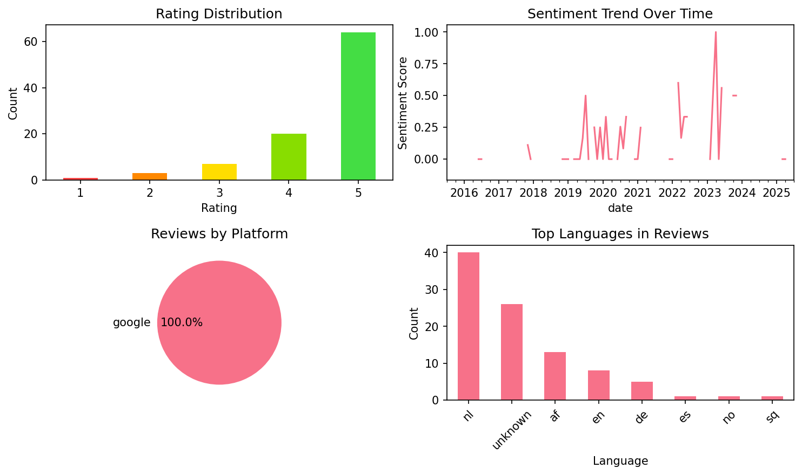

# Learn German for Beginners

## 📱 App Information

| **Attribute** | **Google Play** | **App Store** |
|---------------|-----------------|---------------|
| **Title** | Learn German for Beginners | N/A |
| **Package/ID** | com.german.zeemish | N/A |
| **Rating** | 4.68 | N/A |
| **Total Ratings** | 11,192 | N/A |
| **Installs** | 500,000+ | N/A |
| **Genre** | Education | N/A |

## 📝 Description

Learn German with the world’s most effective language learning educational app for Free. This app is an ultimate  quick German learning package for absolute beginners. Whether you are a beginner or an intermediate German speaker this program will help you to be an expert in German language. You can practice Speaking, Listening, Reading and writing in order to build your vocabulary and grammar skills. Now With Free German Translator.

Learn German for Beginner is Designed by experts to help travellers, school students and even if you need fast, easy and quick German learning guide this app is perfect for you.

Why Learn German for Beginner?
- 100% Free German Learning
- 100% Offline
- No Account Needed, No Sign In, No Sign Up
- You will learn German from Scratch, No prior knowledge of German needed.
- Free German Translator Included. Translate anything, anywhere, whenever you want.
- 10,000+ German Vocabulary
- Fun and effective game like lessons.

Learn how to speak German with lessons, courses, audio, activities and quizzes. Including German Alphabet, phrases, vocabulary, pronunciation, parts of speeches, grammar and many more. The App is divided in several classes to give you the easy and quick learning experience.

## 📊 Reviews Analytics

**Total Reviews:** 2 (2 analyzed)
**Rating Distribution:** 1 positive (4-5★), 1 neutral (3★), 0 negative (1-2★)
**Average Sentiment:** 0.50 (-1=very negative, +1=very positive)
**Primary Language:** nl
**Key Insights:** Average rating: 4.0/5.0 | Overall sentiment: positive (score: 0.50) | Reviews in 2 languages, primarily nl (1 reviews) | Reviews from 1 platform(s): google

### ⭐ Rating Breakdown

- **5 ★★★★★**: 1 reviews (50.0%)
- **3 ★★★☆☆**: 1 reviews (50.0%)

### 🌍 Languages in Reviews

- **nl**: 1 reviews
- **de**: 1 reviews

### 📱 Platform Distribution

- **google**: 2 reviews

## 📈 Visualizations

### Analytics Charts


### Word Cloud


## 💬 Sample Reviews

**Review 1** (★★★★★ - google - 2019-11-27T11:48:19)
> Goed voor zinnen

**Review 2** (★★★ - google - 2015-11-19T20:58:31)
> Das is de beste spul ig haben gehad :D echt kei handig

## 🔧 Raw JSON Data

<details>
<summary>Click to expand raw app data</summary>

```json
{
  "name": "Learn German for Beginners",
  "google_package": "com.german.zeemish",
  "google": {
    "title": "Learn German for Beginners",
    "description": "Learn German with the world’s most effective language learning educational app for Free. This app is an ultimate  quick German learning package for absolute beginners. Whether you are a beginner or an intermediate German speaker this program will help you to be an expert in German language. You can practice Speaking, Listening, Reading and writing in order to build your vocabulary and grammar skills. Now With Free German Translator.\r\n\r\nLearn German for Beginner is Designed by experts to help travellers, school students and even if you need fast, easy and quick German learning guide this app is perfect for you.\r\n\r\nWhy Learn German for Beginner?\r\n- 100% Free German Learning\r\n- 100% Offline\r\n- No Account Needed, No Sign In, No Sign Up\r\n- You will learn German from Scratch, No prior knowledge of German needed.\r\n- Free German Translator Included. Translate anything, anywhere, whenever you want.\r\n- 10,000+ German Vocabulary\r\n- Fun and effective game like lessons.\r\n\r\nLearn how to speak German with lessons, courses, audio, activities and quizzes. Including German Alphabet, phrases, vocabulary, pronunciation, parts of speeches, grammar and many more. The App is divided in several classes to give you the easy and quick learning experience.",
    "rating": 4.68,
    "rating_text": null,
    "ratings_total": 11192,
    "ratings_histogram": [
      331,
      211,
      211,
      1116,
      9276
    ],
    "installs": "500,000+",
    "genre": "Education"
  },
  "apple": null,
  "reviews": [
    {
      "platform": "google",
      "rating": 5,
      "review": "Goed voor zinnen",
      "date": "2019-11-27T11:48:19"
    },
    {
      "platform": "google",
      "rating": 3,
      "review": "Das is de beste spul ig haben gehad :D echt kei handig",
      "date": "2015-11-19T20:58:31"
    }
  ]
}
```

</details>

---
*Report generated on 2025-11-08 13:50:08 using advanced analytics*
