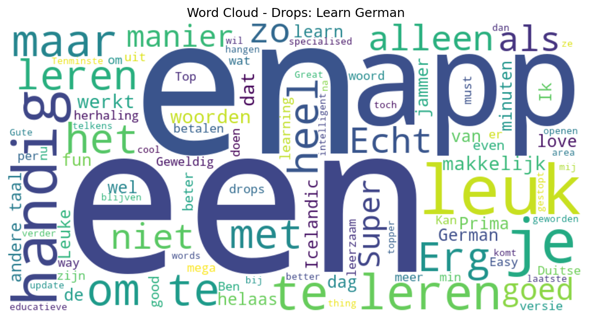

# Drops: Learn German

## 📱 App Information

| **Attribute** | **Google Play** | **App Store** |
|---------------|-----------------|---------------|
| **Title** | Drops: Learn German | N/A |
| **Package/ID** | com.languagedrops.drops.learn.learning.speak.language.german.words | N/A |
| **Rating** | 4.557756 | N/A |
| **Total Ratings** | 65,374 | N/A |
| **Installs** | 1,000,000+ | N/A |
| **Genre** | Education | N/A |

## 📝 Description

What if 🇩🇪 German vocabulary learning would be a crazy fun game instead of boring memorisation drills? Drops makes language learning an effortless fun. Practical vocabulary is bound to your memories through beautiful graphics and quick mini-games.
The crazy part? You have only 5 mins per day. Might sound insane but works like charm! :)
These are the ingredients of the secret sauce:
👀 100% illustrated: Pictures directly carry the meaning -  you don’t have to use your native language at all! No intermediary. Faster, more effective and of course more fun! :)
🏎 5 min sessions: limiting practice time sounds crazy but it it makes it incredibly addictive - which is cool thing for learning. The barrier of entry is close to zero so you can’t have any excuses: you’ll have 5 minutes even on the busiest day!
🕹 Effortless play: We know why games are fun and addictive and distilled the essence into Drops. The result is a truly immersive experience but it’s not waste of your time while you play because you build a valuable knowledge.
⚡Qucik: Keyboard typing is painfully slow. Welcome rapid swipes and taps! Trust us, you’ll need those extra seconds during the quick learning session ;)
🎯 Vocabulary only: Zero grammar, just handpicked practical words. That’s our focus and we do it extremely well. The app teaches the Korean “alphabet” Hangul (hangoul) too!
💁Forge a habit: Drops wants to make you language learning addict. Effectiveness is nothing without a well established habit. We help you build one!
We are extremely proud of our lovely word pronunciations by seasoned voice talents!
Drops is free for casual learners: more than 1700 words in 99 topics are all available for everyone. Hardcore language learners can subscribe for premium to progress faster with unlimited learning time. Subscriptions start from $2.99 / month.
 
🌍 Our goal is to empower people of the world via language knowledge by providing a special tool that utilizes the universal language we all speak: pictures.
 
 
p.s.: be careful, this app really can get you addicted to to language learning.
 
-----------------
😍 If you love Drops as much as we enjoyed building it, please leave us a review! :)
 
Questions? Contact us at sup@languagedrops.com

## 📊 Reviews Analytics

**Total Reviews:** 57 (57 analyzed)
**Rating Distribution:** 51 positive (4-5★), 4 neutral (3★), 2 negative (1-2★)
**Average Sentiment:** 0.14 (-1=very negative, +1=very positive)
**Primary Language:** nl
**Key Insights:** Average rating: 4.5/5.0 | Overall sentiment: positive (score: 0.14) | Reviews in 9 languages, primarily nl (27 reviews) | Reviews from 1 platform(s): google | Key themes: app, een, en


### 🔑 Key Themes & Phrases

- **app** (relevance: 0.092)
- **een** (relevance: 0.063)
- **en** (relevance: 0.063)
- **handig** (relevance: 0.057)
- **leuk** (relevance: 0.056)
- **prima** (relevance: 0.053)
- **leren** (relevance: 0.052)
- **te** (relevance: 0.047)

### ⭐ Rating Breakdown

- **5 ★★★★★**: 39 reviews (68.4%)
- **4 ★★★★☆**: 12 reviews (21.1%)
- **3 ★★★☆☆**: 4 reviews (7.0%)
- **1 ★☆☆☆☆**: 2 reviews (3.5%)

### 🌍 Languages in Reviews

- **nl**: 27 reviews
- **en**: 10 reviews
- **unknown**: 10 reviews
- **af**: 4 reviews
- **no**: 2 reviews

### 📱 Platform Distribution

- **google**: 57 reviews

## 📈 Visualizations

### Analytics Charts


### Word Cloud


## 💬 Sample Reviews

**Review 1** (★★★★★ - google - 2023-07-22T20:18:55)
> cool thing

**Review 2** (★★★★★ - google - 2020-03-09T15:10:39)
> Super app

**Review 3** (★★★★★ - google - 2019-04-23T16:13:36)
> super mega goed

**Review 4** (★★★★★ - google - 2019-02-13T19:20:39)
> Geweldig handig.

**Review 5** (★★★★★ - google - 2018-03-22T12:12:26)
> Very fun! Both auditive and visual input, which is excellent. I love it!

## 🔧 Raw JSON Data

<details>
<summary>Click to expand raw app data</summary>

```json
{
  "name": "Drops: Learn German",
  "google_package": "com.languagedrops.drops.learn.learning.speak.language.german.words",
  "google": {
    "title": "Drops: Learn German",
    "description": "What if 🇩🇪 German vocabulary learning would be a crazy fun game instead of boring memorisation drills? Drops makes language learning an effortless fun. Practical vocabulary is bound to your memories through beautiful graphics and quick mini-games.\r\nThe crazy part? You have only 5 mins per day. Might sound insane but works like charm! :)\r\nThese are the ingredients of the secret sauce:\r\n👀 100% illustrated: Pictures directly carry the meaning -  you don’t have to use your native language at all! No intermediary. Faster, more effective and of course more fun! :)\r\n🏎 5 min sessions: limiting practice time sounds crazy but it it makes it incredibly addictive - which is cool thing for learning. The barrier of entry is close to zero so you can’t have any excuses: you’ll have 5 minutes even on the busiest day!\r\n🕹 Effortless play: We know why games are fun and addictive and distilled the essence into Drops. The result is a truly immersive experience but it’s not waste of your time while you play because you build a valuable knowledge.\r\n⚡Qucik: Keyboard typing is painfully slow. Welcome rapid swipes and taps! Trust us, you’ll need those extra seconds during the quick learning session ;)\r\n🎯 Vocabulary only: Zero grammar, just handpicked practical words. That’s our focus and we do it extremely well. The app teaches the Korean “alphabet” Hangul (hangoul) too!\r\n💁Forge a habit: Drops wants to make you language learning addict. Effectiveness is nothing without a well established habit. We help you build one!\r\nWe are extremely proud of our lovely word pronunciations by seasoned voice talents!\r\nDrops is free for casual learners: more than 1700 words in 99 topics are all available for everyone. Hardcore language learners can subscribe for premium to progress faster with unlimited learning time. Subscriptions start from $2.99 / month.\r\n \r\n🌍 Our goal is to empower people of the world via language knowledge by providing a special tool that utilizes the universal language we all speak: pictures.\r\n \r\n \r\np.s.: be careful, this app really can get you addicted to to language learning.\r\n \r\n-----------------\r\n😍 If you love Drops as much as we enjoyed building it, please leave us a review! :)\r\n \r\nQuestions? Contact us at sup@languagedrops.com",
    "rating": 4.557756,
    "rating_text": null,
    "ratings_total": 65374,
    "ratings_histogram": [
      3001,
      1706,
      1922,
      7753,
      50904
    ],
    "installs": "1,000,000+",
    "genre": "Education"
  },
  "apple": null,
  "reviews": [
    {
      "platform": "google",
      "rating": 5,
      "review": "cool thing",
      "date": "2023-07-22T20:18:55"
    },
    {
      "platform": "google",
      "rating": 5,
      "review": "Erg handig en een educatieve topper En alleen maar beter geworden",
      "date": "2023-07-18T00:00:09"
    },
    {
      "platform": "google",
      "rating": 5,
      "review": "Gute App",
      "date": "2023-06-26T02:01:30"
    },
    {
      "platform": "google",
      "rating": 5,
      "review": "Its a good German learning app!!!🇦🇹🇩🇪",
      "date": "2022-12-31T15:31:31"
    },
    {
      "platform": "google",
      "rating": 5,
      "review": "Great learning app! Would be even better if you could learn even more words in a specialised area.",
      "date": "2022-10-20T09:42:03"
    },
    {
      "platform": "google",
      "rating": 3,
      "review": "Leuke app met herhaling en van woord en, zo blijven ze beter hangen. Tenminste bij mij dan toch. Helaas na laatste update komt er telkens als ik de app wil openen helaas drops is gestopt. Kan nu niet verder leren 😢😕",
      "date": "2021-04-07T22:32:59"
    },
    {
      "platform": "google",
      "rating": 5,
      "review": "Handig en intelligent leren",
      "date": "2020-09-01T21:49:53"
    },
    {
      "platform": "google",
      "rating": 4,
      "review": "Weird... I have 2 drops on my phone. Icelandic and now German too. With Icelandic I could browse all topics for free but with German I must buy premium? Must be because Icelandic is way cooler ;) I totaly agree lol",
      "date": "2020-08-09T19:33:34"
    },
    {
      "platform": "google",
      "rating": 5,
      "review": "Echt leerzaam op een fijne manier",
      "date": "2020-08-04T06:27:11"
    },
    {
      "platform": "google",
      "rating": 5,
      "review": "Top",
      "date": "2020-05-30T20:25:27"
    },
    {
      "platform": "google",
      "rating": 4,
      "review": "Nice app. Easy",
      "date": "2020-05-24T12:39:14"
    },
    {
      "platform": "google",
      "rating": 3,
      "review": "Was to easy",
      "date": "2020-05-21T11:55:36"
    },
    {
      "platform": "google",
      "rating": 5,
      "review": "Prima hoor",
      "date": "2020-05-07T13:22:12"
    },
    {
      "platform": "google",
      "rating": 5,
      "review": "Heel leuk. Goed te leren door constante herhaling.",
      "date": "2020-03-30T08:03:19"
    },
    {
      "platform": "google",
      "rating": 5,
      "review": "Super app",
      "date": "2020-03-09T15:10:39"
    },
    {
      "platform": "google",
      "rating": 5,
      "review": "Leuk om te leren",
      "date": "2020-01-13T21:20:39"
    },
    {
      "platform": "google",
      "rating": 4,
      "review": "Erg handig",
      "date": "2019-12-17T17:01:13"
    },
    {
      "platform": "google",
      "rating": 5,
      "review": "Very good app to learn a language!!!!",
      "date": "2019-08-23T08:39:43"
    },
    {
      "platform": "google",
      "rating": 5,
      "review": "Echt een mega handige app. Ben er heel blij mee! Een aanrader!😊",
      "date": "2019-08-13T00:07:33"
    },
    {
      "platform": "google",
      "rating": 5,
      "review": "Deze is goed en simpel.",
      "date": "2019-08-04T20:24:11"
    },
    {
      "platform": "google",
      "rating": 4,
      "review": "leuke app, het gedeelte tot nu toe is erg makkelijk",
      "date": "2019-07-31T09:45:24"
    },
    {
      "platform": "google",
      "rating": 4,
      "review": "leuk",
      "date": "2019-07-28T08:48:42"
    },
    {
      "platform": "google",
      "rating": 5,
      "review": "snel en via afbeeldingen woorden leren, gaat vlotjes",
      "date": "2019-07-27T22:24:44"
    },
    {
      "platform": "google",
      "rating": 5,
      "review": "werkt met plaatjes dus heel fijn als je een beelddenker bent, zonder te betalen ben je met 5 minuten per dag klaar.",
      "date": "2019-07-26T21:48:57"
    },
    {
      "platform": "google",
      "rating": 5,
      "review": "goeie visuele Duitse les",
      "date": "2019-07-02T21:14:48"
    },
    {
      "platform": "google",
      "rating": 5,
      "review": "heel handig",
      "date": "2019-06-09T18:27:02"
    },
    {
      "platform": "google",
      "rating": 5,
      "review": "prima",
      "date": "2019-05-01T12:05:22"
    },
    {
      "platform": "google",
      "rating": 3,
      "review": "eenvoudig om te beginnen, voorlopig alleen woordjes, zeer beeldend, dat helpt als je vauit een andere taal begint.n",
      "date": "2019-04-29T15:55:09"
    },
    {
      "platform": "google",
      "rating": 5,
      "review": "super mega goed",
      "date": "2019-04-23T16:13:36"
    },
    {
      "platform": "google",
      "rating": 5,
      "review": "Super handig zo met woorden spelen!",
      "date": "2019-04-11T13:01:07"
    },
    {
      "platform": "google",
      "rating": 4,
      "review": "leuk en makkelijk te doen!!!",
      "date": "2019-04-06T19:54:24"
    },
    {
      "platform": "google",
      "rating": 5,
      "review": "Vlot, motiverend, speelt als een game en je woordenschat breidt uit.",
      "date": "2019-04-01T08:27:46"
    },
    {
      "platform": "google",
      "rating": 4,
      "review": "balen van de 5 minuten",
      "date": "2019-03-31T21:38:02"
    },
    {
      "platform": "google",
      "rating": 4,
      "review": "leuk om te doen",
      "date": "2019-03-12T14:42:13"
    },
    {
      "platform": "google",
      "rating": 5,
      "review": "Fast and fun! love it.",
      "date": "2019-03-10T09:48:46"
    },
    {
      "platform": "google",
      "rating": 4,
      "review": "wat",
      "date": "2019-03-07T20:05:27"
    },
    {
      "platform": "google",
      "rating": 5,
      "review": "Leuke manier om een andere taal te leren. Ik ontdekte wel een foutje. Het Duitse woord Zucchini betekent courgette en niet pompoen.",
      "date": "2019-03-07T11:26:12"
    },
    {
      "platform": "google",
      "rating": 5,
      "review": "Goede app",
      "date": "2019-03-03T11:19:31"
    },
    {
      "platform": "google",
      "rating": 3,
      "review": "zegt niet wat de vertalingen zijn maar wel geweldige manier om te leren",
      "date": "2019-02-26T17:29:54"
    },
    {
      "platform": "google",
      "rating": 5,
      "review": "werkt echt goed",
      "date": "2019-02-23T14:09:37"
    },
    {
      "platform": "google",
      "rating": 5,
      "review": "Top",
      "date": "2019-02-19T11:15:50"
    },
    {
      "platform": "google",
      "rating": 5,
      "review": "love it",
      "date": "2019-02-19T09:17:28"
    },
    {
      "platform": "google",
      "rating": 5,
      "review": "Geweldig handig.",
      "date": "2019-02-13T19:20:39"
    },
    {
      "platform": "google",
      "rating": 5,
      "review": "Lit maar jammer maar 5 min p dag",
      "date": "2019-01-30T07:36:01"
    },
    {
      "platform": "google",
      "rating": 5,
      "review": "Fun way to quickly learn! So far I'm enjoying it 😀",
      "date": "2019-01-29T09:43:57"
    },
    {
      "platform": "google",
      "rating": 1,
      "review": "classic. een nuttige versie kost 160 eu 😂 hoe werkt dat xd men Duits boeken voor school waren nog geeneens 40 😅",
      "date": "2019-01-05T12:59:20"
    },
    {
      "platform": "google",
      "rating": 5,
      "review": "Het is een geweldig app je kan zo gemakkelijk een taal leren",
      "date": "2018-11-15T09:28:26"
    },
    {
      "platform": "google",
      "rating": 5,
      "review": "Heel erg makkelijk om woorden in/uit een andere taal te leren",
      "date": "2018-11-05T09:01:42"
    },
    {
      "platform": "google",
      "rating": 4,
      "review": "5 minuten zijn te weinig met iets meer reclame zou je zo 15 of meer tijd kunnen geven Installeer duolingo werk ongeveer het zelfde maar is onbeperkt",
      "date": "2018-09-23T09:49:54"
    },
    {
      "platform": "google",
      "rating": 1,
      "review": "Werkt helaas niet. Krijg alleen een wit scherm.",
      "date": "2018-09-06T07:49:17"
    },
    {
      "platform": "google",
      "rating": 4,
      "review": "Erg handig, wel jammer dat het geen Nederlands is",
      "date": "2018-08-24T10:49:48"
    },
    {
      "platform": "google",
      "rating": 5,
      "review": "Grappige manier van woorden leren. Leuk.",
      "date": "2018-08-06T15:54:44"
    },
    {
      "platform": "google",
      "rating": 5,
      "review": "Prima",
      "date": "2018-07-21T17:53:58"
    },
    {
      "platform": "google",
      "rating": 5,
      "review": "Leuk en makkelijk om te leren",
      "date": "2018-07-14T09:37:09"
    },
    {
      "platform": "google",
      "rating": 4,
      "review": "Leuk en leerzaam alleen jammer dat je moet betalen. En maar 5 min per dag \nkrijgt. Ik stap weer over naar een gratis versie",
      "date": "2018-06-24T11:17:21"
    },
    {
      "platform": "google",
      "rating": 5,
      "review": "Super app, echt leuk om te leren",
      "date": "2018-04-18T12:21:01"
    },
    {
      "platform": "google",
      "rating": 5,
      "review": "Very fun! Both auditive and visual input, which is excellent. I love it!",
      "date": "2018-03-22T12:12:26"
    }
  ]
}
```

</details>

---
*Report generated on 2025-11-08 13:51:01 using advanced analytics*
