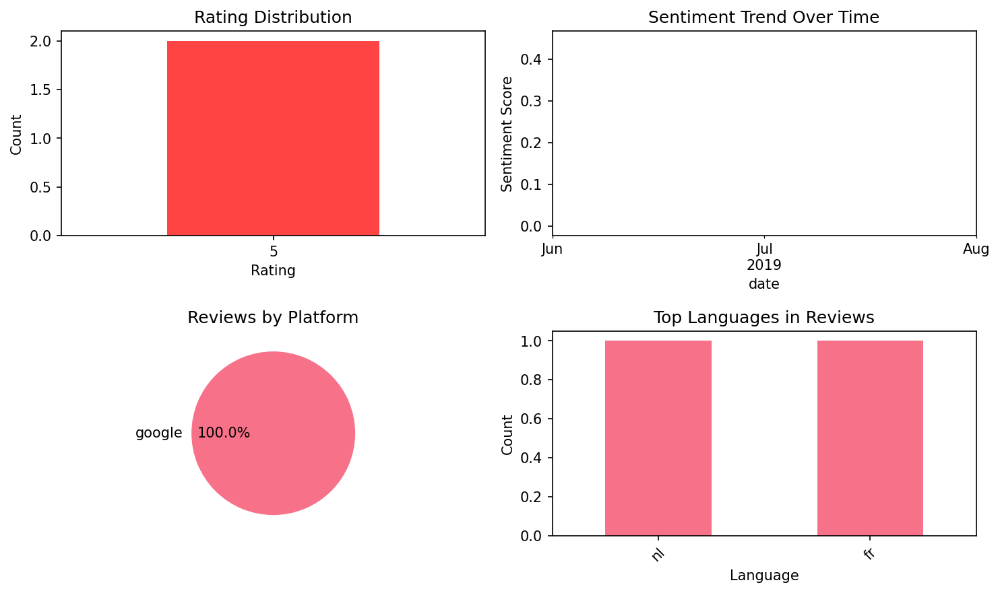

# Learn German Fast: Course

## 📱 App Information

| **Attribute** | **Google Play** | **App Store** |
|---------------|-----------------|---------------|
| **Title** | Learn German Fast: Course | N/A |
| **Package/ID** | com.mosalingua.defree | N/A |
| **Rating** | 4.4 | N/A |
| **Total Ratings** | 3,572 | N/A |
| **Installs** | 100,000+ | N/A |
| **Genre** | Education | N/A |

## 📝 Description

So, you want to learn German in no time? You need MosaLingua! Innovative and effective, our application has helped more than 13.000,000 people all over the world learn German in only 10 minutes per day - with actual results!

Popular on app stores, MosaLingua also comes highly recommended by the media and many specialized blogs.


Learn more about MosaLingua by watching the demonstration video on https://mosalingua.com/en.
Feel free to try our smartphone application for free: you'll see for yourself how well it works!
It's a powerful and effective tool - ideal for people who want to speak German in no time, without taking long, boring language courses.

It's useful in any situation: our method can help you while you travel, in the workplace, and in everyday life with our courses that suit your language needs.

THE BENEFITS OF MOSALINGUA: 
1) Useful, practical content
Don't waste your time with notions and courses that won't help you. Instead, learn the 20% that you'll use 80% of the time.

2) An innovative method based on scientific research
Our international team is made up of expert polyglots who've used the most modern and proven learning, memorization and consolidation techniques (SRS, active recall, metacognition, etc.).

3) Coaching throughout the learning process
To succeed, you can count on our review sessions that consolidate what you've learned, our mini German lessons, and our advice for better understanding vocabulary.

4) Learning and having fun at the same time
Achieve great results and have fun doing so: your progress will boost your MOTIVATION, which is key to any learning plan.

If you want to learn German, download the MosaLingua Learn German app and try it free – you won't regret it!

## 📊 Reviews Analytics

**Total Reviews:** 2 (2 analyzed)
**Rating Distribution:** 2 positive (4-5★), 0 neutral (3★), 0 negative (1-2★)
**Average Sentiment:** 0.22 (-1=very negative, +1=very positive)
**Primary Language:** nl
**Key Insights:** Average rating: 5.0/5.0 | Overall sentiment: positive (score: 0.22) | Reviews in 2 languages, primarily nl (1 reviews) | Reviews from 1 platform(s): google

### ⭐ Rating Breakdown

- **5 ★★★★★**: 2 reviews (100.0%)

### 🌍 Languages in Reviews

- **nl**: 1 reviews
- **fr**: 1 reviews

### 📱 Platform Distribution

- **google**: 2 reviews

## 📈 Visualizations

### Analytics Charts


### Word Cloud


## 💬 Sample Reviews

**Review 1** (★★★★★ - google - 2019-08-09T19:08:34)
> na de Franse nu de Duitse versie. Eenvoudig in gebruik en door de kraxht van herhaling erg effectief!

**Review 2** (★★★★★ - google - 2019-06-20T22:44:13)
> Excellent, super appli. Simple, rapide, on apprend très vite avec le temps !!!

## 🔧 Raw JSON Data

<details>
<summary>Click to expand raw app data</summary>

```json
{
  "name": "Learn German Fast: Course",
  "google_package": "com.mosalingua.defree",
  "google": {
    "title": "Learn German Fast: Course",
    "description": "So, you want to learn German in no time? You need MosaLingua! Innovative and effective, our application has helped more than 13.000,000 people all over the world learn German in only 10 minutes per day - with actual results!\r\n\r\nPopular on app stores, MosaLingua also comes highly recommended by the media and many specialized blogs.\r\n\r\n\r\nLearn more about MosaLingua by watching the demonstration video on https://mosalingua.com/en.\r\nFeel free to try our smartphone application for free: you'll see for yourself how well it works!\r\nIt's a powerful and effective tool - ideal for people who want to speak German in no time, without taking long, boring language courses.\r\n\r\nIt's useful in any situation: our method can help you while you travel, in the workplace, and in everyday life with our courses that suit your language needs.\r\n\r\nTHE BENEFITS OF MOSALINGUA: \r\n1) Useful, practical content\r\nDon't waste your time with notions and courses that won't help you. Instead, learn the 20% that you'll use 80% of the time.\r\n\r\n2) An innovative method based on scientific research\r\nOur international team is made up of expert polyglots who've used the most modern and proven learning, memorization and consolidation techniques (SRS, active recall, metacognition, etc.).\r\n\r\n3) Coaching throughout the learning process\r\nTo succeed, you can count on our review sessions that consolidate what you've learned, our mini German lessons, and our advice for better understanding vocabulary.\r\n\r\n4) Learning and having fun at the same time\r\nAchieve great results and have fun doing so: your progress will boost your MOTIVATION, which is key to any learning plan.\r\n\r\nIf you want to learn German, download the MosaLingua Learn German app and try it free – you won't regret it!",
    "rating": 4.4,
    "rating_text": null,
    "ratings_total": 3572,
    "ratings_histogram": [
      274,
      0,
      137,
      480,
      2541
    ],
    "installs": "100,000+",
    "genre": "Education"
  },
  "apple": null,
  "reviews": [
    {
      "platform": "google",
      "rating": 5,
      "review": "na de Franse nu de Duitse versie. Eenvoudig in gebruik en door de kraxht van herhaling erg effectief!",
      "date": "2019-08-09T19:08:34"
    },
    {
      "platform": "google",
      "rating": 5,
      "review": "Excellent, super appli. Simple, rapide, on apprend très vite avec le temps !!!",
      "date": "2019-06-20T22:44:13"
    }
  ]
}
```

</details>

---
*Report generated on 2025-11-08 13:51:25 using advanced analytics*
