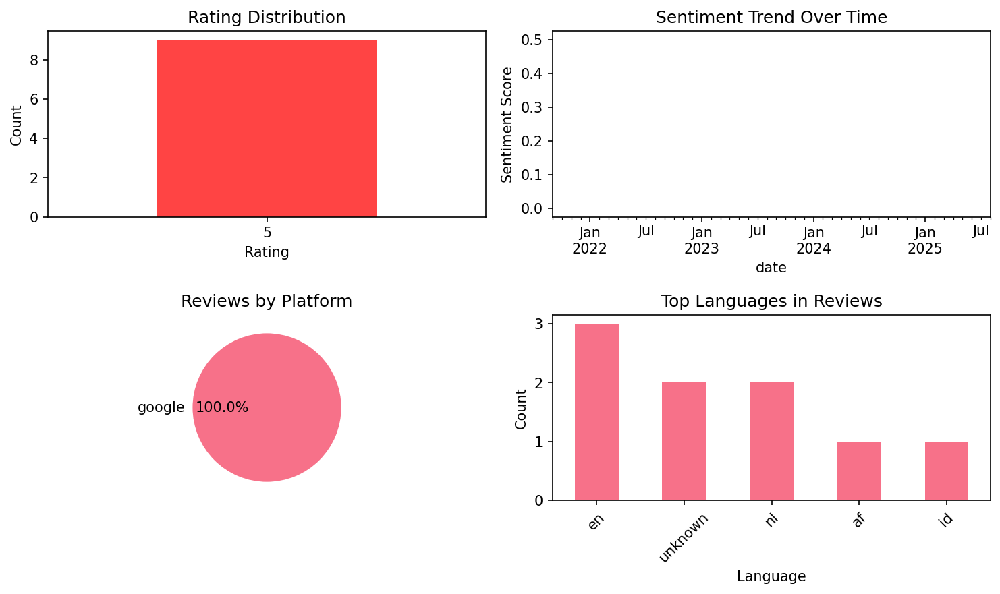
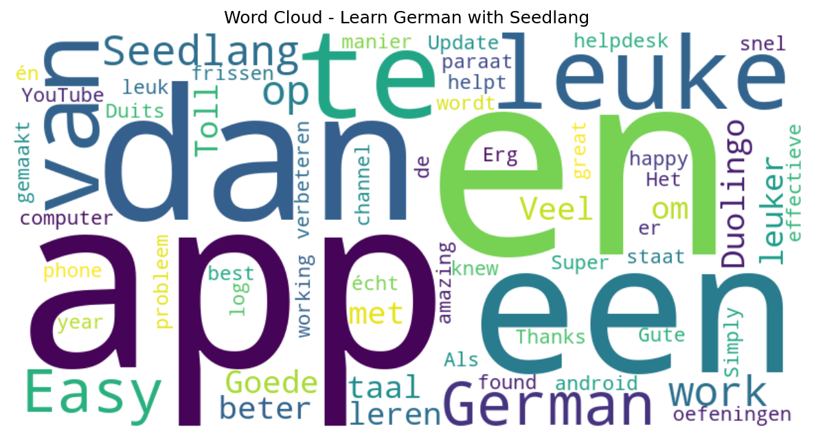

# Learn German with Seedlang

## 📱 App Information

| **Attribute** | **Google Play** | **App Store** |
|---------------|-----------------|---------------|
| **Title** | Learn German with Seedlang | N/A |
| **Package/ID** | com.seedlang.mobile.android.all | N/A |
| **Rating** | 4.7 | N/A |
| **Total Ratings** | 7,160 | N/A |
| **Installs** | 100,000+ | N/A |
| **Genre** | Education | N/A |

## 📝 Description

Learn German with our language learning app and focus on improving your speaking and listening skills, as well as your vocab knowledge and grammar comprehension. We do this by building interactive experiences using videos of native speakers, so you'll learn the best way possible.

We‘ve built this app in partnership with the Easy German YouTube channel and have a strong focus on teaching German with real people and authentic language. This app takes a unique approach to enhancing your speaking, listening, and grammar skills, making it easy to increase and sustain your vocab and grammar knowledge as well as your pronunciation.

Why Seedlang?

Simply put, we combine real humor and fun with a deep understanding of the German language. We craft learning experiences that are unlike others you have experienced before in the world of language apps. Learn German with Seedlang, and you'll be amazed at how swiftly you improve your vocab, grammar, speaking, and listening skills.

Learn German with Interactive Stories

To increase your vocab knowledge, we use video-based interactive stories that are fun, surprising, and memorable. This will help to give context to what you are learning and make building new memories of vocab and grammar feel effortless. You want to increase your vocab knowledge and grammar comprehension without hardships? Try this app, and you will see how simple it is to increase your vocab and grammar skills.

A New Type of Flashcards to Learn German

You've never seen vocab flashcards like these before. They combine video, speaking practice, and embedded grammar to create a fun and effective experience to learn German. This vocab learning feature is also a part of our free content, so you can start creating your own vocab lists and review your vocab regarding your needs.

Learn German Actively Through Speaking

Recording audio of your pronunciation and comparing it with that of German native speakers allows you to improve your speaking. As you practice these improvements, your muscle memory for the language strengthens and speaking becomes effortless.

Grammar at Your Fingertips

We are most receptive to learning grammar after we've made a mistake. So, if you make a grammar mistake with a word, simply click it to display detailed grammar information. We understand the feeling that learning grammar is the most difficult part of learning a new language. But when you learn German grammar with Seedlang, you will find how much easier it is to remember the grammar rules when their explanations are right there at your fingertips when you need them.

Learn German the way you want

Use our vocab trainer to build flashcard decks tailored to the specific vocab that you want to learn. Each vocab card is pulled from one of our stories, ensuring that learning a new language comes with all the fun context that makes it easy to remember your German vocab and grammar topics.

Learn German with Trivia games

Included in this language learning app, you can test your German comprehension by competing against other German language students in an interactive trivia game. This fun feature adds a playful element to your language learning journey and enlarges your vocab knowledge in no time.

You can start this unique language learning adventure with the free app version and explore vocab, grammar, and speaking practice. Every interaction is a step closer to mastering the German language. Start your journey towards A1, A2, B1, and B2 proficiency levels covering pronunciation, grammar, and vocab with the best German language learning tool. Download this free German language learning app now and try learning German the Seedlang way.

## 📊 Reviews Analytics

**Total Reviews:** 9 (9 analyzed)
**Rating Distribution:** 9 positive (4-5★), 0 neutral (3★), 0 negative (1-2★)
**Average Sentiment:** 0.20 (-1=very negative, +1=very positive)
**Primary Language:** en
**Key Insights:** Average rating: 5.0/5.0 | Overall sentiment: positive (score: 0.20) | Reviews in 5 languages, primarily en (3 reviews) | Reviews from 1 platform(s): google | Key themes: app, en, dan


### 🔑 Key Themes & Phrases

- **app** (relevance: 0.295)
- **en** (relevance: 0.193)
- **dan** (relevance: 0.120)
- **te** (relevance: 0.103)
- **leuke** (relevance: 0.103)
- **german** (relevance: 0.094)
- **easy german** (relevance: 0.094)
- **easy** (relevance: 0.094)

### ⭐ Rating Breakdown

- **5 ★★★★★**: 9 reviews (100.0%)

### 🌍 Languages in Reviews

- **en**: 3 reviews
- **unknown**: 2 reviews
- **nl**: 2 reviews
- **af**: 1 reviews
- **id**: 1 reviews

### 📱 Platform Distribution

- **google**: 9 reviews

## 📈 Visualizations

### Analytics Charts


### Word Cloud


## 💬 Sample Reviews

**Review 1** (★★★★★ - google - 2025-08-08T18:08:27)
> Veel beter en leuker dan Duolingo

**Review 2** (★★★★★ - google - 2024-02-23T16:25:36)
> Goede app om een taal te leren, met leuke oefeningen van Easy German en Seedlang. Als er een probleem is dan staat de helpdesk van Seedlang paraat en helpt snel.

**Review 3** (★★★★★ - google - 2023-06-10T18:38:59)
> Is does not work on my phone(android) I cannot log in. It's works on computer only. Update. It's working again. Thanks.

**Review 4** (★★★★★ - google - 2022-01-20T17:35:24)
> Super! App

**Review 5** (★★★★★ - google - 2021-09-17T03:16:44)
> Simply the best!

## 🔧 Raw JSON Data

<details>
<summary>Click to expand raw app data</summary>

```json
{
  "name": "Learn German with Seedlang",
  "google_package": "com.seedlang.mobile.android.all",
  "google": {
    "title": "Learn German with Seedlang",
    "description": "Learn German with our language learning app and focus on improving your speaking and listening skills, as well as your vocab knowledge and grammar comprehension. We do this by building interactive experiences using videos of native speakers, so you'll learn the best way possible.\r\n\r\nWe‘ve built this app in partnership with the Easy German YouTube channel and have a strong focus on teaching German with real people and authentic language. This app takes a unique approach to enhancing your speaking, listening, and grammar skills, making it easy to increase and sustain your vocab and grammar knowledge as well as your pronunciation.\r\n\r\nWhy Seedlang?\r\n\r\nSimply put, we combine real humor and fun with a deep understanding of the German language. We craft learning experiences that are unlike others you have experienced before in the world of language apps. Learn German with Seedlang, and you'll be amazed at how swiftly you improve your vocab, grammar, speaking, and listening skills.\r\n\r\nLearn German with Interactive Stories\r\n\r\nTo increase your vocab knowledge, we use video-based interactive stories that are fun, surprising, and memorable. This will help to give context to what you are learning and make building new memories of vocab and grammar feel effortless. You want to increase your vocab knowledge and grammar comprehension without hardships? Try this app, and you will see how simple it is to increase your vocab and grammar skills.\r\n\r\nA New Type of Flashcards to Learn German\r\n\r\nYou've never seen vocab flashcards like these before. They combine video, speaking practice, and embedded grammar to create a fun and effective experience to learn German. This vocab learning feature is also a part of our free content, so you can start creating your own vocab lists and review your vocab regarding your needs.\r\n\r\nLearn German Actively Through Speaking\r\n\r\nRecording audio of your pronunciation and comparing it with that of German native speakers allows you to improve your speaking. As you practice these improvements, your muscle memory for the language strengthens and speaking becomes effortless.\r\n\r\nGrammar at Your Fingertips\r\n\r\nWe are most receptive to learning grammar after we've made a mistake. So, if you make a grammar mistake with a word, simply click it to display detailed grammar information. We understand the feeling that learning grammar is the most difficult part of learning a new language. But when you learn German grammar with Seedlang, you will find how much easier it is to remember the grammar rules when their explanations are right there at your fingertips when you need them.\r\n\r\nLearn German the way you want\r\n\r\nUse our vocab trainer to build flashcard decks tailored to the specific vocab that you want to learn. Each vocab card is pulled from one of our stories, ensuring that learning a new language comes with all the fun context that makes it easy to remember your German vocab and grammar topics.\r\n\r\nLearn German with Trivia games\r\n\r\nIncluded in this language learning app, you can test your German comprehension by competing against other German language students in an interactive trivia game. This fun feature adds a playful element to your language learning journey and enlarges your vocab knowledge in no time.\r\n\r\nYou can start this unique language learning adventure with the free app version and explore vocab, grammar, and speaking practice. Every interaction is a step closer to mastering the German language. Start your journey towards A1, A2, B1, and B2 proficiency levels covering pronunciation, grammar, and vocab with the best German language learning tool. Download this free German language learning app now and try learning German the Seedlang way.",
    "rating": 4.7,
    "rating_text": null,
    "ratings_total": 7160,
    "ratings_histogram": [
      269,
      0,
      125,
      701,
      6008
    ],
    "installs": "100,000+",
    "genre": "Education"
  },
  "apple": null,
  "reviews": [
    {
      "platform": "google",
      "rating": 5,
      "review": "Veel beter en leuker dan Duolingo",
      "date": "2025-08-08T18:08:27"
    },
    {
      "platform": "google",
      "rating": 5,
      "review": "Toll",
      "date": "2024-10-23T21:10:42"
    },
    {
      "platform": "google",
      "rating": 5,
      "review": "Goede app om een taal te leren, met leuke oefeningen van Easy German en Seedlang. Als er een probleem is dan staat de helpdesk van Seedlang paraat en helpt snel.",
      "date": "2024-02-23T16:25:36"
    },
    {
      "platform": "google",
      "rating": 5,
      "review": "Gute App",
      "date": "2023-06-26T01:40:21"
    },
    {
      "platform": "google",
      "rating": 5,
      "review": "Is does not work on my phone(android) I cannot log in. It's works on computer only. Update. It's working again. Thanks.",
      "date": "2023-06-10T18:38:59"
    },
    {
      "platform": "google",
      "rating": 5,
      "review": "Erg leuke én effectieve manier op Duits op te frissen en verbeteren. Het wordt écht leuk gemaakt",
      "date": "2022-01-27T09:46:57"
    },
    {
      "platform": "google",
      "rating": 5,
      "review": "Super! App",
      "date": "2022-01-20T17:35:24"
    },
    {
      "platform": "google",
      "rating": 5,
      "review": "It's amazing!🔥 I'm so happy that I found the YouTube channel of Easy German this year, and knew about this app! ❤️😍 Just great!",
      "date": "2022-01-06T11:02:07"
    },
    {
      "platform": "google",
      "rating": 5,
      "review": "Simply the best!",
      "date": "2021-09-17T03:16:44"
    }
  ]
}
```

</details>

---
*Report generated on 2025-11-08 13:51:59 using advanced analytics*
