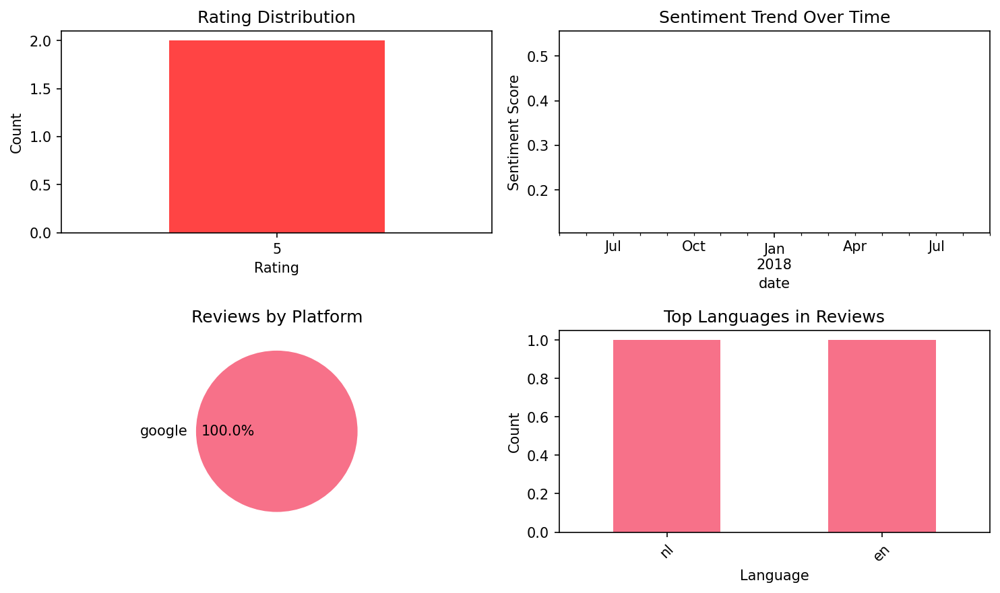

# Dr French, French grammar

## 📱 App Information

| **Attribute** | **Google Play** | **App Store** |
|---------------|-----------------|---------------|
| **Title** | Dr French, French grammar | N/A |
| **Package/ID** | com.thegrammaruniversity.drfrench | N/A |
| **Rating** | 4.3333335 | N/A |
| **Total Ratings** | 1,301 | N/A |
| **Installs** | 100,000+ | N/A |
| **Genre** | Education | N/A |

## 📝 Description

Dr French is the ultimate app to learn and review <b>French grammar</b>. In this easy-to-use and intuitive app, the content is organized by topic and level. You will find <b>simple and straight forward lessons</b> with <b>translated examples</b>, as well as exercises to practice what you learn and strengthen your skills.
With Dr French, French grammar becomes easy!

<u>What is Dr French?</u>

• Over <b>240 lessons</b> and <b>700 exercises</b>
• Content organized by topics and levels
• A "Homework" section
• Lessons suggested to you according to your skills and your learning pace to ensure a steady progression
• A search bar: search for a word or concept you have trouble with 
• Offline access
• Lessons available in French, English and Chinese (simplified and traditional characters)
• No advertisement or unwanted notifications
• A responsive team

Dr French was developed by teachers of French as a foreign language with a view to helping learners from all over the world understand the workings of French grammar. 

<u>241 lessons:</u> short and straightforward lessons with over 1000 translated examples, in order to answer ALL your grammar questions.

<u>700 exercises:</u> stimulating exercises to practice what you learn and strengthen your skills, with over 5500 questions.

<u>Easy and efficient:</u> the lessons are organized by topic and level. Read the lesson, then do the exercises!

<u>Homework:</u> add lessons to your homework and review them when you want. 

<u>The doctor’s suggestions:</u> to ensure a regular progression, you can ask Dr French to automatically add lessons to your homework, at the frequency and level of your choosing. 

<u>Offline access:</u> review French grammar anywhere: on the bus, on the tube, at home or between two meetings. 

<u>A search bar:</u> using the search bar, you can now enter a word or a notion that you are interested in and directly access the relevant lessons.

<u>4 languages:</u> the content of Dr French is available in French, English, Portuguese and Mandarin Chinese (simplified or traditional characters) in order to enable you to understand the explanations regardless of your level. Over 1000 examples have been translated to ensure a perfect understanding of the grammatical issues at hand.

<u>No advertisement or unwanted notifications:</u> The developers of Dr French have given priority to a maximal comfort of use and have removed all undesirable stimulation liable to disturb the learning process.

<u>Grammar and only grammar:</u> Dr French focuses on French grammar, and not on vocabulary. There are many other apps out there to help you learn and review French vocabulary!

<u>A responsive team:</u> if you encounter any problem with the app, our team is here to answer your questions!

We do not use pop-ups to get you to rate our app, so if you like Dr French, please come and rate it!

Do you want to learn French? Do you want to learn French grammar? With Dr French, French grammar becomes easy!

## 📊 Reviews Analytics

**Total Reviews:** 2 (2 analyzed)
**Rating Distribution:** 2 positive (4-5★), 0 neutral (3★), 0 negative (1-2★)
**Average Sentiment:** 0.33 (-1=very negative, +1=very positive)
**Primary Language:** nl
**Key Insights:** Average rating: 5.0/5.0 | Overall sentiment: positive (score: 0.33) | Reviews in 2 languages, primarily nl (1 reviews) | Reviews from 1 platform(s): google

### ⭐ Rating Breakdown

- **5 ★★★★★**: 2 reviews (100.0%)

### 🌍 Languages in Reviews

- **nl**: 1 reviews
- **en**: 1 reviews

### 📱 Platform Distribution

- **google**: 2 reviews

## 📈 Visualizations

### Analytics Charts


### Word Cloud


## 💬 Sample Reviews

**Review 1** (★★★★★ - google - 2018-09-24T12:25:53)
> Heel erg goede app, glasheldere uitleg, goede opbouw en genoeg oefeningen. En dat alles zonder advertenties. Wow!

**Review 2** (★★★★★ - google - 2017-05-16T11:00:29)
> Love it, clear explanation, easy to use the app and no ads! You guys are great!

## 🔧 Raw JSON Data

<details>
<summary>Click to expand raw app data</summary>

```json
{
  "name": "Dr French, French grammar",
  "google_package": "com.thegrammaruniversity.drfrench",
  "google": {
    "title": "Dr French, French grammar",
    "description": "Dr French is the ultimate app to learn and review <b>French grammar</b>. In this easy-to-use and intuitive app, the content is organized by topic and level. You will find <b>simple and straight forward lessons</b> with <b>translated examples</b>, as well as exercises to practice what you learn and strengthen your skills.\r\nWith Dr French, French grammar becomes easy!\r\n\r\n<u>What is Dr French?</u>\r\n\r\n• Over <b>240 lessons</b> and <b>700 exercises</b>\r\n• Content organized by topics and levels\r\n• A \"Homework\" section\r\n• Lessons suggested to you according to your skills and your learning pace to ensure a steady progression\r\n• A search bar: search for a word or concept you have trouble with \r\n• Offline access\r\n• Lessons available in French, English and Chinese (simplified and traditional characters)\r\n• No advertisement or unwanted notifications\r\n• A responsive team\r\n\r\nDr French was developed by teachers of French as a foreign language with a view to helping learners from all over the world understand the workings of French grammar. \r\n\r\n<u>241 lessons:</u> short and straightforward lessons with over 1000 translated examples, in order to answer ALL your grammar questions.\r\n\r\n<u>700 exercises:</u> stimulating exercises to practice what you learn and strengthen your skills, with over 5500 questions.\r\n\r\n<u>Easy and efficient:</u> the lessons are organized by topic and level. Read the lesson, then do the exercises!\r\n\r\n<u>Homework:</u> add lessons to your homework and review them when you want. \r\n\r\n<u>The doctor’s suggestions:</u> to ensure a regular progression, you can ask Dr French to automatically add lessons to your homework, at the frequency and level of your choosing. \r\n\r\n<u>Offline access:</u> review French grammar anywhere: on the bus, on the tube, at home or between two meetings. \r\n\r\n<u>A search bar:</u> using the search bar, you can now enter a word or a notion that you are interested in and directly access the relevant lessons.\r\n\r\n<u>4 languages:</u> the content of Dr French is available in French, English, Portuguese and Mandarin Chinese (simplified or traditional characters) in order to enable you to understand the explanations regardless of your level. Over 1000 examples have been translated to ensure a perfect understanding of the grammatical issues at hand.\r\n\r\n<u>No advertisement or unwanted notifications:</u> The developers of Dr French have given priority to a maximal comfort of use and have removed all undesirable stimulation liable to disturb the learning process.\r\n\r\n<u>Grammar and only grammar:</u> Dr French focuses on French grammar, and not on vocabulary. There are many other apps out there to help you learn and review French vocabulary!\r\n\r\n<u>A responsive team:</u> if you encounter any problem with the app, our team is here to answer your questions!\r\n\r\nWe do not use pop-ups to get you to rate our app, so if you like Dr French, please come and rate it!\r\n\r\nDo you want to learn French? Do you want to learn French grammar? With Dr French, French grammar becomes easy!",
    "rating": 4.3333335,
    "rating_text": null,
    "ratings_total": 1301,
    "ratings_histogram": [
      118,
      19,
      118,
      98,
      946
    ],
    "installs": "100,000+",
    "genre": "Education"
  },
  "apple": null,
  "reviews": [
    {
      "platform": "google",
      "rating": 5,
      "review": "Heel erg goede app, glasheldere uitleg, goede opbouw en genoeg oefeningen. En dat alles zonder advertenties. Wow!",
      "date": "2018-09-24T12:25:53"
    },
    {
      "platform": "google",
      "rating": 5,
      "review": "Love it, clear explanation, easy to use the app and no ads! You guys are great!",
      "date": "2017-05-16T11:00:29"
    }
  ]
}
```

</details>

---
*Report generated on 2025-11-08 13:52:14 using advanced analytics*
