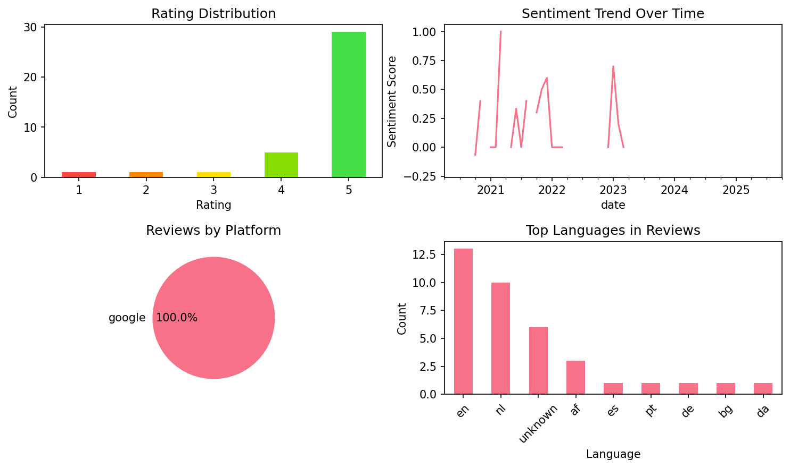

# Cake - Learn English & Korean

## 📱 App Information

| **Attribute** | **Google Play** | **App Store** |
|---------------|-----------------|---------------|
| **Title** | Cake - Learn English & Korean | N/A |
| **Package/ID** | me.mycake | N/A |
| **Rating** | 4.710505 | N/A |
| **Total Ratings** | 1,217,819 | N/A |
| **Installs** | 100,000,000+ | N/A |
| **Genre** | Education | N/A |

## 📝 Description

An incredible English & Korean learning app used by 100 million people worldwide. Master your English & Korean using free videos and audio content updated daily! We currently only support English for learning Korean. But don't worry! More languages will be added soon! 

You can learn real English expressions selected by English experts. 
Practice your speaking and revise what you learned with quizzes. 
Practice and repetition will make memorizing the expressions simple!
Continuous learning with Cake will definitely help improve your English & Korean skills. 

<font color="#ff5288"><b>It's fun.</b></font>
- Learn with your favorite celebrity, artist, and vlogger videos. 
- It's also full of exciting original content made by us. 

<font color="#ff5288"><b>You can learn real native English.</b></font>
- Learn real English used in vlogs, movies, and TV shows. 
- Become familiar with different accents and pronunciations.
- You can learn how to express one sentence in many different ways. 

<font color="#ff5288"><b>Cake will help you improve your speaking. </b></font>
- Watch videos with subtitles, and repeat after each line. 
- Get your pronunciation checked by our AI. 
- Practice speaking like in a real conversation. 

<font color="#ff5288"><b>Learn step-by-step.</b></font>
- Select a topic of your choice and study step-by-step with our 'class' feature. 
- Study using the 'classes' created by English experts. 
- You can practice speaking and listening like in real conversations. 

<font color="#ff5288"><b>Repeat and revise.</b></font>
- Review what you learned using fun quizzes. 
- Save the sentences you like, and test yourself.

<font color="#ff5288"><b>Just 10 minutes a day. </b></font>
- Achieve your daily study goals, and feel accomplished.
- The more accomplished you feel, the more motivated you'll feel to keep learning!

<font color="#ff5288"><b>Cake's exclusive features</b></font>
- Daily expression clips: New expressions are added daily, and are organized by topic.
- Original lectures: English & Korean lectures created by Cake 
- Classes: Enables you to study step-by-step by combining lectures, videos, and quizzes into several courses. 
- Quizzes: Listening, key expressions, reviews, and many more revision quizzes. 
- Speak: Practice listening and speaking with audio learning. 
- Today's conversation: Practice listening and speaking with a unique conversation every day.
- Save sentences and words: Practice and repeat sentences and words of your choice.

Improve your learning with Cake Plus. 
Get unlimited hearts and enjoy the app with no ads.
Access exclusive Cake Plus content, and save as many words and sentences as you want. 
Real English expressions selected by English experts! 
Use Cake daily and watch your English improve!

## 📊 Reviews Analytics

**Total Reviews:** 37 (37 analyzed)
**Rating Distribution:** 34 positive (4-5★), 1 neutral (3★), 2 negative (1-2★)
**Average Sentiment:** 0.23 (-1=very negative, +1=very positive)
**Primary Language:** en
**Key Insights:** Average rating: 4.6/5.0 | Overall sentiment: positive (score: 0.23) | Reviews in 9 languages, primarily en (13 reviews) | Reviews from 1 platform(s): google | Key themes: app, good, just


### 🔑 Key Themes & Phrases

- **app** (relevance: 0.120)
- **good** (relevance: 0.108)
- **just** (relevance: 0.067)
- **learn** (relevance: 0.055)
- **cake** (relevance: 0.054)
- **speak** (relevance: 0.051)
- **nice** (relevance: 0.050)
- **het** (relevance: 0.048)

### ⭐ Rating Breakdown

- **5 ★★★★★**: 29 reviews (78.4%)
- **4 ★★★★☆**: 5 reviews (13.5%)
- **3 ★★★☆☆**: 1 reviews (2.7%)
- **2 ★★☆☆☆**: 1 reviews (2.7%)
- **1 ★☆☆☆☆**: 1 reviews (2.7%)

### 🌍 Languages in Reviews

- **en**: 13 reviews
- **nl**: 10 reviews
- **unknown**: 6 reviews
- **af**: 3 reviews
- **es**: 1 reviews

### 📱 Platform Distribution

- **google**: 37 reviews

## 📈 Visualizations

### Analytics Charts


### Word Cloud


## 💬 Sample Reviews

**Review 1** (★★★★★ - google - 2025-10-11T23:54:40)
> is amazing even in this app i can wach a videos in korean i hope it will help me speak korean

**Review 2** (★★★★★ - google - 2023-01-10T21:09:09)
> IT WORKS REALLY GOOD TRUST ME

**Review 3** (★★★★★ - google - 2021-10-05T19:35:06)
> Echt een leuke app. Het is een leuk manier om Engels te leren

**Review 4** (★★★★★ - google - 2021-01-18T17:48:40)
> de beste

**Review 5** (★★★★★ - google - 2020-04-18T10:43:36)
> Top echt zeer hulpvaardig

## 🔧 Raw JSON Data

<details>
<summary>Click to expand raw app data</summary>

```json
{
  "name": "Cake - Learn English & Korean",
  "google_package": "me.mycake",
  "google": {
    "title": "Cake - Learn English & Korean",
    "description": "An incredible English & Korean learning app used by 100 million people worldwide. Master your English & Korean using free videos and audio content updated daily! We currently only support English for learning Korean. But don't worry! More languages will be added soon! \r\n\r\nYou can learn real English expressions selected by English experts. \r\nPractice your speaking and revise what you learned with quizzes. \r\nPractice and repetition will make memorizing the expressions simple!\r\nContinuous learning with Cake will definitely help improve your English & Korean skills. \r\n\r\n<font color=\"#ff5288\"><b>It's fun.</b></font>\r\n- Learn with your favorite celebrity, artist, and vlogger videos. \r\n- It's also full of exciting original content made by us. \r\n\r\n<font color=\"#ff5288\"><b>You can learn real native English.</b></font>\r\n- Learn real English used in vlogs, movies, and TV shows. \r\n- Become familiar with different accents and pronunciations.\r\n- You can learn how to express one sentence in many different ways. \r\n\r\n<font color=\"#ff5288\"><b>Cake will help you improve your speaking. </b></font>\r\n- Watch videos with subtitles, and repeat after each line. \r\n- Get your pronunciation checked by our AI. \r\n- Practice speaking like in a real conversation. \r\n\r\n<font color=\"#ff5288\"><b>Learn step-by-step.</b></font>\r\n- Select a topic of your choice and study step-by-step with our 'class' feature. \r\n- Study using the 'classes' created by English experts. \r\n- You can practice speaking and listening like in real conversations. \r\n\r\n<font color=\"#ff5288\"><b>Repeat and revise.</b></font>\r\n- Review what you learned using fun quizzes. \r\n- Save the sentences you like, and test yourself.\r\n\r\n<font color=\"#ff5288\"><b>Just 10 minutes a day. </b></font>\r\n- Achieve your daily study goals, and feel accomplished.\r\n- The more accomplished you feel, the more motivated you'll feel to keep learning!\r\n\r\n<font color=\"#ff5288\"><b>Cake's exclusive features</b></font>\r\n- Daily expression clips: New expressions are added daily, and are organized by topic.\r\n- Original lectures: English & Korean lectures created by Cake \r\n- Classes: Enables you to study step-by-step by combining lectures, videos, and quizzes into several courses. \r\n- Quizzes: Listening, key expressions, reviews, and many more revision quizzes. \r\n- Speak: Practice listening and speaking with audio learning. \r\n- Today's conversation: Practice listening and speaking with a unique conversation every day.\r\n- Save sentences and words: Practice and repeat sentences and words of your choice.\r\n\r\nImprove your learning with Cake Plus. \r\nGet unlimited hearts and enjoy the app with no ads.\r\nAccess exclusive Cake Plus content, and save as many words and sentences as you want. \r\nReal English expressions selected by English experts! \r\nUse Cake daily and watch your English improve!",
    "rating": 4.710505,
    "rating_text": null,
    "ratings_total": 1217819,
    "ratings_histogram": [
      45853,
      17048,
      20477,
      76618,
      1057624
    ],
    "installs": "100,000,000+",
    "genre": "Education"
  },
  "apple": null,
  "reviews": [
    {
      "platform": "google",
      "rating": 5,
      "review": "is amazing even in this app i can wach a videos in korean i hope it will help me speak korean",
      "date": "2025-10-11T23:54:40"
    },
    {
      "platform": "google",
      "rating": 5,
      "review": "het is heel leuk on met bts te leren omdat ik een fan ben",
      "date": "2025-10-01T20:44:24"
    },
    {
      "platform": "google",
      "rating": 5,
      "review": "I learned a few wordt in just one day I now I can speak fluent in 1 year",
      "date": "2025-08-07T00:24:05"
    },
    {
      "platform": "google",
      "rating": 5,
      "review": "Very good",
      "date": "2025-01-21T23:22:59"
    },
    {
      "platform": "google",
      "rating": 4,
      "review": "It's is good but a bit bad because it has no dutch",
      "date": "2025-01-02T23:48:01"
    },
    {
      "platform": "google",
      "rating": 5,
      "review": "I just started and i love it already",
      "date": "2024-03-28T10:57:05"
    },
    {
      "platform": "google",
      "rating": 5,
      "review": "this app is amazing download it",
      "date": "2023-07-30T19:31:50"
    },
    {
      "platform": "google",
      "rating": 4,
      "review": "Mencanta Cake. Porque aprendo muchas cosas nuevas aunque ya se un poco el ingles.",
      "date": "2023-03-01T19:49:12"
    },
    {
      "platform": "google",
      "rating": 5,
      "review": "It's good but I'm just a slowly learner",
      "date": "2023-02-02T16:30:51"
    },
    {
      "platform": "google",
      "rating": 5,
      "review": "IT WORKS REALLY GOOD TRUST ME",
      "date": "2023-01-10T21:09:09"
    },
    {
      "platform": "google",
      "rating": 5,
      "review": "This is a really good app to learn",
      "date": "2023-01-03T13:45:19"
    },
    {
      "platform": "google",
      "rating": 5,
      "review": "Makelijk",
      "date": "2022-12-27T16:35:22"
    },
    {
      "platform": "google",
      "rating": 5,
      "review": "Cake um muito didático e bom metódo de aprendizagem, com grammática, legenda etc... um total paket ! Principalmente para os principiantes, .. Excelente!",
      "date": "2022-03-25T22:15:22"
    },
    {
      "platform": "google",
      "rating": 5,
      "review": "Fantastisch!",
      "date": "2022-02-22T21:40:42"
    },
    {
      "platform": "google",
      "rating": 1,
      "review": "Dacht dat je ook andere talen kon leren jammer.",
      "date": "2022-01-24T14:09:45"
    },
    {
      "platform": "google",
      "rating": 5,
      "review": "It's so Nice app",
      "date": "2021-12-26T17:44:37"
    },
    {
      "platform": "google",
      "rating": 5,
      "review": "Im making this rating cause it is an app that you can learn so many words that you cant Imagine",
      "date": "2021-11-01T03:26:19"
    },
    {
      "platform": "google",
      "rating": 5,
      "review": "Nice",
      "date": "2021-10-25T16:12:36"
    },
    {
      "platform": "google",
      "rating": 5,
      "review": "Echt een leuke app. Het is een leuk manier om Engels te leren",
      "date": "2021-10-05T19:35:06"
    },
    {
      "platform": "google",
      "rating": 4,
      "review": "Its a good application to learn English : ) I recommande your this. Top👍🏾",
      "date": "2021-08-16T13:05:00"
    },
    {
      "platform": "google",
      "rating": 5,
      "review": "Dit app is geweldig 😍😍",
      "date": "2021-07-09T17:25:51"
    },
    {
      "platform": "google",
      "rating": 5,
      "review": "Je leert Engels op een leuk manier die apps is super 🤗🌟😇",
      "date": "2021-06-13T12:28:32"
    },
    {
      "platform": "google",
      "rating": 5,
      "review": "Dit is een goede app vooral voor mensen die vooral geen engels kunnen",
      "date": "2021-05-09T10:04:39"
    },
    {
      "platform": "google",
      "rating": 5,
      "review": "Ik ben er maar een dag bezig en ik ken het al best goed dankje",
      "date": "2021-03-12T08:43:07"
    },
    {
      "platform": "google",
      "rating": 5,
      "review": "Het geeft me veel energie om engels te leren om een leuke manier echt heel goed",
      "date": "2021-02-26T12:37:19"
    },
    {
      "platform": "google",
      "rating": 4,
      "review": "Jesus Иисус Исус",
      "date": "2021-02-03T13:20:55"
    },
    {
      "platform": "google",
      "rating": 5,
      "review": "I speak english well now!",
      "date": "2021-02-01T13:56:05"
    },
    {
      "platform": "google",
      "rating": 5,
      "review": "de beste",
      "date": "2021-01-18T17:48:40"
    },
    {
      "platform": "google",
      "rating": 5,
      "review": "Nuttige app voor Engels",
      "date": "2021-01-10T01:21:45"
    },
    {
      "platform": "google",
      "rating": 5,
      "review": "het is leuk👍👌",
      "date": "2020-11-04T22:00:11"
    },
    {
      "platform": "google",
      "rating": 5,
      "review": "Great",
      "date": "2020-11-04T16:42:17"
    },
    {
      "platform": "google",
      "rating": 4,
      "review": "فخامة",
      "date": "2020-10-27T20:26:14"
    },
    {
      "platform": "google",
      "rating": 2,
      "review": "I didn't understand how the app worked and I thought I was going to learn something new but I knew everything already. I give it 2 stars because i think they worked really hard on the app.",
      "date": "2020-10-22T20:42:47"
    },
    {
      "platform": "google",
      "rating": 5,
      "review": "Unbelievable",
      "date": "2020-10-17T20:38:40"
    },
    {
      "platform": "google",
      "rating": 3,
      "review": "3 steren want ik snap het egt niet ik hoop dat iemand mij kan. Helpen om te zegen wat ik moet doen pls help mij heel erg bedankt als je mij help fijne dag nog",
      "date": "2020-10-07T22:58:51"
    },
    {
      "platform": "google",
      "rating": 5,
      "review": "This is the beste app om spreken en luisteren goed te oefenen",
      "date": "2020-10-07T09:10:01"
    },
    {
      "platform": "google",
      "rating": 5,
      "review": "Top echt zeer hulpvaardig",
      "date": "2020-04-18T10:43:36"
    }
  ]
}
```

</details>

---
*Report generated on 2025-11-08 13:52:50 using advanced analytics*
