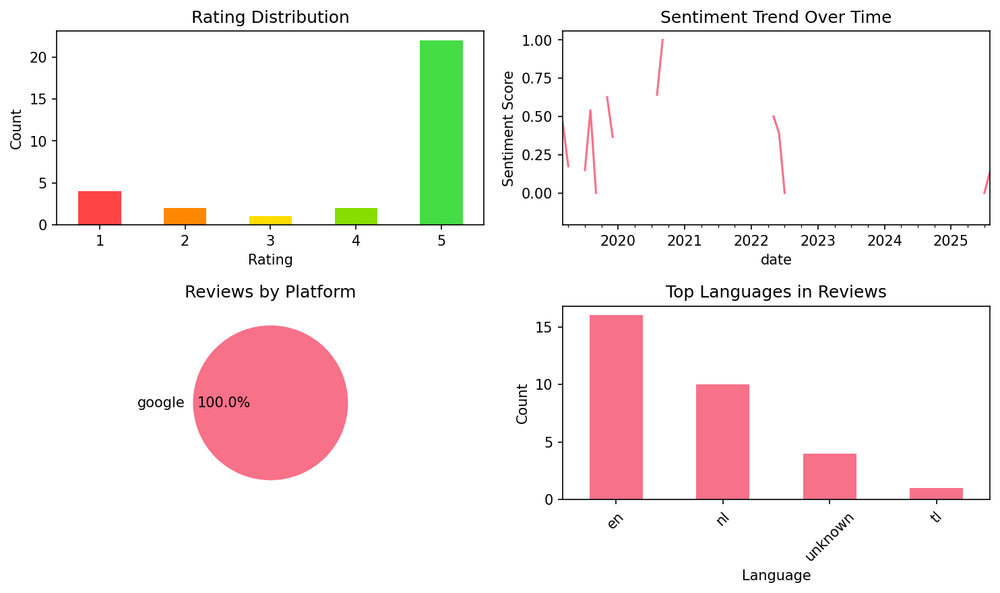

# WordUp | AI Vocabulary Builder

## 📱 App Information

| **Attribute** | **Google Play** | **App Store** |
|---------------|-----------------|---------------|
| **Title** | WordUp | AI Vocabulary Builder | N/A |
| **Package/ID** | co.wordupapp.app | N/A |
| **Rating** | 4.6272836 | N/A |
| **Total Ratings** | 182,416 | N/A |
| **Installs** | 5,000,000+ | N/A |
| **Genre** | Education | N/A |

## 📝 Description

The world’s first AI-based English vocabulary builder app. If you are serious about your English, you will fall in love with WordUp. It is the smartest way to perfect your English, and learn every word that matters while enjoying the process!


Vocabulary Builder: 
Vocab builder feature in WordUp utilizes advanced algorithms to expand vocabulary and improve English skills. It recommends a new word each day based on your current knowledge, allowing you to gradually enhance your language proficiency. By incorporating daily words into your learning routine, WordUp ensures steady and consistent growth in your vocabulary.

Knowledge Map
WordUp helps you build a map of your knowledge by identifying the words you know and the words you don't know. It helps you learn new words by identifying the gaps in your vocabulary and suggesting the most important and useful English words to focus on. By incorporating daily vocabulary and tracking your progress, the Knowledge Map enables you to steadily increase your vocabulary and enhance your understanding of English words.
All 25,000 useful English words are ranked in the order of IMPORTANCE, and USEFULNESS, based on how often they are used in real-world spoken English (extracted from thousands of movies, and TV shows).

To actually learn the words that you discover in your Knowledge Map, WordUp gives you everything you need, and more! From word definitions and pictures to tens of entertaining examples from movies, quotes, news, and more. So you get a good feel of how to use each word in context. 

Multilingual Translations
There are also translations in more than 30 languages including French, Spanish, German, Arabic, Turkish, Persian, ...

The daily reviews then kick in. Like flashcards, the words will come back with games and challenges until you master them. It's called Spaced Repetition, and it's scientifically proven to help memorise them forever!

WordUp is unlike any vocabulary builder app you've seen before. It is not another dictionary app, although it can be used as an English dictionary too.

Suitable for Various Users:
WordUp's novel approach to language learning and expanding your vocabulary will leave you feeling confident and empowered. Whether you are new to English, are preparing for an English exam (IELTS, TOEFL, etc), or are a native English speaker, you will find WordUp helpful and entertaining. Just give it a try and see for yourself!

## 📊 Reviews Analytics

**Total Reviews:** 31 (31 analyzed)
**Rating Distribution:** 24 positive (4-5★), 1 neutral (3★), 6 negative (1-2★)
**Average Sentiment:** 0.33 (-1=very negative, +1=very positive)
**Primary Language:** en
**Key Insights:** Average rating: 4.2/5.0 | Overall sentiment: positive (score: 0.33) | Reviews in 4 languages, primarily en (16 reviews) | Reviews from 1 platform(s): google | Key themes: app, best, words


### 🔑 Key Themes & Phrases

- **app** (relevance: 0.133)
- **best** (relevance: 0.072)
- **words** (relevance: 0.068)
- **amazing** (relevance: 0.062)
- **way** (relevance: 0.056)
- **great** (relevance: 0.055)
- **nice** (relevance: 0.051)
- **use** (relevance: 0.048)

### ⭐ Rating Breakdown

- **5 ★★★★★**: 22 reviews (71.0%)
- **4 ★★★★☆**: 2 reviews (6.5%)
- **3 ★★★☆☆**: 1 reviews (3.2%)
- **2 ★★☆☆☆**: 2 reviews (6.5%)
- **1 ★☆☆☆☆**: 4 reviews (12.9%)

### 🌍 Languages in Reviews

- **en**: 16 reviews
- **nl**: 10 reviews
- **unknown**: 4 reviews
- **tl**: 1 reviews

### 📱 Platform Distribution

- **google**: 31 reviews

## 📈 Visualizations

### Analytics Charts


### Word Cloud


## 💬 Sample Reviews

**Review 1** (★★★★★ - google - 2025-08-15T08:02:11)
> Best app to learn new English words. I'm using the app for about 6 months, and my English is now so much better. I clearly understand without reading the subtitles when watching movies or interviews. Thanks a lot for creating this app

**Review 2** (★★★★★ - google - 2022-06-05T23:59:18)
> Very nice app

**Review 3** (★★★★★ - google - 2020-04-09T07:54:22)
> Easy, friendly and adaptive to your level. I use it to improve my English as native Dutch speaker. My English is already good, but in this app I started in level 5 out of 20! So a lot to gain!

**Review 4** (★★★★★ - google - 2019-11-25T23:29:19)
> The best i like it very much

**Review 5** (★★★★ - google - 2019-03-07T19:52:00)
> great app to expand your vocabulary and learn words you maybe wouldn't learn in class! But I selected my first language and that I would like a translation when discovering new vocab, but I don't get one.

## 🔧 Raw JSON Data

<details>
<summary>Click to expand raw app data</summary>

```json
{
  "name": "WordUp | AI Vocabulary Builder",
  "google_package": "co.wordupapp.app",
  "google": {
    "title": "WordUp | AI Vocabulary Builder",
    "description": "The world’s first AI-based English vocabulary builder app. If you are serious about your English, you will fall in love with WordUp. It is the smartest way to perfect your English, and learn every word that matters while enjoying the process!\r\n\r\n\r\nVocabulary Builder: \r\nVocab builder feature in WordUp utilizes advanced algorithms to expand vocabulary and improve English skills. It recommends a new word each day based on your current knowledge, allowing you to gradually enhance your language proficiency. By incorporating daily words into your learning routine, WordUp ensures steady and consistent growth in your vocabulary.\r\n\r\nKnowledge Map\r\nWordUp helps you build a map of your knowledge by identifying the words you know and the words you don't know. It helps you learn new words by identifying the gaps in your vocabulary and suggesting the most important and useful English words to focus on. By incorporating daily vocabulary and tracking your progress, the Knowledge Map enables you to steadily increase your vocabulary and enhance your understanding of English words.\r\nAll 25,000 useful English words are ranked in the order of IMPORTANCE, and USEFULNESS, based on how often they are used in real-world spoken English (extracted from thousands of movies, and TV shows).\r\n\r\nTo actually learn the words that you discover in your Knowledge Map, WordUp gives you everything you need, and more! From word definitions and pictures to tens of entertaining examples from movies, quotes, news, and more. So you get a good feel of how to use each word in context. \r\n\r\nMultilingual Translations\r\nThere are also translations in more than 30 languages including French, Spanish, German, Arabic, Turkish, Persian, ...\r\n\r\nThe daily reviews then kick in. Like flashcards, the words will come back with games and challenges until you master them. It's called Spaced Repetition, and it's scientifically proven to help memorise them forever!\r\n\r\nWordUp is unlike any vocabulary builder app you've seen before. It is not another dictionary app, although it can be used as an English dictionary too.\r\n\r\nSuitable for Various Users:\r\nWordUp's novel approach to language learning and expanding your vocabulary will leave you feeling confident and empowered. Whether you are new to English, are preparing for an English exam (IELTS, TOEFL, etc), or are a native English speaker, you will find WordUp helpful and entertaining. Just give it a try and see for yourself!",
    "rating": 4.6272836,
    "rating_text": null,
    "ratings_total": 182416,
    "ratings_histogram": [
      4424,
      1311,
      9093,
      27990,
      139529
    ],
    "installs": "5,000,000+",
    "genre": "Education"
  },
  "apple": null,
  "reviews": [
    {
      "platform": "google",
      "rating": 5,
      "review": "Best app to learn new English words. I'm using the app for about 6 months, and my English is now so much better. I clearly understand without reading the subtitles when watching movies or interviews. Thanks a lot for creating this app",
      "date": "2025-08-15T08:02:11"
    },
    {
      "platform": "google",
      "rating": 3,
      "review": "7/8: lijkt opgelost. Fijn. Wel trage vertaling (5 tot 20sec) opeens. 31/7: problemen nog steeds aanwezig na de Naupdate van 9 juli. De app is hierdoor onbruikbaar. Vertaling naar de gewenste taal is niet beschikbaar en de weergave is niet op volledig scherm (ik kan niet naar beneden scrollen). Sinds de laatste update juni'25 kan ik geen vertaling van de woorden zien. Geprobeerd om een bericht naar de klantenservice te sturen, maar dan loopt de app vast en wordt het bericht niet verzonden.",
      "date": "2025-08-07T18:35:51"
    },
    {
      "platform": "google",
      "rating": 1,
      "review": "geweldige app, ik had veel woorden opgeslagen maar ineens is alles weg",
      "date": "2025-07-21T21:26:19"
    },
    {
      "platform": "google",
      "rating": 5,
      "review": "great",
      "date": "2025-03-04T19:44:15"
    },
    {
      "platform": "google",
      "rating": 4,
      "review": "Goede app, ben er tot nu toe wel erg blij mee maar valt nog te zien hoe veel het daadwerkelijk zal helpen. Ik zal over een maand of 2 terugkeren en zien of dit echt mijn vocabulair heeft verbeterd. Wel hele goede user interface",
      "date": "2025-01-05T05:16:50"
    },
    {
      "platform": "google",
      "rating": 1,
      "review": "I miss the old 2020 version of this app everything is behind a paywall and it use ai art 🤢",
      "date": "2024-06-07T02:04:05"
    },
    {
      "platform": "google",
      "rating": 5,
      "review": "Leuke app om je woordenschat te vergroten. Fijn is ook dat je meerdere betekenissen van woorden leert en voorbeelden kan zien hoe je het woord gebruikt in een zin. De uitspraak is ook zeer goed.",
      "date": "2022-07-07T18:51:37"
    },
    {
      "platform": "google",
      "rating": 5,
      "review": "Very nice app",
      "date": "2022-06-05T23:59:18"
    },
    {
      "platform": "google",
      "rating": 1,
      "review": "Bugged to the brim.",
      "date": "2022-06-02T07:50:10"
    },
    {
      "platform": "google",
      "rating": 5,
      "review": "Top",
      "date": "2022-05-01T20:09:14"
    },
    {
      "platform": "google",
      "rating": 5,
      "review": "Thought I knew so many words, apparently not.",
      "date": "2020-12-20T14:26:42"
    },
    {
      "platform": "google",
      "rating": 2,
      "review": "Goede app, maar reageert regelmatig niet wanneer ik een tegel aanraak. Best frustrerend",
      "date": "2020-09-07T18:25:53"
    },
    {
      "platform": "google",
      "rating": 5,
      "review": "Great app. It let's you learn the most used words you don't know. It doesn't get any better than that!",
      "date": "2020-08-13T15:29:50"
    },
    {
      "platform": "google",
      "rating": 5,
      "review": "Goeie app, uitgebreide encyclopedia en definities zijn goed omschreven",
      "date": "2020-06-16T19:49:56"
    },
    {
      "platform": "google",
      "rating": 1,
      "review": "Be aware to pay anything for those scammers. I have paid 79 euros for a pro-membership, and after 7 whole days, my account hasnt been activated yet. I tried every possible way to contact them, but still no answer or any explanation. Google also didint take any action yet to help me to get my money back.",
      "date": "2020-04-20T19:33:53"
    },
    {
      "platform": "google",
      "rating": 5,
      "review": "Easy, friendly and adaptive to your level. I use it to improve my English as native Dutch speaker. My English is already good, but in this app I started in level 5 out of 20! So a lot to gain!",
      "date": "2020-04-09T07:54:22"
    },
    {
      "platform": "google",
      "rating": 5,
      "review": "Top ! Leuke manier om je Engels te verbeteren. Veel voorbeelden, erg leerzaam",
      "date": "2020-02-29T21:27:15"
    },
    {
      "platform": "google",
      "rating": 2,
      "review": "Contains many errors. Not helpful for learning.",
      "date": "2020-02-15T00:39:03"
    },
    {
      "platform": "google",
      "rating": 5,
      "review": "Amazing app",
      "date": "2019-12-26T19:47:19"
    },
    {
      "platform": "google",
      "rating": 5,
      "review": "👍",
      "date": "2019-12-18T10:00:45"
    },
    {
      "platform": "google",
      "rating": 5,
      "review": "Nice app. Enjoy it",
      "date": "2019-12-16T07:48:34"
    },
    {
      "platform": "google",
      "rating": 5,
      "review": "The first time your level. Afterwards your vocabulary is enlarged and enriched.",
      "date": "2019-11-28T17:03:09"
    },
    {
      "platform": "google",
      "rating": 5,
      "review": "Best",
      "date": "2019-11-26T01:43:20"
    },
    {
      "platform": "google",
      "rating": 5,
      "review": "The best i like it very much",
      "date": "2019-11-25T23:29:19"
    },
    {
      "platform": "google",
      "rating": 5,
      "review": "Een effectieve manier om je woordenschat uit te breiden.",
      "date": "2019-09-09T14:44:38"
    },
    {
      "platform": "google",
      "rating": 5,
      "review": "Wow! I'm really impressed. 😍 What an amazing, beautiful and powerful app! 😍 What an efficient way to increase your vocabulary! 😍 Thanks Geeks. 😘",
      "date": "2019-08-30T15:35:53"
    },
    {
      "platform": "google",
      "rating": 5,
      "review": "Hele leuke set up, en leerzaam! Hopelijk beweegt het onderwijs meer deze kant op (manier van leren).",
      "date": "2019-07-24T10:52:55"
    },
    {
      "platform": "google",
      "rating": 5,
      "review": "Review updated after a lot of updates of the app (they really try to solve the problems quickly). Apps runs very smoothly and is a nice way to learn new words in English.",
      "date": "2019-07-20T07:48:13"
    },
    {
      "platform": "google",
      "rating": 5,
      "review": "My first review was 2 stars, it had a lot of bugs, but I said back then that you guys had an amazing potential. And now you guys blew my mind, and I am glad you did, because this app is amazing to use. I almost never wright a review, but you deserve it, well done!",
      "date": "2019-04-26T17:42:07"
    },
    {
      "platform": "google",
      "rating": 5,
      "review": "Zeer nuttig voor scholieren",
      "date": "2019-04-08T21:30:58"
    },
    {
      "platform": "google",
      "rating": 4,
      "review": "great app to expand your vocabulary and learn words you maybe wouldn't learn in class! But I selected my first language and that I would like a translation when discovering new vocab, but I don't get one.",
      "date": "2019-03-07T19:52:00"
    }
  ]
}
```

</details>

---
*Report generated on 2025-11-08 13:48:37 using advanced analytics*
