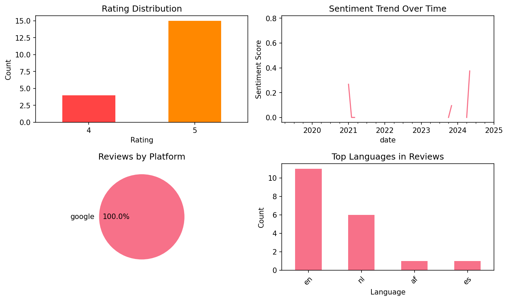

# ConjuGato: Learn Spanish Verbs

## 📱 App Information

| **Attribute** | **Google Play** | **App Store** |
|---------------|-----------------|---------------|
| **Title** | ConjuGato: Learn Spanish Verbs | N/A |
| **Package/ID** | com.QotoQot.ConjuGato | N/A |
| **Rating** | 4.8 | N/A |
| **Total Ratings** | 3,119 | N/A |
| **Installs** | 100,000+ | N/A |
| **Genre** | Education | N/A |

## 📝 Description

ConjuGato is your perfect Spanish language learning app to easily master verb conjugations. Whether you're a beginner just starting to learn Spanish or aiming to quickly improve your skills, ConjuGato makes grammar practice enjoyable and efficient. Build your vocabulary, enhance your Spanish pronunciation, and learn verbs effectively with convenient flashcards – ideal for quick practice anytime, even offline.

<b>Why choose ConjuGato?</b>
• NEW: Guides for each tense and verb form
• Flexible Practice: Customize verb exercises by irregularity, endings, or popularity
• Conjugation tables for each verb, with highlighted irregular forms
• Spaced repetition algorithm for efficient exam preparation and long-term retention
• Mnemonic flashcards to learn similar verbs together, ideal for beginners!
• Audio Pronunciation: Listen to Spanish phonetics for all the verb forms
• Argentinian and Chilean voseo forms
• Dark Mode for late night studying 🌙
• No ads, no internet connection required: A distraction-free, offline experience

ConjuGato was created by a two-person team who moved to Chile without speaking Spanish. Back then, even basic verb conjugation was challenging, and we couldn't find a good app to practice effectively. Out of necessity, we developed ConjuGato to make speaking and learning Spanish easier. It dramatically improved our Spanish skills, and now thousands of learners have successfully used it too – just check out all those 5-star reviews! ⭐⭐⭐⭐⭐

Free version to master Spanish language essentials:
• 250 most popular verbs + additional 27 mnemonic flashcards
• Indicative mood
• Present and Preterite tenses
• Present progressive (continuous) verb forms

If you need more advanced practice, there’s an affordable one-time upgrade that unlocks everything in the app forever!
• 1000 verbs + additional 104 mnemonic flashcards
• All moods: Indicative, Subjunctive, Imperative
• Complete tense coverage: Present, Preterite, Imperfect, Pluperfect, Conditional, Future (plus perfect and progressive forms)
• No subscriptions or hidden fees!

This app is suitable for both Spanish as it’s spoken in Spain and also Latin American dialects — just disable ‘vosotros’ and you are good to go.

🎓 Download ConjuGato now and learn Spanish verbs and conjugation with ease!

## 📊 Reviews Analytics

**Total Reviews:** 19 (19 analyzed)
**Rating Distribution:** 19 positive (4-5★), 0 neutral (3★), 0 negative (1-2★)
**Average Sentiment:** 0.26 (-1=very negative, +1=very positive)
**Primary Language:** en
**Key Insights:** Average rating: 4.8/5.0 | Overall sentiment: positive (score: 0.26) | Reviews in 4 languages, primarily en (11 reviews) | Reviews from 1 platform(s): google | Key themes: app, te, love


### 🔑 Key Themes & Phrases

- **app** (relevance: 0.190)
- **te** (relevance: 0.089)
- **love** (relevance: 0.084)
- **love app** (relevance: 0.084)
- **verbs** (relevance: 0.083)
- **en** (relevance: 0.082)
- **perfect** (relevance: 0.080)
- **heel** (relevance: 0.079)

### ⭐ Rating Breakdown

- **5 ★★★★★**: 15 reviews (78.9%)
- **4 ★★★★☆**: 4 reviews (21.1%)

### 🌍 Languages in Reviews

- **en**: 11 reviews
- **nl**: 6 reviews
- **af**: 1 reviews
- **es**: 1 reviews

### 📱 Platform Distribution

- **google**: 19 reviews

## 📈 Visualizations

### Analytics Charts


### Word Cloud


## 💬 Sample Reviews

**Review 1** (★★★★★ - google - 2025-01-22T08:52:49)
> Ik heb echt lang gezocht naar een app als deze. Oefenen door steeds maar te herhalen, het werkt heel fijn!

**Review 2** (★★★★★ - google - 2023-11-21T11:35:44)
> Love it. This app only does a handful of things but it does it simply and well. If you are serious about learning Spanish, you also need to drill your verbs at some point. I think it might be most helpful when you are trying to go beyond the present.

**Review 3** (★★★★★ - google - 2023-05-20T12:08:09)
> Fijne app om spaanse werkwoorden te automatiseren!

**Review 4** (★★★★★ - google - 2021-01-31T13:22:23)
> Fantastic app! Totally worth a couple of euros to completely personalize it. Please keep adding new verbs!

**Review 5** (★★★★ - google - 2019-03-18T22:56:04)
> Esa apa estario muy boniqua

## 🔧 Raw JSON Data

<details>
<summary>Click to expand raw app data</summary>

```json
{
  "name": "ConjuGato: Learn Spanish Verbs",
  "google_package": "com.QotoQot.ConjuGato",
  "google": {
    "title": "ConjuGato: Learn Spanish Verbs",
    "description": "ConjuGato is your perfect Spanish language learning app to easily master verb conjugations. Whether you're a beginner just starting to learn Spanish or aiming to quickly improve your skills, ConjuGato makes grammar practice enjoyable and efficient. Build your vocabulary, enhance your Spanish pronunciation, and learn verbs effectively with convenient flashcards – ideal for quick practice anytime, even offline.\r\n\r\n<b>Why choose ConjuGato?</b>\r\n• NEW: Guides for each tense and verb form\r\n• Flexible Practice: Customize verb exercises by irregularity, endings, or popularity\r\n• Conjugation tables for each verb, with highlighted irregular forms\r\n• Spaced repetition algorithm for efficient exam preparation and long-term retention\r\n• Mnemonic flashcards to learn similar verbs together, ideal for beginners!\r\n• Audio Pronunciation: Listen to Spanish phonetics for all the verb forms\r\n• Argentinian and Chilean voseo forms\r\n• Dark Mode for late night studying 🌙\r\n• No ads, no internet connection required: A distraction-free, offline experience\r\n\r\nConjuGato was created by a two-person team who moved to Chile without speaking Spanish. Back then, even basic verb conjugation was challenging, and we couldn't find a good app to practice effectively. Out of necessity, we developed ConjuGato to make speaking and learning Spanish easier. It dramatically improved our Spanish skills, and now thousands of learners have successfully used it too – just check out all those 5-star reviews! ⭐⭐⭐⭐⭐\r\n\r\nFree version to master Spanish language essentials:\r\n• 250 most popular verbs + additional 27 mnemonic flashcards\r\n• Indicative mood\r\n• Present and Preterite tenses\r\n• Present progressive (continuous) verb forms\r\n\r\nIf you need more advanced practice, there’s an affordable one-time upgrade that unlocks everything in the app forever!\r\n• 1000 verbs + additional 104 mnemonic flashcards\r\n• All moods: Indicative, Subjunctive, Imperative\r\n• Complete tense coverage: Present, Preterite, Imperfect, Pluperfect, Conditional, Future (plus perfect and progressive forms)\r\n• No subscriptions or hidden fees!\r\n\r\nThis app is suitable for both Spanish as it’s spoken in Spain and also Latin American dialects — just disable ‘vosotros’ and you are good to go.\r\n\r\n🎓 Download ConjuGato now and learn Spanish verbs and conjugation with ease!",
    "rating": 4.8,
    "rating_text": null,
    "ratings_total": 3119,
    "ratings_histogram": [
      0,
      59,
      59,
      310,
      2679
    ],
    "installs": "100,000+",
    "genre": "Education"
  },
  "apple": null,
  "reviews": [
    {
      "platform": "google",
      "rating": 5,
      "review": "Ik heb echt lang gezocht naar een app als deze. Oefenen door steeds maar te herhalen, het werkt heel fijn!",
      "date": "2025-01-22T08:52:49"
    },
    {
      "platform": "google",
      "rating": 5,
      "review": "This is a great app.",
      "date": "2025-01-08T19:19:09"
    },
    {
      "platform": "google",
      "rating": 4,
      "review": "I love the app, the only thing that would make it the perfect conjugation app is an english translation of the conjugated word!",
      "date": "2024-05-04T14:26:10"
    },
    {
      "platform": "google",
      "rating": 5,
      "review": "improved my verb knowledge rapidly",
      "date": "2024-04-25T20:18:53"
    },
    {
      "platform": "google",
      "rating": 5,
      "review": "Love it. This app only does a handful of things but it does it simply and well. If you are serious about learning Spanish, you also need to drill your verbs at some point. I think it might be most helpful when you are trying to go beyond the present.",
      "date": "2023-11-21T11:35:44"
    },
    {
      "platform": "google",
      "rating": 5,
      "review": "Heel handig",
      "date": "2023-10-27T13:39:51"
    },
    {
      "platform": "google",
      "rating": 4,
      "review": "Zeer gebruiksvriendelijke app en helpt je zeker bij het leren van Spaans.",
      "date": "2023-10-04T06:31:00"
    },
    {
      "platform": "google",
      "rating": 5,
      "review": "Absolutely love the app, hopefully Dutch translations soon! Definitely worth the money too to help and support the brilliant makers",
      "date": "2023-08-19T21:29:26"
    },
    {
      "platform": "google",
      "rating": 5,
      "review": "Great app for practicing conjugations and the full version is worth the money. I like the simplicity but also the versatility as you can adjust the settings to whichever tenses you would like to practice.",
      "date": "2023-05-29T12:47:05"
    },
    {
      "platform": "google",
      "rating": 5,
      "review": "Fijne app om spaanse werkwoorden te automatiseren!",
      "date": "2023-05-20T12:08:09"
    },
    {
      "platform": "google",
      "rating": 4,
      "review": "I love this app! I would give it 5 stars if you could practise translations of the verbs as well!",
      "date": "2022-03-31T15:04:38"
    },
    {
      "platform": "google",
      "rating": 5,
      "review": "Straigthforward and helpful",
      "date": "2021-05-20T12:19:09"
    },
    {
      "platform": "google",
      "rating": 5,
      "review": "De Meest handige app om ww vervoegingen te oefenen.",
      "date": "2021-03-19T18:49:32"
    },
    {
      "platform": "google",
      "rating": 5,
      "review": "Geweldige manier om vervoegingen te trainen",
      "date": "2021-02-17T06:09:20"
    },
    {
      "platform": "google",
      "rating": 5,
      "review": "Fantastic app! Totally worth a couple of euros to completely personalize it. Please keep adding new verbs!",
      "date": "2021-01-31T13:22:23"
    },
    {
      "platform": "google",
      "rating": 5,
      "review": "Leuke app, leerzaam en uitdagend😊",
      "date": "2020-05-30T22:36:06"
    },
    {
      "platform": "google",
      "rating": 5,
      "review": "Perfect to learn tenses in Spanish or to rehearse them. I just keep forgetting some of them",
      "date": "2020-02-18T22:34:56"
    },
    {
      "platform": "google",
      "rating": 5,
      "review": "Perfect to practice conjugation!",
      "date": "2019-03-26T17:12:56"
    },
    {
      "platform": "google",
      "rating": 4,
      "review": "Esa apa estario muy boniqua",
      "date": "2019-03-18T22:56:04"
    }
  ]
}
```

</details>

---
*Report generated on 2025-11-08 13:51:47 using advanced analytics*
