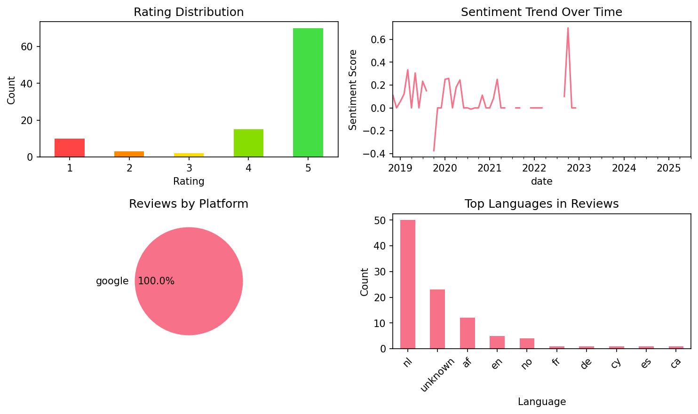

# Learn English. Speak English

## 📱 App Information

| **Attribute** | **Google Play** | **App Store** |
|---------------|-----------------|---------------|
| **Title** | Learn English. Speak English | N/A |
| **Package/ID** | com.atistudios.ispeak.en | N/A |
| **Rating** | 4.595588 | N/A |
| **Total Ratings** | 104,475 | N/A |
| **Installs** | 1,000,000+ | N/A |
| **Genre** | Education | N/A |

## 📝 Description

Learn English with free lessons daily. Let Mondly teach you the English language quickly and effectively. In just minutes you’ll start memorizing core English words, form sentences, learn to speak English phrases and take part in conversations. Fun English lessons improve your vocabulary, grammar and pronunciation like no other language learning method. Beginner or advanced learner, traveler or business professional with a tight schedule? The app works great and dynamically adjusts to your needs.

Explore language exercises for reading, listening, writing and speaking enhanced with a dictionary, verb conjugator and state-of-the-art speech recognition technology - you’ll feel like having your own English language tutor in your pocket.
Download the language learning pill today and enjoy the benefits of learning a new language for life.

<b>The secret path to language learning</b>
Remember the English language classes in school? You started with hundreds of basic words and expressions, continued with tons of English grammar lessons and at the end of a full semester’s language course you could barely translate a sentence or say “Hello!” to a foreigner. That’s the traditional way to learn a language.
Mondly has a different approach, that’s opposite to the average language course.

<b>This is how the future of language courses looks like</b>
The App gets you started with a basic conversation between two people. You quickly start memorizing core words, use them to build sentences and phrases, and at the end of a 45-minutes module you are able to reconstruct that conversation with your own voice. It’s an effective way to learn English phrases. State-of-the-art Natural Speech Recognition and Spaced Repetition Algorithms make the app effective for learning languages.

Here are the key features that make Mondly a great tutor for you:

<b>Crystal-clear audio and professional voice actors.</b> Learn the right English pronunciation from conversations between native speakers.

<b>State-of-the-art Speech Recognition.</b> Mondly knows exactly how to listen to your English words and phrases. You will only get a positive feedback if you speak English clearly and correctly. This will improve your pronunciation.

<b>Useful phrases for real situations.</b> Memorizing hundreds of isolated words is not the way to go when it comes to learning English. Mondly teaches you English vocabulary by offering you core words and phrases. The app breaks the learning process down into short lessons and puts them into themed packs.

<b>Learn conversational English.</b> Conversation is the main reason to take this free course. It will help you build a core English vocabulary with widely-used nouns and verbs, and speak English clearly.

<b>Verb conjugations.</b> If you want to learn more during this course, just tap the English verbs and get the full conjugation on the screen, including the translation. It’s faster and better than a dictionary.

<b>Advanced Statistics.</b> The App uses intelligent reporting, so you can always follow your progress. Build your vocabulary step by step and become better daily.

<b>The Leaderboard.</b> See how your friends are doing and compete with people from all over the world to become the best learner in the Mondly community family. Take the Weekly Quiz to become even better.

<b>Adaptive Learning.</b> Learning English is different from person to person. So we taught the app to learn from your way of learning. After little time spent together, Mondly will understand what suits you best and it will become your own guide and customized teacher.

Before you know it, at the end of these English lessons, you will master the most useful 5000 words and phrases and you will be on the fast lane to learning a new language.

## 📊 Reviews Analytics

**Total Reviews:** 100 (100 analyzed)
**Rating Distribution:** 85 positive (4-5★), 2 neutral (3★), 13 negative (1-2★)
**Average Sentiment:** 0.10 (-1=very negative, +1=very positive)
**Primary Language:** nl
**Key Insights:** Average rating: 4.3/5.0 | Overall sentiment: neutral (score: 0.10) | Reviews in 11 languages, primarily nl (50 reviews) | Reviews from 1 platform(s): google | Key themes: app, goed, en


### 🔑 Key Themes & Phrases

- **app** (relevance: 0.071)
- **goed** (relevance: 0.057)
- **en** (relevance: 0.056)
- **heel** (relevance: 0.054)
- **ik** (relevance: 0.050)
- **geweldig** (relevance: 0.049)
- **good** (relevance: 0.048)
- **leuk** (relevance: 0.044)

### ⭐ Rating Breakdown

- **5 ★★★★★**: 70 reviews (70.0%)
- **4 ★★★★☆**: 15 reviews (15.0%)
- **3 ★★★☆☆**: 2 reviews (2.0%)
- **2 ★★☆☆☆**: 3 reviews (3.0%)
- **1 ★☆☆☆☆**: 10 reviews (10.0%)

### 🌍 Languages in Reviews

- **nl**: 50 reviews
- **unknown**: 23 reviews
- **af**: 12 reviews
- **en**: 5 reviews
- **no**: 4 reviews

### 📱 Platform Distribution

- **google**: 100 reviews

## 📈 Visualizations

### Analytics Charts


### Word Cloud


## 💬 Sample Reviews

**Review 1** (★★★★★ - google - 2025-07-27T13:50:52)
> onnodig

**Review 2** (★★★★★ - google - 2021-03-27T22:01:17)
> Dit is een top app om goed je nieuwe taal te oefenen ik geef dit een dikke vette 5 sterren.

**Review 3** (★★★★★ - google - 2020-04-07T21:37:29)
> Geweldig

**Review 4** (★★★★★ - google - 2019-05-27T13:50:40)
> leuk om te doen

**Review 5** (★★★★★ - google - 2018-11-11T15:45:18)
> T'is super dat je talen kan leren met dit spel

## 🔧 Raw JSON Data

<details>
<summary>Click to expand raw app data</summary>

```json
{
  "name": "Learn English. Speak English",
  "google_package": "com.atistudios.ispeak.en",
  "google": {
    "title": "Learn English. Speak English",
    "description": "Learn English with free lessons daily. Let Mondly teach you the English language quickly and effectively. In just minutes you’ll start memorizing core English words, form sentences, learn to speak English phrases and take part in conversations. Fun English lessons improve your vocabulary, grammar and pronunciation like no other language learning method. Beginner or advanced learner, traveler or business professional with a tight schedule? The app works great and dynamically adjusts to your needs.\r\n\r\nExplore language exercises for reading, listening, writing and speaking enhanced with a dictionary, verb conjugator and state-of-the-art speech recognition technology - you’ll feel like having your own English language tutor in your pocket.\r\nDownload the language learning pill today and enjoy the benefits of learning a new language for life.\r\n\r\n<b>The secret path to language learning</b>\r\nRemember the English language classes in school? You started with hundreds of basic words and expressions, continued with tons of English grammar lessons and at the end of a full semester’s language course you could barely translate a sentence or say “Hello!” to a foreigner. That’s the traditional way to learn a language.\r\nMondly has a different approach, that’s opposite to the average language course.\r\n\r\n<b>This is how the future of language courses looks like</b>\r\nThe App gets you started with a basic conversation between two people. You quickly start memorizing core words, use them to build sentences and phrases, and at the end of a 45-minutes module you are able to reconstruct that conversation with your own voice. It’s an effective way to learn English phrases. State-of-the-art Natural Speech Recognition and Spaced Repetition Algorithms make the app effective for learning languages.\r\n\r\nHere are the key features that make Mondly a great tutor for you:\r\n\r\n<b>Crystal-clear audio and professional voice actors.</b> Learn the right English pronunciation from conversations between native speakers.\r\n\r\n<b>State-of-the-art Speech Recognition.</b> Mondly knows exactly how to listen to your English words and phrases. You will only get a positive feedback if you speak English clearly and correctly. This will improve your pronunciation.\r\n\r\n<b>Useful phrases for real situations.</b> Memorizing hundreds of isolated words is not the way to go when it comes to learning English. Mondly teaches you English vocabulary by offering you core words and phrases. The app breaks the learning process down into short lessons and puts them into themed packs.\r\n\r\n<b>Learn conversational English.</b> Conversation is the main reason to take this free course. It will help you build a core English vocabulary with widely-used nouns and verbs, and speak English clearly.\r\n\r\n<b>Verb conjugations.</b> If you want to learn more during this course, just tap the English verbs and get the full conjugation on the screen, including the translation. It’s faster and better than a dictionary.\r\n\r\n<b>Advanced Statistics.</b> The App uses intelligent reporting, so you can always follow your progress. Build your vocabulary step by step and become better daily.\r\n\r\n<b>The Leaderboard.</b> See how your friends are doing and compete with people from all over the world to become the best learner in the Mondly community family. Take the Weekly Quiz to become even better.\r\n\r\n<b>Adaptive Learning.</b> Learning English is different from person to person. So we taught the app to learn from your way of learning. After little time spent together, Mondly will understand what suits you best and it will become your own guide and customized teacher.\r\n\r\nBefore you know it, at the end of these English lessons, you will master the most useful 5000 words and phrases and you will be on the fast lane to learning a new language.",
    "rating": 4.595588,
    "rating_text": null,
    "ratings_total": 104475,
    "ratings_histogram": [
      1475,
      1475,
      8411,
      14535,
      78356
    ],
    "installs": "1,000,000+",
    "genre": "Education"
  },
  "apple": null,
  "reviews": [
    {
      "platform": "google",
      "rating": 5,
      "review": "onnodig",
      "date": "2025-07-27T13:50:52"
    },
    {
      "platform": "google",
      "rating": 1,
      "review": "Niet gratis 10 euro per maand",
      "date": "2024-08-17T00:11:24"
    },
    {
      "platform": "google",
      "rating": 4,
      "review": "Weinig reclame! Maar te veel betalend",
      "date": "2024-04-03T11:54:07"
    },
    {
      "platform": "google",
      "rating": 1,
      "review": "Ik vindt het wel leuk Daar na moet j betalln en dat vindt ik zo laar want hmmmmm",
      "date": "2023-11-28T16:58:44"
    },
    {
      "platform": "google",
      "rating": 5,
      "review": "Ik hou niet van talen leren, maar door deze app ga ik het ook echt leuk vind. Heel blij mee😃",
      "date": "2023-05-01T21:34:16"
    },
    {
      "platform": "google",
      "rating": 5,
      "review": "Good",
      "date": "2023-02-20T08:15:30"
    },
    {
      "platform": "google",
      "rating": 4,
      "review": "Het is goed om te leren",
      "date": "2022-12-28T22:34:31"
    },
    {
      "platform": "google",
      "rating": 5,
      "review": "Ben zeer tevreden over de afhandeling van Mondly v.w.b. de betaling.",
      "date": "2022-11-04T17:58:32"
    },
    {
      "platform": "google",
      "rating": 5,
      "review": "Really good app , but is there a way to reset your progres to start all over again ? I cant find it",
      "date": "2022-10-11T13:54:01"
    },
    {
      "platform": "google",
      "rating": 3,
      "review": "Wow this is Good👌🏾",
      "date": "2022-09-11T21:31:24"
    },
    {
      "platform": "google",
      "rating": 4,
      "review": "Nog te gemakkelijk voor mij",
      "date": "2022-05-29T20:00:19"
    },
    {
      "platform": "google",
      "rating": 5,
      "review": "Is geweldig binnen een maand ben ik van geen engels kunnen naar 31 zinnen, 48 woorden en 2 min engels kunnen! ( heb maar 2/3 keer gedaan in de maand)",
      "date": "2022-03-26T19:06:59"
    },
    {
      "platform": "google",
      "rating": 1,
      "review": "Ik kan er niet in ik heb hem verwijderd en weer gedownload maar hij wil niet werken",
      "date": "2022-03-07T18:58:41"
    },
    {
      "platform": "google",
      "rating": 4,
      "review": "Zeer goed",
      "date": "2022-02-10T08:18:45"
    },
    {
      "platform": "google",
      "rating": 5,
      "review": "Muy bueno",
      "date": "2022-02-08T00:37:10"
    },
    {
      "platform": "google",
      "rating": 1,
      "review": "Helemaal niet gratis",
      "date": "2022-01-19T21:29:43"
    },
    {
      "platform": "google",
      "rating": 4,
      "review": "het is zo leer zaam 4 steren",
      "date": "2021-12-28T11:05:15"
    },
    {
      "platform": "google",
      "rating": 5,
      "review": "Vindt het leuk app",
      "date": "2021-12-07T18:07:41"
    },
    {
      "platform": "google",
      "rating": 5,
      "review": "heel leer rijk",
      "date": "2021-09-25T13:28:07"
    },
    {
      "platform": "google",
      "rating": 5,
      "review": "Ik ben net begonnen, maar het is nu wel veel te makkelijk",
      "date": "2021-09-06T16:39:41"
    },
    {
      "platform": "google",
      "rating": 5,
      "review": "Zeer goede app, nu al beter dan die andere apps, ik zal zeker doorgaan met deze app, je leert snel nieuwe woorden en zinnen 👌",
      "date": "2021-08-06T10:18:19"
    },
    {
      "platform": "google",
      "rating": 5,
      "review": "Hele goede lessen en makkelijk om te leren.",
      "date": "2021-05-26T01:03:59"
    },
    {
      "platform": "google",
      "rating": 5,
      "review": "Mooi app om English leren.",
      "date": "2021-05-17T00:15:00"
    },
    {
      "platform": "google",
      "rating": 5,
      "review": "Altijd goed de dagelijkse les om bij te blijven 👍",
      "date": "2021-04-20T17:04:29"
    },
    {
      "platform": "google",
      "rating": 2,
      "review": "Erdam",
      "date": "2021-04-11T16:20:21"
    },
    {
      "platform": "google",
      "rating": 5,
      "review": "Dit is een top app om goed je nieuwe taal te oefenen ik geef dit een dikke vette 5 sterren.",
      "date": "2021-03-27T22:01:17"
    },
    {
      "platform": "google",
      "rating": 5,
      "review": "Beatiful",
      "date": "2021-03-20T22:05:40"
    },
    {
      "platform": "google",
      "rating": 5,
      "review": "Elke dag even oefenen.. het werkt!",
      "date": "2021-02-26T09:10:47"
    },
    {
      "platform": "google",
      "rating": 5,
      "review": "Mooi, veel plezier aan gehad maar nu afmelden",
      "date": "2021-02-17T10:24:05"
    },
    {
      "platform": "google",
      "rating": 5,
      "review": "Goed appel",
      "date": "2021-02-11T10:47:01"
    },
    {
      "platform": "google",
      "rating": 5,
      "review": "Heel goed super leuk",
      "date": "2021-02-06T12:02:54"
    },
    {
      "platform": "google",
      "rating": 5,
      "review": "Leuke uitdagende app",
      "date": "2021-01-03T19:13:04"
    },
    {
      "platform": "google",
      "rating": 1,
      "review": "waar zijn de instelingen",
      "date": "2020-12-23T17:30:24"
    },
    {
      "platform": "google",
      "rating": 5,
      "review": "Ik kan hier goed mee leren alleen kosten sommige dingen geld dat vind ik jammer",
      "date": "2020-11-12T16:19:13"
    },
    {
      "platform": "google",
      "rating": 5,
      "review": "Ik kan nu beter Engels daarna ga ik koreans 🇰🇷leren👍😊",
      "date": "2020-11-11T12:47:28"
    },
    {
      "platform": "google",
      "rating": 5,
      "review": "Super lessen goede app",
      "date": "2020-11-09T06:05:06"
    },
    {
      "platform": "google",
      "rating": 4,
      "review": "Het is wel een goede app maar het was beter als ze niet alles voorzeggen",
      "date": "2020-10-20T10:29:57"
    },
    {
      "platform": "google",
      "rating": 5,
      "review": "🥰🥰🥰",
      "date": "2020-09-26T09:19:34"
    },
    {
      "platform": "google",
      "rating": 1,
      "review": "Staat bij Gratis maar je moet gewoon betalen hoor!! Slecht dus, wordt automatiche factuur gestuurd via google play!",
      "date": "2020-08-25T17:46:21"
    },
    {
      "platform": "google",
      "rating": 5,
      "review": "It's a good game heel geode game hahah I'm engels Yaay",
      "date": "2020-08-22T15:32:07"
    },
    {
      "platform": "google",
      "rating": 5,
      "review": "Leuk om te doen",
      "date": "2020-08-15T16:00:47"
    },
    {
      "platform": "google",
      "rating": 4,
      "review": "Geweldig interessant motiveerde ook .",
      "date": "2020-07-15T19:16:04"
    },
    {
      "platform": "google",
      "rating": 5,
      "review": "Heel duidelijk",
      "date": "2020-06-27T10:02:11"
    },
    {
      "platform": "google",
      "rating": 5,
      "review": "Great app just found out that you could download one of them and use one app to learn multiple language's.",
      "date": "2020-05-25T14:03:17"
    },
    {
      "platform": "google",
      "rating": 4,
      "review": "Super",
      "date": "2020-05-20T11:16:10"
    },
    {
      "platform": "google",
      "rating": 5,
      "review": "Heel goed",
      "date": "2020-05-02T00:30:55"
    },
    {
      "platform": "google",
      "rating": 4,
      "review": "Very good",
      "date": "2020-04-13T23:44:50"
    },
    {
      "platform": "google",
      "rating": 5,
      "review": "Sony heeft mij via hun veilig modes verwijderd van jullie app waardeer ik uw Engelse lessen niet meer kan volgen terwijl ik voor een heel jaar betaald.Gaarne uw hulp a.u.b.",
      "date": "2020-04-12T10:48:09"
    },
    {
      "platform": "google",
      "rating": 5,
      "review": "Fijne app",
      "date": "2020-04-12T10:22:21"
    },
    {
      "platform": "google",
      "rating": 5,
      "review": "Leuke leerwijze!",
      "date": "2020-04-09T12:37:09"
    },
    {
      "platform": "google",
      "rating": 5,
      "review": "Geweldig",
      "date": "2020-04-07T21:37:29"
    },
    {
      "platform": "google",
      "rating": 1,
      "review": "Werk slech",
      "date": "2020-03-20T15:05:15"
    },
    {
      "platform": "google",
      "rating": 1,
      "review": "Valt altijd uit en kan moelijk openen",
      "date": "2020-03-12T06:27:55"
    },
    {
      "platform": "google",
      "rating": 2,
      "review": "Eerst vond ik het erg leuk maar omdat het wat kost heb ik het verwijdert",
      "date": "2020-03-10T10:28:42"
    },
    {
      "platform": "google",
      "rating": 5,
      "review": "Dis app is verry good ik Kon geen egels en kijk nu ik kan super goed engels is echt een aanzadertje ✌️😍❤️",
      "date": "2020-02-29T19:26:14"
    },
    {
      "platform": "google",
      "rating": 5,
      "review": "Erg leerzaam",
      "date": "2020-02-19T16:54:50"
    },
    {
      "platform": "google",
      "rating": 5,
      "review": "ok",
      "date": "2020-01-12T12:50:49"
    },
    {
      "platform": "google",
      "rating": 5,
      "review": "Ik leer met deze app heel goed Engels",
      "date": "2020-01-02T21:43:31"
    },
    {
      "platform": "google",
      "rating": 4,
      "review": "Heel leuk : )",
      "date": "2020-01-02T11:52:00"
    },
    {
      "platform": "google",
      "rating": 5,
      "review": "Je kan er veel van leren daarom 5 sterren",
      "date": "2020-01-01T14:07:13"
    },
    {
      "platform": "google",
      "rating": 5,
      "review": "Op een leuke manier Engels leren",
      "date": "2019-12-21T13:10:53"
    },
    {
      "platform": "google",
      "rating": 3,
      "review": "Tof",
      "date": "2019-12-10T13:30:16"
    },
    {
      "platform": "google",
      "rating": 5,
      "review": "Ik kan makkelijk leren.",
      "date": "2019-12-08T16:33:34"
    },
    {
      "platform": "google",
      "rating": 4,
      "review": "Heel makkelijk nu",
      "date": "2019-11-26T19:22:39"
    },
    {
      "platform": "google",
      "rating": 5,
      "review": "Heel goed app. Zo kan ik makkelijker Engels leren, maar er is een problem, om beter Engels te leren moet wij betalen. :(",
      "date": "2019-10-30T22:23:49"
    },
    {
      "platform": "google",
      "rating": 5,
      "review": "Goeie app",
      "date": "2019-10-07T21:09:15"
    },
    {
      "platform": "google",
      "rating": 4,
      "review": "Makkelijk en leerzaam, jammer dat een betaalde versie nog beter werkt",
      "date": "2019-08-29T21:32:50"
    },
    {
      "platform": "google",
      "rating": 5,
      "review": "For full version",
      "date": "2019-08-28T08:58:32"
    },
    {
      "platform": "google",
      "rating": 5,
      "review": "het is leuk om te doen en door deze app leer je heel snel en goed engels. omdat ik al een beetje engels kan is begin wel erg makkelijk, masr het word steeds moeilijker. het is een vrolijke app waardoor het niet saai gaat worden en dat is erg fijn.",
      "date": "2019-08-10T15:47:43"
    },
    {
      "platform": "google",
      "rating": 5,
      "review": "Thank you so much for everything!",
      "date": "2019-08-09T23:10:09"
    },
    {
      "platform": "google",
      "rating": 1,
      "review": "Je kan alleen 1 pakket oefenen en dan heb je deze app uitgespeeld daarna moet je betalen als je verder wilt.",
      "date": "2019-07-26T12:01:27"
    },
    {
      "platform": "google",
      "rating": 5,
      "review": "good game/leerzaame spel🇱🇺en🇬🇧is leuk",
      "date": "2019-07-14T08:53:59"
    },
    {
      "platform": "google",
      "rating": 5,
      "review": "Geweldig",
      "date": "2019-07-03T00:43:12"
    },
    {
      "platform": "google",
      "rating": 5,
      "review": "volgens mij is dit gewoon gratis",
      "date": "2019-06-30T13:47:23"
    },
    {
      "platform": "google",
      "rating": 5,
      "review": "super goed!",
      "date": "2019-05-29T17:09:49"
    },
    {
      "platform": "google",
      "rating": 5,
      "review": "leuk om te doen",
      "date": "2019-05-27T13:50:40"
    },
    {
      "platform": "google",
      "rating": 5,
      "review": "love this",
      "date": "2019-05-25T17:45:39"
    },
    {
      "platform": "google",
      "rating": 4,
      "review": "prima programma om mee te beginnen",
      "date": "2019-04-05T23:07:11"
    },
    {
      "platform": "google",
      "rating": 5,
      "review": "Dit is de beste mondly ooit",
      "date": "2019-03-29T18:27:20"
    },
    {
      "platform": "google",
      "rating": 4,
      "review": "tot heden nog geen klachten best leuk om te doen",
      "date": "2019-03-08T10:12:28"
    },
    {
      "platform": "google",
      "rating": 5,
      "review": "leuk spel",
      "date": "2019-03-07T19:05:16"
    },
    {
      "platform": "google",
      "rating": 5,
      "review": "ook heel fijn voor school",
      "date": "2019-02-14T07:42:36"
    },
    {
      "platform": "google",
      "rating": 5,
      "review": "Werkt goed en plezierig.",
      "date": "2019-02-10T11:35:56"
    },
    {
      "platform": "google",
      "rating": 5,
      "review": "tot nu toe goef",
      "date": "2019-02-09T17:55:57"
    },
    {
      "platform": "google",
      "rating": 5,
      "review": "me gusta aprendo varias palabras en ingles",
      "date": "2019-02-04T22:14:46"
    },
    {
      "platform": "google",
      "rating": 5,
      "review": "nice",
      "date": "2019-02-03T15:23:39"
    },
    {
      "platform": "google",
      "rating": 5,
      "review": "Super spel 👍👍👍",
      "date": "2019-01-28T19:51:13"
    },
    {
      "platform": "google",
      "rating": 5,
      "review": "💯",
      "date": "2019-01-26T22:34:43"
    },
    {
      "platform": "google",
      "rating": 5,
      "review": "geweldig",
      "date": "2019-01-17T18:56:10"
    },
    {
      "platform": "google",
      "rating": 5,
      "review": "Superleuk",
      "date": "2019-01-15T20:08:18"
    },
    {
      "platform": "google",
      "rating": 5,
      "review": "ik vind het een heel leuk spel om engels te leren .",
      "date": "2019-01-14T18:53:24"
    },
    {
      "platform": "google",
      "rating": 2,
      "review": "leuk. jamer dat deze niet gratis is",
      "date": "2019-01-02T15:33:16"
    },
    {
      "platform": "google",
      "rating": 5,
      "review": "so hulpfull",
      "date": "2018-12-31T10:33:10"
    },
    {
      "platform": "google",
      "rating": 5,
      "review": "geweldig",
      "date": "2018-12-25T21:24:59"
    },
    {
      "platform": "google",
      "rating": 5,
      "review": "heel goed en handig",
      "date": "2018-12-25T10:50:38"
    },
    {
      "platform": "google",
      "rating": 1,
      "review": "je leert er niet veel van",
      "date": "2018-12-18T16:17:36"
    },
    {
      "platform": "google",
      "rating": 5,
      "review": "De lessen zijn duidelijk en gemakkelijk",
      "date": "2018-12-10T13:36:02"
    },
    {
      "platform": "google",
      "rating": 5,
      "review": "Dit is vloeiend en vlot",
      "date": "2018-11-30T07:37:59"
    },
    {
      "platform": "google",
      "rating": 4,
      "review": "Vlot leren",
      "date": "2018-11-25T15:43:47"
    },
    {
      "platform": "google",
      "rating": 5,
      "review": "T'is super dat je talen kan leren met dit spel",
      "date": "2018-11-11T15:45:18"
    }
  ]
}
```

</details>

---
*Report generated on 2025-11-08 13:48:46 using advanced analytics*
