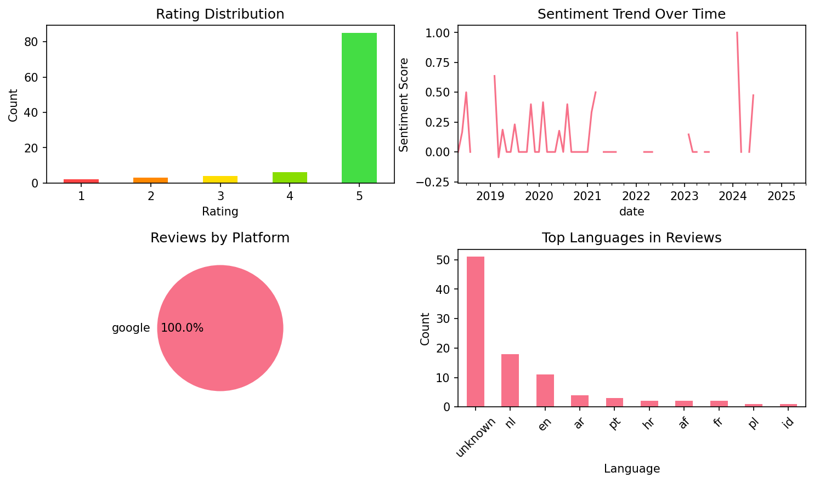

# Learn Dutch - Speak Dutch

## 📱 App Information

| **Attribute** | **Google Play** | **App Store** |
|---------------|-----------------|---------------|
| **Title** | Learn Dutch - Speak Dutch | N/A |
| **Package/ID** | com.atistudios.italk.nl | N/A |
| **Rating** | 4.59 | N/A |
| **Total Ratings** | 29,363 | N/A |
| **Installs** | 500,000+ | N/A |
| **Genre** | Education | N/A |

## 📝 Description

Learn Dutch with 5 minutes of practice daily. Mondly is the quick fix that will teach you core Dutch words and Dutch phrases for conversation, just like a phrasebook. If you want to learn beyond the basics, there are also Dutch grammar lessons available.

With Mondly you can learn Dutch sentences and expressions FREE with daily Dutch language lessons online. This app is the effective way for beginners to study verbs, pronunciation and how to speak like a native with daily practice.

<b>The secret path to language learning</b>
Remember the Dutch language classes in school? You started with hundreds of basic words and expressions, continued with tons of Dutch grammar lessons and at the end of a full semester’s language course you could barely translate a sentence or say “Hello!” to a local. Does it sound familiar? That’s the traditional way to learn a language. But it’s not the fastest and not the most efficient way.
Mondly has a different approach, that’s opposite to the average language course.

<b>This is how the future of language courses looks like</b>
The App gets you started with a basic conversation between two people. You quickly start memorizing core words, use them to build sentences and phrases, and at the end of a 45-minutes module you are able to reconstruct that conversation with your own voice. It’s an effective way to learn Dutch phrases. State-of-the-art Natural Speech Recognition and Spaced Repetition Algorithms make the app effective for learning languages.

Here are the key features that make Mondly a great tutor for you:

<b>- Crystal-clear audio and professional voice actors.</b> Learn the right Dutch pronunciation from conversations between native speakers.

<b>- State-of-the-art Speech Recognition.</b> Mondly knows exactly how to listen to your Dutch words and phrases. You will only get a positive feedback if you speak Dutch clearly and correctly. This will improve your pronunciation.

<b>- Useful phrases for real situations.</b> Memorizing hundreds of words is not the way to go when it comes to learning Dutch. Mondly teaches you Dutch vocabulary by offering you core words and phrases. The app breaks the learning process down into bite-size chunks and puts them into themed packs of lessons.

<b>- Learn conversational Dutch.</b> Unless you plan on reading science books, conversation is the main reason to take this free course. It will help you build a core Dutch vocabulary with widely-used nouns and verbs and speak Dutch clearly.

<b>- Verb conjugations.</b> Conversations are fun, but the foundation of a foreign language is grammar. If you want to learn more during this course, just tap the Dutch verbs and get the full conjugation on the screen, including the translation. It’s faster and better than a dictionary.

<b>- Statistics that make sense.</b> The App uses intelligent reporting, so you can always follow your progress. Build your vocabulary step by step and become better daily.

<b>- The Leaderboard.</b> We made learning easy and fun, so why not throw in some more game elements, such as score? See how your friends are doing and compete with people from all over the world to become the best learner in the Mondly family. Take the Weekly Quiz to become even better.

<b>- Adaptive Learning.</b> We wanted to craft Mondly in such a way that it will suit every learner’s needs, even complete beginners. Along the way we noticed that learning Dutch is different from person to person. So we taught the app to learn from your way of learning. After little time spent together, Mondly will understand what suits you best and it will become your own guide and customized teacher.

Before you know it, at the end of these Dutch lessons, you will master the most useful 5000 words and phrases and you will be on the fast lane to learning a new language.

## 📊 Reviews Analytics

**Total Reviews:** 100 (100 analyzed)
**Rating Distribution:** 91 positive (4-5★), 4 neutral (3★), 5 negative (1-2★)
**Average Sentiment:** 0.15 (-1=very negative, +1=very positive)
**Primary Language:** unknown
**Key Insights:** Average rating: 4.7/5.0 | Overall sentiment: positive (score: 0.15) | Reviews in 15 languages, primarily unknown (51 reviews) | Reviews from 1 platform(s): google | Key themes: goed, app, zeer


### 🔑 Key Themes & Phrases

- **goed** (relevance: 0.146)
- **app** (relevance: 0.071)
- **zeer** (relevance: 0.046)
- **zeer goed** (relevance: 0.045)
- **perfect** (relevance: 0.045)
- **ik** (relevance: 0.039)
- **super** (relevance: 0.035)
- **heel** (relevance: 0.035)

### ⭐ Rating Breakdown

- **5 ★★★★★**: 85 reviews (85.0%)
- **4 ★★★★☆**: 6 reviews (6.0%)
- **3 ★★★☆☆**: 4 reviews (4.0%)
- **2 ★★☆☆☆**: 3 reviews (3.0%)
- **1 ★☆☆☆☆**: 2 reviews (2.0%)

### 🌍 Languages in Reviews

- **unknown**: 51 reviews
- **nl**: 18 reviews
- **en**: 11 reviews
- **ar**: 4 reviews
- **pt**: 3 reviews

### 📱 Platform Distribution

- **google**: 100 reviews

## 📈 Visualizations

### Analytics Charts


### Word Cloud


## 💬 Sample Reviews

**Review 1** (★★★★★ - google - 2025-07-27T13:51:26)
> ik spreek hetzelfde

**Review 2** (★★★★★ - google - 2021-05-26T20:03:48)
> Het is een zeer leuke cursus om Nederlands te leren.

**Review 3** (★★★★★ - google - 2020-06-11T02:03:22)
> Zeer goed

**Review 4** (★★★★★ - google - 2019-07-24T10:26:39)
> hallo ik ben Maaike en ik woon in Nederland. hello I'm Maaike and I live in the Netherlands. If you get the first sentense you nailed it👏

**Review 5** (★★★★★ - google - 2018-05-03T20:26:57)
> Geweldig

## 🔧 Raw JSON Data

<details>
<summary>Click to expand raw app data</summary>

```json
{
  "name": "Learn Dutch - Speak Dutch",
  "google_package": "com.atistudios.italk.nl",
  "google": {
    "title": "Learn Dutch - Speak Dutch",
    "description": "Learn Dutch with 5 minutes of practice daily. Mondly is the quick fix that will teach you core Dutch words and Dutch phrases for conversation, just like a phrasebook. If you want to learn beyond the basics, there are also Dutch grammar lessons available.\r\n\r\nWith Mondly you can learn Dutch sentences and expressions FREE with daily Dutch language lessons online. This app is the effective way for beginners to study verbs, pronunciation and how to speak like a native with daily practice.\r\n\r\n<b>The secret path to language learning</b>\r\nRemember the Dutch language classes in school? You started with hundreds of basic words and expressions, continued with tons of Dutch grammar lessons and at the end of a full semester’s language course you could barely translate a sentence or say “Hello!” to a local. Does it sound familiar? That’s the traditional way to learn a language. But it’s not the fastest and not the most efficient way.\r\nMondly has a different approach, that’s opposite to the average language course.\r\n\r\n<b>This is how the future of language courses looks like</b>\r\nThe App gets you started with a basic conversation between two people. You quickly start memorizing core words, use them to build sentences and phrases, and at the end of a 45-minutes module you are able to reconstruct that conversation with your own voice. It’s an effective way to learn Dutch phrases. State-of-the-art Natural Speech Recognition and Spaced Repetition Algorithms make the app effective for learning languages.\r\n\r\nHere are the key features that make Mondly a great tutor for you:\r\n\r\n<b>- Crystal-clear audio and professional voice actors.</b> Learn the right Dutch pronunciation from conversations between native speakers.\r\n\r\n<b>- State-of-the-art Speech Recognition.</b> Mondly knows exactly how to listen to your Dutch words and phrases. You will only get a positive feedback if you speak Dutch clearly and correctly. This will improve your pronunciation.\r\n\r\n<b>- Useful phrases for real situations.</b> Memorizing hundreds of words is not the way to go when it comes to learning Dutch. Mondly teaches you Dutch vocabulary by offering you core words and phrases. The app breaks the learning process down into bite-size chunks and puts them into themed packs of lessons.\r\n\r\n<b>- Learn conversational Dutch.</b> Unless you plan on reading science books, conversation is the main reason to take this free course. It will help you build a core Dutch vocabulary with widely-used nouns and verbs and speak Dutch clearly.\r\n\r\n<b>- Verb conjugations.</b> Conversations are fun, but the foundation of a foreign language is grammar. If you want to learn more during this course, just tap the Dutch verbs and get the full conjugation on the screen, including the translation. It’s faster and better than a dictionary.\r\n\r\n<b>- Statistics that make sense.</b> The App uses intelligent reporting, so you can always follow your progress. Build your vocabulary step by step and become better daily.\r\n\r\n<b>- The Leaderboard.</b> We made learning easy and fun, so why not throw in some more game elements, such as score? See how your friends are doing and compete with people from all over the world to become the best learner in the Mondly family. Take the Weekly Quiz to become even better.\r\n\r\n<b>- Adaptive Learning.</b> We wanted to craft Mondly in such a way that it will suit every learner’s needs, even complete beginners. Along the way we noticed that learning Dutch is different from person to person. So we taught the app to learn from your way of learning. After little time spent together, Mondly will understand what suits you best and it will become your own guide and customized teacher.\r\n\r\nBefore you know it, at the end of these Dutch lessons, you will master the most useful 5000 words and phrases and you will be on the fast lane to learning a new language.",
    "rating": 4.59,
    "rating_text": null,
    "ratings_total": 29363,
    "ratings_histogram": [
      1134,
      567,
      567,
      4363,
      22600
    ],
    "installs": "500,000+",
    "genre": "Education"
  },
  "apple": null,
  "reviews": [
    {
      "platform": "google",
      "rating": 5,
      "review": "ik spreek hetzelfde",
      "date": "2025-07-27T13:51:26"
    },
    {
      "platform": "google",
      "rating": 5,
      "review": "Gooed",
      "date": "2024-12-24T21:03:42"
    },
    {
      "platform": "google",
      "rating": 5,
      "review": "best app for languages learning",
      "date": "2024-10-23T20:21:11"
    },
    {
      "platform": "google",
      "rating": 3,
      "review": "I think there are some mistakes in the new version. When I say \"twaalf uur\", in stead of \"twaalf uur\", turn into \"12 uur\", and I'm wrong, I lose my star. Some lesson have no voice.",
      "date": "2024-10-21T06:30:02"
    },
    {
      "platform": "google",
      "rating": 5,
      "review": "Good app",
      "date": "2024-08-15T00:25:01"
    },
    {
      "platform": "google",
      "rating": 4,
      "review": "There are some minor problems with microphone. It will be perfect when they resolve it 👍",
      "date": "2024-06-20T15:37:51"
    },
    {
      "platform": "google",
      "rating": 5,
      "review": "جيد جدا",
      "date": "2024-05-09T18:18:10"
    },
    {
      "platform": "google",
      "rating": 5,
      "review": "♥♥",
      "date": "2024-03-09T14:00:28"
    },
    {
      "platform": "google",
      "rating": 4,
      "review": "Is best app Ik heb Veel Geleerd Nederland Taal dank wel Ser",
      "date": "2024-02-29T18:12:49"
    },
    {
      "platform": "google",
      "rating": 1,
      "review": "Noooo People don't install trial is not free cost money Just scam",
      "date": "2023-09-03T16:58:33"
    },
    {
      "platform": "google",
      "rating": 5,
      "review": "اكثر من رائع",
      "date": "2023-07-05T22:46:07"
    },
    {
      "platform": "google",
      "rating": 5,
      "review": "Is mooier",
      "date": "2023-06-16T22:18:22"
    },
    {
      "platform": "google",
      "rating": 5,
      "review": "Goed",
      "date": "2023-04-12T02:39:26"
    },
    {
      "platform": "google",
      "rating": 4,
      "review": "Dopiero zaczęłam ale dla początkujących to dobra zabawa",
      "date": "2023-03-27T03:40:59"
    },
    {
      "platform": "google",
      "rating": 2,
      "review": "Its ok for vocabulary especially, not really worth much more, the \"grammer\"courses arent really grammatical. The app in general is pretty cheaply maintained, not only in terms of the learning service, but also with numerous bugs, and an overall average user experience. There are apps way better for learning to communicate than this. Not worth your money!",
      "date": "2023-02-09T08:41:05"
    },
    {
      "platform": "google",
      "rating": 5,
      "review": "zeer goed",
      "date": "2022-07-15T21:43:18"
    },
    {
      "platform": "google",
      "rating": 5,
      "review": "Heel goed",
      "date": "2022-05-15T02:37:19"
    },
    {
      "platform": "google",
      "rating": 5,
      "review": "Goed",
      "date": "2022-04-17T21:11:48"
    },
    {
      "platform": "google",
      "rating": 5,
      "review": "goed, dank je",
      "date": "2022-03-05T02:37:24"
    },
    {
      "platform": "google",
      "rating": 5,
      "review": "Good 👍",
      "date": "2021-12-10T10:20:13"
    },
    {
      "platform": "google",
      "rating": 5,
      "review": "👌🙏",
      "date": "2021-10-03T01:49:09"
    },
    {
      "platform": "google",
      "rating": 1,
      "review": "goed",
      "date": "2021-10-02T11:33:51"
    },
    {
      "platform": "google",
      "rating": 5,
      "review": "In leer veel Dank u",
      "date": "2021-08-10T23:51:52"
    },
    {
      "platform": "google",
      "rating": 5,
      "review": "Moooi",
      "date": "2021-07-08T20:49:09"
    },
    {
      "platform": "google",
      "rating": 5,
      "review": "Heel goede app",
      "date": "2021-06-16T19:46:38"
    },
    {
      "platform": "google",
      "rating": 5,
      "review": "Het is een zeer leuke cursus om Nederlands te leren.",
      "date": "2021-05-26T20:03:48"
    },
    {
      "platform": "google",
      "rating": 5,
      "review": "Perfect",
      "date": "2021-03-13T10:07:43"
    },
    {
      "platform": "google",
      "rating": 5,
      "review": "Mooi",
      "date": "2021-03-06T17:53:41"
    },
    {
      "platform": "google",
      "rating": 5,
      "review": "Is goed",
      "date": "2021-02-28T12:03:06"
    },
    {
      "platform": "google",
      "rating": 5,
      "review": "It's best app",
      "date": "2021-02-26T03:03:40"
    },
    {
      "platform": "google",
      "rating": 5,
      "review": "Zeer goed",
      "date": "2021-02-22T08:09:16"
    },
    {
      "platform": "google",
      "rating": 5,
      "review": "Goed",
      "date": "2021-01-29T16:45:29"
    },
    {
      "platform": "google",
      "rating": 4,
      "review": "Goed...",
      "date": "2021-01-16T12:59:58"
    },
    {
      "platform": "google",
      "rating": 5,
      "review": "جميل",
      "date": "2021-01-11T19:03:35"
    },
    {
      "platform": "google",
      "rating": 5,
      "review": "Dank je",
      "date": "2020-12-27T08:58:52"
    },
    {
      "platform": "google",
      "rating": 5,
      "review": "👍🏽",
      "date": "2020-12-21T16:11:25"
    },
    {
      "platform": "google",
      "rating": 5,
      "review": "Prachtige concept om een taal te leren.",
      "date": "2020-12-16T20:26:04"
    },
    {
      "platform": "google",
      "rating": 5,
      "review": "Bagus buat belajar ngomong",
      "date": "2020-11-30T13:32:37"
    },
    {
      "platform": "google",
      "rating": 5,
      "review": "Is heel mooi",
      "date": "2020-11-16T21:52:09"
    },
    {
      "platform": "google",
      "rating": 5,
      "review": "Brzo se uci holandski Dobra aplikacija za pocetnike...",
      "date": "2020-10-26T11:08:49"
    },
    {
      "platform": "google",
      "rating": 5,
      "review": "عالیه😍",
      "date": "2020-09-08T15:10:33"
    },
    {
      "platform": "google",
      "rating": 5,
      "review": "Serefsiz",
      "date": "2020-08-22T15:33:37"
    },
    {
      "platform": "google",
      "rating": 5,
      "review": "⭐⭐⭐⭐⭐⭐",
      "date": "2020-08-20T16:57:42"
    },
    {
      "platform": "google",
      "rating": 5,
      "review": "Perfect",
      "date": "2020-08-08T14:42:23"
    },
    {
      "platform": "google",
      "rating": 5,
      "review": "Плхоже на комптерную игру.",
      "date": "2020-08-07T22:10:40"
    },
    {
      "platform": "google",
      "rating": 5,
      "review": "Perfect",
      "date": "2020-08-01T13:46:05"
    },
    {
      "platform": "google",
      "rating": 5,
      "review": "Esto amando este aplicativo",
      "date": "2020-07-22T00:08:56"
    },
    {
      "platform": "google",
      "rating": 5,
      "review": "Mooi aap",
      "date": "2020-07-11T12:43:27"
    },
    {
      "platform": "google",
      "rating": 4,
      "review": "Para principiantes esta super. Variedad de palabras frases y pronunciación",
      "date": "2020-06-29T13:43:15"
    },
    {
      "platform": "google",
      "rating": 3,
      "review": "9.99 per month is wayyy too much for a learning app",
      "date": "2020-06-24T10:19:21"
    },
    {
      "platform": "google",
      "rating": 5,
      "review": "Zeer goed",
      "date": "2020-06-11T02:03:22"
    },
    {
      "platform": "google",
      "rating": 5,
      "review": "Heel erg bedankt voor deze geweldige applicatie",
      "date": "2020-05-29T17:42:33"
    },
    {
      "platform": "google",
      "rating": 5,
      "review": "Heel goed",
      "date": "2020-05-09T07:53:42"
    },
    {
      "platform": "google",
      "rating": 5,
      "review": "Zeer goed",
      "date": "2020-05-05T12:45:00"
    },
    {
      "platform": "google",
      "rating": 5,
      "review": "zeer goed",
      "date": "2020-05-02T01:48:20"
    },
    {
      "platform": "google",
      "rating": 5,
      "review": "mondlis heel mooi",
      "date": "2020-04-26T10:54:13"
    },
    {
      "platform": "google",
      "rating": 5,
      "review": "Leuk spel, leerzaam",
      "date": "2020-03-31T08:52:43"
    },
    {
      "platform": "google",
      "rating": 5,
      "review": "Mooie programma'",
      "date": "2020-03-30T17:27:05"
    },
    {
      "platform": "google",
      "rating": 5,
      "review": "Excelente",
      "date": "2020-03-21T22:59:24"
    },
    {
      "platform": "google",
      "rating": 5,
      "review": "Super",
      "date": "2020-02-11T10:09:15"
    },
    {
      "platform": "google",
      "rating": 5,
      "review": "Excellent choice for everyone starting from the beginning",
      "date": "2020-02-07T23:22:02"
    },
    {
      "platform": "google",
      "rating": 5,
      "review": "Muito bom,. Está me ajudando muito",
      "date": "2020-01-31T20:49:41"
    },
    {
      "platform": "google",
      "rating": 5,
      "review": "Heel leuk en leerzaam en handig voor vrouwen en mannen die niet kunnen Nederlanders spreken of kinderen kan ook",
      "date": "2020-01-20T23:16:04"
    },
    {
      "platform": "google",
      "rating": 5,
      "review": "Lo mejor",
      "date": "2020-01-07T23:10:13"
    },
    {
      "platform": "google",
      "rating": 5,
      "review": "برنامج مفيد ❤🌹",
      "date": "2020-01-04T15:13:44"
    },
    {
      "platform": "google",
      "rating": 5,
      "review": "Heel goed te leren . Bedankt voor alles",
      "date": "2019-12-25T19:29:59"
    },
    {
      "platform": "google",
      "rating": 3,
      "review": "Waarom andere apps zijn vergrendeld 🤔🤔👍🤨🤨",
      "date": "2019-12-24T10:17:05"
    },
    {
      "platform": "google",
      "rating": 5,
      "review": "Zeer goed.",
      "date": "2019-12-12T09:49:40"
    },
    {
      "platform": "google",
      "rating": 5,
      "review": "goed",
      "date": "2019-11-28T09:17:05"
    },
    {
      "platform": "google",
      "rating": 2,
      "review": "Als je Nederlands bent en dit voor de lol doet zie je een paar foute aan het begin het is goedemiddag en goedemorgen en niet goede middag en goede morgen zo kan je het schrijven maar ik zou het verander",
      "date": "2019-11-19T17:26:19"
    },
    {
      "platform": "google",
      "rating": 5,
      "review": "💪💪",
      "date": "2019-10-22T04:46:24"
    },
    {
      "platform": "google",
      "rating": 5,
      "review": "Goed",
      "date": "2019-10-16T21:03:36"
    },
    {
      "platform": "google",
      "rating": 5,
      "review": "تطبيق رائع",
      "date": "2019-09-02T13:03:32"
    },
    {
      "platform": "google",
      "rating": 5,
      "review": "exelente",
      "date": "2019-08-07T23:13:09"
    },
    {
      "platform": "google",
      "rating": 5,
      "review": "is een top applicatie",
      "date": "2019-07-29T21:27:48"
    },
    {
      "platform": "google",
      "rating": 5,
      "review": "hallo ik ben Maaike en ik woon in Nederland. hello I'm Maaike and I live in the Netherlands. If you get the first sentense you nailed it👏",
      "date": "2019-07-24T10:26:39"
    },
    {
      "platform": "google",
      "rating": 5,
      "review": "برنامج أكثر من رائع",
      "date": "2019-07-09T00:01:39"
    },
    {
      "platform": "google",
      "rating": 5,
      "review": "zeer goed",
      "date": "2019-06-08T21:54:48"
    },
    {
      "platform": "google",
      "rating": 5,
      "review": "Coool app",
      "date": "2019-06-07T15:00:59"
    },
    {
      "platform": "google",
      "rating": 5,
      "review": "hasta el momento no me ha dado problemas, recomendado. aangenam, tot ziens.",
      "date": "2019-05-07T16:40:14"
    },
    {
      "platform": "google",
      "rating": 5,
      "review": "👍",
      "date": "2019-04-14T22:54:19"
    },
    {
      "platform": "google",
      "rating": 5,
      "review": "super leuk",
      "date": "2019-04-14T19:51:45"
    },
    {
      "platform": "google",
      "rating": 5,
      "review": "رائع",
      "date": "2019-04-04T15:42:03"
    },
    {
      "platform": "google",
      "rating": 5,
      "review": "ik hoop deze programma gratis",
      "date": "2019-04-02T23:03:36"
    },
    {
      "platform": "google",
      "rating": 5,
      "review": "Master Nice app",
      "date": "2019-04-01T06:56:29"
    },
    {
      "platform": "google",
      "rating": 5,
      "review": "خیلی عالی",
      "date": "2019-03-19T22:11:12"
    },
    {
      "platform": "google",
      "rating": 5,
      "review": "Erg leuke app voor het leren van de Nederlandse taal! 😊",
      "date": "2019-03-19T20:45:04"
    },
    {
      "platform": "google",
      "rating": 2,
      "review": "Words input speed is limited by word selection animation, which is not configurable and can't be disabled.",
      "date": "2019-03-05T15:44:02"
    },
    {
      "platform": "google",
      "rating": 5,
      "review": "Vernieuw ik wat ik weet perfect",
      "date": "2019-02-23T08:19:10"
    },
    {
      "platform": "google",
      "rating": 5,
      "review": "goede",
      "date": "2019-02-16T13:46:13"
    },
    {
      "platform": "google",
      "rating": 5,
      "review": "Very good app. 👍😁",
      "date": "2019-02-07T11:47:34"
    },
    {
      "platform": "google",
      "rating": 5,
      "review": "Muy buena app.",
      "date": "2018-12-07T07:42:13"
    },
    {
      "platform": "google",
      "rating": 4,
      "review": "goed",
      "date": "2018-10-25T09:07:42"
    },
    {
      "platform": "google",
      "rating": 3,
      "review": "Ik ben nog niet beggonen maar ik vind het wel grapig want ik ben nederlands",
      "date": "2018-08-14T19:35:00"
    },
    {
      "platform": "google",
      "rating": 5,
      "review": "Goed. 👍",
      "date": "2018-07-25T08:45:31"
    },
    {
      "platform": "google",
      "rating": 5,
      "review": "Best application",
      "date": "2018-07-12T07:27:54"
    },
    {
      "platform": "google",
      "rating": 5,
      "review": "Super app",
      "date": "2018-06-25T16:49:03"
    },
    {
      "platform": "google",
      "rating": 5,
      "review": "Topapp",
      "date": "2018-06-03T08:29:24"
    },
    {
      "platform": "google",
      "rating": 5,
      "review": "Geweldig!",
      "date": "2018-05-17T10:19:08"
    },
    {
      "platform": "google",
      "rating": 5,
      "review": "Geweldig",
      "date": "2018-05-03T20:26:57"
    }
  ]
}
```

</details>

---
*Report generated on 2025-11-08 13:48:59 using advanced analytics*
