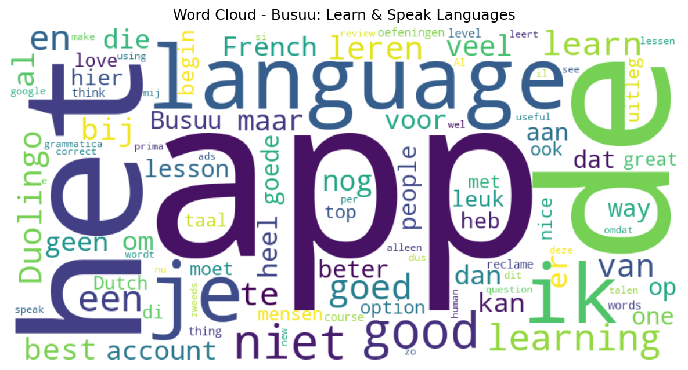

# Busuu: Learn & Speak Languages

## 📱 App Information

| **Attribute** | **Google Play** | **App Store** |
|---------------|-----------------|---------------|
| **Title** | Busuu: Learn & Speak Languages | N/A |
| **Package/ID** | com.busuu.android.enc | N/A |
| **Rating** | 4.666032 | N/A |
| **Total Ratings** | 1,040,673 | N/A |
| **Installs** | 50,000,000+ | N/A |
| **Genre** | Education | N/A |

## 📝 Description

Learn Spanish with language learning designed to build confidence from day one. Connect with our online language learning Community and get feedback on exercises and Spanish vocabulary from fluent speakers. Easily see what needs more revision, from Spanish verbs to pronunciation, and learn how to speak Spanish plus other languages faster!

Learn how to speak Spanish 🇪🇸, Japanese 🇯🇵, English 🇬🇧, French 🇫🇷, Italian 🇮🇹, Portuguese 🇧🇷, German 🇩🇪, Korean 🇰🇷, Polish 🇵🇱, Russian 🇷🇺, Turkish 🇹🇷, Arabic, Chinese 🇨🇳 & Dutch 🇳🇱. 

★ Google Play – Editor’s Choice ★ 

<b>LANGUAGE LEARNING, POWERED BY PEOPLE</b>

<b>Learn Spanish</b>

Learn how to speak Spanish with confidence from your first lesson.
Whether at beginner or intermediate level, learn to hold a real-life conversation in Spanish with support from our language learning Community.
Improve your Spanish verbs and learn Spanish grammar with language learning opportunities to practice writing, reading, listening, and speaking.


<b>Learn Japanese</b>

Enjoy interactive Japanese lessons that help you progress from beginner to intermediate. 
Learn from fluent speakers and get useful tips from our international language learning Community. 
Learn to read and write in Japanese with unique hiragana, katakana, and kanji lessons. 
Our complete Japanese course covers all the reading, writing, listening, and speaking skills you need for language learning. 

<b>Choose from 14 languages</b> 

From beginner to intermediate lessons, Busuu offers free language learning courses designed by experts in 14 different languages.
Learn how to speak Spanish, Japanese, French, Arabic, Chinese, Dutch, English, German, Italian, Korean, Polish, Portuguese, Russian, and Turkish.

<b>JOIN OUR GLOBAL COMMUNITY OF OVER 120 MILLION REGISTERED USERS</b>

★ Features ★ 

<b>Learn from fluent speakers/b>

Learn how to speak Spanish and other languages like a local by discovering how the language you’re learning is used in real-life scenarios.
Get feedback and exchange tips with our international language learning community to help you learn Spanish quickly. 
Learn Spanish and get prepared for real-life conversations from your first lesson.

<b>Up-to-date course content</b>

Our courses are regularly updated and combine video bites featuring real people with audio learning to help learn Spanish, Japanese, English, and other languages more easily.
Discover our latest range of dedicated specialty courses, including:
Spanish - Advanced Spanish Exam Preparation
Japanese - Manga 
English - English for Business & English Exam Success

<b>Confident in real-life conversations</b>

Join our international language learning Community to learn Spanish and prepare for real-world conversations.
See and hear real fluent speakers to boost your conversational skills.
Receive reminders tailored to help you learn Spanish and reach your language learning goals faster.
Learn how to speak Spanish through a variety of interactive lessons, specialty courses, and bespoke content that prepares you for real-world conversations.
Learn Spanish verbs, vocabulary, and grammar with dedicated language learning spaces for confident communication.
Whether it's business, travel, school, or personal enjoyment, the end goal is learning how to speak Spanish and hold real-world conversations.

Busuu, a Chegg Service. 

<b>DOWNLOAD NOW FOR FREE LANGUAGE LEARNING</b>

Subscription is required for full access. Read our terms and conditions: https://www.busuu.com/en/terms 

Privacy policy: https://www.busuu.com/en/privacy 

Need some help?
We’re here to support you in English, French, Spanish, Italian, Portuguese, German, Polish, Russian, Turkish, Arabic, Chinese, Japanese, Korean, Vietnamese & Indonesian.</b>

## 📊 Reviews Analytics

**Total Reviews:** 100 (100 analyzed)
**Rating Distribution:** 73 positive (4-5★), 13 neutral (3★), 14 negative (1-2★)
**Average Sentiment:** 0.21 (-1=very negative, +1=very positive)
**Primary Language:** en
**Key Insights:** Average rating: 4.1/5.0 | Overall sentiment: positive (score: 0.21) | Reviews in 11 languages, primarily en (39 reviews) | Reviews from 1 platform(s): google | Key themes: app, good, goed


### 🔑 Key Themes & Phrases

- **app** (relevance: 0.107)
- **good** (relevance: 0.082)
- **goed** (relevance: 0.058)
- **language** (relevance: 0.051)
- **learn** (relevance: 0.050)
- **learning** (relevance: 0.048)
- **het** (relevance: 0.045)
- **just** (relevance: 0.040)

### ⭐ Rating Breakdown

- **5 ★★★★★**: 56 reviews (56.0%)
- **4 ★★★★☆**: 17 reviews (17.0%)
- **3 ★★★☆☆**: 13 reviews (13.0%)
- **2 ★★☆☆☆**: 5 reviews (5.0%)
- **1 ★☆☆☆☆**: 9 reviews (9.0%)

### 🌍 Languages in Reviews

- **en**: 39 reviews
- **nl**: 31 reviews
- **unknown**: 14 reviews
- **af**: 5 reviews
- **so**: 3 reviews

### 📱 Platform Distribution

- **google**: 100 reviews

## 📈 Visualizations

### Analytics Charts


### Word Cloud


## 💬 Sample Reviews

**Review 1** (★★★ - google - 2025-11-06T18:19:00)
> bazı kelime ve çeviri hataları var.onlari düzeltmeleri gerekli. geçmiş zaman örnek fiiller az gibi geldi bana.

**Review 2** (★ - google - 2025-05-29T14:31:10)
> na het installeren komt de app niet door het inloggen, beide opties google en Facebook geprobeerd, maar geen gebruikt kunnen maken van taalcursus

**Review 3** (★★★★★ - google - 2024-10-30T08:28:24)
> After almost a year of using this app and others (free and not), this is the one with the best content. The software side could be improved but at the end of the day still good quality content.

**Review 4** (★★★★ - google - 2024-03-09T09:25:22)
> zeer tevreden en goed opgebouwd

**Review 5** (★★★★★ - google - 2023-10-14T11:12:55)
> Es un App super páctica, fácil de usar.

## 🔧 Raw JSON Data

<details>
<summary>Click to expand raw app data</summary>

```json
{
  "name": "Busuu: Learn & Speak Languages",
  "google_package": "com.busuu.android.enc",
  "google": {
    "title": "Busuu: Learn & Speak Languages",
    "description": "Learn Spanish with language learning designed to build confidence from day one. Connect with our online language learning Community and get feedback on exercises and Spanish vocabulary from fluent speakers. Easily see what needs more revision, from Spanish verbs to pronunciation, and learn how to speak Spanish plus other languages faster!\r\n\r\nLearn how to speak Spanish 🇪🇸, Japanese 🇯🇵, English 🇬🇧, French 🇫🇷, Italian 🇮🇹, Portuguese 🇧🇷, German 🇩🇪, Korean 🇰🇷, Polish 🇵🇱, Russian 🇷🇺, Turkish 🇹🇷, Arabic, Chinese 🇨🇳 & Dutch 🇳🇱. \r\n\r\n★ Google Play – Editor’s Choice ★ \r\n\r\n<b>LANGUAGE LEARNING, POWERED BY PEOPLE</b>\r\n\r\n<b>Learn Spanish</b>\r\n\r\nLearn how to speak Spanish with confidence from your first lesson.\r\nWhether at beginner or intermediate level, learn to hold a real-life conversation in Spanish with support from our language learning Community.\r\nImprove your Spanish verbs and learn Spanish grammar with language learning opportunities to practice writing, reading, listening, and speaking.\r\n\r\n\r\n<b>Learn Japanese</b>\r\n\r\nEnjoy interactive Japanese lessons that help you progress from beginner to intermediate. \r\nLearn from fluent speakers and get useful tips from our international language learning Community. \r\nLearn to read and write in Japanese with unique hiragana, katakana, and kanji lessons. \r\nOur complete Japanese course covers all the reading, writing, listening, and speaking skills you need for language learning. \r\n\r\n<b>Choose from 14 languages</b> \r\n\r\nFrom beginner to intermediate lessons, Busuu offers free language learning courses designed by experts in 14 different languages.\r\nLearn how to speak Spanish, Japanese, French, Arabic, Chinese, Dutch, English, German, Italian, Korean, Polish, Portuguese, Russian, and Turkish.\r\n\r\n<b>JOIN OUR GLOBAL COMMUNITY OF OVER 120 MILLION REGISTERED USERS</b>\r\n\r\n★ Features ★ \r\n\r\n<b>Learn from fluent speakers/b>\r\n\r\nLearn how to speak Spanish and other languages like a local by discovering how the language you’re learning is used in real-life scenarios.\r\nGet feedback and exchange tips with our international language learning community to help you learn Spanish quickly. \r\nLearn Spanish and get prepared for real-life conversations from your first lesson.\r\n\r\n<b>Up-to-date course content</b>\r\n\r\nOur courses are regularly updated and combine video bites featuring real people with audio learning to help learn Spanish, Japanese, English, and other languages more easily.\r\nDiscover our latest range of dedicated specialty courses, including:\r\nSpanish - Advanced Spanish Exam Preparation\r\nJapanese - Manga \r\nEnglish - English for Business & English Exam Success\r\n\r\n<b>Confident in real-life conversations</b>\r\n\r\nJoin our international language learning Community to learn Spanish and prepare for real-world conversations.\r\nSee and hear real fluent speakers to boost your conversational skills.\r\nReceive reminders tailored to help you learn Spanish and reach your language learning goals faster.\r\nLearn how to speak Spanish through a variety of interactive lessons, specialty courses, and bespoke content that prepares you for real-world conversations.\r\nLearn Spanish verbs, vocabulary, and grammar with dedicated language learning spaces for confident communication.\r\nWhether it's business, travel, school, or personal enjoyment, the end goal is learning how to speak Spanish and hold real-world conversations.\r\n\r\nBusuu, a Chegg Service. \r\n\r\n<b>DOWNLOAD NOW FOR FREE LANGUAGE LEARNING</b>\r\n\r\nSubscription is required for full access. Read our terms and conditions: https://www.busuu.com/en/terms \r\n\r\nPrivacy policy: https://www.busuu.com/en/privacy \r\n\r\nNeed some help?\r\nWe’re here to support you in English, French, Spanish, Italian, Portuguese, German, Polish, Russian, Turkish, Arabic, Chinese, Japanese, Korean, Vietnamese & Indonesian.</b>",
    "rating": 4.666032,
    "rating_text": null,
    "ratings_total": 1040673,
    "ratings_histogram": [
      21353,
      13648,
      43826,
      133466,
      828348
    ],
    "installs": "50,000,000+",
    "genre": "Education"
  },
  "apple": null,
  "reviews": [
    {
      "platform": "google",
      "rating": 3,
      "review": "bazı kelime ve çeviri hataları var.onlari düzeltmeleri gerekli. geçmiş zaman örnek fiiller az gibi geldi bana.",
      "date": "2025-11-06T18:19:00"
    },
    {
      "platform": "google",
      "rating": 3,
      "review": "To bad the French used in the app is Canadian french and not regular French as they speak in France. As my French friends pointed out this Canadian French is not useful in France. Therefore this app is not suited to learn proper French.",
      "date": "2025-10-31T09:56:30"
    },
    {
      "platform": "google",
      "rating": 4,
      "review": "ik zit nog te leren Ma het is wel leuk Ma je kan het snel vergeten wat je leert ik weet nog niet veel over de app",
      "date": "2025-10-27T22:03:20"
    },
    {
      "platform": "google",
      "rating": 2,
      "review": "App works fine, but I'm disappointed. Paid for premium just to find out that it only offers levels A1 - B2 Russian.",
      "date": "2025-10-21T18:09:29"
    },
    {
      "platform": "google",
      "rating": 1,
      "review": "ik krijg de interfacetaal niet in het nederlands. hier heb ik niks aan",
      "date": "2025-10-21T15:04:56"
    },
    {
      "platform": "google",
      "rating": 2,
      "review": "De moeilijkheidsgraad van de lessen klopt niet. Er worden dingen van je gevraagd die je op dat niveau nog niet kan. Als het je dan niet lukt, kan je niet verder, omdat de cursus blijft vragen die onmogelijke opgave eerst zonder fouten te doen.",
      "date": "2025-10-16T18:09:20"
    },
    {
      "platform": "google",
      "rating": 4,
      "review": "begin is goed",
      "date": "2025-10-01T08:14:46"
    },
    {
      "platform": "google",
      "rating": 5,
      "review": "de best appe",
      "date": "2025-09-22T01:29:35"
    },
    {
      "platform": "google",
      "rating": 1,
      "review": "i can't login with my google account anymore?",
      "date": "2025-09-19T22:04:43"
    },
    {
      "platform": "google",
      "rating": 3,
      "review": "I'm missing the option to use my native Dutch language. Also, it would have been nice if there was Dutch as an option to learn for foreign people. The grammatica learning in this app is the best I have seen so far.",
      "date": "2025-09-18T20:05:52"
    },
    {
      "platform": "google",
      "rating": 5,
      "review": "top",
      "date": "2025-09-17T17:25:07"
    },
    {
      "platform": "google",
      "rating": 5,
      "review": "very good",
      "date": "2025-08-30T23:46:23"
    },
    {
      "platform": "google",
      "rating": 5,
      "review": "I know six languages and, in my opinion, Busuu is the best language learning app available in the Play Store. Thank you for the great value you offer!",
      "date": "2025-08-29T10:42:59"
    },
    {
      "platform": "google",
      "rating": 4,
      "review": "goei app alleen moet je betalen voor een betere versie",
      "date": "2025-08-27T19:03:31"
    },
    {
      "platform": "google",
      "rating": 5,
      "review": "brilliant app! Expensive, but honestly worth it compared to others. I'd love to be able to have a widget of this app tho! Will refresh my subscription once it ends.",
      "date": "2025-08-26T00:33:47"
    },
    {
      "platform": "google",
      "rating": 1,
      "review": "Bij het eerste lesje Spaans - Engels kwam ik al een foute vertaling tegen. Waarschijnlijk wordt Google Translate gebruikt voor de vertalingen. Er is geen optie om het probleem te melden. Hierdoor heb ik geen vertrouwen in deze spaanstalige lessen.",
      "date": "2025-08-15T19:10:11"
    },
    {
      "platform": "google",
      "rating": 5,
      "review": "It is perfect!! Not only just grammar and voc but culture too!!!!!!",
      "date": "2025-08-13T18:30:08"
    },
    {
      "platform": "google",
      "rating": 5,
      "review": "Very good app to learn languages! 👌",
      "date": "2025-08-13T14:09:12"
    },
    {
      "platform": "google",
      "rating": 1,
      "review": "Nieuw geinstalleerd. Probeer account aan te maken. Zegt dat ik die al heb. Reset link wordt niet gestuurd. Kan met geen mogelijkheid inloggen vanwege deze loop. Slecht begin.",
      "date": "2025-08-08T17:30:42"
    },
    {
      "platform": "google",
      "rating": 4,
      "review": "its good and easy to learn the basic and more",
      "date": "2025-07-28T11:36:40"
    },
    {
      "platform": "google",
      "rating": 5,
      "review": "yay",
      "date": "2025-07-25T21:58:43"
    },
    {
      "platform": "google",
      "rating": 4,
      "review": "Esperienza positiva! Si impara il lessico, alcuni modi di dire, gli esercizi vertono su situazioni reali. Inoltre la grande \"forza\" di questa app sono gli esercizi di scrittura che vengono corretti direttamente dai madrelingua. Fantastico. Alla mia valutazione manca una stella per un paio di inezie. La grammatica è pochina, e i corsi si fermano al b2, mi sarebbe piaciuto almeno provare il c1. per il resto è l'app migliore per imparare da zero o allenarsi con le lingue che già si conoscono.",
      "date": "2025-07-07T13:02:28"
    },
    {
      "platform": "google",
      "rating": 5,
      "review": "Top, leuk om te leren bij busuu",
      "date": "2025-07-01T11:42:26"
    },
    {
      "platform": "google",
      "rating": 5,
      "review": "top",
      "date": "2025-06-18T20:52:27"
    },
    {
      "platform": "google",
      "rating": 5,
      "review": "heel fijn",
      "date": "2025-06-03T16:07:07"
    },
    {
      "platform": "google",
      "rating": 1,
      "review": "na het installeren komt de app niet door het inloggen, beide opties google en Facebook geprobeerd, maar geen gebruikt kunnen maken van taalcursus",
      "date": "2025-05-29T14:31:10"
    },
    {
      "platform": "google",
      "rating": 3,
      "review": "The language learning itself is really good but I wish I could add my real-life friends to see what they're up to, and not random people on the app that I don't know or need anything from. Also, I wish the app actually sent lesson reminders - I've checked all my notification settings but it looks like such notifications just don't exist, making me forget to do my lesson a lot of the time.",
      "date": "2025-05-19T15:04:22"
    },
    {
      "platform": "google",
      "rating": 5,
      "review": "je leert veel meer dan bij duolingo en de kwaliteit is ook veel beter, als je echt op zoek bent naar het leren van een taal om te gebruiken in het dagelijks leven moet je dit proberen!",
      "date": "2025-03-25T19:10:59"
    },
    {
      "platform": "google",
      "rating": 4,
      "review": "Op dit moment ben ik erg tevreden over de App; in tegenstelling tot D-lingo kan ik hier wel gewoon een behoorlijk taalniveau (Frans) nastreven. Natuurlijk moet ik het zelf doen. Vraag; bestaat er ook zoiets als een \"familie-account\". Tegen een gunstig bedrag met vijf mensen een taal naar keuze leren? Zou leuk zijn.",
      "date": "2025-03-25T13:04:29"
    },
    {
      "platform": "google",
      "rating": 4,
      "review": "goede uitleg grammatica maar te weinig oefeningen",
      "date": "2025-03-25T06:45:54"
    },
    {
      "platform": "google",
      "rating": 2,
      "review": "i can't log into my account, it takes forever to load. making a new account w a different email address also takes a full calendar year. i'd love to practice languages with this app but for some reason it just wont let me log in.",
      "date": "2025-03-18T20:53:53"
    },
    {
      "platform": "google",
      "rating": 5,
      "review": "heel mooie app",
      "date": "2025-03-12T10:34:12"
    },
    {
      "platform": "google",
      "rating": 3,
      "review": "in spanish, the speak to quick when learning in an early stage",
      "date": "2025-03-11T17:34:32"
    },
    {
      "platform": "google",
      "rating": 5,
      "review": "Formidabel !",
      "date": "2025-02-22T08:17:26"
    },
    {
      "platform": "google",
      "rating": 5,
      "review": "goede app",
      "date": "2025-02-20T23:57:08"
    },
    {
      "platform": "google",
      "rating": 3,
      "review": "Spreekoefeningen werken niet tijdens de lessen, moet ze telkens overslaan omdat het niet goed gaat. Gelukkig zijn er nog mensen die de optionele oefeningen controleren ...",
      "date": "2025-02-07T19:38:16"
    },
    {
      "platform": "google",
      "rating": 5,
      "review": "gebruiksvriendelijk en goede praktische oefeningen",
      "date": "2025-01-24T13:33:05"
    },
    {
      "platform": "google",
      "rating": 5,
      "review": "geweldige app om talen mee te leren, velen malen beter dan duolingo. Hier kan je namelijk feedback vragen/krijgen van mensen waar de taal die je studeert hun moedertaal van is.",
      "date": "2025-01-11T11:49:09"
    },
    {
      "platform": "google",
      "rating": 4,
      "review": "satisfied with the system, just a bummer there are lots of ads",
      "date": "2025-01-01T23:33:11"
    },
    {
      "platform": "google",
      "rating": 3,
      "review": "Nog steeds een prima app om talen te leren, maar hij loopt bij mij standaard vast bij de externe reclame aan het begin, bv. voor een game. Bij reclame voor Busuu zelf, gebeurt dit niet.",
      "date": "2024-12-27T18:23:35"
    },
    {
      "platform": "google",
      "rating": 5,
      "review": "good good good",
      "date": "2024-12-25T18:34:57"
    },
    {
      "platform": "google",
      "rating": 3,
      "review": "the language learning aspect here is pretty good. but the way the app is constantly begging you to correct other people's exercises is extremely annoying and there is no way to turn that off. I don't want to. I shouldn't. I suck at that stuff. let me opt out.",
      "date": "2024-12-20T00:06:22"
    },
    {
      "platform": "google",
      "rating": 5,
      "review": "heel mooi en eenvoudig aap.",
      "date": "2024-12-19T09:32:16"
    },
    {
      "platform": "google",
      "rating": 1,
      "review": "Er staan maar een paar talen in. Zweeds is er niet bij... dus voor mij geen goede app Ik wil zweeds leren... dus als je me beantwoordt in het zweeds begrijp ik er niet veel van... 😂😂😂 behalve tack dan!",
      "date": "2024-12-10T17:00:09"
    },
    {
      "platform": "google",
      "rating": 5,
      "review": "hella good",
      "date": "2024-11-25T19:46:21"
    },
    {
      "platform": "google",
      "rating": 3,
      "review": "op jouw gemak leren",
      "date": "2024-11-22T22:59:31"
    },
    {
      "platform": "google",
      "rating": 5,
      "review": "Busy geef mij goed vrustan",
      "date": "2024-11-14T05:49:12"
    },
    {
      "platform": "google",
      "rating": 5,
      "review": "very good one",
      "date": "2024-11-10T15:21:27"
    },
    {
      "platform": "google",
      "rating": 5,
      "review": "Ik geniet nu van het leren",
      "date": "2024-11-04T09:38:32"
    },
    {
      "platform": "google",
      "rating": 5,
      "review": "Voor het begin 5 sterren! Veel beter dan Duolingo! Betere uitleg en niet die irritante poppetjes en stemmetjes zoals bij Duolingo. Ook hier veel reclame, maar de indruk dat je hiervan meer leert; dus neem ik de reclame op de koop toe. Benieuwd of ik zo positief blijf.",
      "date": "2024-11-01T13:17:38"
    },
    {
      "platform": "google",
      "rating": 5,
      "review": "After almost a year of using this app and others (free and not), this is the one with the best content. The software side could be improved but at the end of the day still good quality content.",
      "date": "2024-10-30T08:28:24"
    },
    {
      "platform": "google",
      "rating": 4,
      "review": "I've just paid for this app. I think it's amazing, the devices to add, the price is high, but within reasonable bounds (i got it 70% off). One thing i hate is the AI. Suddenly every app got AI and i think it doesn't help very well with this one. Regardless, great app overall.",
      "date": "2024-10-25T21:45:54"
    },
    {
      "platform": "google",
      "rating": 3,
      "review": "Nice app but too many ads. And it is even stuck on loading sometimes so you have lood ads TWICE!",
      "date": "2024-10-21T11:52:11"
    },
    {
      "platform": "google",
      "rating": 1,
      "review": "Exam question \"write Arabic\" and then prevent the user from answering that question???? In a language app that charges you for it and does not respond to submitting this big?? Same disease as Duolingo: worthless!!!!",
      "date": "2024-09-16T07:10:53"
    },
    {
      "platform": "google",
      "rating": 5,
      "review": "Love it",
      "date": "2024-08-28T22:44:37"
    },
    {
      "platform": "google",
      "rating": 3,
      "review": "Using this to learn Turkish. It feels like the excersises are made by AI. It would be good to have a human go over the excersises to correct them. Especially since language is a human thing, not a computer thing. Reviewing words is the best way to actually memorize the vocabulary. But it keeps giving you the same words and never gives you new words you learned to review. This could be improved so much. Okay app, but feels very detached from human usge. Please hire some actual people!",
      "date": "2024-07-24T16:24:50"
    },
    {
      "platform": "google",
      "rating": 5,
      "review": "it a good but very expensive",
      "date": "2024-07-21T18:57:16"
    },
    {
      "platform": "google",
      "rating": 3,
      "review": "I wanted to learn arab but i didnt get the rights arabic",
      "date": "2024-07-20T19:55:45"
    },
    {
      "platform": "google",
      "rating": 5,
      "review": "busuuuuiiiiiiii",
      "date": "2024-07-16T19:11:23"
    },
    {
      "platform": "google",
      "rating": 5,
      "review": "Het is goed dat er telkens veel herhaald wordt. Zo blijven de uitdrukkingen en woorden beter hangen.",
      "date": "2024-07-12T10:51:08"
    },
    {
      "platform": "google",
      "rating": 4,
      "review": "Een uitstekend en leerzame app alleen vind wel jammer dat de oefeningen worden niet nagekeken!",
      "date": "2024-07-06T08:49:29"
    },
    {
      "platform": "google",
      "rating": 1,
      "review": "I have to make an account just to see if this app might be a good choice for me? Uhm, nope!",
      "date": "2024-06-08T06:48:37"
    },
    {
      "platform": "google",
      "rating": 5,
      "review": "Goed om mee te beginnen...",
      "date": "2024-06-04T18:45:22"
    },
    {
      "platform": "google",
      "rating": 5,
      "review": "lesson's are very good! 'fun' to learn! advertenties are dramatic. and if you try the 7 days try, he won't work, says: fout aan onze kant. probeer het later opnieuw",
      "date": "2024-05-21T12:32:40"
    },
    {
      "platform": "google",
      "rating": 5,
      "review": "goed",
      "date": "2024-05-19T21:13:09"
    },
    {
      "platform": "google",
      "rating": 2,
      "review": "it loads pretty slowly to go from one excercise to the other. also kinda stupid that if you do the test between lesson and you pass the test. you still need to do the lesson so that the percentage of your level goes up.",
      "date": "2024-05-05T22:51:47"
    },
    {
      "platform": "google",
      "rating": 5,
      "review": "Heel goede app, legt ook alles goed uit. Duolingo daarentegen verbetert je enkel en alleen, maar geeft geen uitleg erbij. Heel blij met de app!",
      "date": "2024-04-24T17:57:57"
    },
    {
      "platform": "google",
      "rating": 2,
      "review": "The number of courses is vast. However, they lack many important aspects like translation of sentences in higher levels of language (dutch and italian in my case) after cholsing an answer i get a comment in that language which is stupid as I'm not proficient enough to understand it.some texts which are prepared for the exercises should be translated so that when you are not sure what's this on about, you can check it. Interface is slow and changing course to another language is thus problematic",
      "date": "2024-04-22T23:28:02"
    },
    {
      "platform": "google",
      "rating": 5,
      "review": "heel goed",
      "date": "2024-04-16T15:24:57"
    },
    {
      "platform": "google",
      "rating": 5,
      "review": "ik vind het een geweldige app wasr ik goed van heb geleerd!!",
      "date": "2024-04-15T15:40:10"
    },
    {
      "platform": "google",
      "rating": 5,
      "review": "my personal resource to get to start a language (I'm sorry luodingo)",
      "date": "2024-04-09T01:58:34"
    },
    {
      "platform": "google",
      "rating": 1,
      "review": "First thing you see and can't skip is a 'free trial'. Rubbish.",
      "date": "2024-04-01T09:48:21"
    },
    {
      "platform": "google",
      "rating": 5,
      "review": "fijne app",
      "date": "2024-03-24T09:46:22"
    },
    {
      "platform": "google",
      "rating": 4,
      "review": "Muito bom, eu sinto apenas falta de mais exercícios de treinamento, e mais uma coisa, eu fiz 100% do curso de polonês porém a.mjnha pontuação ainda é 90%",
      "date": "2024-03-22T09:00:31"
    },
    {
      "platform": "google",
      "rating": 4,
      "review": "It makes learning fun and it's improving my language skills.",
      "date": "2024-03-16T22:05:34"
    },
    {
      "platform": "google",
      "rating": 4,
      "review": "zeer tevreden en goed opgebouwd",
      "date": "2024-03-09T09:25:22"
    },
    {
      "platform": "google",
      "rating": 4,
      "review": "Overall, I have a positive experience using Busuu. However, the mobile app and the web version don't sync with each other.",
      "date": "2024-02-22T11:40:45"
    },
    {
      "platform": "google",
      "rating": 5,
      "review": "Great for (higher) intermediate level learners. It's full of features and helpful, friendly people. It's certainly better than the green owl.",
      "date": "2024-02-20T02:15:56"
    },
    {
      "platform": "google",
      "rating": 5,
      "review": "geo",
      "date": "2024-02-05T20:56:05"
    },
    {
      "platform": "google",
      "rating": 5,
      "review": "leuk ....met uitspraak ...top ...",
      "date": "2024-02-04T14:22:53"
    },
    {
      "platform": "google",
      "rating": 5,
      "review": "very entertaining to learn Japanese with clear voices and beautiful pictures!",
      "date": "2024-01-17T14:00:42"
    },
    {
      "platform": "google",
      "rating": 5,
      "review": "beter dan Duolingo, omdat je uitleg krijgt waar de les over gaat en je ziet echte mensen spreken in korte videos",
      "date": "2024-01-15T23:34:15"
    },
    {
      "platform": "google",
      "rating": 5,
      "review": "Na prawdę super nikt mi za to nie zapłacił!!!",
      "date": "2024-01-04T21:18:43"
    },
    {
      "platform": "google",
      "rating": 5,
      "review": "Well balanced and fun learning.",
      "date": "2024-01-04T06:18:31"
    },
    {
      "platform": "google",
      "rating": 5,
      "review": "perfect",
      "date": "2023-12-24T22:16:13"
    },
    {
      "platform": "google",
      "rating": 5,
      "review": "Fabtastitico",
      "date": "2023-12-22T21:21:41"
    },
    {
      "platform": "google",
      "rating": 3,
      "review": "In the dutch course, asking what the plural of the name 'school' is, and the options include such as 'schools'. If this were a qualifying exam, I could say Ok. but it is not. I think that this multiple choice question method, which makes someone who is just starting to learn a language think about the possibility of being correct by showing wrong options, is not useful. This incident reminded me of the movie 12 Monkeys, Cole was sent to the past to prevent the disaster, but he himself caused it",
      "date": "2023-12-22T19:11:41"
    },
    {
      "platform": "google",
      "rating": 5,
      "review": "The best language learning application I found so far. Tips mentioning differences in dialects of the chosen language are a huge advantage.",
      "date": "2023-12-11T04:47:52"
    },
    {
      "platform": "google",
      "rating": 5,
      "review": "best goed gemaakt",
      "date": "2023-12-10T10:33:34"
    },
    {
      "platform": "google",
      "rating": 4,
      "review": "Good way to learn a new language. Useful words and sentences. A shame they don't have a Swedish course",
      "date": "2023-12-03T19:50:56"
    },
    {
      "platform": "google",
      "rating": 5,
      "review": "nice",
      "date": "2023-11-27T19:39:39"
    },
    {
      "platform": "google",
      "rating": 4,
      "review": "Nog aan het ontdekken maar tot nu toe dik oke",
      "date": "2023-11-21T09:23:06"
    },
    {
      "platform": "google",
      "rating": 5,
      "review": "Busuu is the best language learning app out there (in my opinion).",
      "date": "2023-11-18T18:52:13"
    },
    {
      "platform": "google",
      "rating": 5,
      "review": "prima!",
      "date": "2023-11-11T21:49:07"
    },
    {
      "platform": "google",
      "rating": 5,
      "review": "very nice learning app way better than duolingo",
      "date": "2023-11-11T09:17:44"
    },
    {
      "platform": "google",
      "rating": 5,
      "review": "het is zo fijn deze app",
      "date": "2023-11-04T17:30:44"
    },
    {
      "platform": "google",
      "rating": 5,
      "review": "Great app for learning languages. I especially love the peer review system. It's possible to write or speak phrases and have native speakers review it. That really helps with pronunciation.",
      "date": "2023-10-22T15:45:14"
    },
    {
      "platform": "google",
      "rating": 5,
      "review": "Much better than Duolingo! This is harder but I'm learning more",
      "date": "2023-10-17T00:51:10"
    },
    {
      "platform": "google",
      "rating": 4,
      "review": "Prima app nu nog Nederlands toevoegen als interface taal.",
      "date": "2023-10-16T17:46:30"
    },
    {
      "platform": "google",
      "rating": 5,
      "review": "Es un App super páctica, fácil de usar.",
      "date": "2023-10-14T11:12:55"
    }
  ]
}
```

</details>

---
*Report generated on 2025-11-08 13:49:29 using advanced analytics*
