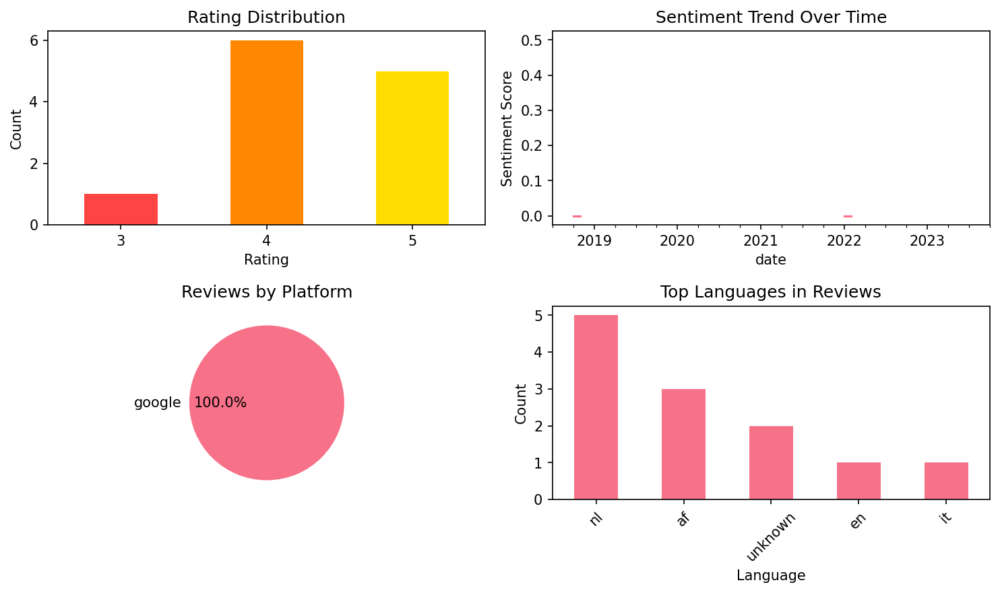

# Learn German - 5,000 Phrases

## 📱 App Information

| **Attribute** | **Google Play** | **App Store** |
|---------------|-----------------|---------------|
| **Title** | Learn German - 5,000 Phrases | N/A |
| **Package/ID** | com.funeasylearn.phrasebook.german | N/A |
| **Rating** | 4.45 | N/A |
| **Total Ratings** | 10,692 | N/A |
| **Installs** | 1,000,000+ | N/A |
| **Genre** | Education | N/A |

## 📝 Description

Play, Learn and Speak – discover common phrases for daily German conversation!
✔ 5,000 useful phrases for conversation.
✔ Learn German in your tongue (60 languages available).
✔ Best FREE app for learning fast.

<b>Speak German Fluently in Real Conversations</b>
With Learn German application, you can now explore over 5,000 German phrases for short daily conversations while having absolutely pure fun! Whether you’re a tourist having a vacation in an German speaking country or someone who just wants to speak a foreign language, this application will help you learn German phrases in a fast, easy and enjoyable way.

<b>Why Our FREE App is Different</b>
✔ No internet connection required – play where you want and when you want (offline).
✔ 5,000 common phrases – audio pronunciations and phonetic transcriptions to show you how native speaker from Germany actually pronounce them. 
✔ 11 fun games – a innovative approach to practice your listening, writing and speaking skills.
✔ 4 levels for learning: beginner, intermediate, advanced and expert.
✔ 20 topics divided into 145 subtopics – so you’ll know what and when to say each phrase. 

Topics for German conversation: Greetings, Conversations with friends, Basic sentences, Travel, Transportation, Hotel, Restaurant, Food, Shopping, Work, Business etc.

<b>More Features to Improve Your German Speaking Vocabulary</b>
✔ Search and bookmark your most common expressions from the phrasebook.
✔ Earn points as your German skills progress.
✔ “Random Categories” feature to randomly select the topic, subtopic and game.
✔ 60 languages –so you could understand and speak each phrase easily regardless of which country you’re from. 

About FunEasyLearn:
Fun Easy Learn has developed many applications to help people around the world learn foreign languages for free. Fun Easy Learn applications improve your German skills: speaking, listening and grammar. The dictionary of the apps has human voice pronunciation for each common phrase to improve your speaking skill.

Speak German easily and fluently for travel, business or fun!

## 📊 Reviews Analytics

**Total Reviews:** 12 (12 analyzed)
**Rating Distribution:** 11 positive (4-5★), 1 neutral (3★), 0 negative (1-2★)
**Average Sentiment:** 0.04 (-1=very negative, +1=very positive)
**Primary Language:** nl
**Key Insights:** Average rating: 4.3/5.0 | Overall sentiment: neutral (score: 0.04) | Reviews in 5 languages, primarily nl (5 reviews) | Reviews from 1 platform(s): google | Key themes: app, leuk, alleen


### 🔑 Key Themes & Phrases

- **app** (relevance: 0.306)
- **leuk** (relevance: 0.142)
- **alleen** (relevance: 0.142)
- **te** (relevance: 0.128)
- **om** (relevance: 0.128)
- **veel** (relevance: 0.120)
- **te leren** (relevance: 0.078)
- **leren** (relevance: 0.078)

### ⭐ Rating Breakdown

- **5 ★★★★★**: 5 reviews (41.7%)
- **4 ★★★★☆**: 6 reviews (50.0%)
- **3 ★★★☆☆**: 1 reviews (8.3%)

### 🌍 Languages in Reviews

- **nl**: 5 reviews
- **af**: 3 reviews
- **unknown**: 2 reviews
- **en**: 1 reviews
- **it**: 1 reviews

### 📱 Platform Distribution

- **google**: 12 reviews

## 📈 Visualizations

### Analytics Charts


### Word Cloud


## 💬 Sample Reviews

**Review 1** (★★★★★ - google - 2023-10-19T19:22:40)
> OK is leuk

**Review 2** (★★★★ - google - 2022-01-10T10:21:46)
> Fijne zinnen om echt te kunnen gebruiken als je op vakantie gaat naar Duitsland.

**Review 3** (★★★ - google - 2020-09-07T20:39:33)
> Ik vind de duolingo app veel beter om te leren.

**Review 4** (★★★★★ - google - 2018-11-07T22:51:12)
> Helpvolle app

**Review 5** (★★★★★ - google - 2018-07-26T15:05:47)
> Handig veel geleerd

## 🔧 Raw JSON Data

<details>
<summary>Click to expand raw app data</summary>

```json
{
  "name": "Learn German - 5,000 Phrases",
  "google_package": "com.funeasylearn.phrasebook.german",
  "google": {
    "title": "Learn German - 5,000 Phrases",
    "description": "Play, Learn and Speak – discover common phrases for daily German conversation!\r\n✔ 5,000 useful phrases for conversation.\r\n✔ Learn German in your tongue (60 languages available).\r\n✔ Best FREE app for learning fast.\r\n\r\n<b>Speak German Fluently in Real Conversations</b>\r\nWith Learn German application, you can now explore over 5,000 German phrases for short daily conversations while having absolutely pure fun! Whether you’re a tourist having a vacation in an German speaking country or someone who just wants to speak a foreign language, this application will help you learn German phrases in a fast, easy and enjoyable way.\r\n\r\n<b>Why Our FREE App is Different</b>\r\n✔ No internet connection required – play where you want and when you want (offline).\r\n✔ 5,000 common phrases – audio pronunciations and phonetic transcriptions to show you how native speaker from Germany actually pronounce them. \r\n✔ 11 fun games – a innovative approach to practice your listening, writing and speaking skills.\r\n✔ 4 levels for learning: beginner, intermediate, advanced and expert.\r\n✔ 20 topics divided into 145 subtopics – so you’ll know what and when to say each phrase. \r\n\r\nTopics for German conversation: Greetings, Conversations with friends, Basic sentences, Travel, Transportation, Hotel, Restaurant, Food, Shopping, Work, Business etc.\r\n\r\n<b>More Features to Improve Your German Speaking Vocabulary</b>\r\n✔ Search and bookmark your most common expressions from the phrasebook.\r\n✔ Earn points as your German skills progress.\r\n✔ “Random Categories” feature to randomly select the topic, subtopic and game.\r\n✔ 60 languages –so you could understand and speak each phrase easily regardless of which country you’re from. \r\n\r\nAbout FunEasyLearn:\r\nFun Easy Learn has developed many applications to help people around the world learn foreign languages for free. Fun Easy Learn applications improve your German skills: speaking, listening and grammar. The dictionary of the apps has human voice pronunciation for each common phrase to improve your speaking skill.\r\n\r\nSpeak German easily and fluently for travel, business or fun!",
    "rating": 4.45,
    "rating_text": null,
    "ratings_total": 10692,
    "ratings_histogram": [
      668,
      190,
      381,
      1336,
      7828
    ],
    "installs": "1,000,000+",
    "genre": "Education"
  },
  "apple": null,
  "reviews": [
    {
      "platform": "google",
      "rating": 5,
      "review": "OK is leuk",
      "date": "2023-10-19T19:22:40"
    },
    {
      "platform": "google",
      "rating": 5,
      "review": "Gute App",
      "date": "2023-06-26T01:37:56"
    },
    {
      "platform": "google",
      "rating": 4,
      "review": "Goeie app om Duits te leren, ben er blij mee over de resultaten",
      "date": "2022-02-27T08:29:50"
    },
    {
      "platform": "google",
      "rating": 4,
      "review": "Fijne zinnen om echt te kunnen gebruiken als je op vakantie gaat naar Duitsland.",
      "date": "2022-01-10T10:21:46"
    },
    {
      "platform": "google",
      "rating": 5,
      "review": "Doenst say i bought it after i payed it.",
      "date": "2021-01-29T10:29:26"
    },
    {
      "platform": "google",
      "rating": 4,
      "review": "Oke",
      "date": "2020-09-08T12:08:56"
    },
    {
      "platform": "google",
      "rating": 3,
      "review": "Ik vind de duolingo app veel beter om te leren.",
      "date": "2020-09-07T20:39:33"
    },
    {
      "platform": "google",
      "rating": 4,
      "review": "leuk doe alleen de gratis woorden",
      "date": "2019-04-22T07:30:23"
    },
    {
      "platform": "google",
      "rating": 4,
      "review": "Jammer dat de instructies alleen in het engels zijn",
      "date": "2018-11-18T17:31:59"
    },
    {
      "platform": "google",
      "rating": 5,
      "review": "Helpvolle app",
      "date": "2018-11-07T22:51:12"
    },
    {
      "platform": "google",
      "rating": 4,
      "review": "Boeiende app in volledige versie .",
      "date": "2018-10-04T12:41:17"
    },
    {
      "platform": "google",
      "rating": 5,
      "review": "Handig veel geleerd",
      "date": "2018-07-26T15:05:47"
    }
  ]
}
```

</details>

---
*Report generated on 2025-11-08 13:50:03 using advanced analytics*
