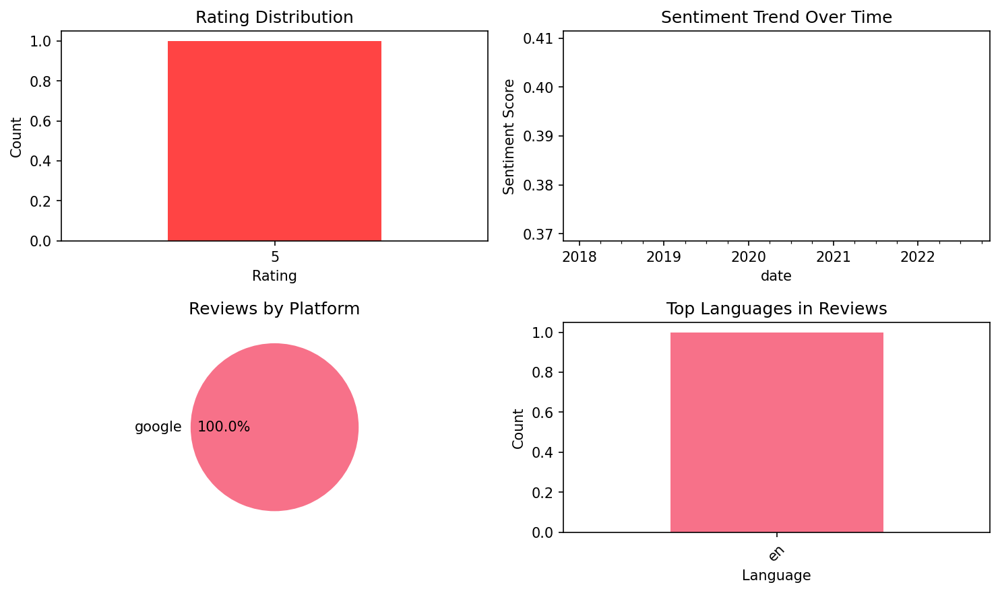

# IELTS Exam Preparation: Vocabu

## 📱 App Information

| **Attribute** | **Google Play** | **App Store** |
|---------------|-----------------|---------------|
| **Title** | IELTS Exam Preparation: Vocabu | N/A |
| **Package/ID** | com.magoosh.ielts.flashcards.vocabulary | N/A |
| **Rating** | 4.67 | N/A |
| **Total Ratings** | 5,010 | N/A |
| **Installs** | 500,000+ | N/A |
| **Genre** | Education | N/A |

## 📝 Description

Prep for the IELTS exam with Magoosh! Learn the 600 most important IELTS English vocabulary words with our easy to use flashcards and master your vocab with full definitions, example sentences and more! Best of all, you can study using our flashcards for free!
----------------------------------------------------------------
<b>MASTER YOUR IELTS VOCAB - STUDY WITH MAGOOSH</b>
----------------------------------------------------------------
- Practice & learn 600 English vocab words picked by an expert IELTS exam tutor
- Complete definitions & example sentences for each word
- Decks of flashcards for multiple difficulty levels; easy, intermediate and advanced
- Track your progress, identify your strengths and areas for improvement
- Smart algorithm optimizes the flashcards for accelerated learning & optimized study
- FREE access to all of the flashcards, just sign in to your Magoosh account! 


<b>WRTTEN BY EXPERT IELTS TUTORS</b>
Every word, definition, and example sentence in this app has been selected, written and triple checked by our team of expert tutors led by led by Eliot Friesen, Lucas Fink, and Chris Lele. Eliot is the IELTS Curriculum Manager at Magoosh and has successfully coached college-level ESL students for years. Lucas has written an eBook on TOEFL preparation and has a hugely popular YouTube series on English vocabulary. Chris is a vocabulary master and has helped students of all backgrounds improve their language skills and test scores. Now they’re here to help you! 

<b>LEARN FASTER. LEARN SMARTER. </b>
Magoosh uses spaced repetition to make your learning sessions as streamlined as possible! Academic studies and tests have shown that spaced repetition is shown to significantly increase learning efficiency and information retention.
Words and definitions you’re learning will reappear on flashcards to help you learn them faster, appearing less and less frequently as you know them better. Our IELTS prep flashcards contain the 600 most important English vocab words you should learn to ace the IELTS test, making sure you don’t waste your time learning unimportant vocabulary.  

<b>ABOUT MAGOOSH</b>
We’re an online test preparation service with a passion for teaching English through video lessons and practice questions. In addition to our apps and courses, you can check out our active blog for even more IELTS tips, study guides, strategies, and other useful learning resources. 

Visit our website: https://ielts.magoosh.com

<b>GET IN TOUCH WITH US</b>

We’re always striving to make our services as beneficial to you as possible! If you have any feedback, suggestions for new features or you just want to drop in and say hi, send us an email at help@magoosh.com.



<b>DOWNLOAD FOR FREE & START MASTERING YOUR IELTS VOCABULARY TODAY</b>

## 📊 Reviews Analytics

**Total Reviews:** 1 (1 analyzed)
**Rating Distribution:** 1 positive (4-5★), 0 neutral (3★), 0 negative (1-2★)
**Average Sentiment:** 0.39 (-1=very negative, +1=very positive)
**Primary Language:** en
**Key Insights:** Average rating: 5.0/5.0 | Overall sentiment: positive (score: 0.39) | Reviews from 1 platform(s): google

### ⭐ Rating Breakdown

- **5 ★★★★★**: 1 reviews (100.0%)

### 🌍 Languages in Reviews

- **en**: 1 reviews

### 📱 Platform Distribution

- **google**: 1 reviews

## 📈 Visualizations

### Analytics Charts


## 💬 Sample Reviews

**Review 1** (★★★★★ - google - 2020-05-10T11:58:01)
> Very nice, conveniet study for different people

## 🔧 Raw JSON Data

<details>
<summary>Click to expand raw app data</summary>

```json
{
  "name": "IELTS Exam Preparation: Vocabu",
  "google_package": "com.magoosh.ielts.flashcards.vocabulary",
  "google": {
    "title": "IELTS Exam Preparation: Vocabu",
    "description": "Prep for the IELTS exam with Magoosh! Learn the 600 most important IELTS English vocabulary words with our easy to use flashcards and master your vocab with full definitions, example sentences and more! Best of all, you can study using our flashcards for free!\r\n----------------------------------------------------------------\r\n<b>MASTER YOUR IELTS VOCAB - STUDY WITH MAGOOSH</b>\r\n----------------------------------------------------------------\r\n- Practice & learn 600 English vocab words picked by an expert IELTS exam tutor\r\n- Complete definitions & example sentences for each word\r\n- Decks of flashcards for multiple difficulty levels; easy, intermediate and advanced\r\n- Track your progress, identify your strengths and areas for improvement\r\n- Smart algorithm optimizes the flashcards for accelerated learning & optimized study\r\n- FREE access to all of the flashcards, just sign in to your Magoosh account! \r\n\r\n\r\n<b>WRTTEN BY EXPERT IELTS TUTORS</b>\r\nEvery word, definition, and example sentence in this app has been selected, written and triple checked by our team of expert tutors led by led by Eliot Friesen, Lucas Fink, and Chris Lele. Eliot is the IELTS Curriculum Manager at Magoosh and has successfully coached college-level ESL students for years. Lucas has written an eBook on TOEFL preparation and has a hugely popular YouTube series on English vocabulary. Chris is a vocabulary master and has helped students of all backgrounds improve their language skills and test scores. Now they’re here to help you! \r\n\r\n<b>LEARN FASTER. LEARN SMARTER. </b>\r\nMagoosh uses spaced repetition to make your learning sessions as streamlined as possible! Academic studies and tests have shown that spaced repetition is shown to significantly increase learning efficiency and information retention.\r\nWords and definitions you’re learning will reappear on flashcards to help you learn them faster, appearing less and less frequently as you know them better. Our IELTS prep flashcards contain the 600 most important English vocab words you should learn to ace the IELTS test, making sure you don’t waste your time learning unimportant vocabulary.  \r\n\r\n<b>ABOUT MAGOOSH</b>\r\nWe’re an online test preparation service with a passion for teaching English through video lessons and practice questions. In addition to our apps and courses, you can check out our active blog for even more IELTS tips, study guides, strategies, and other useful learning resources. \r\n\r\nVisit our website: https://ielts.magoosh.com\r\n\r\n<b>GET IN TOUCH WITH US</b>\r\n\r\nWe’re always striving to make our services as beneficial to you as possible! If you have any feedback, suggestions for new features or you just want to drop in and say hi, send us an email at help@magoosh.com.\r\n\r\n\r\n\r\n<b>DOWNLOAD FOR FREE & START MASTERING YOUR IELTS VOCABULARY TODAY</b>",
    "rating": 4.67,
    "rating_text": null,
    "ratings_total": 5010,
    "ratings_histogram": [
      135,
      27,
      81,
      677,
      4008
    ],
    "installs": "500,000+",
    "genre": "Education"
  },
  "apple": null,
  "reviews": [
    {
      "platform": "google",
      "rating": 5,
      "review": "Very nice, conveniet study for different people",
      "date": "2020-05-10T11:58:01"
    }
  ]
}
```

</details>

---
*Report generated on 2025-11-08 13:51:16 using advanced analytics*
