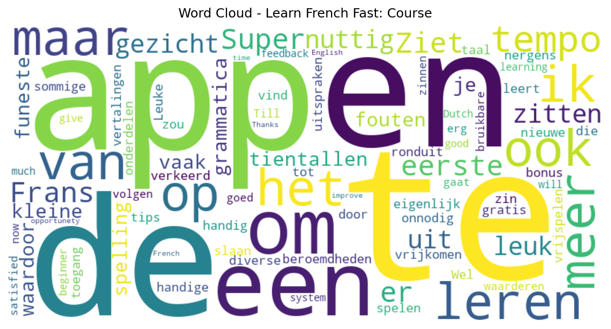

# Learn French Fast: Course

## 📱 App Information

| **Attribute** | **Google Play** | **App Store** |
|---------------|-----------------|---------------|
| **Title** | Learn French Fast: Course | N/A |
| **Package/ID** | com.mosalingua.frfree | N/A |
| **Rating** | 4.24 | N/A |
| **Total Ratings** | 11,223 | N/A |
| **Installs** | 1,000,000+ | N/A |
| **Genre** | Education | N/A |

## 📝 Description

So, you want to learn French in no time? You need MosaLingua! 
Innovative, easy and effective, our SRS-based application has helped more than 13,000,000 people all over the world learn languages in only 10 minutes per day - with actual results!

Learn more about MosaLingua Learn French app and its effective SRS system by watching the demonstration video on https://mosalingua.com.

Feel free to try our smartphone application Learn French you'll see for yourself how well it works! It's a powerful, easy and effective tool - ideal for people who want to speak French in no time, without taking long, boring language courses or a French translator.

It's useful in any situation: our method can help you learning French quickly while you travel in France or Paris, in the workplace, and in everyday life with our courses that suit your language needs.

THE BENEFITS OF MOSALINGUA: 
1) Useful, practical content to learn French words, French verbs, and French pronunciation
Don't waste your time with notions, courses, or a French dictionary that won't help you learning French. Instead, learn the 20% of the language that you'll use 80% of the time in France or Paris. Better than using a French translator!

2) An innovative method based on scientific research
Our international team is made up of expert polyglots who've used the most modern and proven learning, memorization and consolidation techniques (SRS, active recall, metacognition, etc.).

3) Coaching throughout the learning process
To succeed, you can count on our review sessions that consolidate what you've learned, our mini French lessons, and our advice for better understanding French vocabulary, French verbs, and French pronunciation.

4) Learn French words quickly and have fun at the same time!
Achieve great results and have fun doing so: your progress will boost your MOTIVATION, which is key to any learning plan.

Our French app includes all these add-ons and features:
 ★ +3000 flash cards: useful phrases and words for communicating and comprehending native French speakers. 
 ★ Audio pronunciation: our French learning app include phrases and words pronounced by native French speakers. 
 ★ 37 dialogues: our French app contains 37 dialogues that depict common occurrences that happen during everyday life, professional situations and travel. 
 ★ Tips and tricks for learning French: to progress your learning level faster and more efficiently. 
 ★ Essential grammar: pronouns, connectors, and soon to be added on the list–mini grammar lessons!


Using MosaLingua’s highly addictive and effective method to learn French, you will be able to memorize a large amount of key phrases and vocabulary in no time


If you want to learn French, download the MosaLingua Learn French app and try it free – you won't regret it!

## 📊 Reviews Analytics

**Total Reviews:** 6 (6 analyzed)
**Rating Distribution:** 5 positive (4-5★), 0 neutral (3★), 1 negative (1-2★)
**Average Sentiment:** 0.10 (-1=very negative, +1=very positive)
**Primary Language:** nl
**Key Insights:** Average rating: 4.2/5.0 | Overall sentiment: neutral (score: 0.10) | Reviews in 4 languages, primarily nl (3 reviews) | Reviews from 1 platform(s): google | Key themes: tempo, en, te


### 🔑 Key Themes & Phrases

- **tempo** (relevance: 0.253)
- **en** (relevance: 0.240)
- **te** (relevance: 0.216)
- **een** (relevance: 0.185)
- **app** (relevance: 0.167)
- **te leren** (relevance: 0.121)
- **om** (relevance: 0.121)
- **leren** (relevance: 0.121)

### ⭐ Rating Breakdown

- **5 ★★★★★**: 3 reviews (50.0%)
- **4 ★★★★☆**: 2 reviews (33.3%)
- **2 ★★☆☆☆**: 1 reviews (16.7%)

### 🌍 Languages in Reviews

- **nl**: 3 reviews
- **no**: 1 reviews
- **af**: 1 reviews
- **en**: 1 reviews

### 📱 Platform Distribution

- **google**: 6 reviews

## 📈 Visualizations

### Analytics Charts


### Word Cloud


## 💬 Sample Reviews

**Review 1** (★★★★★ - google - 2024-05-02T10:59:23)
> Super app om Frans te leren

**Review 2** (★★ - google - 2021-11-15T22:03:54)
> Ziet er op het eerste gezicht leuk en nuttig uit, maar in de app zitten tientallen kleine maar vaak funeste spelling en grammatica fouten, waardoor je het eigenlijk ook verkeerd leert. Ook slaan sommige vertalingen ronduit nergens op.

**Review 3** (★★★★ - google - 2019-05-16T08:01:00)
> Leuke handige app om een nieuwe taal te leren. De tips of uitspraken van beroemdheden die vrijkomen door te spelen, vind ik onnodig. Een bonus vrijspelen in de zin van meer gratis toegang tot diverse onderdelen zou ik meer waarderen.

**Review 4** (★★★★★ - google - 2019-04-11T16:46:43)
> erg bruikbare zinnen. en gaat in een goed te volgen tempo.

**Review 5** (★★★★ - google - 2019-03-17T10:49:39)
> Till now I am very satisfied of this learning system. You can do it in your tempo. However I am just a beginner, so I can't give much feedback. As I am Dutch this will be a good opportunety to improve my English and French at the same time. Thanks.

## 🔧 Raw JSON Data

<details>
<summary>Click to expand raw app data</summary>

```json
{
  "name": "Learn French Fast: Course",
  "google_package": "com.mosalingua.frfree",
  "google": {
    "title": "Learn French Fast: Course",
    "description": "So, you want to learn French in no time? You need MosaLingua! \r\nInnovative, easy and effective, our SRS-based application has helped more than 13,000,000 people all over the world learn languages in only 10 minutes per day - with actual results!\r\n\r\nLearn more about MosaLingua Learn French app and its effective SRS system by watching the demonstration video on https://mosalingua.com.\r\n\r\nFeel free to try our smartphone application Learn French you'll see for yourself how well it works! It's a powerful, easy and effective tool - ideal for people who want to speak French in no time, without taking long, boring language courses or a French translator.\r\n\r\nIt's useful in any situation: our method can help you learning French quickly while you travel in France or Paris, in the workplace, and in everyday life with our courses that suit your language needs.\r\n\r\nTHE BENEFITS OF MOSALINGUA: \r\n1) Useful, practical content to learn French words, French verbs, and French pronunciation\r\nDon't waste your time with notions, courses, or a French dictionary that won't help you learning French. Instead, learn the 20% of the language that you'll use 80% of the time in France or Paris. Better than using a French translator!\r\n\r\n2) An innovative method based on scientific research\r\nOur international team is made up of expert polyglots who've used the most modern and proven learning, memorization and consolidation techniques (SRS, active recall, metacognition, etc.).\r\n\r\n3) Coaching throughout the learning process\r\nTo succeed, you can count on our review sessions that consolidate what you've learned, our mini French lessons, and our advice for better understanding French vocabulary, French verbs, and French pronunciation.\r\n\r\n4) Learn French words quickly and have fun at the same time!\r\nAchieve great results and have fun doing so: your progress will boost your MOTIVATION, which is key to any learning plan.\r\n\r\nOur French app includes all these add-ons and features:\r\n ★ +3000 flash cards: useful phrases and words for communicating and comprehending native French speakers. \r\n ★ Audio pronunciation: our French learning app include phrases and words pronounced by native French speakers. \r\n ★ 37 dialogues: our French app contains 37 dialogues that depict common occurrences that happen during everyday life, professional situations and travel. \r\n ★ Tips and tricks for learning French: to progress your learning level faster and more efficiently. \r\n ★ Essential grammar: pronouns, connectors, and soon to be added on the list–mini grammar lessons!\r\n\r\n\r\nUsing MosaLingua’s highly addictive and effective method to learn French, you will be able to memorize a large amount of key phrases and vocabulary in no time\r\n\r\n\r\nIf you want to learn French, download the MosaLingua Learn French app and try it free – you won't regret it!",
    "rating": 4.24,
    "rating_text": null,
    "ratings_total": 11223,
    "ratings_histogram": [
      1318,
      101,
      777,
      1216,
      7741
    ],
    "installs": "1,000,000+",
    "genre": "Education"
  },
  "apple": null,
  "reviews": [
    {
      "platform": "google",
      "rating": 5,
      "review": "Super app om Frans te leren",
      "date": "2024-05-02T10:59:23"
    },
    {
      "platform": "google",
      "rating": 2,
      "review": "Ziet er op het eerste gezicht leuk en nuttig uit, maar in de app zitten tientallen kleine maar vaak funeste spelling en grammatica fouten, waardoor je het eigenlijk ook verkeerd leert. Ook slaan sommige vertalingen ronduit nergens op.",
      "date": "2021-11-15T22:03:54"
    },
    {
      "platform": "google",
      "rating": 5,
      "review": "Wel handig",
      "date": "2019-12-26T17:44:05"
    },
    {
      "platform": "google",
      "rating": 4,
      "review": "Leuke handige app om een nieuwe taal te leren. De tips of uitspraken van beroemdheden die vrijkomen door te spelen, vind ik onnodig. Een bonus vrijspelen in de zin van meer gratis toegang tot diverse onderdelen zou ik meer waarderen.",
      "date": "2019-05-16T08:01:00"
    },
    {
      "platform": "google",
      "rating": 5,
      "review": "erg bruikbare zinnen. en gaat in een goed te volgen tempo.",
      "date": "2019-04-11T16:46:43"
    },
    {
      "platform": "google",
      "rating": 4,
      "review": "Till now I am very satisfied of this learning system. You can do it in your tempo. However I am just a beginner, so I can't give much feedback. As I am Dutch this will be a good opportunety to improve my English and French at the same time. Thanks.",
      "date": "2019-03-17T10:49:39"
    }
  ]
}
```

</details>

---
*Report generated on 2025-11-08 13:51:30 using advanced analytics*
