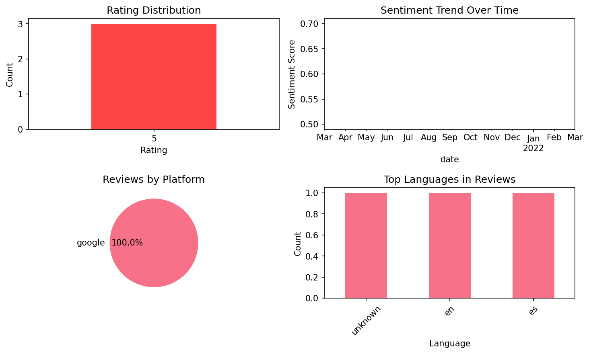

# Learn Dutch. Speak Dutch. Stud

## 📱 App Information

| **Attribute** | **Google Play** | **App Store** |
|---------------|-----------------|---------------|
| **Title** | Learn Dutch. Speak Dutch. Stud | N/A |
| **Package/ID** | com.pronunciatorllc.bluebird.dutch | N/A |
| **Rating** | 4.5 | N/A |
| **Total Ratings** | 306 | N/A |
| **Installs** | 50,000+ | N/A |
| **Genre** | Education | N/A |

## 📝 Description

<h1><b>Quickly learn to speak and understand Dutch with interactive video lessons narrated in any of 146 languages. </b></h1>

"Affordable, responsive, easy to set up, and simple to access, Bluebird is loaded with user-friendly features and contains an enormous amount of content. This is an excellent resource for users seeking a handy, enhanced mobile experience for language learning." - Library Journal

Choose from 2,000 pre-recorded lessons (over 5 years of lessons) or create a truly personalized course that revolves around the things you love. 

If you’re learning for your job, you can even create a personalized course for any of 60 occupations. 

Bluebird uses the scientifically proven <i>spaced repetition</i> technique, so you’ll learn quickly and retain what you learn long-term. Just listen and repeat – it’s that easy. 

Learn Dutch hands-free. No typing or swiping needed. Learn while you’re exercising, cooking, commuting, or relaxing at home. You can even stream your Bluebird lessons to smart speakers like Google Home or to your TV.

<b><u>You’ll Learn:</u></b>

* 2,000 high frequency words. (84% of everyday speech includes these powerful words.)

* The top 100 verbs – with conjugations in the past, present, and future tenses.

* How to build complete sentences on your own.

* How to manage dozens of everyday situations.

* How to handle complex conversations.

<b><u>Watch Your Progress:</u></b>

* 2,000 quizzes will test your knowledge and reinforce what you learn. 

* Each quiz contains a variety of question types to evaluate your listening, reading, and writing skills.

* See your statistics for both your lessons and quizzes at any time.

<b><u>A Global Approach</u></b>

Bluebird brings language learning to the world’s population in an unprecedented way. You can learn Dutch from any of 146 narration languages. 

<b><u>Something for Everybody</u></b>

Whether you’re preparing for a trip or want to learn Dutch for fun, school, or work, Bluebird will teach you what you need to know, and ensure you remember what you learn long-term. And, with family-friendly content throughout, your whole family can enjoy learning Dutch the Bluebird way.

<b><u>Unparalleled Content and Quality</u></b>

Bluebird has the most comprehensive language courses in the world, with an average of 10,000 instructional phrases per language. Each Bluebird lesson lasts between 15 and 45 minutes, with the average lesson lasting 30 minutes. Our curriculum is teacher-designed and human-translated; our narrators and actors are professional voice-over artists and native speakers of their respective languages; and our audio is studio-grade.

## 📊 Reviews Analytics

**Total Reviews:** 3 (3 analyzed)
**Rating Distribution:** 3 positive (4-5★), 0 neutral (3★), 0 negative (1-2★)
**Average Sentiment:** 0.57 (-1=very negative, +1=very positive)
**Primary Language:** unknown
**Key Insights:** Average rating: 5.0/5.0 | Overall sentiment: positive (score: 0.57) | Reviews in 3 languages, primarily unknown (1 reviews) | Reviews from 1 platform(s): google

### ⭐ Rating Breakdown

- **5 ★★★★★**: 3 reviews (100.0%)

### 🌍 Languages in Reviews

- **unknown**: 1 reviews
- **en**: 1 reviews
- **es**: 1 reviews

### 📱 Platform Distribution

- **google**: 3 reviews

## 📈 Visualizations

### Analytics Charts


## 💬 Sample Reviews

**Review 1** (★★★★★ - google - 2022-03-30T23:35:16)
> Good

**Review 2** (★★★★★ - google - 2021-03-28T17:01:48)
> Perfect app

**Review 3** (★★★★★ - google - 2021-03-12T12:33:52)
> Fácil y rápido de aprender

## 🔧 Raw JSON Data

<details>
<summary>Click to expand raw app data</summary>

```json
{
  "name": "Learn Dutch. Speak Dutch. Stud",
  "google_package": "com.pronunciatorllc.bluebird.dutch",
  "google": {
    "title": "Learn Dutch. Speak Dutch. Stud",
    "description": "<h1><b>Quickly learn to speak and understand Dutch with interactive video lessons narrated in any of 146 languages. </b></h1>\r\n\r\n\"Affordable, responsive, easy to set up, and simple to access, Bluebird is loaded with user-friendly features and contains an enormous amount of content. This is an excellent resource for users seeking a handy, enhanced mobile experience for language learning.\" - Library Journal\r\n\r\nChoose from 2,000 pre-recorded lessons (over 5 years of lessons) or create a truly personalized course that revolves around the things you love. \r\n\r\nIf you’re learning for your job, you can even create a personalized course for any of 60 occupations. \r\n\r\nBluebird uses the scientifically proven <i>spaced repetition</i> technique, so you’ll learn quickly and retain what you learn long-term. Just listen and repeat – it’s that easy. \r\n\r\nLearn Dutch hands-free. No typing or swiping needed. Learn while you’re exercising, cooking, commuting, or relaxing at home. You can even stream your Bluebird lessons to smart speakers like Google Home or to your TV.\r\n\r\n<b><u>You’ll Learn:</u></b>\r\n\r\n* 2,000 high frequency words. (84% of everyday speech includes these powerful words.)\r\n\r\n* The top 100 verbs – with conjugations in the past, present, and future tenses.\r\n\r\n* How to build complete sentences on your own.\r\n\r\n* How to manage dozens of everyday situations.\r\n\r\n* How to handle complex conversations.\r\n\r\n<b><u>Watch Your Progress:</u></b>\r\n\r\n* 2,000 quizzes will test your knowledge and reinforce what you learn. \r\n\r\n* Each quiz contains a variety of question types to evaluate your listening, reading, and writing skills.\r\n\r\n* See your statistics for both your lessons and quizzes at any time.\r\n\r\n<b><u>A Global Approach</u></b>\r\n\r\nBluebird brings language learning to the world’s population in an unprecedented way. You can learn Dutch from any of 146 narration languages. \r\n\r\n<b><u>Something for Everybody</u></b>\r\n\r\nWhether you’re preparing for a trip or want to learn Dutch for fun, school, or work, Bluebird will teach you what you need to know, and ensure you remember what you learn long-term. And, with family-friendly content throughout, your whole family can enjoy learning Dutch the Bluebird way.\r\n\r\n<b><u>Unparalleled Content and Quality</u></b>\r\n\r\nBluebird has the most comprehensive language courses in the world, with an average of 10,000 instructional phrases per language. Each Bluebird lesson lasts between 15 and 45 minutes, with the average lesson lasting 30 minutes. Our curriculum is teacher-designed and human-translated; our narrators and actors are professional voice-over artists and native speakers of their respective languages; and our audio is studio-grade.",
    "rating": 4.5,
    "rating_text": null,
    "ratings_total": 306,
    "ratings_histogram": [
      0,
      0,
      51,
      51,
      204
    ],
    "installs": "50,000+",
    "genre": "Education"
  },
  "apple": null,
  "reviews": [
    {
      "platform": "google",
      "rating": 5,
      "review": "Good",
      "date": "2022-03-30T23:35:16"
    },
    {
      "platform": "google",
      "rating": 5,
      "review": "Perfect app",
      "date": "2021-03-28T17:01:48"
    },
    {
      "platform": "google",
      "rating": 5,
      "review": "Fácil y rápido de aprender",
      "date": "2021-03-12T12:33:52"
    }
  ]
}
```

</details>

---
*Report generated on 2025-11-08 13:51:42 using advanced analytics*
