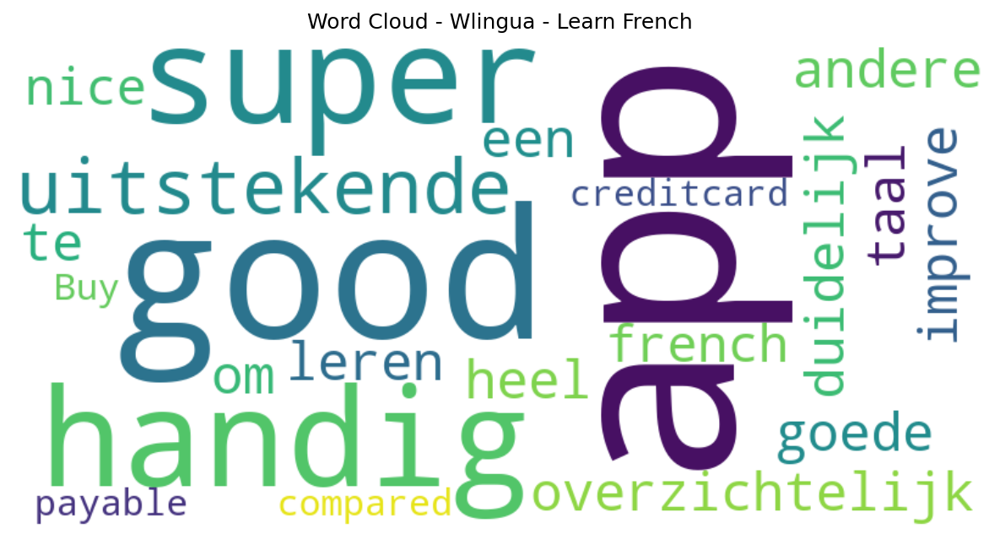

# Wlingua - Learn French

## 📱 App Information

| **Attribute** | **Google Play** | **App Store** |
|---------------|-----------------|---------------|
| **Title** | Wlingua - Learn French | N/A |
| **Package/ID** | com.wlingua.frenchcourse | N/A |
| **Rating** | 4.78 | N/A |
| **Total Ratings** | 13,624 | N/A |
| **Installs** | 500,000+ | N/A |
| **Genre** | Education | N/A |

## 📝 Description

<b>Learning French has never been so easy.</b>
It's perfect for you, whether you already have a beginner, basic, intermediate, or advanced level of French. Thanks to our online French courses, you’ll notice your French improving very quickly. Millions of students have already tried our courses. Would you like to join them?

<h1><b>Our Online French Courses:</b></h1>
<b>French Course</b>
In this course you will learn French from scratch. Guaranteed! Regardless of the level you start from, it is designed to help you learn French from day one.

<b>French Pronunciation Course</b>
The French alphabet has 26 letters, but more than 30 different sounds! In this course you will be able to learn to distinguish them, see example words of each of them, and practice all of them using various exercises.

<h1><b>Our Learning Method:</b></h1>
A learning process designed for you that is both easy and guided: You’ll feel like you’re learning more and more French every day. Every sentence, exercise, review, and reading has been carefully selected for you.

Audio clips in French: A wide variety of accents with clear, crisp pronunciation. Recorded by professional narrators.

Linked concepts: Each word is linked to its use or precise meaning. When you click on the words in each sentence, exercise, or reading, their meaning or an explanation of their use will appear.

Lesson structure: Concepts are introduced progressively throughout the course. Only concepts that are explained in the course are used to create the content (sentences, exercises or readings).

Vocabulary: Learn the meaning, pronunciation, and use of words with activities adapted to your progress.

Grammar exercises: Practice your grammar with exercises linked to explanations.

Vocabulary topics: Words are grouped by topic categories.

Spaced reviews: Review the vocabulary and grammar at increasingly long intervals.

Search function: Find whatever you’re looking for, including vocabulary and grammar.

Reading comprehension texts (readings): Learn and practice with conversations, news, emails, and interviews, among others.

Certificates: Earn a certificate that proves your knowledge at the end of each level.

Account types:
✔ Basic: With a Basic account, the course is free, but has some limitations.
✔ Premium: With a Premium account, you’ll have access to all course content and activities.

At Wlingua, we work hard every day to offer you a quality French app that will help you in your work, with that upcoming exam, on your vacation, in communicating with people from around the world...

Download our app to learn French!

## 📊 Reviews Analytics

**Total Reviews:** 5 (5 analyzed)
**Rating Distribution:** 4 positive (4-5★), 1 neutral (3★), 0 negative (1-2★)
**Average Sentiment:** 0.40 (-1=very negative, +1=very positive)
**Primary Language:** en
**Key Insights:** Average rating: 4.6/5.0 | Overall sentiment: positive (score: 0.40) | Reviews in 4 languages, primarily en (2 reviews) | Reviews from 1 platform(s): google | Key themes: app, good


### 🔑 Key Themes & Phrases

- **app** (relevance: 0.528)
- **good** (relevance: 0.354)

### ⭐ Rating Breakdown

- **5 ★★★★★**: 4 reviews (80.0%)
- **3 ★★★☆☆**: 1 reviews (20.0%)

### 🌍 Languages in Reviews

- **en**: 2 reviews
- **af**: 1 reviews
- **nl**: 1 reviews
- **pl**: 1 reviews

### 📱 Platform Distribution

- **google**: 5 reviews

## 📈 Visualizations

### Analytics Charts


### Word Cloud


## 💬 Sample Reviews

**Review 1** (★★★★★ - google - 2025-04-22T18:54:11)
> super handig! uitstekende app

**Review 2** (★★★★★ - google - 2025-02-21T09:16:49)
> overzichtelijk/duidelijk heel goede app om een andere taal te leren

**Review 3** (★★★★★ - google - 2024-07-20T09:49:55)
> good app to improve your french

**Review 4** (★★★★★ - google - 2022-11-20T21:32:23)
> Very nice!

**Review 5** (★★★ - google - 2020-06-01T19:36:41)
> Very very good compared to other apps! Buy only with creditcard payable

## 🔧 Raw JSON Data

<details>
<summary>Click to expand raw app data</summary>

```json
{
  "name": "Wlingua - Learn French",
  "google_package": "com.wlingua.frenchcourse",
  "google": {
    "title": "Wlingua - Learn French",
    "description": "<b>Learning French has never been so easy.</b>\r\nIt's perfect for you, whether you already have a beginner, basic, intermediate, or advanced level of French. Thanks to our online French courses, you’ll notice your French improving very quickly. Millions of students have already tried our courses. Would you like to join them?\r\n\r\n<h1><b>Our Online French Courses:</b></h1>\r\n<b>French Course</b>\r\nIn this course you will learn French from scratch. Guaranteed! Regardless of the level you start from, it is designed to help you learn French from day one.\r\n\r\n<b>French Pronunciation Course</b>\r\nThe French alphabet has 26 letters, but more than 30 different sounds! In this course you will be able to learn to distinguish them, see example words of each of them, and practice all of them using various exercises.\r\n\r\n<h1><b>Our Learning Method:</b></h1>\r\nA learning process designed for you that is both easy and guided: You’ll feel like you’re learning more and more French every day. Every sentence, exercise, review, and reading has been carefully selected for you.\r\n\r\nAudio clips in French: A wide variety of accents with clear, crisp pronunciation. Recorded by professional narrators.\r\n\r\nLinked concepts: Each word is linked to its use or precise meaning. When you click on the words in each sentence, exercise, or reading, their meaning or an explanation of their use will appear.\r\n\r\nLesson structure: Concepts are introduced progressively throughout the course. Only concepts that are explained in the course are used to create the content (sentences, exercises or readings).\r\n\r\nVocabulary: Learn the meaning, pronunciation, and use of words with activities adapted to your progress.\r\n\r\nGrammar exercises: Practice your grammar with exercises linked to explanations.\r\n\r\nVocabulary topics: Words are grouped by topic categories.\r\n\r\nSpaced reviews: Review the vocabulary and grammar at increasingly long intervals.\r\n\r\nSearch function: Find whatever you’re looking for, including vocabulary and grammar.\r\n\r\nReading comprehension texts (readings): Learn and practice with conversations, news, emails, and interviews, among others.\r\n\r\nCertificates: Earn a certificate that proves your knowledge at the end of each level.\r\n\r\nAccount types:\r\n✔ Basic: With a Basic account, the course is free, but has some limitations.\r\n✔ Premium: With a Premium account, you’ll have access to all course content and activities.\r\n\r\nAt Wlingua, we work hard every day to offer you a quality French app that will help you in your work, with that upcoming exam, on your vacation, in communicating with people from around the world...\r\n\r\nDownload our app to learn French!",
    "rating": 4.78,
    "rating_text": null,
    "ratings_total": 13624,
    "ratings_histogram": [
      112,
      112,
      112,
      1748,
      11423
    ],
    "installs": "500,000+",
    "genre": "Education"
  },
  "apple": null,
  "reviews": [
    {
      "platform": "google",
      "rating": 5,
      "review": "super handig! uitstekende app",
      "date": "2025-04-22T18:54:11"
    },
    {
      "platform": "google",
      "rating": 5,
      "review": "overzichtelijk/duidelijk heel goede app om een andere taal te leren",
      "date": "2025-02-21T09:16:49"
    },
    {
      "platform": "google",
      "rating": 5,
      "review": "good app to improve your french",
      "date": "2024-07-20T09:49:55"
    },
    {
      "platform": "google",
      "rating": 5,
      "review": "Very nice!",
      "date": "2022-11-20T21:32:23"
    },
    {
      "platform": "google",
      "rating": 3,
      "review": "Very very good compared to other apps! Buy only with creditcard payable",
      "date": "2020-06-01T19:36:41"
    }
  ]
}
```

</details>

---
*Report generated on 2025-11-08 13:52:25 using advanced analytics*
