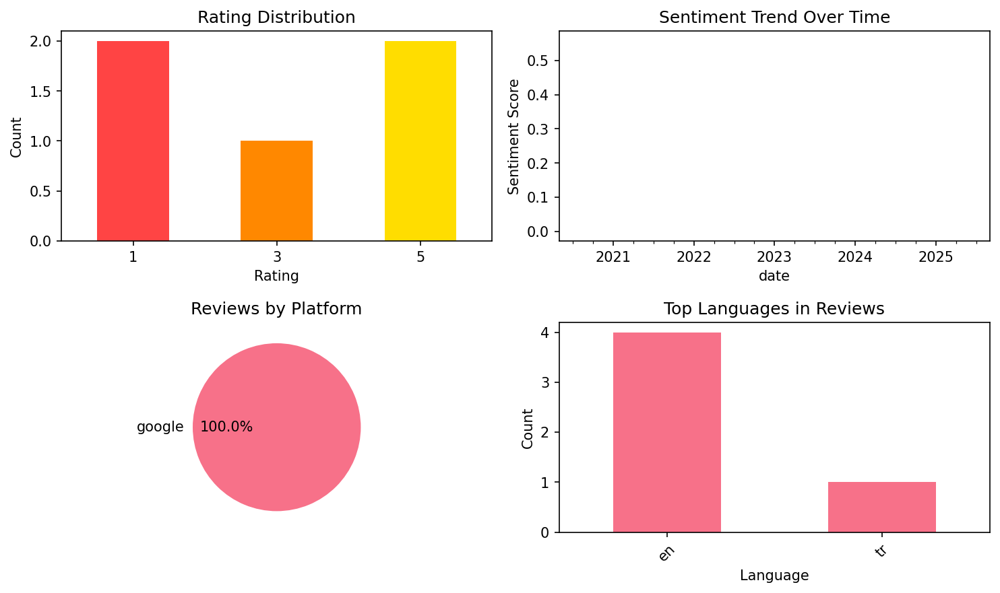
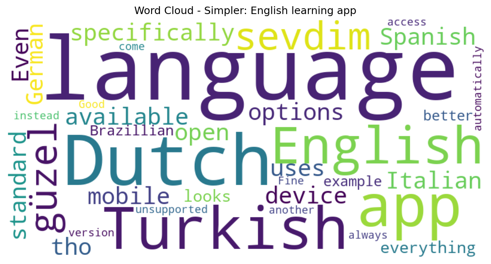

# Simpler: English learning app

## 📱 App Information

| **Attribute** | **Google Play** | **App Store** |
|---------------|-----------------|---------------|
| **Title** | Simpler: English learning app | N/A |
| **Package/ID** | ru.zengalt.simpler | N/A |
| **Rating** | 4.8201184 | N/A |
| **Total Ratings** | 723,285 | N/A |
| **Installs** | 10,000,000+ | N/A |
| **Genre** | Education | N/A |

## 📝 Description

Learning English is now easier than ever! Try Simpler now.

SIMPLER APP is an effective and helpful tool for language learners of all levels.

<b>SIMPLER ENGLISH COURSE FEATURES</b>
★ GRAMMAR in the form of short and simple topics 
★ DETECTIVE STORIES: a fun new way to practice your English
★ Free daily access to TREASURE CHESTS with useful new words
★ Effective DRILLS for each grammar topic
★ ASSOCIATIVE word learning
★ Authentic LISTENING material

Learn and master the English language FOR FREE with SIMPLER!
Simpler English course includes grammar, vocabulary and speaking modules.

<b>HOW DID WE DEVELOP SUCH A SIMPLE AND EFFICIENT TOOL FOR LEARNING ENGLISH FROM SCRATCH?</b>

<b>1.</b> We've developed an accessible and effective <b><u>GRAMMAR COURSE</u></b> for all-level learners.  English grammar can be confusing and overwhelming. Good news: we've done all the hard work for you. We took the most essential and relevant grammar and broke it down into bite-sized topics complete with drills. Each topic is a simple rule or structure, which comes with an instant comprehension check. With this system you can learn English grammar from the basics, all by yourself.

<b>2.</b>We've created an improved <b><u>FLASHCARD LIBRARY</u></b> for more effective word learning. Each flashcard has a sentence which helps memorize the word using associations. The app uses <b>spaced repetition</b> to help you remember every word. Expand your vocabulary fast with Simpler. 

<b>3.</b> At Simpler we know the importance of <b>listening skills</b> and learning the correct pronunciation from the very beginning. That's why every phrase in our exercises is voiced by a native speaker. And in our <b><u>PRACTICE</u></b> section you can put new grammar and vocabulary to use and role play one of the two speakers in a real-life dialogue.  

<b>4.</b> <u><b>DRILLS</b></u> are one of the key elements of our course. These are grammar exercises, such as completing a sentence or typing in the translation of a phrase. The drills train you to formulate correct sentences and use new grammar without even thinking about it. Some of the previously learned grammar is regularly added to your drills to keep your memory strong. We use various types of exercises in our drills to maximize the efficiency and make them fun. 

<b>5.</b> <b>Practice makes perfect.</b> You can select <u><b>RAPID PACE</b></u> and set your DAILY GOAL for extra motivation. Practice regularly and see the effects within a week!  

<b>7.</b> <u><b>A UNIQUE FEATURE</b></u>: Enjoy thrilling detective stories adapted for English learners! Learn new words and phrases and start thinking in English as you solve crimes and mysteries. 

With Simpler you can learn English for free.

📭  <b>CONTACT US</b>
If you have suggestions or comments on Simpler App, please, send them to: <u>help@simpler.link</u>. We appreciate your feedback.

## 📊 Reviews Analytics

**Total Reviews:** 5 (5 analyzed)
**Rating Distribution:** 2 positive (4-5★), 1 neutral (3★), 2 negative (1-2★)
**Average Sentiment:** 0.15 (-1=very negative, +1=very positive)
**Primary Language:** en
**Key Insights:** Average rating: 3.0/5.0 | Overall sentiment: positive (score: 0.15) | Reviews in 2 languages, primarily en (4 reviews) | Reviews from 1 platform(s): google | Key themes: language, dutch, turkish


### 🔑 Key Themes & Phrases

- **language** (relevance: 0.300)
- **dutch** (relevance: 0.239)
- **turkish** (relevance: 0.226)
- **english** (relevance: 0.190)
- **app** (relevance: 0.172)

### ⭐ Rating Breakdown

- **5 ★★★★★**: 2 reviews (40.0%)
- **3 ★★★☆☆**: 1 reviews (20.0%)
- **1 ★☆☆☆☆**: 2 reviews (40.0%)

### 🌍 Languages in Reviews

- **en**: 4 reviews
- **tr**: 1 reviews

### 📱 Platform Distribution

- **google**: 5 reviews

## 📈 Visualizations

### Analytics Charts


### Word Cloud


## 💬 Sample Reviews

**Review 1** (★★★★★ - google - 2025-09-13T21:16:58)
> güzel sevdim 👍❤️👍

**Review 2** (★ - google - 2025-04-03T12:53:11)
> The app is specifically available for Spanish Italian Turkish and other languages. Dutch or German aren't in the language options.

**Review 3** (★ - google - 2023-01-29T15:27:58)
> Even tho my mobile device uses Dutch as standard language when I open this app everything looks in the Brazillian language. It would be better that for example if Dutch is unsupported that we automatically get English instead.

**Review 4** (★★★★★ - google - 2022-04-23T20:27:31)
> Good Fine.

**Review 5** (★★★ - google - 2020-05-22T10:13:57)
> I cannot access the english or turkish version .It always come out in another language.

## 🔧 Raw JSON Data

<details>
<summary>Click to expand raw app data</summary>

```json
{
  "name": "Simpler: English learning app",
  "google_package": "ru.zengalt.simpler",
  "google": {
    "title": "Simpler: English learning app",
    "description": "Learning English is now easier than ever! Try Simpler now.\r\n\r\nSIMPLER APP is an effective and helpful tool for language learners of all levels.\r\n\r\n<b>SIMPLER ENGLISH COURSE FEATURES</b>\r\n★ GRAMMAR in the form of short and simple topics \r\n★ DETECTIVE STORIES: a fun new way to practice your English\r\n★ Free daily access to TREASURE CHESTS with useful new words\r\n★ Effective DRILLS for each grammar topic\r\n★ ASSOCIATIVE word learning\r\n★ Authentic LISTENING material\r\n\r\nLearn and master the English language FOR FREE with SIMPLER!\r\nSimpler English course includes grammar, vocabulary and speaking modules.\r\n\r\n<b>HOW DID WE DEVELOP SUCH A SIMPLE AND EFFICIENT TOOL FOR LEARNING ENGLISH FROM SCRATCH?</b>\r\n\r\n<b>1.</b> We've developed an accessible and effective <b><u>GRAMMAR COURSE</u></b> for all-level learners.  English grammar can be confusing and overwhelming. Good news: we've done all the hard work for you. We took the most essential and relevant grammar and broke it down into bite-sized topics complete with drills. Each topic is a simple rule or structure, which comes with an instant comprehension check. With this system you can learn English grammar from the basics, all by yourself.\r\n\r\n<b>2.</b>We've created an improved <b><u>FLASHCARD LIBRARY</u></b> for more effective word learning. Each flashcard has a sentence which helps memorize the word using associations. The app uses <b>spaced repetition</b> to help you remember every word. Expand your vocabulary fast with Simpler. \r\n\r\n<b>3.</b> At Simpler we know the importance of <b>listening skills</b> and learning the correct pronunciation from the very beginning. That's why every phrase in our exercises is voiced by a native speaker. And in our <b><u>PRACTICE</u></b> section you can put new grammar and vocabulary to use and role play one of the two speakers in a real-life dialogue.  \r\n\r\n<b>4.</b> <u><b>DRILLS</b></u> are one of the key elements of our course. These are grammar exercises, such as completing a sentence or typing in the translation of a phrase. The drills train you to formulate correct sentences and use new grammar without even thinking about it. Some of the previously learned grammar is regularly added to your drills to keep your memory strong. We use various types of exercises in our drills to maximize the efficiency and make them fun. \r\n\r\n<b>5.</b> <b>Practice makes perfect.</b> You can select <u><b>RAPID PACE</b></u> and set your DAILY GOAL for extra motivation. Practice regularly and see the effects within a week!  \r\n\r\n<b>7.</b> <u><b>A UNIQUE FEATURE</b></u>: Enjoy thrilling detective stories adapted for English learners! Learn new words and phrases and start thinking in English as you solve crimes and mysteries. \r\n\r\nWith Simpler you can learn English for free.\r\n\r\n📭  <b>CONTACT US</b>\r\nIf you have suggestions or comments on Simpler App, please, send them to: <u>help@simpler.link</u>. We appreciate your feedback.",
    "rating": 4.8201184,
    "rating_text": null,
    "ratings_total": 723285,
    "ratings_histogram": [
      6778,
      4204,
      12785,
      64185,
      635073
    ],
    "installs": "10,000,000+",
    "genre": "Education"
  },
  "apple": null,
  "reviews": [
    {
      "platform": "google",
      "rating": 5,
      "review": "güzel sevdim 👍❤️👍",
      "date": "2025-09-13T21:16:58"
    },
    {
      "platform": "google",
      "rating": 1,
      "review": "The app is specifically available for Spanish Italian Turkish and other languages. Dutch or German aren't in the language options.",
      "date": "2025-04-03T12:53:11"
    },
    {
      "platform": "google",
      "rating": 1,
      "review": "Even tho my mobile device uses Dutch as standard language when I open this app everything looks in the Brazillian language. It would be better that for example if Dutch is unsupported that we automatically get English instead.",
      "date": "2023-01-29T15:27:58"
    },
    {
      "platform": "google",
      "rating": 5,
      "review": "Good Fine.",
      "date": "2022-04-23T20:27:31"
    },
    {
      "platform": "google",
      "rating": 3,
      "review": "I cannot access the english or turkish version .It always come out in another language.",
      "date": "2020-05-22T10:13:57"
    }
  ]
}
```

</details>

---
*Report generated on 2025-11-08 13:53:03 using advanced analytics*
