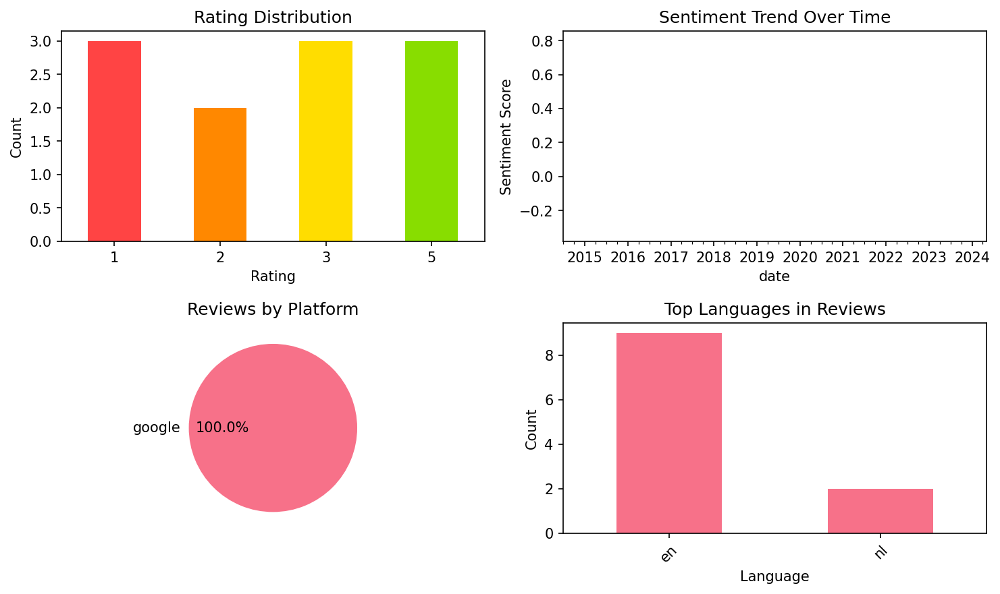

# AlgoApp Flashcards

## 📱 App Information

| **Attribute** | **Google Play** | **App Store** |
|---------------|-----------------|---------------|
| **Title** | AlgoApp Flashcards | N/A |
| **Package/ID** | com.ankiapp.client | N/A |
| **Rating** | 4.2178216 | N/A |
| **Total Ratings** | 3,960 | N/A |
| **Installs** | 1,000,000+ | N/A |
| **Genre** | Education | N/A |

## 📝 Description

Ranked #1 Education app in multiple countries world-wide. Featured in the New York Times.

Learning Chinese characters? Kanji? Medicine? Another subject with lots to memorize? With that much to learn, you need the right flashcard app, to get the most from your study time.

That's why AlgoApp uses an improved form of Spaced Repetition (SRS), built with Artificial Intelligence (AI), to maximize the amount of learning you get done in each study session. When you go to study, the AI chooses which flashcards you need to work on, based on a detailed analysis of your progress. It's like a coach, for your brain.

Make your own flashcards, styled how you like. AlgoApp lets you use colors, bulleted lists, and more. Or search through millions of flashcards that are ready for you to download. Your choice.

You get all this power, wrapped in a simple, polished app.

SIMPLE
  • Easy to add cards directly from the mobile app
  • Format your cards using colored text, bulleted lists, underlines, and more, all without knowing CSS
  • Flip your decks to study back-to-front, with a couple taps
  • Syncs automatically with desktop, web app, and your other phones and tablets
  • Create decks on the go
  • Make cards using photos from your camera
  • Share any deck with a friend by putting in their email

POWERFUL
  • Fully-featured—-NOT a "companion" app that requires a computer
  • Detailed stats on each of your decks, and individual cards too
  • For advanced formatting, supports HTML and CSS
  • Text-to-speech (TTS) that reads parts of your cards in English or other languages
  • Automatic translation
  • Automatic furigana generation annotation for Japanese kanji
  • Study offline, and your new cards and progress sync when you're back online

USER-FRIENDLY
  • Dashboard that shows your overall progress
  • Study at any time; doesn't force you to study cards on a rigid schedule
  • Study your recent decks from the Dashboard in just 2 taps
  • "Night Mode" that's easy on your eyeballs when studying in the dark
  • Settings sync across all your devices

## 📊 Reviews Analytics

**Total Reviews:** 11 (11 analyzed)
**Rating Distribution:** 3 positive (4-5★), 3 neutral (3★), 5 negative (1-2★)
**Average Sentiment:** 0.21 (-1=very negative, +1=very positive)
**Primary Language:** en
**Key Insights:** Average rating: 2.8/5.0 | Overall sentiment: positive (score: 0.21) | Reviews in 2 languages, primarily en (9 reviews) | Reviews from 1 platform(s): google | Key themes: app, thank, decks


### 🔑 Key Themes & Phrases

- **app** (relevance: 0.175)
- **thank** (relevance: 0.141)
- **decks** (relevance: 0.128)
- **cards** (relevance: 0.120)
- **great** (relevance: 0.116)
- **anki** (relevance: 0.115)
- **flashcards** (relevance: 0.103)
- **just** (relevance: 0.100)

### ⭐ Rating Breakdown

- **5 ★★★★★**: 3 reviews (27.3%)
- **3 ★★★☆☆**: 3 reviews (27.3%)
- **2 ★★☆☆☆**: 2 reviews (18.2%)
- **1 ★☆☆☆☆**: 3 reviews (27.3%)

### 🌍 Languages in Reviews

- **en**: 9 reviews
- **nl**: 2 reviews

### 📱 Platform Distribution

- **google**: 11 reviews

## 📈 Visualizations

### Analytics Charts


### Word Cloud


## 💬 Sample Reviews

**Review 1** (★★★ - google - 2024-05-29T21:51:18)
> Great app, it works really well, but the limit is far too small, on exam days i am sometimes just not allowed to study my flashcards because of the 100-cards limit. Please update this!!

**Review 2** (★★★ - google - 2022-08-24T16:46:47)
> I can't upload any of my own decks anymore. No clue what I'm doing wrong (or different than before). I already sent a couple of mails concerning this problem, but no reaction...

**Review 3** (★ - google - 2020-01-31T19:03:34)
> This is not Anki, this is the wrong app by a company trying to profit from a successful open source platform. Don't give them your money.

**Review 4** (★★ - google - 2016-10-29T17:56:10)
> Worked fine until it stopped adding new cards for no reason. It just says internal error. contact support

**Review 5** (★★★★★ - google - 2014-07-24T14:58:39)
> Thank you so much for Winant!

## 🔧 Raw JSON Data

<details>
<summary>Click to expand raw app data</summary>

```json
{
  "name": "AlgoApp Flashcards",
  "google_package": "com.ankiapp.client",
  "google": {
    "title": "AlgoApp Flashcards",
    "description": "Ranked #1 Education app in multiple countries world-wide. Featured in the New York Times.\r\n\r\nLearning Chinese characters? Kanji? Medicine? Another subject with lots to memorize? With that much to learn, you need the right flashcard app, to get the most from your study time.\r\n\r\nThat's why AlgoApp uses an improved form of Spaced Repetition (SRS), built with Artificial Intelligence (AI), to maximize the amount of learning you get done in each study session. When you go to study, the AI chooses which flashcards you need to work on, based on a detailed analysis of your progress. It's like a coach, for your brain.\r\n\r\nMake your own flashcards, styled how you like. AlgoApp lets you use colors, bulleted lists, and more. Or search through millions of flashcards that are ready for you to download. Your choice.\r\n\r\nYou get all this power, wrapped in a simple, polished app.\r\n\r\nSIMPLE\r\n  • Easy to add cards directly from the mobile app\r\n  • Format your cards using colored text, bulleted lists, underlines, and more, all without knowing CSS\r\n  • Flip your decks to study back-to-front, with a couple taps\r\n  • Syncs automatically with desktop, web app, and your other phones and tablets\r\n  • Create decks on the go\r\n  • Make cards using photos from your camera\r\n  • Share any deck with a friend by putting in their email\r\n\r\nPOWERFUL\r\n  • Fully-featured—-NOT a \"companion\" app that requires a computer\r\n  • Detailed stats on each of your decks, and individual cards too\r\n  • For advanced formatting, supports HTML and CSS\r\n  • Text-to-speech (TTS) that reads parts of your cards in English or other languages\r\n  • Automatic translation\r\n  • Automatic furigana generation annotation for Japanese kanji\r\n  • Study offline, and your new cards and progress sync when you're back online\r\n\r\nUSER-FRIENDLY\r\n  • Dashboard that shows your overall progress\r\n  • Study at any time; doesn't force you to study cards on a rigid schedule\r\n  • Study your recent decks from the Dashboard in just 2 taps\r\n  • \"Night Mode\" that's easy on your eyeballs when studying in the dark\r\n  • Settings sync across all your devices",
    "rating": 4.2178216,
    "rating_text": null,
    "ratings_total": 3960,
    "ratings_histogram": [
      619,
      105,
      0,
      226,
      2977
    ],
    "installs": "1,000,000+",
    "genre": "Education"
  },
  "apple": null,
  "reviews": [
    {
      "platform": "google",
      "rating": 3,
      "review": "Great app, it works really well, but the limit is far too small, on exam days i am sometimes just not allowed to study my flashcards because of the 100-cards limit. Please update this!!",
      "date": "2024-05-29T21:51:18"
    },
    {
      "platform": "google",
      "rating": 1,
      "review": "Crasht constant bij opstarten",
      "date": "2022-10-10T13:31:45"
    },
    {
      "platform": "google",
      "rating": 3,
      "review": "I can't upload any of my own decks anymore. No clue what I'm doing wrong (or different than before). I already sent a couple of mails concerning this problem, but no reaction...",
      "date": "2022-08-24T16:46:47"
    },
    {
      "platform": "google",
      "rating": 5,
      "review": "Thank you for making this app. Is has been most helpfull for me to learn by heart different subjects. Great!",
      "date": "2022-01-15T10:25:23"
    },
    {
      "platform": "google",
      "rating": 5,
      "review": "Ideale tool om dingen te leren zoals talen.",
      "date": "2020-07-08T13:18:15"
    },
    {
      "platform": "google",
      "rating": 1,
      "review": "This is not Anki, this is the wrong app by a company trying to profit from a successful open source platform. Don't give them your money.",
      "date": "2020-01-31T19:03:34"
    },
    {
      "platform": "google",
      "rating": 1,
      "review": "This app has nothing to do with the popular Anki flashcards.",
      "date": "2019-05-02T18:34:22"
    },
    {
      "platform": "google",
      "rating": 2,
      "review": "The app is great, but after I had to log of I can not see my cards anymore. I sent an e-mail to support but no reaction",
      "date": "2017-09-18T20:56:41"
    },
    {
      "platform": "google",
      "rating": 2,
      "review": "Worked fine until it stopped adding new cards for no reason. It just says internal error. contact support",
      "date": "2016-10-29T17:56:10"
    },
    {
      "platform": "google",
      "rating": 3,
      "review": "No sub-decks possible. So, if you have lots of decks, this becomes very uncomfortable.",
      "date": "2015-12-15T11:00:42"
    },
    {
      "platform": "google",
      "rating": 5,
      "review": "Thank you so much for Winant!",
      "date": "2014-07-24T14:58:39"
    }
  ]
}
```

</details>

---
*Report generated on 2025-11-08 13:48:43 using advanced analytics*
