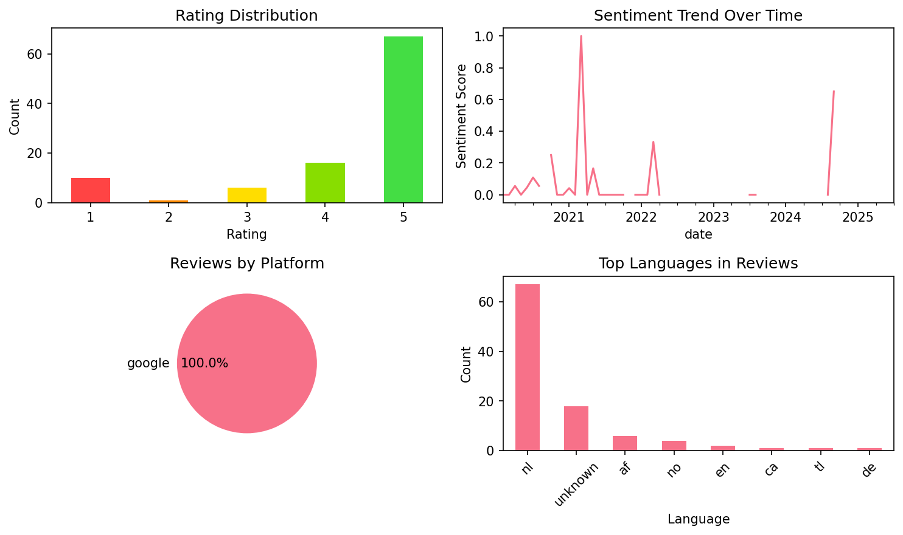

# Learn French - Speak French

## 📱 App Information

| **Attribute** | **Google Play** | **App Store** |
|---------------|-----------------|---------------|
| **Title** | Learn French - Speak French | N/A |
| **Package/ID** | com.atistudios.ispeak.fr | N/A |
| **Rating** | 4.6563945 | N/A |
| **Total Ratings** | 108,726 | N/A |
| **Installs** | 1,000,000+ | N/A |
| **Genre** | Education | N/A |

## 📝 Description

<b>Start learning French 🇫🇷</b> quickly and effectively with Mondly’s free daily lessons! In just minutes you’ll start memorizing core French words, form sentences, learn to speak French phrases and take part in conversations. You’ll feel like having your own French language tutor in your pocket.

<b>Loved and trusted worldwide</b>

🏆 Mondly was named <b>"Editors’ Choice"</b> in Google Play and <b>"App of the Year"</b> by Facebook.
🌍 Beginner or advanced learner, traveler or business professional - This French app works great and dynamically adjusts to your needs.

Join over 50 million people that are learning new languages from their mother tongue!
Why Mondly? Because we build bridges between people by making language learning fun and easy through technological innovation.

<b>TRY MONDLY</b>

★ "The closest thing to classroom education." — Bloomberg
★ "A practical approach to language learning likely to be widely adopted." — Forbes
★ "The new way to learn languages ." — Inc.
★ "Mondly is like having a private tutor." — CNN
_____________________

<h2><b>This is how the future of language courses looks like</b></h2>
Our French language learning app gets you started with a basic conversation between two people. You quickly start memorizing core words, use them to build sentences and phrases, and at the end of a 45-minutes module you are able to reconstruct that conversation with your own voice. It’s an effective way to learn French phrases. State-of-the-art Natural Speech Recognition and Spaced Repetition Algorithms make our French learning app effective for learning languages.

<h2><b>Here are the key features that make Mondly a great tutor for you:</b></h2>
✓ Crystal-clear audio and professional voice actors.
» Learn the right French pronunciation from conversations between native speakers.

✓ State-of-the-art Speech Recognition.
» Mondly knows exactly how to listen to your French words and phrases. You will only get a positive feedback if you speak French clearly and correctly. This will improve your pronunciation.

✓ Useful phrases for real situations.
» Memorizing hundreds of isolated words is not the way to go when it comes to learning French. Mondly teaches you French vocabulary by offering you core words and phrases. Our French language learning apps break the learning process down into short lessons and puts them into themed packs.

✓ Learn conversational French.
» Conversation is the main reason to take this free course. It will help you build a core French vocabulary with widely-used nouns and verbs, and speak French clearly.

✓ Verb conjugations.
» If you want to learn French grammar during this course, just tap the French verbs and get the full conjugation on the screen, including the translation. It’s faster and better than a dictionary.

✓ Advanced Statistics.
» Our French learning apps use intelligent reporting, so you can always follow your progress. Build your vocabulary step by step and become better daily.

✓ The Leaderboard.
» See how your friends are doing and compete with people from all over the world to become the best learner in the Mondly community family. Take the Weekly Quiz to become even better.

✓ Adaptive Learning.
» Learning French is different from person to person. So we taught the app to learn from your way of learning. After little time spent together, Mondly will understand what suits you best and it will become your own guide and customized teacher.

★ Before you know it, at the end of these French lessons, you will master the most useful 5000 words and phrases and you will be on the fast lane to learning a new language.

<b>Continue learning with Mondly:</b>

• Facebook: https://www.facebook.com/mondlylanguages
• Twitter: https://twitter.com/MondlyLanguages
• Instagram: https://www.instagram.com/mondlylanguages

## 📊 Reviews Analytics

**Total Reviews:** 100 (100 analyzed)
**Rating Distribution:** 83 positive (4-5★), 6 neutral (3★), 11 negative (1-2★)
**Average Sentiment:** 0.06 (-1=very negative, +1=very positive)
**Primary Language:** nl
**Key Insights:** Average rating: 4.3/5.0 | Overall sentiment: neutral (score: 0.06) | Reviews in 8 languages, primarily nl (67 reviews) | Reviews from 1 platform(s): google | Key themes: app, te, leuk


### 🔑 Key Themes & Phrases

- **app** (relevance: 0.101)
- **te** (relevance: 0.070)
- **leuk** (relevance: 0.060)
- **en** (relevance: 0.059)
- **ik** (relevance: 0.057)
- **een** (relevance: 0.057)
- **het** (relevance: 0.051)
- **goed** (relevance: 0.049)

### ⭐ Rating Breakdown

- **5 ★★★★★**: 67 reviews (67.0%)
- **4 ★★★★☆**: 16 reviews (16.0%)
- **3 ★★★☆☆**: 6 reviews (6.0%)
- **2 ★★☆☆☆**: 1 reviews (1.0%)
- **1 ★☆☆☆☆**: 10 reviews (10.0%)

### 🌍 Languages in Reviews

- **nl**: 67 reviews
- **unknown**: 18 reviews
- **af**: 6 reviews
- **no**: 4 reviews
- **en**: 2 reviews

### 📱 Platform Distribution

- **google**: 100 reviews

## 📈 Visualizations

### Analytics Charts


### Word Cloud


## 💬 Sample Reviews

**Review 1** (★★★★★ - google - 2025-07-27T13:51:36)
> onnodig

**Review 2** (★★★★★ - google - 2021-05-30T22:43:16)
> Wat een prettige manier om een taal te oefenen en bij te leren! Het kost weinig tijd, veel herhalen, top..

**Review 3** (★★★★★ - google - 2020-10-22T11:02:20)
> Het is een super fijne app

**Review 4** (★★★★★ - google - 2020-05-23T13:19:05)
> Werkt erg fijn

**Review 5** (★★★★★ - google - 2020-02-08T08:47:14)
> Fijne manier om een taal te leren

## 🔧 Raw JSON Data

<details>
<summary>Click to expand raw app data</summary>

```json
{
  "name": "Learn French - Speak French",
  "google_package": "com.atistudios.ispeak.fr",
  "google": {
    "title": "Learn French - Speak French",
    "description": "<b>Start learning French 🇫🇷</b> quickly and effectively with Mondly’s free daily lessons! In just minutes you’ll start memorizing core French words, form sentences, learn to speak French phrases and take part in conversations. You’ll feel like having your own French language tutor in your pocket.\r\n\r\n<b>Loved and trusted worldwide</b>\r\n\r\n🏆 Mondly was named <b>\"Editors’ Choice\"</b> in Google Play and <b>\"App of the Year\"</b> by Facebook.\r\n🌍 Beginner or advanced learner, traveler or business professional - This French app works great and dynamically adjusts to your needs.\r\n\r\nJoin over 50 million people that are learning new languages from their mother tongue!\r\nWhy Mondly? Because we build bridges between people by making language learning fun and easy through technological innovation.\r\n\r\n<b>TRY MONDLY</b>\r\n\r\n★ \"The closest thing to classroom education.\" — Bloomberg\r\n★ \"A practical approach to language learning likely to be widely adopted.\" — Forbes\r\n★ \"The new way to learn languages .\" — Inc.\r\n★ \"Mondly is like having a private tutor.\" — CNN\r\n_____________________\r\n\r\n<h2><b>This is how the future of language courses looks like</b></h2>\r\nOur French language learning app gets you started with a basic conversation between two people. You quickly start memorizing core words, use them to build sentences and phrases, and at the end of a 45-minutes module you are able to reconstruct that conversation with your own voice. It’s an effective way to learn French phrases. State-of-the-art Natural Speech Recognition and Spaced Repetition Algorithms make our French learning app effective for learning languages.\r\n\r\n<h2><b>Here are the key features that make Mondly a great tutor for you:</b></h2>\r\n✓ Crystal-clear audio and professional voice actors.\r\n» Learn the right French pronunciation from conversations between native speakers.\r\n\r\n✓ State-of-the-art Speech Recognition.\r\n» Mondly knows exactly how to listen to your French words and phrases. You will only get a positive feedback if you speak French clearly and correctly. This will improve your pronunciation.\r\n\r\n✓ Useful phrases for real situations.\r\n» Memorizing hundreds of isolated words is not the way to go when it comes to learning French. Mondly teaches you French vocabulary by offering you core words and phrases. Our French language learning apps break the learning process down into short lessons and puts them into themed packs.\r\n\r\n✓ Learn conversational French.\r\n» Conversation is the main reason to take this free course. It will help you build a core French vocabulary with widely-used nouns and verbs, and speak French clearly.\r\n\r\n✓ Verb conjugations.\r\n» If you want to learn French grammar during this course, just tap the French verbs and get the full conjugation on the screen, including the translation. It’s faster and better than a dictionary.\r\n\r\n✓ Advanced Statistics.\r\n» Our French learning apps use intelligent reporting, so you can always follow your progress. Build your vocabulary step by step and become better daily.\r\n\r\n✓ The Leaderboard.\r\n» See how your friends are doing and compete with people from all over the world to become the best learner in the Mondly community family. Take the Weekly Quiz to become even better.\r\n\r\n✓ Adaptive Learning.\r\n» Learning French is different from person to person. So we taught the app to learn from your way of learning. After little time spent together, Mondly will understand what suits you best and it will become your own guide and customized teacher.\r\n\r\n★ Before you know it, at the end of these French lessons, you will master the most useful 5000 words and phrases and you will be on the fast lane to learning a new language.\r\n\r\n<b>Continue learning with Mondly:</b>\r\n\r\n• Facebook: https://www.facebook.com/mondlylanguages\r\n• Twitter: https://twitter.com/MondlyLanguages\r\n• Instagram: https://www.instagram.com/mondlylanguages",
    "rating": 4.6563945,
    "rating_text": null,
    "ratings_total": 108726,
    "ratings_histogram": [
      3009,
      1832,
      3336,
      13053,
      87445
    ],
    "installs": "1,000,000+",
    "genre": "Education"
  },
  "apple": null,
  "reviews": [
    {
      "platform": "google",
      "rating": 5,
      "review": "onnodig",
      "date": "2025-07-27T13:51:36"
    },
    {
      "platform": "google",
      "rating": 5,
      "review": "Met deze app kun je op gemakkelijke en leuke wijze tot wel 41 talen leren. Als je dagelijks een paar lessen volgt blijf je vanzelf de woorden en zinnen onthouden en merk je opeens dat je er steeds beter in wordt.",
      "date": "2025-03-13T14:13:20"
    },
    {
      "platform": "google",
      "rating": 5,
      "review": "zeer leuke app om Frans te leren. Wooooow vandaag de app in een nieuw jasje, SUPER leuk !!!",
      "date": "2024-09-14T19:33:01"
    },
    {
      "platform": "google",
      "rating": 5,
      "review": "Toffe app",
      "date": "2024-08-20T17:25:59"
    },
    {
      "platform": "google",
      "rating": 5,
      "review": "Très bien",
      "date": "2023-08-28T18:14:24"
    },
    {
      "platform": "google",
      "rating": 5,
      "review": "Leuk",
      "date": "2023-07-11T10:07:56"
    },
    {
      "platform": "google",
      "rating": 1,
      "review": "Deens - Frans? Nederlands - Frans wil ik. Verwarrend hoor.",
      "date": "2023-03-16T06:33:29"
    },
    {
      "platform": "google",
      "rating": 5,
      "review": "Net aangeschaft om mijn (schoon)familie in Frankrijk te begrijpen. Tot nu toe een fijne manier van leren.",
      "date": "2022-09-24T13:11:08"
    },
    {
      "platform": "google",
      "rating": 2,
      "review": "Veel te gemakkelijk. Ze geven altijd het antwoord dat je moet geven, zo is er niet echt een uitdaging en leer je het niet snel",
      "date": "2022-04-01T07:42:05"
    },
    {
      "platform": "google",
      "rating": 5,
      "review": "Super",
      "date": "2022-03-09T20:59:01"
    },
    {
      "platform": "google",
      "rating": 5,
      "review": "Iedere dag nieuwe woorden en zinnen. Soms lastig en soms makkelijk. Uitdaging. En na 30 min weer een stap verder. Verschillende manieren van leren.luisteren Nazeggen,vertalen,invullen.",
      "date": "2022-02-11T09:39:54"
    },
    {
      "platform": "google",
      "rating": 1,
      "review": "Ik moest alles 9 keer invullen en toch kwam ik er niet in.",
      "date": "2022-01-05T14:51:37"
    },
    {
      "platform": "google",
      "rating": 4,
      "review": "Prima uitgelegd",
      "date": "2022-01-02T14:18:02"
    },
    {
      "platform": "google",
      "rating": 5,
      "review": "Zeer prettig op deze ontspannen manier",
      "date": "2021-12-09T17:39:41"
    },
    {
      "platform": "google",
      "rating": 3,
      "review": "Te beperkt voor gevorderden in het Frans",
      "date": "2021-10-12T09:36:09"
    },
    {
      "platform": "google",
      "rating": 5,
      "review": "Heel duidelijk!",
      "date": "2021-10-11T10:12:26"
    },
    {
      "platform": "google",
      "rating": 1,
      "review": "Is niet gratis...na 7 dagen 9.90 abonnement pm of jaar geen idee? In ieder geval niet GRATIS",
      "date": "2021-10-09T12:54:23"
    },
    {
      "platform": "google",
      "rating": 4,
      "review": "Leuke en snel",
      "date": "2021-10-01T08:18:33"
    },
    {
      "platform": "google",
      "rating": 5,
      "review": "Alle begin is moeilijk ,",
      "date": "2021-09-28T10:30:21"
    },
    {
      "platform": "google",
      "rating": 5,
      "review": "Leuke manier om te leren",
      "date": "2021-08-30T17:22:15"
    },
    {
      "platform": "google",
      "rating": 5,
      "review": "Handig overzichtelijk",
      "date": "2021-08-29T20:37:55"
    },
    {
      "platform": "google",
      "rating": 4,
      "review": "Leert snel en eenvoudig",
      "date": "2021-08-17T14:55:42"
    },
    {
      "platform": "google",
      "rating": 3,
      "review": "Vragen zijn óf te makkelijk óf te moeilijk voor mijn niveau. In de test verschijnen soms woorden die nooit eerder zijn vermeld en die je dan moet vertalen. Het komt regelmatig voor dat een antwoord fout wordt beoordeeld, terwijl ik zeker weet dat het goed is. Na ongeveer een jaar stop ik ermee. Dank voor de dingen die ik wél heb geleerd.",
      "date": "2021-08-16T07:32:27"
    },
    {
      "platform": "google",
      "rating": 5,
      "review": "Ik vind het heel interessant op een eenvoudige manier als starter Frans te oefenen.",
      "date": "2021-07-28T08:32:08"
    },
    {
      "platform": "google",
      "rating": 5,
      "review": "Goede begeleiding en je kan het steeds terug kijken.",
      "date": "2021-06-13T08:43:26"
    },
    {
      "platform": "google",
      "rating": 5,
      "review": "Wat een prettige manier om een taal te oefenen en bij te leren! Het kost weinig tijd, veel herhalen, top..",
      "date": "2021-05-30T22:43:16"
    },
    {
      "platform": "google",
      "rating": 1,
      "review": "Als in de titel gratis staat verwacht ik dat ook.",
      "date": "2021-05-26T00:07:39"
    },
    {
      "platform": "google",
      "rating": 5,
      "review": "Prima app",
      "date": "2021-05-20T13:26:59"
    },
    {
      "platform": "google",
      "rating": 1,
      "review": "Zonder abonnement erg weinig te leren. Een enkele les, en daarna 1 simpele oefening op een dag.",
      "date": "2021-04-29T09:35:31"
    },
    {
      "platform": "google",
      "rating": 4,
      "review": "Te makkelijk en veel herhaling. Weinig nieuwe onderwerpen",
      "date": "2021-04-23T08:06:13"
    },
    {
      "platform": "google",
      "rating": 5,
      "review": "Superrrrrr👍👍",
      "date": "2021-04-11T22:46:52"
    },
    {
      "platform": "google",
      "rating": 5,
      "review": "Gemakelijk",
      "date": "2021-04-11T08:57:24"
    },
    {
      "platform": "google",
      "rating": 5,
      "review": "Zeer fantastische app! Zeker als je de premium hebt dan is de app perfect! Geen spijt van de betaling.",
      "date": "2021-03-18T13:46:35"
    },
    {
      "platform": "google",
      "rating": 5,
      "review": "Ben nog mee met de les. Op",
      "date": "2021-02-13T13:47:31"
    },
    {
      "platform": "google",
      "rating": 3,
      "review": "Niet altijd juiste vertaling van grammatica. De oefeningen waren in het begin te makkelijk.",
      "date": "2021-02-10T19:30:39"
    },
    {
      "platform": "google",
      "rating": 4,
      "review": "Een fijne gebruiksvriendelijke app,ik kan hem aanbevelen. Ik gebruik de premium versie.",
      "date": "2021-02-08T17:25:25"
    },
    {
      "platform": "google",
      "rating": 5,
      "review": "Zeer goede App",
      "date": "2021-02-05T10:08:46"
    },
    {
      "platform": "google",
      "rating": 1,
      "review": "Matige vordering, niks gratis.",
      "date": "2021-01-22T18:16:25"
    },
    {
      "platform": "google",
      "rating": 4,
      "review": "Duidelijke lessen. Grammatica is toegevoegd",
      "date": "2021-01-17T21:41:23"
    },
    {
      "platform": "google",
      "rating": 5,
      "review": "👌",
      "date": "2021-01-17T20:59:46"
    },
    {
      "platform": "google",
      "rating": 5,
      "review": "Goede app",
      "date": "2021-01-15T20:06:21"
    },
    {
      "platform": "google",
      "rating": 4,
      "review": "Net begonnen maar top",
      "date": "2021-01-12T20:34:00"
    },
    {
      "platform": "google",
      "rating": 4,
      "review": "Makkelijk te doen",
      "date": "2021-01-06T16:15:59"
    },
    {
      "platform": "google",
      "rating": 5,
      "review": "Hele fijne app!",
      "date": "2020-12-26T19:57:02"
    },
    {
      "platform": "google",
      "rating": 3,
      "review": "Heel leerrijke les, maar hoe verder je wil, weeral betalen, dat vindt ik niet leuk",
      "date": "2020-12-20T10:21:23"
    },
    {
      "platform": "google",
      "rating": 1,
      "review": "niet supper handig en onmogelijk om je aboloment op te zeggen",
      "date": "2020-12-03T11:08:37"
    },
    {
      "platform": "google",
      "rating": 3,
      "review": "Heel Leuk en begrijpelijk om te leren!",
      "date": "2020-11-29T13:15:41"
    },
    {
      "platform": "google",
      "rating": 5,
      "review": "Supèr",
      "date": "2020-11-25T16:16:33"
    },
    {
      "platform": "google",
      "rating": 5,
      "review": "Leuk. Te doen",
      "date": "2020-11-23T08:24:19"
    },
    {
      "platform": "google",
      "rating": 4,
      "review": "Real nice app. But the font size should be bigger and therefor better readable for elderly and impaired poeple. When that comes i ll gice 5 star.",
      "date": "2020-10-25T19:48:20"
    },
    {
      "platform": "google",
      "rating": 5,
      "review": "Het is een super fijne app",
      "date": "2020-10-22T11:02:20"
    },
    {
      "platform": "google",
      "rating": 5,
      "review": "is good app",
      "date": "2020-10-16T17:54:43"
    },
    {
      "platform": "google",
      "rating": 4,
      "review": "Goed",
      "date": "2020-10-12T20:19:27"
    },
    {
      "platform": "google",
      "rating": 4,
      "review": "Goede ap om bij te leren, helpt om actief te onthouden. Het geeft wel regelmatig een pop up voor reclame wat ik persoonlijk wat vervelend vindt.",
      "date": "2020-10-10T16:57:43"
    },
    {
      "platform": "google",
      "rating": 5,
      "review": "TRES BIEN APP",
      "date": "2020-10-04T20:32:18"
    },
    {
      "platform": "google",
      "rating": 5,
      "review": "Lekker makkelijk",
      "date": "2020-08-27T00:02:34"
    },
    {
      "platform": "google",
      "rating": 5,
      "review": "In mijn vorige review stond er dat ik de app zeer slecht vond omdat er zich een betalend gedeelte bevondt. Ik gaf het een tweede kans en tot nu toe is de gratis versie ook te doen. Voorlopig raad ik deze app aan, want met de gratis versie raak je ook ver!",
      "date": "2020-08-21T10:06:50"
    },
    {
      "platform": "google",
      "rating": 5,
      "review": "Fijne leerzame app",
      "date": "2020-08-12T14:53:04"
    },
    {
      "platform": "google",
      "rating": 5,
      "review": "Goede app. Niet gratis.",
      "date": "2020-08-09T09:07:43"
    },
    {
      "platform": "google",
      "rating": 5,
      "review": "Super leuke app leer je goed van",
      "date": "2020-08-04T22:26:18"
    },
    {
      "platform": "google",
      "rating": 5,
      "review": "Ik vind het leuk 👍",
      "date": "2020-08-02T20:21:08"
    },
    {
      "platform": "google",
      "rating": 5,
      "review": "Leuk om te doen hoor, en ook leerzaam",
      "date": "2020-07-29T19:29:25"
    },
    {
      "platform": "google",
      "rating": 5,
      "review": "Prima Gemakkelijk te volgen",
      "date": "2020-07-28T11:23:54"
    },
    {
      "platform": "google",
      "rating": 5,
      "review": "Zeer goed",
      "date": "2020-07-24T17:01:07"
    },
    {
      "platform": "google",
      "rating": 4,
      "review": "Wel een beetje te KLEIN",
      "date": "2020-07-18T07:11:59"
    },
    {
      "platform": "google",
      "rating": 1,
      "review": "Veel te makkelijk: de woordenschat voor gemiddeld hoort eigenlijk bij de oefeningen voor ABSOLUTE beginners. Laat u ook niet misleiden: in principe zijn er binnen de gratis optie weinig tot geen mogelijkheden. Om de app dus écht te kunnen gebruiken moet u wel betalen.",
      "date": "2020-07-15T13:50:21"
    },
    {
      "platform": "google",
      "rating": 5,
      "review": "Het werkt echt goed maar kvind het wel jammer dat je ervoor moet betalen wat dit werkt echt goed voor mij",
      "date": "2020-07-07T23:15:09"
    },
    {
      "platform": "google",
      "rating": 5,
      "review": "Echt een helle goede app. Ik ben al veel beter in frans en in zo een korte tijd.",
      "date": "2020-07-07T22:54:45"
    },
    {
      "platform": "google",
      "rating": 5,
      "review": "Echt een hele goede site ik vergeet zowat niks echt top ik geef dit vijf sterren! Au rovoir!",
      "date": "2020-07-05T17:01:24"
    },
    {
      "platform": "google",
      "rating": 5,
      "review": "Leuke lessen, plezant om te leren",
      "date": "2020-07-01T10:53:22"
    },
    {
      "platform": "google",
      "rating": 5,
      "review": "Prachtige, snelle manier om Frans te leren vanuit de Nederlandse taal.",
      "date": "2020-06-30T20:47:45"
    },
    {
      "platform": "google",
      "rating": 5,
      "review": "Zeer prettig leren!",
      "date": "2020-06-20T14:06:11"
    },
    {
      "platform": "google",
      "rating": 5,
      "review": "❤🌈",
      "date": "2020-06-11T19:25:51"
    },
    {
      "platform": "google",
      "rating": 4,
      "review": "Super leuk en echt leerzaam, jammer dat je uit eindelijk moet betalen als je verder wilt.",
      "date": "2020-06-08T19:57:45"
    },
    {
      "platform": "google",
      "rating": 5,
      "review": "Wow! Ik heb binnen anderhalve week meer Frans geleerd dan 2 jaar les!! Het is leerzaam en leuk. Het is zeker het bedrag waard. Misschien kunnen jullie wel een gedeelte maken wat je ook offline kan maken (bijvoorbeeld een speciale game waarmee je een gedeelte van de woorden die je hebt geleerd, in een soort toets kan maken)",
      "date": "2020-06-04T15:29:09"
    },
    {
      "platform": "google",
      "rating": 5,
      "review": "Werkt erg fijn",
      "date": "2020-05-23T13:19:05"
    },
    {
      "platform": "google",
      "rating": 5,
      "review": "Het is leuk en leerzaam!",
      "date": "2020-05-14T19:36:17"
    },
    {
      "platform": "google",
      "rating": 5,
      "review": "Goede app maar niet goedkoop",
      "date": "2020-05-09T10:18:53"
    },
    {
      "platform": "google",
      "rating": 5,
      "review": "Leuk om te doen en erg leerzaam.",
      "date": "2020-05-02T13:28:11"
    },
    {
      "platform": "google",
      "rating": 1,
      "review": "Jammer dat je bij een proefabonnement alleen hele eenvoudige woordjes kan doen.",
      "date": "2020-05-02T11:53:53"
    },
    {
      "platform": "google",
      "rating": 5,
      "review": "Ik vind het een goeie app zeker installeren je leert er wat mee ik kan frans nu beter je moet wel veel geld betalen om verder te kunnen maar toch 5 sterren een goeie app",
      "date": "2020-04-23T19:54:52"
    },
    {
      "platform": "google",
      "rating": 5,
      "review": "Goed het helpt met ftans",
      "date": "2020-04-23T19:31:29"
    },
    {
      "platform": "google",
      "rating": 5,
      "review": "Zeer goed!",
      "date": "2020-04-13T21:36:13"
    },
    {
      "platform": "google",
      "rating": 4,
      "review": "Duidelijk",
      "date": "2020-04-11T09:52:05"
    },
    {
      "platform": "google",
      "rating": 5,
      "review": "Leuk",
      "date": "2020-04-09T11:08:51"
    },
    {
      "platform": "google",
      "rating": 4,
      "review": "Super goed Ik heb veel bij geleerd",
      "date": "2020-04-07T12:18:33"
    },
    {
      "platform": "google",
      "rating": 5,
      "review": "Prachtig spel",
      "date": "2020-03-30T16:34:16"
    },
    {
      "platform": "google",
      "rating": 5,
      "review": "Leuk",
      "date": "2020-03-29T18:26:37"
    },
    {
      "platform": "google",
      "rating": 5,
      "review": "👍👍👍",
      "date": "2020-03-25T12:06:17"
    },
    {
      "platform": "google",
      "rating": 5,
      "review": "Goed Heel tevreden",
      "date": "2020-03-24T09:10:45"
    },
    {
      "platform": "google",
      "rating": 5,
      "review": "👌",
      "date": "2020-03-17T12:37:20"
    },
    {
      "platform": "google",
      "rating": 5,
      "review": "Altijd leuk om te doen En werkt goed 👌",
      "date": "2020-02-28T09:40:21"
    },
    {
      "platform": "google",
      "rating": 5,
      "review": "Fijne app om makkelijk de basis van een taal te leren",
      "date": "2020-02-26T20:16:45"
    },
    {
      "platform": "google",
      "rating": 3,
      "review": "Ik vind dat zet een plaatje weg moeten houden",
      "date": "2020-02-26T16:15:19"
    },
    {
      "platform": "google",
      "rating": 5,
      "review": "Goeie app",
      "date": "2020-02-21T22:52:22"
    },
    {
      "platform": "google",
      "rating": 5,
      "review": "Ik heb hier gewoon hoge cijfers me yess",
      "date": "2020-02-13T11:08:53"
    },
    {
      "platform": "google",
      "rating": 5,
      "review": "Leuke en goede manier van leren",
      "date": "2020-02-12T06:41:36"
    },
    {
      "platform": "google",
      "rating": 1,
      "review": "Eerste oefening: zonder naar het franse woord te kijken kun je \"de koffie\" naar het plaatje wat koffie weergeeft slepen. Leer je dus nederlands van en geen frans..",
      "date": "2020-02-10T22:10:21"
    },
    {
      "platform": "google",
      "rating": 4,
      "review": "Spraak functie werkt niet Verder een hele goede app om je taal te leren",
      "date": "2020-02-09T06:42:29"
    },
    {
      "platform": "google",
      "rating": 5,
      "review": "Fijne manier om een taal te leren",
      "date": "2020-02-08T08:47:14"
    }
  ]
}
```

</details>

---
*Report generated on 2025-11-08 13:48:50 using advanced analytics*
