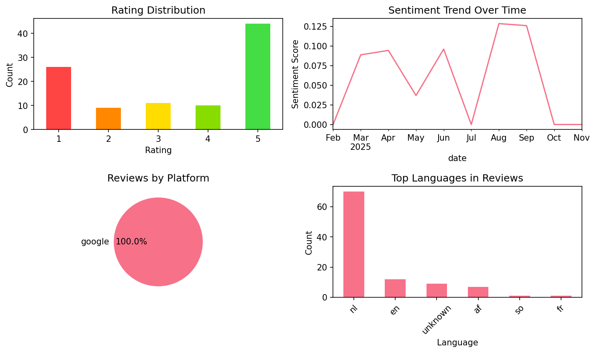
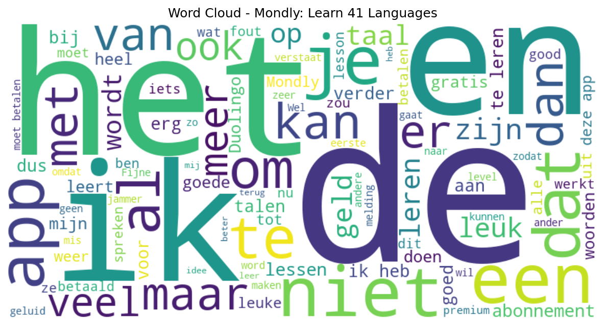

# Mondly: Learn 41 Languages

## 📱 App Information

| **Attribute** | **Google Play** | **App Store** |
|---------------|-----------------|---------------|
| **Title** | Mondly: Learn 41 Languages | N/A |
| **Package/ID** | com.atistudios.mondly.languages | N/A |
| **Rating** | 4.543706 | N/A |
| **Total Ratings** | 917,174 | N/A |
| **Installs** | 10,000,000+ | N/A |
| **Genre** | Education | N/A |

## 📝 Description

🌟 Learn 41 Languages with Mondly: Your Passport to Fluency! 🌟
Join millions already using Mondly to make language learning fun and effective. Whether you're learning for travel, work, or personal growth, Mondly makes it easy. Enjoy quick, engaging lessons that help you learn and speak with confidence. With smart technology and immersive content, mastering a new language has never been easier.


Explore 41 languages: Learn Spanish 🇪🇸🇲🇽, English 🇬🇧🇺🇸, French 🇫🇷, German 🇩🇪, Portuguese 🇧🇷🇵🇹, Italian 🇮🇹, Russian 🇷🇺, Korean 🇰🇷, Japanese 🇯🇵, Chinese 🇨🇳, Arabic, Greek 🇬🇷, Romanian 🇷🇴, Vietnamese 🇻🇳, Indonesian 🇮🇩, Hindi 🇮🇳, Hebrew 🇮🇱, Polish 🇵🇱, Bulgarian 🇧🇬, Ukrainian 🇺🇦, Hungarian 🇭🇺, Czech 🇨🇿, Croatian 🇭🇷, Finnish 🇫🇮, Turkish 🇹🇷, Thai 🇹🇭, Dutch 🇳🇱, Danish 🇩🇰, Swedish 🇸🇪, Norwegian 🇳🇴, Bengali 🇧🇩, Latin, Catalan, Tagalog 🇵🇭, Persian (Farsi), Afrikaans, Urdu 🇵🇰, Slovak 🇸🇰, Latvian 🇱🇻, and Lithuanian 🇱🇹.

🏆Loved by 125 million people worldwide

🚀 Why Choose Mondly for Language Learning? 🚀

Mondly is for all levels—beginner to advanced. Its unique language learning method focuses on real conversations, smart content, and intuitive tech.

🇬🇧 Want to learn English?
With Mondly, you can learn English through fun, effective English courses designed for all levels. Whether you're a beginner or want to be fluent in English, our app helps you improve quickly. Practice daily with bite-sized lessons, realistic conversations, and smart feedback. Start your journey to learn English and be fluent in English—all at your own pace!

✔️ Fun & Effective Learning
Mondly mixes gamified content with real-world use. Each lesson is short, memorable, and helps you learn languages faster.

✔️ Speech Recognition
Practice pronunciation in every lesson. Mondly listens and gives real-time feedback—just like a private language tutor.

✔️ Real-Life Conversations
Lessons mirror everyday conversations. You’ll learn phrases and grammar you can use immediately.

✔️ Smart Adaptive Learning
Everyone learns differently. Mondly adapts your language lessons to fit your learning style and pace.

✔️ Grammar & Vocabulary Tools
Tap a verb for full conjugation. Expand vocabulary with daily exercises and integrated grammar tips that enhance your language learning.

✔️ Immersive Audio Content
100+ dialogues from native speakers let you learn proper pronunciation and natural flow.

✔️ Progress Tracking
Track your progress and see how much you’ve learned with smart stats.

✔️ Social Motivation
Challenge friends or learners worldwide. Stay motivated with global rankings and competitive streaks.

🌟 App Highlights – What You Get With Mondly 🌟
• Daily language lessons to build confidence
• Weekly quizzes & monthly challenges
• 41 full language courses – 1320 combinations
• 200+ practical lessons (travel, work, family & more)
• 38 vocabulary builders for faster word recall
• 3000+ expert-developed lessons
• 260+ video lessons for advanced English learners
• 30+ Pearson-certified English tests
• 300+ business-focused language lessons
• 100+ native speaker conversations
• Verb conjugations and grammar explanations
• Offline mode for anytime learning
• Hands-free mode to learn on the go
• Designed by experts, powered by AI

✨ Start Learning Today ✨
Whether you’re learning your first language or your fourth, Mondly makes every lesson fun and impactful. Build skills in speaking, listening, reading, and writing through smart, enjoyable language learning.

Download Mondly now and learn the language you’ve always wanted—one exciting lesson at a time!

## 📊 Reviews Analytics

**Total Reviews:** 100 (100 analyzed)
**Rating Distribution:** 54 positive (4-5★), 11 neutral (3★), 35 negative (1-2★)
**Average Sentiment:** 0.08 (-1=very negative, +1=very positive)
**Primary Language:** nl
**Key Insights:** Average rating: 3.4/5.0 | Overall sentiment: neutral (score: 0.08) | Reviews in 6 languages, primarily nl (70 reviews) | Reviews from 1 platform(s): google | Key themes: app, een, en


### 🔑 Key Themes & Phrases

- **app** (relevance: 0.091)
- **een** (relevance: 0.072)
- **en** (relevance: 0.070)
- **niet** (relevance: 0.069)
- **het** (relevance: 0.067)
- **ik** (relevance: 0.066)
- **je** (relevance: 0.065)
- **te** (relevance: 0.059)

### ⭐ Rating Breakdown

- **5 ★★★★★**: 44 reviews (44.0%)
- **4 ★★★★☆**: 10 reviews (10.0%)
- **3 ★★★☆☆**: 11 reviews (11.0%)
- **2 ★★☆☆☆**: 9 reviews (9.0%)
- **1 ★☆☆☆☆**: 26 reviews (26.0%)

### 🌍 Languages in Reviews

- **nl**: 70 reviews
- **en**: 12 reviews
- **unknown**: 9 reviews
- **af**: 7 reviews
- **so**: 1 reviews

### 📱 Platform Distribution

- **google**: 100 reviews

## 📈 Visualizations

### Analytics Charts


### Word Cloud


## 💬 Sample Reviews

**Review 1** (★★★ - google - 2025-11-04T19:46:02)
> Het idee is leuk, maar sommige vertalingen kloppen niet helemaal en de spreek oefeningen interpreteren het geluid vaak verkeerd - ik denk dat het probleem is dat vanuit het Engels wordt vertaald naar andere talen. Bijv. Frans - Engels - Nederlands

**Review 2** (★★★★★ - google - 2025-08-01T08:59:12)
> Amazing 😍

**Review 3** (★★ - google - 2025-05-27T20:47:42)
> I understand companies need to earn thier money and stuff but in my opinion ya'll can't say that there is a free course i barely learned to say hello and goodbye and i already have to pay, i understand but the reason i'm giving this 2 stars is because you could better just make the entire app paid a...

**Review 4** (★ - google - 2025-03-23T15:02:29)
> i bought a premium for 1 year, but after buying new phone I need to buy a other one. I don't think. solution?? buying a other premium. do you paying thé samen thing twice?? bye bye mondly. be honest

**Review 5** (★★★★★ - google - 2025-02-26T17:00:05)
> Leuk!

## 🔧 Raw JSON Data

<details>
<summary>Click to expand raw app data</summary>

```json
{
  "name": "Mondly: Learn 41 Languages",
  "google_package": "com.atistudios.mondly.languages",
  "google": {
    "title": "Mondly: Learn 41 Languages",
    "description": "🌟 Learn 41 Languages with Mondly: Your Passport to Fluency! 🌟\r\nJoin millions already using Mondly to make language learning fun and effective. Whether you're learning for travel, work, or personal growth, Mondly makes it easy. Enjoy quick, engaging lessons that help you learn and speak with confidence. With smart technology and immersive content, mastering a new language has never been easier.\r\n\r\n\r\nExplore 41 languages: Learn Spanish 🇪🇸🇲🇽, English 🇬🇧🇺🇸, French 🇫🇷, German 🇩🇪, Portuguese 🇧🇷🇵🇹, Italian 🇮🇹, Russian 🇷🇺, Korean 🇰🇷, Japanese 🇯🇵, Chinese 🇨🇳, Arabic, Greek 🇬🇷, Romanian 🇷🇴, Vietnamese 🇻🇳, Indonesian 🇮🇩, Hindi 🇮🇳, Hebrew 🇮🇱, Polish 🇵🇱, Bulgarian 🇧🇬, Ukrainian 🇺🇦, Hungarian 🇭🇺, Czech 🇨🇿, Croatian 🇭🇷, Finnish 🇫🇮, Turkish 🇹🇷, Thai 🇹🇭, Dutch 🇳🇱, Danish 🇩🇰, Swedish 🇸🇪, Norwegian 🇳🇴, Bengali 🇧🇩, Latin, Catalan, Tagalog 🇵🇭, Persian (Farsi), Afrikaans, Urdu 🇵🇰, Slovak 🇸🇰, Latvian 🇱🇻, and Lithuanian 🇱🇹.\r\n\r\n🏆Loved by 125 million people worldwide\r\n\r\n🚀 Why Choose Mondly for Language Learning? 🚀\r\n\r\nMondly is for all levels—beginner to advanced. Its unique language learning method focuses on real conversations, smart content, and intuitive tech.\r\n\r\n🇬🇧 Want to learn English?\r\nWith Mondly, you can learn English through fun, effective English courses designed for all levels. Whether you're a beginner or want to be fluent in English, our app helps you improve quickly. Practice daily with bite-sized lessons, realistic conversations, and smart feedback. Start your journey to learn English and be fluent in English—all at your own pace!\r\n\r\n✔️ Fun & Effective Learning\r\nMondly mixes gamified content with real-world use. Each lesson is short, memorable, and helps you learn languages faster.\r\n\r\n✔️ Speech Recognition\r\nPractice pronunciation in every lesson. Mondly listens and gives real-time feedback—just like a private language tutor.\r\n\r\n✔️ Real-Life Conversations\r\nLessons mirror everyday conversations. You’ll learn phrases and grammar you can use immediately.\r\n\r\n✔️ Smart Adaptive Learning\r\nEveryone learns differently. Mondly adapts your language lessons to fit your learning style and pace.\r\n\r\n✔️ Grammar & Vocabulary Tools\r\nTap a verb for full conjugation. Expand vocabulary with daily exercises and integrated grammar tips that enhance your language learning.\r\n\r\n✔️ Immersive Audio Content\r\n100+ dialogues from native speakers let you learn proper pronunciation and natural flow.\r\n\r\n✔️ Progress Tracking\r\nTrack your progress and see how much you’ve learned with smart stats.\r\n\r\n✔️ Social Motivation\r\nChallenge friends or learners worldwide. Stay motivated with global rankings and competitive streaks.\r\n\r\n🌟 App Highlights – What You Get With Mondly 🌟\r\n• Daily language lessons to build confidence\r\n• Weekly quizzes & monthly challenges\r\n• 41 full language courses – 1320 combinations\r\n• 200+ practical lessons (travel, work, family & more)\r\n• 38 vocabulary builders for faster word recall\r\n• 3000+ expert-developed lessons\r\n• 260+ video lessons for advanced English learners\r\n• 30+ Pearson-certified English tests\r\n• 300+ business-focused language lessons\r\n• 100+ native speaker conversations\r\n• Verb conjugations and grammar explanations\r\n• Offline mode for anytime learning\r\n• Hands-free mode to learn on the go\r\n• Designed by experts, powered by AI\r\n\r\n✨ Start Learning Today ✨\r\nWhether you’re learning your first language or your fourth, Mondly makes every lesson fun and impactful. Build skills in speaking, listening, reading, and writing through smart, enjoyable language learning.\r\n\r\nDownload Mondly now and learn the language you’ve always wanted—one exciting lesson at a time!",
    "rating": 4.543706,
    "rating_text": null,
    "ratings_total": 917174,
    "ratings_histogram": [
      39167,
      18419,
      44082,
      118304,
      697148
    ],
    "installs": "10,000,000+",
    "genre": "Education"
  },
  "apple": null,
  "reviews": [
    {
      "platform": "google",
      "rating": 3,
      "review": "Het idee is leuk, maar sommige vertalingen kloppen niet helemaal en de spreek oefeningen interpreteren het geluid vaak verkeerd - ik denk dat het probleem is dat vanuit het Engels wordt vertaald naar andere talen. Bijv. Frans - Engels - Nederlands",
      "date": "2025-11-04T19:46:02"
    },
    {
      "platform": "google",
      "rating": 5,
      "review": "Gisteren overgestapt van Duolingo naar Mondly, omdat Duo met iedere update beroerder wordt. Tot nu toe zeer tevreden. De app is veel sneller, je krijgt meer uitleg, je leert per onderwerp, het is mogelijk om geleerde dingen terug te zoeken, je krijgt meer uitleg over/inzicht in vervoegingen van verleden tijd en toekomst, niet zulk extreem gamify-gedoe. Dit is nog beter dan Duo jaren geleden was. Ik raad het iedereen aan. Hopelijk gaan ze in de toekomst niet dezelfde fouten als Duolingo maken.",
      "date": "2025-11-02T23:40:10"
    },
    {
      "platform": "google",
      "rating": 5,
      "review": "Erg fijne app! Fijne lesmethode, ik heb al meer geleerd dan met Duolingo. Scheelt ook behoorlijk in prijs.",
      "date": "2025-10-16T16:32:20"
    },
    {
      "platform": "google",
      "rating": 5,
      "review": "Hele leuke app om snel een taal te leren",
      "date": "2025-10-09T13:06:19"
    },
    {
      "platform": "google",
      "rating": 5,
      "review": "goed",
      "date": "2025-10-02T21:53:16"
    },
    {
      "platform": "google",
      "rating": 5,
      "review": "nice and fun",
      "date": "2025-09-29T22:05:22"
    },
    {
      "platform": "google",
      "rating": 1,
      "review": "Veel te ingewikkeld voor beginner",
      "date": "2025-09-27T15:14:26"
    },
    {
      "platform": "google",
      "rating": 1,
      "review": "betaald, doch opent nog steeds als gratis en beperkt abonnement. mailtjes helpen niet.",
      "date": "2025-09-25T20:12:29"
    },
    {
      "platform": "google",
      "rating": 5,
      "review": "great program really easy set up for kids excellent , just exploring and later I will buy it.",
      "date": "2025-09-18T14:51:15"
    },
    {
      "platform": "google",
      "rating": 5,
      "review": "leuk om.n andere taal te leren met deze app",
      "date": "2025-09-10T22:19:23"
    },
    {
      "platform": "google",
      "rating": 4,
      "review": "2 dagen bezig en ben enthousiast. Ik spreek en lees al een beetje Thais, deze app helpt hier zeker bij. Wel mis ik een mannenstem. De persoonsvorm 'ik' verschilt namelijk tussen mannen en vrouwen. Als man leer je dan het verkeerde woord.",
      "date": "2025-09-08T13:45:01"
    },
    {
      "platform": "google",
      "rating": 5,
      "review": "fijn uitgewerkte app!",
      "date": "2025-09-03T00:35:54"
    },
    {
      "platform": "google",
      "rating": 1,
      "review": "ik zou nog steeds ingeschreven staan maar ik wil deze app helemaal niet. graag slle gegevens van mij verwijdrren, ik kan er niet in, dus moeten jullie het maar doen.",
      "date": "2025-09-02T15:20:21"
    },
    {
      "platform": "google",
      "rating": 1,
      "review": "Moet betalen om te praten kunnen met een ander",
      "date": "2025-08-30T10:59:57"
    },
    {
      "platform": "google",
      "rating": 5,
      "review": "Een heel handige app om je talen bij te spijkeren.",
      "date": "2025-08-29T11:03:12"
    },
    {
      "platform": "google",
      "rating": 5,
      "review": "Great learning ap but you cant make any mistakes or you go down in stars",
      "date": "2025-08-27T17:01:42"
    },
    {
      "platform": "google",
      "rating": 1,
      "review": "je kan maar één ding doen en voor de rest moet je betalen",
      "date": "2025-08-24T14:06:15"
    },
    {
      "platform": "google",
      "rating": 5,
      "review": "leerde leuk",
      "date": "2025-08-21T16:37:55"
    },
    {
      "platform": "google",
      "rating": 5,
      "review": "goede lessen",
      "date": "2025-08-19T12:11:38"
    },
    {
      "platform": "google",
      "rating": 2,
      "review": "spraak opdrachten zijn slecht Alles wat je zegt word anders gezegd",
      "date": "2025-08-17T21:39:40"
    },
    {
      "platform": "google",
      "rating": 5,
      "review": "dit is perfect love this echt een aanrader 😊😊",
      "date": "2025-08-15T17:28:26"
    },
    {
      "platform": "google",
      "rating": 1,
      "review": "pas verderop in de registratie merk je dat het een betaal dingetje is.... waarom niet gelijk bij de specs voordat je gaat installeren?",
      "date": "2025-08-14T18:53:16"
    },
    {
      "platform": "google",
      "rating": 3,
      "review": "Een groot nadeel is dat de app niet synchroniseert. leer je de taal op je tablet en je smartphone dan zijn de vorderingen en de opgeslagen woorden niet gelijk. Als je uitlogt ben je de opgeslagen woorden zowieso kwijt. Nieuwe woorden opslaan is handig om ze te herhalen.",
      "date": "2025-08-06T18:56:30"
    },
    {
      "platform": "google",
      "rating": 3,
      "review": "leuke app. alleen jammer dat je niet goed kan inspreken. De AI verstaat je gewoon niet. Juliet verstaat het tot drie keer als Julien ciel verstaat het als si elle. Dan wordt het fout gekeurd ondanks dat je het goed zegt. Dat maakt het leren vervelend omdat een mens het wel goed verstaat. In het Frans worden veel letters niet uitgesproken en daar zou het rekening mee moeten houden.",
      "date": "2025-08-05T20:20:09"
    },
    {
      "platform": "google",
      "rating": 3,
      "review": "Leuk",
      "date": "2025-08-03T20:54:40"
    },
    {
      "platform": "google",
      "rating": 5,
      "review": "Amazing 😍",
      "date": "2025-08-01T08:59:12"
    },
    {
      "platform": "google",
      "rating": 1,
      "review": "ik hen het idee dat niet alle woorden kloppen",
      "date": "2025-07-29T22:16:03"
    },
    {
      "platform": "google",
      "rating": 5,
      "review": "ben het al vergeet",
      "date": "2025-07-27T13:45:16"
    },
    {
      "platform": "google",
      "rating": 4,
      "review": "€59,99 betaald maar na 3 dagen kon ik de lessen niet meer volgen, kreeg de melding dat ik moest betalen, als ik op de activeer link druk kreeg ik de melding dat ik al een abonnement had. Contact opgenomen, in eerste instantie keurig reactie, alle gevraagde info gestuurd (bijv bevestiging van abonnement). Er werd met mijn gegevens geen abonnement gevonden, er werd gevraagd uit te loggen en opnieuw in te loggen, helaas geen resultaat. Na opnieuw contact toch opgelost gelukkig",
      "date": "2025-07-25T17:28:42"
    },
    {
      "platform": "google",
      "rating": 5,
      "review": "dank u dat jij er bent o merci tu est la",
      "date": "2025-07-25T17:08:31"
    },
    {
      "platform": "google",
      "rating": 4,
      "review": "leuk",
      "date": "2025-07-23T15:59:10"
    },
    {
      "platform": "google",
      "rating": 1,
      "review": "Je wordt niet gewaarschuwd als je proefperiode afloopt. En als je dan vast zit aan een jaarabonnement en alvast opzegt, krijg je bij elke start reclame om te verlengen. ik heb er al geen zin meer in. weggegooid geld voor mij.",
      "date": "2025-07-20T07:56:21"
    },
    {
      "platform": "google",
      "rating": 5,
      "review": "leipste taal app ooit. dankzij mondly kan ik nu bulgaars russisch japans en spaans.",
      "date": "2025-07-19T23:20:49"
    },
    {
      "platform": "google",
      "rating": 2,
      "review": "teveel reclame - is betaald niet gratis",
      "date": "2025-07-16T22:58:45"
    },
    {
      "platform": "google",
      "rating": 1,
      "review": "Waarom is altijd in elke app van talen, de Portugees van Portugal is ALTIJD in Braziliaanse gesproken? 👎🏼 Grote fout",
      "date": "2025-06-28T09:44:57"
    },
    {
      "platform": "google",
      "rating": 5,
      "review": "Ik heb Mondly net pas gedownload, maar het ziet er tot nu toe echt goed uit. De lessen zijn duidelijk, interactief en je leert meteen zinnen die je kunt gebruiken. Je kunt uit 41 talen kiezen, wat super is! Alles werkt overzichtelijk en motiverend. Ik ben benieuwd hoe het verder gaat, maar eerste indruk is zeker positief.",
      "date": "2025-06-25T09:11:29"
    },
    {
      "platform": "google",
      "rating": 1,
      "review": "de app kan zelf de andere taal niet dat de app me probeert te leren, hierdoor kan ik de lessen niet goed maken. spreken valt niet te leren met deze app. erg frustrerend om met deze app iets te proberen leren",
      "date": "2025-06-24T09:20:36"
    },
    {
      "platform": "google",
      "rating": 5,
      "review": "geweldige manier van leren, bevalt mij beter dan Duolingo",
      "date": "2025-06-22T18:44:33"
    },
    {
      "platform": "google",
      "rating": 4,
      "review": "ng niet getests!",
      "date": "2025-06-20T13:15:52"
    },
    {
      "platform": "google",
      "rating": 2,
      "review": "you keep using words that are not explained in the list....like the word \"kawanakereba\" which is not in the past or future words list, and is not explained at all. good concept but plz give more context and grammar explanation",
      "date": "2025-06-13T03:06:42"
    },
    {
      "platform": "google",
      "rating": 1,
      "review": "You can only take one free lesson and then you have to pay.",
      "date": "2025-06-10T23:56:53"
    },
    {
      "platform": "google",
      "rating": 2,
      "review": "geluid signalen (los van de stemmen) zijn irritant en kunnen niet uit.",
      "date": "2025-06-08T21:32:43"
    },
    {
      "platform": "google",
      "rating": 1,
      "review": "Waardeloos, ik heb in 2023 mijn abonnement opgezgd bij googleplay ze blijven gewoon geld afschrijven terwijl ik kan aantonen dat ik dit abonnement niet in mijn bezit heb. dus kijk uit!!!",
      "date": "2025-06-04T21:43:33"
    },
    {
      "platform": "google",
      "rating": 1,
      "review": "gratis app zeggen ze vervolgens blijkt het 4.99 p.m te zijn .",
      "date": "2025-06-03T23:28:05"
    },
    {
      "platform": "google",
      "rating": 4,
      "review": "veel fijner dan Duolingo. je kan zelf kiezen welk thema van toepassing in wat je wil leren ( reizen, zakelijk, familie etc)",
      "date": "2025-06-03T21:57:56"
    },
    {
      "platform": "google",
      "rating": 5,
      "review": "leuke en zeer duidelijke lessen",
      "date": "2025-06-03T15:08:07"
    },
    {
      "platform": "google",
      "rating": 5,
      "review": "Its good for learning langauge",
      "date": "2025-06-02T17:28:46"
    },
    {
      "platform": "google",
      "rating": 1,
      "review": "verplicht Facebook tracking is een no go .",
      "date": "2025-06-02T02:37:48"
    },
    {
      "platform": "google",
      "rating": 5,
      "review": "Ik zou zo graag Albanees(Shqip) willen leren via deze app. Hopelijk is dat de volgende taal die hieraan toegevoegd wordt.",
      "date": "2025-05-29T14:23:36"
    },
    {
      "platform": "google",
      "rating": 1,
      "review": "heel slechte app je kan 1 les gratis doen en dan moet je premium nemen om verder te kunnen",
      "date": "2025-05-28T14:28:00"
    },
    {
      "platform": "google",
      "rating": 2,
      "review": "I understand companies need to earn thier money and stuff but in my opinion ya'll can't say that there is a free course i barely learned to say hello and goodbye and i already have to pay, i understand but the reason i'm giving this 2 stars is because you could better just make the entire app paid and you are basically lying if you say that there is a free course, there isn't really, even still i don't 100% understand i think ya'll would earn more by charging for some features instead of all",
      "date": "2025-05-27T20:47:42"
    },
    {
      "platform": "google",
      "rating": 5,
      "review": "Duidelijk en makkelijk programma. Vooral mooi dat je het ook leert uitspreken via een recorder.",
      "date": "2025-05-26T14:38:35"
    },
    {
      "platform": "google",
      "rating": 3,
      "review": "Mijn abonnement tot januari lijkt het niet meer te doen.",
      "date": "2025-05-26T10:54:11"
    },
    {
      "platform": "google",
      "rating": 1,
      "review": "Ik geeft aan dat ik al zinnetjes kan spreken in het Spaans. Helaas zijn de oefeningen beneden niveau: la madre, la hermana, hola etc. Wat heeft het nut dan om mijn niveau aan te geven? Ik had gehoopt dat er al iets verbeterd zou zijn sind de vorige keer. Ik probeer het volgend jaar nogmaals om te kijken of het dan verbeterd is en ga het nu weer verwijderen",
      "date": "2025-05-25T22:49:40"
    },
    {
      "platform": "google",
      "rating": 1,
      "review": "wil continentaal portugees leren, maar krijg iemand met een Braziliaans accent. is zo irritant.",
      "date": "2025-05-19T15:19:43"
    },
    {
      "platform": "google",
      "rating": 5,
      "review": "gave app leer zo veel",
      "date": "2025-05-15T21:41:14"
    },
    {
      "platform": "google",
      "rating": 5,
      "review": "zeer toegankelijk en snelle leermethode",
      "date": "2025-05-15T08:27:48"
    },
    {
      "platform": "google",
      "rating": 2,
      "review": "Er zitten fouten in waar ik me aan erger. voorbeeld in het Portugees: Ik heb een spijkerbroek mondly leert me \" Eu tenho um par de Jeans (Ik heb een paar soijkerbroeken.)",
      "date": "2025-05-14T10:51:01"
    },
    {
      "platform": "google",
      "rating": 5,
      "review": "👍",
      "date": "2025-05-13T10:38:08"
    },
    {
      "platform": "google",
      "rating": 1,
      "review": "Very greedy for money. Only very basic lessons available, not even a little bit more advanced conversations, why should you pay 59,99 for this",
      "date": "2025-05-13T06:06:02"
    },
    {
      "platform": "google",
      "rating": 1,
      "review": "Wordt aangeprezen als gratis maar dat is het dus niet. Wel een heel schappelijke prijs maar toch niet eerlijk!!!!",
      "date": "2025-05-12T22:13:11"
    },
    {
      "platform": "google",
      "rating": 5,
      "review": "Ik ben er erg blij mee. Ik vind Turks een erg moeilijke taal om te leren en met Mondly wordt het speels en leuk. Ik gebruik de app heel veel. Heb ook voor een betaalde abonnement gekozen.",
      "date": "2025-04-30T11:47:32"
    },
    {
      "platform": "google",
      "rating": 4,
      "review": "nice",
      "date": "2025-04-25T16:20:13"
    },
    {
      "platform": "google",
      "rating": 3,
      "review": "€59,99 betaald maar kan de lessen niet volgen. blijf steeds de melding krijgen dat ik moet betalen. en als ik daar dan op klik krijg ik de melding dat ik al een abonnement heb voor 41 talen. maar kan er nog steeds niet in! ik heb het geld inmiddels terug gekregen. weer opnieuw betaald. en nu werkt de app wel. bedankt daarvoor",
      "date": "2025-04-24T13:07:33"
    },
    {
      "platform": "google",
      "rating": 5,
      "review": "werkt goed",
      "date": "2025-04-24T03:48:57"
    },
    {
      "platform": "google",
      "rating": 5,
      "review": "Geweldig goede app om een taal te leren.",
      "date": "2025-04-20T13:57:02"
    },
    {
      "platform": "google",
      "rating": 5,
      "review": "masha'allah",
      "date": "2025-04-16T17:16:35"
    },
    {
      "platform": "google",
      "rating": 1,
      "review": "Veel te kleine letters, nauwelijks te lezen",
      "date": "2025-04-13T11:17:47"
    },
    {
      "platform": "google",
      "rating": 5,
      "review": "Heel fijn omdat voor veel talen ook een spraakmodule beschikbaar is zodat je het ook leert spreken",
      "date": "2025-04-01T10:50:06"
    },
    {
      "platform": "google",
      "rating": 3,
      "review": "Goede app om een andere taal te oefenen. Alleen jammer dat de letters zo klein zijn. Verder ook jammer dat je met zinnen invullen je het exact moet invullen hoe hun het wil hebben anders wordt het fout gerekend.",
      "date": "2025-04-01T08:11:51"
    },
    {
      "platform": "google",
      "rating": 2,
      "review": "bij les drie registreert hij geen geluid meer",
      "date": "2025-03-29T18:05:31"
    },
    {
      "platform": "google",
      "rating": 4,
      "review": "Still few lessons and complements.",
      "date": "2025-03-29T10:22:55"
    },
    {
      "platform": "google",
      "rating": 1,
      "review": "en weer betalen jammer dit. gaan we dus niet doen",
      "date": "2025-03-29T09:31:57"
    },
    {
      "platform": "google",
      "rating": 2,
      "review": "Geluid is momenteel niet OK en de Nederlandse vertalingen zijn dikwijls onjuist.",
      "date": "2025-03-28T14:02:28"
    },
    {
      "platform": "google",
      "rating": 5,
      "review": "zeer leerzaam, een goede methode",
      "date": "2025-03-26T18:52:39"
    },
    {
      "platform": "google",
      "rating": 1,
      "review": "i bought a premium for 1 year, but after buying new phone I need to buy a other one. I don't think. solution?? buying a other premium. do you paying thé samen thing twice?? bye bye mondly. be honest",
      "date": "2025-03-23T15:02:29"
    },
    {
      "platform": "google",
      "rating": 5,
      "review": "Love the app! But due to health reasons, my sibling and I needed to take a long break. More than a year. Is there any way to make the lessoms restart counting from today, but starting where we left off?",
      "date": "2025-03-22T22:10:38"
    },
    {
      "platform": "google",
      "rating": 3,
      "review": "Not useful for Croatian. I bought the lifetime app subscription for my daughter to learn Croatian. As a native Croatian speaker I found the initial lesson very good, but after subscribing I was very disappointed about the content of the next lessons. The level of difficulty goes up extremely making the app unusable for someone new to the language. I received a refund, hence 3 stars instead of 1.",
      "date": "2025-03-21T21:21:12"
    },
    {
      "platform": "google",
      "rating": 5,
      "review": "als starters een goede ervaring en niet duur..",
      "date": "2025-03-20T09:05:33"
    },
    {
      "platform": "google",
      "rating": 1,
      "review": "was erg leuk, had een abbonement afgesloten met maandelijkse betaling. de proefperiode zojuist gestopt en mail gehad dat geld wordt afgeschreven .. en rara Nu doet de app het niet meer want moet me abonneren !!!!!",
      "date": "2025-03-19T08:36:31"
    },
    {
      "platform": "google",
      "rating": 1,
      "review": "Gratis is niet gratis",
      "date": "2025-03-18T21:26:02"
    },
    {
      "platform": "google",
      "rating": 4,
      "review": "good",
      "date": "2025-03-18T17:24:10"
    },
    {
      "platform": "google",
      "rating": 5,
      "review": "ik heb er veel aan leert makkelijker",
      "date": "2025-03-16T00:17:06"
    },
    {
      "platform": "google",
      "rating": 5,
      "review": "Good thank you",
      "date": "2025-03-15T19:54:07"
    },
    {
      "platform": "google",
      "rating": 5,
      "review": "Top !",
      "date": "2025-03-15T16:38:51"
    },
    {
      "platform": "google",
      "rating": 5,
      "review": "Geweldige app om te leren. Vele malen fijner dan Duolingo naar mijn mening.",
      "date": "2025-03-12T19:25:08"
    },
    {
      "platform": "google",
      "rating": 5,
      "review": "Het speelse en de keuze van dagelijkse woorden.",
      "date": "2025-03-11T09:03:30"
    },
    {
      "platform": "google",
      "rating": 3,
      "review": "Na een moeilijk begin toegang tot alle lessen. Elke dag 10 min oefenen. App is makkelijk begrijpbaar en handelbaar.",
      "date": "2025-03-11T08:54:44"
    },
    {
      "platform": "google",
      "rating": 3,
      "review": "Sinds de laatste update loopt er soms iets mis met de actieve oefening op scherm de ge gesproken tekst. De tekst van de opdracht en gesproken zijn totaal verschillend, is dus heel vervelend zorgt soms voor een fout antwoord. Dus verlaagd van 5 naar3 steren",
      "date": "2025-03-10T11:44:33"
    },
    {
      "platform": "google",
      "rating": 4,
      "review": "Fijne app om een taal mee te leren. Prima om een basis op te bouwen. Nadeel is dat de robot/computer zinnen als fout ziet, zodra de volgorde van de woorden iets anders is. Ook heeft het soms moeite met uitspraak herkennen, wat frustrerend kan zijn. Ook mis ik grammaticale ondersteuning.",
      "date": "2025-03-09T14:25:34"
    },
    {
      "platform": "google",
      "rating": 1,
      "review": "Ze doelen er continu op dat je er geld aan besteedt. Ik verwijder de app weer.",
      "date": "2025-03-09T13:27:15"
    },
    {
      "platform": "google",
      "rating": 3,
      "review": "Ik moet geld betalen voor dat ik verder kan leren dus nee ik vind het niet normaal dat ik geld moet betalen zodat ik de tweede level kan leren dus nee niet leuk als jullie dat weg doen dan ga ik weer verder maar nu slaat het nergens op dat ik geld moet betalen om level 2 te doen en ook alle anderen level onbegrijpelijk alsjeblieft doe dat weg en dan ga ik weer verder leren weg met het geld betalen stop met geld zodat ik verder pas kan leren oké als jullie het veranderen dan geef ik 5 sterren oké",
      "date": "2025-03-08T12:50:09"
    },
    {
      "platform": "google",
      "rating": 2,
      "review": "Leuke app en je leert er ook veel van. Sinds kort zie je om de vijf antwoorden een dartbord met een pijltje. Dit is een beetje veel van het goede en ook erg irritant. Misschien een idee om het met een knop uit of aan te kunnen zetten. Het \"spreken\" gedeelte is bij de wekelijkse en de maandelijkse overhoring erg lang en dodelijk saai. Misschien is het mogelijk om dat iets levendiger te maken. In elk geval niet drie keer achter elkaar dezelfde vraag te stellen.",
      "date": "2025-03-07T08:00:35"
    },
    {
      "platform": "google",
      "rating": 5,
      "review": "Leuke leerzame app",
      "date": "2025-03-05T14:33:03"
    },
    {
      "platform": "google",
      "rating": 5,
      "review": "Gaat verder daar waar duolingo ophoudt. Tot nu toe erg leerzaam",
      "date": "2025-03-05T12:22:36"
    },
    {
      "platform": "google",
      "rating": 4,
      "review": "veel talen. Focus meer op woorden (en spreken) dan grammatica. Optionele dagelijkse lessen, spelelement, inspreken, allemaal leuke opties, handsfree in de auto zou bijna weren als ingesproken getallen uitgeschreven worden, omdat controle plaatsvindt op uitgeschreven getallen. Handsfree kan beter door de eerste fonemen goed op te nemen. het lijkt alsof de app die eerste fonemen raadt, en dat gaat mis als er maar een woord van een of twee lettergrepen ingesproken hoeft te worden.",
      "date": "2025-03-02T16:35:25"
    },
    {
      "platform": "google",
      "rating": 5,
      "review": "Fijne app, leuk om nieuwe talen te leren",
      "date": "2025-03-02T12:05:30"
    },
    {
      "platform": "google",
      "rating": 5,
      "review": "Heel goede app maar plots werkt mijn micro niet meer zodat ik niets meer kan inspreken. Werkt terug normaal.",
      "date": "2025-03-02T11:39:15"
    },
    {
      "platform": "google",
      "rating": 1,
      "review": "geldzucht door maar naar premium te moeten upgraden en dan nog meer... Onmogelijk bij betaalde niet-premium om lessen te maken...!!!",
      "date": "2025-03-01T05:46:05"
    },
    {
      "platform": "google",
      "rating": 5,
      "review": "Leuk!",
      "date": "2025-02-26T17:00:05"
    }
  ]
}
```

</details>

---
*Report generated on 2025-11-08 13:49:06 using advanced analytics*
