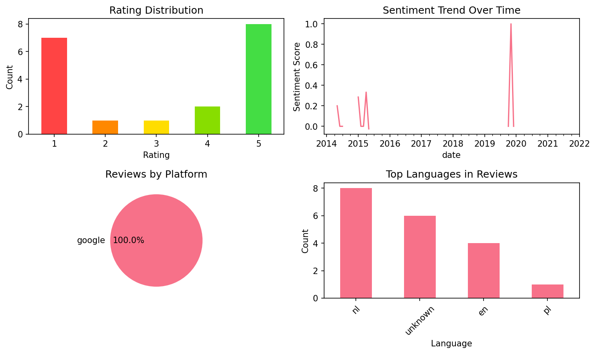

# Learn Dutch Phrases

## 📱 App Information

| **Attribute** | **Google Play** | **App Store** |
|---------------|-----------------|---------------|
| **Title** | Learn Dutch Phrases | N/A |
| **Package/ID** | com.bravolang.dutch | N/A |
| **Rating** | 4.724138 | N/A |
| **Total Ratings** | 4,658 | N/A |
| **Installs** | 100,000+ | N/A |
| **Genre** | Education | N/A |

## 📝 Description

Easily learn Dutch phrases and words! Speak Dutch with confidence!

By using this "Learn Dutch" app, you can learn Dutch phrases and words from our native Dutch speaking parrot. The parrot works together with you to practice your speaking and listening skills. Learning Dutch can never be easier!

When traveling to Netherlands (e.g., Amsterdam), you can ask the parrot to speak on behalf of you. Language barrier will no longer stop you from communicating with Dutch people!

FEATURES 

- Commonly-used Dutch phrases & words
- Pronunciation recorded by native speaker
- Instant search by Dutch or English
- No Internet connection required
- Customizable font size

ABOUT Bravolol 

- Web site: 
http://www.bravolol.com 

- Facebook: 
http://www.facebook.com/Bravolol 

- Twitter: 
https://twitter.com/BravololApps

- Instagram:
https://www.instagram.com/bravolol/

- Email: 
cs@bravolol.com

## 📊 Reviews Analytics

**Total Reviews:** 19 (19 analyzed)
**Rating Distribution:** 10 positive (4-5★), 1 neutral (3★), 8 negative (1-2★)
**Average Sentiment:** 0.18 (-1=very negative, +1=very positive)
**Primary Language:** nl
**Key Insights:** Average rating: 3.2/5.0 | Overall sentiment: positive (score: 0.18) | Reviews in 4 languages, primarily nl (8 reviews) | Reviews from 1 platform(s): google | Key themes: goed, niet, app


### 🔑 Key Themes & Phrases

- **goed** (relevance: 0.170)
- **niet** (relevance: 0.152)
- **app** (relevance: 0.125)
- **slechte** (relevance: 0.083)
- **kan** (relevance: 0.078)
- **good** (relevance: 0.074)
- **uitspraak** (relevance: 0.071)
- **zeer** (relevance: 0.066)

### ⭐ Rating Breakdown

- **5 ★★★★★**: 8 reviews (42.1%)
- **4 ★★★★☆**: 2 reviews (10.5%)
- **3 ★★★☆☆**: 1 reviews (5.3%)
- **2 ★★☆☆☆**: 1 reviews (5.3%)
- **1 ★☆☆☆☆**: 7 reviews (36.8%)

### 🌍 Languages in Reviews

- **nl**: 8 reviews
- **unknown**: 6 reviews
- **en**: 4 reviews
- **pl**: 1 reviews

### 📱 Platform Distribution

- **google**: 19 reviews

## 📈 Visualizations

### Analytics Charts


### Word Cloud


## 💬 Sample Reviews

**Review 1** (★★★★★ - google - 2022-01-03T17:06:08)
> Goed

**Review 2** (★★★★★ - google - 2019-10-12T06:08:18)
> Zeer goed

**Review 3** (★★ - google - 2015-05-19T15:59:31)
> I'm Dutch and just checked this app out for fun. Some phrases make no sense at all and the pronunciation is not good.

**Review 4** (★ - google - 2014-07-14T21:25:29)
> De klemtoon is niet goed

**Review 5** (★ - google - 2013-12-20T09:27:35)
> This is not how we speak Dutch... This is just the voice of Google translate! And the translation isn't even always right...

## 🔧 Raw JSON Data

<details>
<summary>Click to expand raw app data</summary>

```json
{
  "name": "Learn Dutch Phrases",
  "google_package": "com.bravolang.dutch",
  "google": {
    "title": "Learn Dutch Phrases",
    "description": "Easily learn Dutch phrases and words! Speak Dutch with confidence!\r\n\r\nBy using this \"Learn Dutch\" app, you can learn Dutch phrases and words from our native Dutch speaking parrot. The parrot works together with you to practice your speaking and listening skills. Learning Dutch can never be easier!\r\n\r\nWhen traveling to Netherlands (e.g., Amsterdam), you can ask the parrot to speak on behalf of you. Language barrier will no longer stop you from communicating with Dutch people!\r\n\r\nFEATURES \r\n\r\n- Commonly-used Dutch phrases & words\r\n- Pronunciation recorded by native speaker\r\n- Instant search by Dutch or English\r\n- No Internet connection required\r\n- Customizable font size\r\n\r\nABOUT Bravolol \r\n\r\n- Web site: \r\nhttp://www.bravolol.com \r\n\r\n- Facebook: \r\nhttp://www.facebook.com/Bravolol \r\n\r\n- Twitter: \r\nhttps://twitter.com/BravololApps\r\n\r\n- Instagram:\r\nhttps://www.instagram.com/bravolol/\r\n\r\n- Email: \r\ncs@bravolol.com",
    "rating": 4.724138,
    "rating_text": null,
    "ratings_total": 4658,
    "ratings_histogram": [
      151,
      0,
      0,
      636,
      3849
    ],
    "installs": "100,000+",
    "genre": "Education"
  },
  "apple": null,
  "reviews": [
    {
      "platform": "google",
      "rating": 5,
      "review": "Goed",
      "date": "2022-01-03T17:06:08"
    },
    {
      "platform": "google",
      "rating": 3,
      "review": "Good but unsatisfied u should add more words....for learning",
      "date": "2020-04-09T17:28:00"
    },
    {
      "platform": "google",
      "rating": 5,
      "review": "Zeer goed",
      "date": "2019-12-07T23:27:08"
    },
    {
      "platform": "google",
      "rating": 5,
      "review": "Perfect 👌",
      "date": "2019-11-12T01:13:47"
    },
    {
      "platform": "google",
      "rating": 5,
      "review": "Zeer goed",
      "date": "2019-10-12T06:08:18"
    },
    {
      "platform": "google",
      "rating": 5,
      "review": "Heel goed",
      "date": "2016-01-29T14:30:32"
    },
    {
      "platform": "google",
      "rating": 4,
      "review": "Omdet je meer kan leren:-)",
      "date": "2016-01-15T20:21:21"
    },
    {
      "platform": "google",
      "rating": 1,
      "review": "Slechte vertalingen",
      "date": "2016-01-13T15:45:53"
    },
    {
      "platform": "google",
      "rating": 5,
      "review": "App",
      "date": "2015-10-04T13:32:25"
    },
    {
      "platform": "google",
      "rating": 2,
      "review": "I'm Dutch and just checked this app out for fun. Some phrases make no sense at all and the pronunciation is not good.",
      "date": "2015-05-19T15:59:31"
    },
    {
      "platform": "google",
      "rating": 1,
      "review": "Super slechte uitspraak",
      "date": "2015-04-07T20:18:08"
    },
    {
      "platform": "google",
      "rating": 5,
      "review": "Leuk want mijn vriendin is Duits en ze kan niet Nederlands spreken",
      "date": "2015-03-27T21:30:46"
    },
    {
      "platform": "google",
      "rating": 4,
      "review": "Leuke app. Ben hem nog aan het verkennen.",
      "date": "2015-02-27T13:07:01"
    },
    {
      "platform": "google",
      "rating": 1,
      "review": "Pronunciation isn't right.",
      "date": "2015-01-20T05:44:44"
    },
    {
      "platform": "google",
      "rating": 1,
      "review": "De klemtoon is niet goed",
      "date": "2014-07-14T21:25:29"
    },
    {
      "platform": "google",
      "rating": 1,
      "review": "De uitspraak klopt niet",
      "date": "2014-06-13T21:08:36"
    },
    {
      "platform": "google",
      "rating": 1,
      "review": "Haha zo praten we niet",
      "date": "2014-05-06T20:30:17"
    },
    {
      "platform": "google",
      "rating": 5,
      "review": "Super makkelijk in een paar uur kan je al heel veel dingen zegen en leren",
      "date": "2013-12-21T19:37:39"
    },
    {
      "platform": "google",
      "rating": 1,
      "review": "This is not how we speak Dutch... This is just the voice of Google translate! And the translation isn't even always right...",
      "date": "2013-12-20T09:27:35"
    }
  ]
}
```

</details>

---
*Report generated on 2025-11-08 13:49:18 using advanced analytics*
