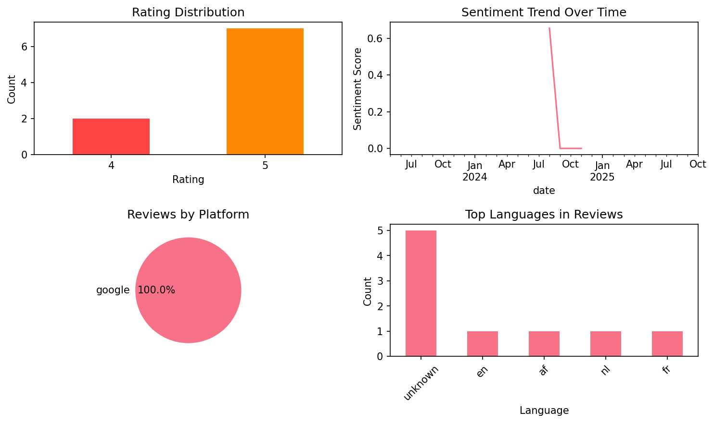
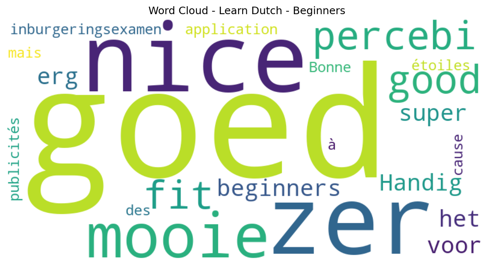

# Learn Dutch - Beginners

## 📱 App Information

| **Attribute** | **Google Play** | **App Store** |
|---------------|-----------------|---------------|
| **Title** | Learn Dutch - Beginners | N/A |
| **Package/ID** | com.breboucas.holandesparaviajar | N/A |
| **Rating** | 4.6309524 | N/A |
| **Total Ratings** | 4,807 | N/A |
| **Installs** | 100,000+ | N/A |
| **Genre** | Education | N/A |

## 📝 Description

Want to learn Dutch online for free? Join over 30 million people who have chosen to study with the BNR Languages apps!

Dutch for beginners — designed for anyone who wants to learn Dutch from scratch and study at their own pace, in a simple and practical way.

With interactive activities and native audio to help with pronunciation and listening comprehension, you'll learn Dutch quickly and intuitively.

Study on your own, in your own time, with no daily limits. Choose what you want to practice: reading, writing, listening, or vocabulary. Everything is easy to use and personalized for you.

Exercises use images to help you memorize words, and the review mode lets you practice and refresh everything you've already learned — anytime you want.

Learning a new language has never been easier, more accessible, and 100% free!

Find out why our app is the ideal choice to study anytime, anywhere:

- Complete offline Dutch course — from beginner to advanced levels.

- Learn on your own! Study Dutch independently, at your own pace, without needing teachers or tutors.

- 100% free! All content and features are available for free — you don't need to pay to learn!

- Start from the very beginning, learning the alphabet!

- Set your own study time. Learn as much as you want — no time limits! No daily activity limits! Practice and learn as many times as you like every day!

- Large selection of words to help expand your vocabulary.

- Interactive exercises with images that make it easier to memorize new words! Learn in a fun and easy way — with a gamified interface that makes studying feel like playing a game.

- Review mode to practice and refresh everything you've already learned.

- Native audio recordings with adjustable playback speed.

- Different types of tests! Practice your reading, writing, and listening skills.

- Full translation available in many languages: Chinese, Spanish, English, Hindi, Arabic, Bengali, Portuguese, Russian, Japanese, Korean, French, Turkish, Vietnamese, Italian, Thai, Persian, Indonesian, Urdu, Polish, Ukrainian, Malay, Uzbek, Romanian, Dutch, Greek, Czech, Hungarian, Swedish, Belarusian, Bulgarian, Croatian, Danish, Norwegian, Slovak, Finnish, Hebrew, Irish, Catalan, Swahili.

- Choose what you want to study and customize your learning experience.

- Perfect for learning Dutch quickly — whether for travel, work, study, or to connect with family and friends.

- Simple, intuitive, and user-friendly interface for all ages.

- No internet connection needed to learn Dutch! The app works completely offline.

- Earn medals, track your progress, and stay motivated.

- Join the weekly ranking and compete with other users!

- New words and vocabulary categories added regularly.

Download the BNR Languages app now and start your Dutch course!

## 📊 Reviews Analytics

**Total Reviews:** 9 (9 analyzed)
**Rating Distribution:** 9 positive (4-5★), 0 neutral (3★), 0 negative (1-2★)
**Average Sentiment:** 0.18 (-1=very negative, +1=very positive)
**Primary Language:** unknown
**Key Insights:** Average rating: 4.8/5.0 | Overall sentiment: positive (score: 0.18) | Reviews in 5 languages, primarily unknown (5 reviews) | Reviews from 1 platform(s): google | Key themes: goed


### 🔑 Key Themes & Phrases

- **goed** (relevance: 0.444)

### ⭐ Rating Breakdown

- **5 ★★★★★**: 7 reviews (77.8%)
- **4 ★★★★☆**: 2 reviews (22.2%)

### 🌍 Languages in Reviews

- **unknown**: 5 reviews
- **en**: 1 reviews
- **af**: 1 reviews
- **nl**: 1 reviews
- **fr**: 1 reviews

### 📱 Platform Distribution

- **google**: 9 reviews

## 📈 Visualizations

### Analytics Charts


### Word Cloud


## 💬 Sample Reviews

**Review 1** (★★★★★ - google - 2025-10-08T10:06:36)
> zer goed

**Review 2** (★★★★★ - google - 2024-11-02T20:24:37)
> mooie

**Review 3** (★★★★★ - google - 2024-09-05T21:43:36)
> percebi

**Review 4** (★★★★★ - google - 2024-05-30T06:48:49)
> Handig, super goed

**Review 5** (★★★★ - google - 2023-05-08T14:20:25)
> Bonne application mais 4 étoiles à cause des publicités.

## 🔧 Raw JSON Data

<details>
<summary>Click to expand raw app data</summary>

```json
{
  "name": "Learn Dutch - Beginners",
  "google_package": "com.breboucas.holandesparaviajar",
  "google": {
    "title": "Learn Dutch - Beginners",
    "description": "Want to learn Dutch online for free? Join over 30 million people who have chosen to study with the BNR Languages apps!\r\n\r\nDutch for beginners — designed for anyone who wants to learn Dutch from scratch and study at their own pace, in a simple and practical way.\r\n\r\nWith interactive activities and native audio to help with pronunciation and listening comprehension, you'll learn Dutch quickly and intuitively.\r\n\r\nStudy on your own, in your own time, with no daily limits. Choose what you want to practice: reading, writing, listening, or vocabulary. Everything is easy to use and personalized for you.\r\n\r\nExercises use images to help you memorize words, and the review mode lets you practice and refresh everything you've already learned — anytime you want.\r\n\r\nLearning a new language has never been easier, more accessible, and 100% free!\r\n\r\nFind out why our app is the ideal choice to study anytime, anywhere:\r\n\r\n- Complete offline Dutch course — from beginner to advanced levels.\r\n\r\n- Learn on your own! Study Dutch independently, at your own pace, without needing teachers or tutors.\r\n\r\n- 100% free! All content and features are available for free — you don't need to pay to learn!\r\n\r\n- Start from the very beginning, learning the alphabet!\r\n\r\n- Set your own study time. Learn as much as you want — no time limits! No daily activity limits! Practice and learn as many times as you like every day!\r\n\r\n- Large selection of words to help expand your vocabulary.\r\n\r\n- Interactive exercises with images that make it easier to memorize new words! Learn in a fun and easy way — with a gamified interface that makes studying feel like playing a game.\r\n\r\n- Review mode to practice and refresh everything you've already learned.\r\n\r\n- Native audio recordings with adjustable playback speed.\r\n\r\n- Different types of tests! Practice your reading, writing, and listening skills.\r\n\r\n- Full translation available in many languages: Chinese, Spanish, English, Hindi, Arabic, Bengali, Portuguese, Russian, Japanese, Korean, French, Turkish, Vietnamese, Italian, Thai, Persian, Indonesian, Urdu, Polish, Ukrainian, Malay, Uzbek, Romanian, Dutch, Greek, Czech, Hungarian, Swedish, Belarusian, Bulgarian, Croatian, Danish, Norwegian, Slovak, Finnish, Hebrew, Irish, Catalan, Swahili.\r\n\r\n- Choose what you want to study and customize your learning experience.\r\n\r\n- Perfect for learning Dutch quickly — whether for travel, work, study, or to connect with family and friends.\r\n\r\n- Simple, intuitive, and user-friendly interface for all ages.\r\n\r\n- No internet connection needed to learn Dutch! The app works completely offline.\r\n\r\n- Earn medals, track your progress, and stay motivated.\r\n\r\n- Join the weekly ranking and compete with other users!\r\n\r\n- New words and vocabulary categories added regularly.\r\n\r\nDownload the BNR Languages app now and start your Dutch course!",
    "rating": 4.6309524,
    "rating_text": null,
    "ratings_total": 4807,
    "ratings_histogram": [
      0,
      171,
      114,
      1030,
      3490
    ],
    "installs": "100,000+",
    "genre": "Education"
  },
  "apple": null,
  "reviews": [
    {
      "platform": "google",
      "rating": 5,
      "review": "zer goed",
      "date": "2025-10-08T10:06:36"
    },
    {
      "platform": "google",
      "rating": 5,
      "review": "nice",
      "date": "2025-02-17T22:28:52"
    },
    {
      "platform": "google",
      "rating": 5,
      "review": "mooie",
      "date": "2024-11-02T20:24:37"
    },
    {
      "platform": "google",
      "rating": 5,
      "review": "Is goed",
      "date": "2024-10-08T17:59:48"
    },
    {
      "platform": "google",
      "rating": 5,
      "review": "percebi",
      "date": "2024-09-05T21:43:36"
    },
    {
      "platform": "google",
      "rating": 5,
      "review": "very good and fit to beginners",
      "date": "2024-08-11T13:46:36"
    },
    {
      "platform": "google",
      "rating": 5,
      "review": "Handig, super goed",
      "date": "2024-05-30T06:48:49"
    },
    {
      "platform": "google",
      "rating": 4,
      "review": "erg goed voor het inburgeringsexamen 👍",
      "date": "2023-10-01T23:33:49"
    },
    {
      "platform": "google",
      "rating": 4,
      "review": "Bonne application mais 4 étoiles à cause des publicités.",
      "date": "2023-05-08T14:20:25"
    }
  ]
}
```

</details>

---
*Report generated on 2025-11-08 13:49:24 using advanced analytics*
