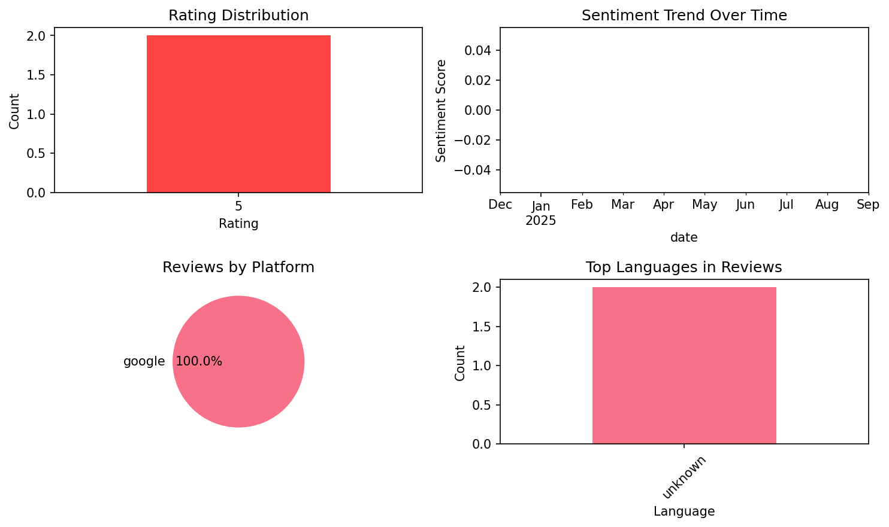

# 3000 Most Common Dutch Words

## 📱 App Information

| **Attribute** | **Google Play** | **App Store** |
|---------------|-----------------|---------------|
| **Title** | 3000 Most Common Dutch Words | N/A |
| **Package/ID** | com.chillnstudy.ennl | N/A |
| **Rating** | 4 | N/A |
| **Total Ratings** | 99 | N/A |
| **Installs** | 5,000+ | N/A |
| **Genre** | Education | N/A |

## 📝 Description

3000 words are all you need to easily express yourself and have everyday conversations in a language. This app has all the most common Dutch ones, always available on your phone, even while offline.
122041 example sentences to put words into context, with pronunciations
Filter by Levels (A1, A2, B1, B2), Topics, Top 100 Groups, and Parts of Speech
Study without even opening the app, even on your watch, with flexibly scheduled notifications
Flashcard autoplay and auto-pronounce loops over your flashcards for times when you cannot use your hands
Practice with your favorite quiz types to master all words

## 📊 Reviews Analytics

**Total Reviews:** 2 (2 analyzed)
**Rating Distribution:** 2 positive (4-5★), 0 neutral (3★), 0 negative (1-2★)
**Average Sentiment:** 0.00 (-1=very negative, +1=very positive)
**Primary Language:** unknown
**Key Insights:** Average rating: 5.0/5.0 | Reviews from 1 platform(s): google

### ⭐ Rating Breakdown

- **5 ★★★★★**: 2 reviews (100.0%)

### 🌍 Languages in Reviews

- **unknown**: 2 reviews

### 📱 Platform Distribution

- **google**: 2 reviews

## 📈 Visualizations

### Analytics Charts


## 💬 Sample Reviews

**Review 1** (★★★★★ - google - 2025-09-29T16:42:06)
> goed

**Review 2** (★★★★★ - google - 2024-12-09T19:10:02)
> Heel goed

## 🔧 Raw JSON Data

<details>
<summary>Click to expand raw app data</summary>

```json
{
  "name": "3000 Most Common Dutch Words",
  "google_package": "com.chillnstudy.ennl",
  "google": {
    "title": "3000 Most Common Dutch Words",
    "description": "3000 words are all you need to easily express yourself and have everyday conversations in a language. This app has all the most common Dutch ones, always available on your phone, even while offline.\r\n122041 example sentences to put words into context, with pronunciations\r\nFilter by Levels (A1, A2, B1, B2), Topics, Top 100 Groups, and Parts of Speech\r\nStudy without even opening the app, even on your watch, with flexibly scheduled notifications\r\nFlashcard autoplay and auto-pronounce loops over your flashcards for times when you cannot use your hands\r\nPractice with your favorite quiz types to master all words",
    "rating": 4,
    "rating_text": null,
    "ratings_total": 99,
    "ratings_histogram": [
      19,
      0,
      0,
      19,
      59
    ],
    "installs": "5,000+",
    "genre": "Education"
  },
  "apple": null,
  "reviews": [
    {
      "platform": "google",
      "rating": 5,
      "review": "goed",
      "date": "2025-09-29T16:42:06"
    },
    {
      "platform": "google",
      "rating": 5,
      "review": "Heel goed",
      "date": "2024-12-09T19:10:02"
    }
  ]
}
```

</details>

---
*Report generated on 2025-11-08 13:49:30 using advanced analytics*
