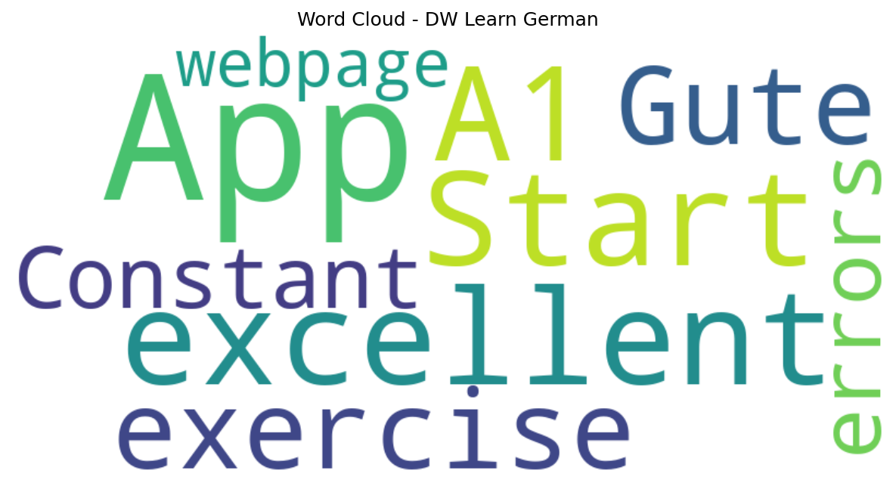

# DW Learn German

## 📱 App Information

| **Attribute** | **Google Play** | **App Store** |
|---------------|-----------------|---------------|
| **Title** | DW Learn German | N/A |
| **Package/ID** | com.dw.learngerman | N/A |
| **Rating** | 4.25 | N/A |
| **Total Ratings** | 9,273 | N/A |
| **Installs** | 1,000,000+ | N/A |
| **Genre** | Education | N/A |

## 📝 Description

Learn German on the go with DW - for beginners, advanced learners and teachers
 
With exciting videos, informative news and music, we’ll make sure that you’ll find the perfect way to learn German. Start right away, even without any previous knowledge, and improve your German online and on the go, completely free of charge. We offer courses for all levels -and if you're not sure where you stand, our placement test will help you find the perfect course for you - quickly and easily!
 
Our offer includes:
•	A placement test to help you find the right level
•	Courses for beginners, intermediate and advanced learners (from literacy to exam training)
•	A wide range of interactive exercises
•	Vocabulary training and word explanations
•	Grammar and regional studies
•	Comprehensive materials for teachers
 
Our courses cover all levels of the Common European Framework of Reference for Languages. There are also offers for learning the alphabet and language preparation for various jobs.
 
As a teacher, you will also find what you are looking with materials that you can use for your lessons free of charge.
 
Simply download the app and learn German with DW! 😊

## 📊 Reviews Analytics

**Total Reviews:** 4 (4 analyzed)
**Rating Distribution:** 3 positive (4-5★), 0 neutral (3★), 1 negative (1-2★)
**Average Sentiment:** 0.25 (-1=very negative, +1=very positive)
**Primary Language:** en
**Key Insights:** Average rating: 4.0/5.0 | Overall sentiment: positive (score: 0.25) | Reviews in 2 languages, primarily en (2 reviews) | Reviews from 1 platform(s): google | Key themes: app


### 🔑 Key Themes & Phrases

- **app** (relevance: 0.500)

### ⭐ Rating Breakdown

- **5 ★★★★★**: 3 reviews (75.0%)
- **1 ★☆☆☆☆**: 1 reviews (25.0%)

### 🌍 Languages in Reviews

- **en**: 2 reviews
- **unknown**: 2 reviews

### 📱 Platform Distribution

- **google**: 4 reviews

## 📈 Visualizations

### Analytics Charts


### Word Cloud


## 💬 Sample Reviews

**Review 1** (★★★★★ - google - 2024-11-12T02:11:59)
> excellent. Start with the A1 exercise.

**Review 2** (★★★★★ - google - 2023-06-26T01:50:47)
> Gute App

**Review 3** (★ - google - 2018-01-19T02:41:36)
> Constant errors and its a webpage not an app..

**Review 4** (★★★★★ - google - 2017-10-17T18:07:45)
> 👍👍👍👍👍👍

## 🔧 Raw JSON Data

<details>
<summary>Click to expand raw app data</summary>

```json
{
  "name": "DW Learn German",
  "google_package": "com.dw.learngerman",
  "google": {
    "title": "DW Learn German",
    "description": "Learn German on the go with DW - for beginners, advanced learners and teachers\r\n \r\nWith exciting videos, informative news and music, we’ll make sure that you’ll find the perfect way to learn German. Start right away, even without any previous knowledge, and improve your German online and on the go, completely free of charge. We offer courses for all levels -and if you're not sure where you stand, our placement test will help you find the perfect course for you - quickly and easily!\r\n \r\nOur offer includes:\r\n•\tA placement test to help you find the right level\r\n•\tCourses for beginners, intermediate and advanced learners (from literacy to exam training)\r\n•\tA wide range of interactive exercises\r\n•\tVocabulary training and word explanations\r\n•\tGrammar and regional studies\r\n•\tComprehensive materials for teachers\r\n \r\nOur courses cover all levels of the Common European Framework of Reference for Languages. There are also offers for learning the alphabet and language preparation for various jobs.\r\n \r\nAs a teacher, you will also find what you are looking with materials that you can use for your lessons free of charge.\r\n \r\nSimply download the app and learn German with DW! 😊",
    "rating": 4.25,
    "rating_text": null,
    "ratings_total": 9273,
    "ratings_histogram": [
      1089,
      176,
      647,
      647,
      6653
    ],
    "installs": "1,000,000+",
    "genre": "Education"
  },
  "apple": null,
  "reviews": [
    {
      "platform": "google",
      "rating": 5,
      "review": "excellent. Start with the A1 exercise.",
      "date": "2024-11-12T02:11:59"
    },
    {
      "platform": "google",
      "rating": 5,
      "review": "Gute App",
      "date": "2023-06-26T01:50:47"
    },
    {
      "platform": "google",
      "rating": 1,
      "review": "Constant errors and its a webpage not an app..",
      "date": "2018-01-19T02:41:36"
    },
    {
      "platform": "google",
      "rating": 5,
      "review": "👍👍👍👍👍👍",
      "date": "2017-10-17T18:07:45"
    }
  ]
}
```

</details>

---
*Report generated on 2025-11-08 13:49:40 using advanced analytics*
