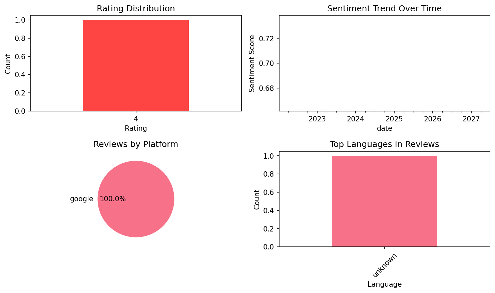

# Dutch For Kids And Beginners

## 📱 App Information

| **Attribute** | **Google Play** | **App Store** |
|---------------|-----------------|---------------|
| **Title** | Dutch For Kids And Beginners | N/A |
| **Package/ID** | com.funbox.dutchforkid | N/A |
| **Rating** | 3.7777777 | N/A |
| **Total Ratings** | 485 | N/A |
| **Installs** | 10,000+ | N/A |
| **Genre** | Education | N/A |

## 📝 Description

⭐️ Our app is the ultimate guide on how to learn Dutch language, making your dutch language learning experience engaging and enjoyable from the very first lesson. You will start with the fundamentals by mastering the Dutch alphabet and pronunciation, and then build your vocabulary with a wide range of common Dutch words through fun, interactive games. Our goal is to help you speak Dutch from day one, building your confidence with every tap and swipe.

Are you a beginner wanting to step into the fascinating world of the Dutch language? With our Dutch for Beginners app, you can embark on an exciting journey to Learn Dutch easily and efficiently. Designed as an interactive Dutch language learning tool, our app makes mastering the Dutch language fun and accessible.

Dutch is an interesting language that many people learn and love. This wonderful application will be a great help for those who are just starting to learn Dutch. ✈️ If you intend to travel to the Netherlands or you want to have the most basic background in Dutch, this application will help you learn this language in the fastest and easiest way.

We offer an immersive environment where you can learn to speak Dutch confidently, one phrase at a time. Our primary focus is to provide you with the essential Dutch vocabulary that will be your stepping stone into the language. You'll find hundreds of words, phrases, and expressions that are part of daily conversations in the Netherlands and Flanders.

Our Dutch language app equips you with all the words and phrases you need to sound natural. We've carefully designed our Dutch lessons to cover topics that are useful for beginners. You can quickly expand your Dutch vocabulary and start having conversations in no time.

We understand how daunting it can be to learn Dutch from scratch. That's why we've included interactive Dutch lessons to guide you along the way. Each lesson focuses on different aspects of the language and provides you with ample opportunities to practice. Speak Dutch like a native with the help of our interactive quizzes, flashcards, and exercises.

🔑 Main features of "Dutch for kids and beginners":
★ Learn Dutch alphabet: vowels and consonants with pronunciation.
★ Learn Dutch phrases: most commonly used Dutch phrases in daily life.
★ Learn Dutch vocabulary through eye-catching pictures and native pronunciation. We have 60+ vocabulary topics in the app.
★ Leaderboards: motivate you to complete the lessons. We have daily and lifetime leaderboards.
★ Stickers Collection: hundreds of fun stickers are waiting for you to collect.
★ Funny avatars for showing on the leaderboard.
★ Learn Math: simple counting and calculations for kids.
★ Multi-language support.

▶️ Start your fun Dutch learning journey for free—download now and begin your first lesson!

## 📊 Reviews Analytics

**Total Reviews:** 1 (1 analyzed)
**Rating Distribution:** 1 positive (4-5★), 0 neutral (3★), 0 negative (1-2★)
**Average Sentiment:** 0.70 (-1=very negative, +1=very positive)
**Primary Language:** unknown
**Key Insights:** Average rating: 4.0/5.0 | Overall sentiment: positive (score: 0.70) | Reviews from 1 platform(s): google

### ⭐ Rating Breakdown

- **4 ★★★★☆**: 1 reviews (100.0%)

### 🌍 Languages in Reviews

- **unknown**: 1 reviews

### 📱 Platform Distribution

- **google**: 1 reviews

## 📈 Visualizations

### Analytics Charts


## 💬 Sample Reviews

**Review 1** (★★★★ - google - 2024-10-31T00:45:58)
> good

## 🔧 Raw JSON Data

<details>
<summary>Click to expand raw app data</summary>

```json
{
  "name": "Dutch For Kids And Beginners",
  "google_package": "com.funbox.dutchforkid",
  "google": {
    "title": "Dutch For Kids And Beginners",
    "description": "⭐️ Our app is the ultimate guide on how to learn Dutch language, making your dutch language learning experience engaging and enjoyable from the very first lesson. You will start with the fundamentals by mastering the Dutch alphabet and pronunciation, and then build your vocabulary with a wide range of common Dutch words through fun, interactive games. Our goal is to help you speak Dutch from day one, building your confidence with every tap and swipe.\r\n\r\nAre you a beginner wanting to step into the fascinating world of the Dutch language? With our Dutch for Beginners app, you can embark on an exciting journey to Learn Dutch easily and efficiently. Designed as an interactive Dutch language learning tool, our app makes mastering the Dutch language fun and accessible.\r\n\r\nDutch is an interesting language that many people learn and love. This wonderful application will be a great help for those who are just starting to learn Dutch. ✈️ If you intend to travel to the Netherlands or you want to have the most basic background in Dutch, this application will help you learn this language in the fastest and easiest way.\r\n\r\nWe offer an immersive environment where you can learn to speak Dutch confidently, one phrase at a time. Our primary focus is to provide you with the essential Dutch vocabulary that will be your stepping stone into the language. You'll find hundreds of words, phrases, and expressions that are part of daily conversations in the Netherlands and Flanders.\r\n\r\nOur Dutch language app equips you with all the words and phrases you need to sound natural. We've carefully designed our Dutch lessons to cover topics that are useful for beginners. You can quickly expand your Dutch vocabulary and start having conversations in no time.\r\n\r\nWe understand how daunting it can be to learn Dutch from scratch. That's why we've included interactive Dutch lessons to guide you along the way. Each lesson focuses on different aspects of the language and provides you with ample opportunities to practice. Speak Dutch like a native with the help of our interactive quizzes, flashcards, and exercises.\r\n\r\n🔑 Main features of \"Dutch for kids and beginners\":\r\n★ Learn Dutch alphabet: vowels and consonants with pronunciation.\r\n★ Learn Dutch phrases: most commonly used Dutch phrases in daily life.\r\n★ Learn Dutch vocabulary through eye-catching pictures and native pronunciation. We have 60+ vocabulary topics in the app.\r\n★ Leaderboards: motivate you to complete the lessons. We have daily and lifetime leaderboards.\r\n★ Stickers Collection: hundreds of fun stickers are waiting for you to collect.\r\n★ Funny avatars for showing on the leaderboard.\r\n★ Learn Math: simple counting and calculations for kids.\r\n★ Multi-language support.\r\n\r\n▶️ Start your fun Dutch learning journey for free—download now and begin your first lesson!",
    "rating": 3.7777777,
    "rating_text": null,
    "ratings_total": 485,
    "ratings_histogram": [
      107,
      0,
      53,
      53,
      269
    ],
    "installs": "10,000+",
    "genre": "Education"
  },
  "apple": null,
  "reviews": [
    {
      "platform": "google",
      "rating": 4,
      "review": "good",
      "date": "2024-10-31T00:45:58"
    }
  ]
}
```

</details>

---
*Report generated on 2025-11-08 13:49:44 using advanced analytics*
