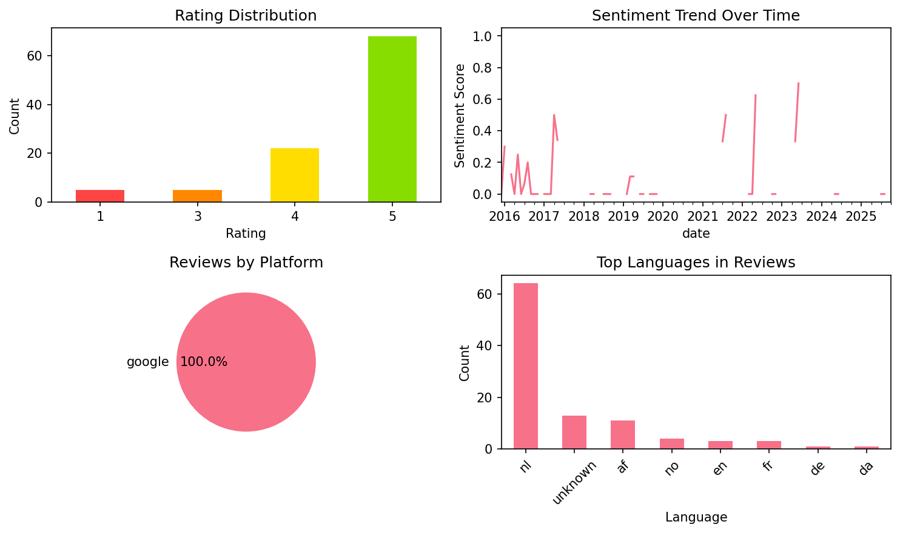

# Learn French - 11,000 Words

## 📱 App Information

| **Attribute** | **Google Play** | **App Store** |
|---------------|-----------------|---------------|
| **Title** | Learn French - 11,000 Words | N/A |
| **Package/ID** | com.funeasylearn.french6000 | N/A |
| **Rating** | 4.38 | N/A |
| **Total Ratings** | 40,353 | N/A |
| **Installs** | 1,000,000+ | N/A |
| **Genre** | Education | N/A |

## 📝 Description

<b>Learn French</b> from 61 native languages, for free & offline, with FunEasyLearn.

Learn to <b>READ 📖 WRITE ✍ and SPEAK French 💬</b>
Discover the fun & easy way to learn all the reading rules, all the words you’ll ever need and all the useful phrases in the French language.

🚀 <b>Contents</b>
• <b>6,000 French words</b> (constantly growing): the most common nouns, verbs, adjectives, etc., categorized into 7 levels and 200 topics;
• <b>5,000 French phrases</b> (frequently used): the most important phrases for daily conversations and travelling, categorized into 10 levels and 120 topics.

Enhance your vocabulary by learning words, sentences and expressions for beginner, intermediate and advanced learners. 

🔔 <b>Why learn French with FunEasyLearn?</b>
FunEasyLearn reinvents language learning. Our team of linguists and teachers have developed a unique language learning strategy. The secret lies in combining an alphabet with all the reading rules, all the necessary words and a practical phrasebook into one app. This allows our users to read a word or phrase, pronounce it correctly, associate it with an illustration and practice it with listening, writing and speaking games. 

🏆 <b>Top features</b>
<b>Hand-drawn illustrations</b> – memorize the new vocabulary faster with intuitive illustrations;
<b>Professional audio recordings</b> – listen to audios recorded by native speakers;
<b>Detailed statistics</b> – analyze your results and track your progress;
<b>Review manager</b> – review everything you learn;
<b>Smart search</b> – find quickly the words and phrases you need;
<b>Hide what you know</b> – hide the content you already know;
<b>Speech recognition</b> – improve your pronunciation;
<b>Offline</b> – use the app anywhere in the world, with no internet connection.

💼 <b>French for business</b>
Get access to special French lessons created for your business. We provide specialized courses for taxi drivers, hotel & restaurant staffs, flight-attendants, shop-assistants, etc.

✈ <b>French for travelling</b>
Learn how to book a hotel room, order a meal in a restaurant, ask for directions, carry out a conversation and speak confidently with the native speakers.

🙌 <b>French for adults</b>
We adapt the contents depending on the age of the learner. Both you and your kid can learn French and have fun.

<b>FunEasyLearn Free Subscription</b>
<b>Subscribe for FREE</b>, with the flowers you earn while playing language learning games. 

Learn French, play for free! It’s fast & easy. 📴

📥 <b>Download the FunEasyLearn French course right now!</b>
Recommend the app to your friends and get a reward.
Rate us and write a review ⭐⭐⭐⭐⭐ It would mean a lot to our team!

Contact us: 
https://www.FunEasyLearn.com/

## 📊 Reviews Analytics

**Total Reviews:** 100 (100 analyzed)
**Rating Distribution:** 90 positive (4-5★), 5 neutral (3★), 5 negative (1-2★)
**Average Sentiment:** 0.10 (-1=very negative, +1=very positive)
**Primary Language:** nl
**Key Insights:** Average rating: 4.5/5.0 | Overall sentiment: positive (score: 0.10) | Reviews in 8 languages, primarily nl (64 reviews) | Reviews from 1 platform(s): google | Key themes: app, en, leuk


### 🔑 Key Themes & Phrases

- **app** (relevance: 0.100)
- **en** (relevance: 0.091)
- **leuk** (relevance: 0.089)
- **leren** (relevance: 0.068)
- **je** (relevance: 0.063)
- **het** (relevance: 0.062)
- **ik** (relevance: 0.052)
- **te** (relevance: 0.050)

### ⭐ Rating Breakdown

- **5 ★★★★★**: 68 reviews (68.0%)
- **4 ★★★★☆**: 22 reviews (22.0%)
- **3 ★★★☆☆**: 5 reviews (5.0%)
- **1 ★☆☆☆☆**: 5 reviews (5.0%)

### 🌍 Languages in Reviews

- **nl**: 64 reviews
- **unknown**: 13 reviews
- **af**: 11 reviews
- **no**: 4 reviews
- **en**: 3 reviews

### 📱 Platform Distribution

- **google**: 100 reviews

## 📈 Visualizations

### Analytics Charts


### Word Cloud


## 💬 Sample Reviews

**Review 1** (★★★★★ - google - 2025-10-27T12:06:02)
> ik hou van dit merci ik kan goed frans leren

**Review 2** (★★★★★ - google - 2021-08-28T02:08:31)
> Top app helemaal geen réclame en helemaal GRATIS

**Review 3** (★★★★★ - google - 2018-09-26T10:52:31)
> Toppie

**Review 4** (★★★★★ - google - 2016-10-10T15:17:36)
> Zeer goed opgebouwd

**Review 5** (★★★★★ - google - 2015-12-27T23:53:15)
> Dé gratis versie leert je 1000 woorden,met uitspraak,schrijven, spellen en regelmatig ontvang je een nieuw woord. Er zijn vele mogelijkheden om jezelf te trainen. Heel goede app. Verveelt niet.

## 🔧 Raw JSON Data

<details>
<summary>Click to expand raw app data</summary>

```json
{
  "name": "Learn French - 11,000 Words",
  "google_package": "com.funeasylearn.french6000",
  "google": {
    "title": "Learn French - 11,000 Words",
    "description": "<b>Learn French</b> from 61 native languages, for free & offline, with FunEasyLearn.\r\n\r\nLearn to <b>READ 📖 WRITE ✍ and SPEAK French 💬</b>\r\nDiscover the fun & easy way to learn all the reading rules, all the words you’ll ever need and all the useful phrases in the French language.\r\n\r\n🚀 <b>Contents</b>\r\n• <b>6,000 French words</b> (constantly growing): the most common nouns, verbs, adjectives, etc., categorized into 7 levels and 200 topics;\r\n• <b>5,000 French phrases</b> (frequently used): the most important phrases for daily conversations and travelling, categorized into 10 levels and 120 topics.\r\n\r\nEnhance your vocabulary by learning words, sentences and expressions for beginner, intermediate and advanced learners. \r\n\r\n🔔 <b>Why learn French with FunEasyLearn?</b>\r\nFunEasyLearn reinvents language learning. Our team of linguists and teachers have developed a unique language learning strategy. The secret lies in combining an alphabet with all the reading rules, all the necessary words and a practical phrasebook into one app. This allows our users to read a word or phrase, pronounce it correctly, associate it with an illustration and practice it with listening, writing and speaking games. \r\n\r\n🏆 <b>Top features</b>\r\n<b>Hand-drawn illustrations</b> – memorize the new vocabulary faster with intuitive illustrations;\r\n<b>Professional audio recordings</b> – listen to audios recorded by native speakers;\r\n<b>Detailed statistics</b> – analyze your results and track your progress;\r\n<b>Review manager</b> – review everything you learn;\r\n<b>Smart search</b> – find quickly the words and phrases you need;\r\n<b>Hide what you know</b> – hide the content you already know;\r\n<b>Speech recognition</b> – improve your pronunciation;\r\n<b>Offline</b> – use the app anywhere in the world, with no internet connection.\r\n\r\n💼 <b>French for business</b>\r\nGet access to special French lessons created for your business. We provide specialized courses for taxi drivers, hotel & restaurant staffs, flight-attendants, shop-assistants, etc.\r\n\r\n✈ <b>French for travelling</b>\r\nLearn how to book a hotel room, order a meal in a restaurant, ask for directions, carry out a conversation and speak confidently with the native speakers.\r\n\r\n🙌 <b>French for adults</b>\r\nWe adapt the contents depending on the age of the learner. Both you and your kid can learn French and have fun.\r\n\r\n<b>FunEasyLearn Free Subscription</b>\r\n<b>Subscribe for FREE</b>, with the flowers you earn while playing language learning games. \r\n\r\nLearn French, play for free! It’s fast & easy. 📴\r\n\r\n📥 <b>Download the FunEasyLearn French course right now!</b>\r\nRecommend the app to your friends and get a reward.\r\nRate us and write a review ⭐⭐⭐⭐⭐ It would mean a lot to our team!\r\n\r\nContact us: \r\nhttps://www.FunEasyLearn.com/",
    "rating": 4.38,
    "rating_text": null,
    "ratings_total": 40353,
    "ratings_histogram": [
      3617,
      396,
      2014,
      5234,
      29043
    ],
    "installs": "1,000,000+",
    "genre": "Education"
  },
  "apple": null,
  "reviews": [
    {
      "platform": "google",
      "rating": 5,
      "review": "ik hou van dit merci ik kan goed frans leren",
      "date": "2025-10-27T12:06:02"
    },
    {
      "platform": "google",
      "rating": 5,
      "review": "mooie en duidelijke afbeeldingen",
      "date": "2025-10-21T17:19:20"
    },
    {
      "platform": "google",
      "rating": 5,
      "review": "erg goede app als het gratis is of goedkoop blijft.",
      "date": "2025-10-12T23:59:12"
    },
    {
      "platform": "google",
      "rating": 5,
      "review": "leuk en leerzaam je kan een maand gratis leren verdienen door veel lesjes te maken!",
      "date": "2025-08-31T11:22:38"
    },
    {
      "platform": "google",
      "rating": 1,
      "review": "is niet gratis zeer duur beter leren lang you tube",
      "date": "2025-07-26T15:07:27"
    },
    {
      "platform": "google",
      "rating": 3,
      "review": "Opeens ben ik net verdiende hogere niveaus kwijt, ondanks net verlengd bij Engels. Bij meerdere cursussen weet de app het niet meer. Irritant.",
      "date": "2025-01-17T11:51:03"
    },
    {
      "platform": "google",
      "rating": 5,
      "review": "Het helpt me met studeren",
      "date": "2024-06-10T19:46:58"
    },
    {
      "platform": "google",
      "rating": 5,
      "review": "❤",
      "date": "2024-05-12T00:51:15"
    },
    {
      "platform": "google",
      "rating": 5,
      "review": "Heel goed en duidelijk",
      "date": "2024-05-02T19:30:48"
    },
    {
      "platform": "google",
      "rating": 5,
      "review": "Leuk",
      "date": "2024-01-14T19:00:36"
    },
    {
      "platform": "google",
      "rating": 1,
      "review": "I did the starting test and ended up in level 6, but I couldn't continue without paying since it's only free for the first few levels. Wouldn't recommend.",
      "date": "2023-11-27T09:20:43"
    },
    {
      "platform": "google",
      "rating": 1,
      "review": "Cool ap",
      "date": "2023-08-30T08:16:37"
    },
    {
      "platform": "google",
      "rating": 5,
      "review": "Good App",
      "date": "2023-06-26T00:57:38"
    },
    {
      "platform": "google",
      "rating": 5,
      "review": "Super goed om Frans te leren in 5 minuten heb je een spel gehaald. Dit is goed voor beginners en ervaren mensen om Frans te leren. Je kunt ook een test doen om te zien bij welk level je kan beginnen. Dus een tip installeer dit als je goed Frans wil spreken. Deze app let ook op je uitspraak zodat als je Frans praat tegen een Franse dat je uitspraak niet verkeerd is. Je moet natuurlijk niet want iedereen wilt leren op zijn eigen manier. Het is ook een beetje speels want Frans moet leuk blijven hé.",
      "date": "2023-05-27T09:32:28"
    },
    {
      "platform": "google",
      "rating": 5,
      "review": "Super leuk",
      "date": "2023-05-26T11:38:09"
    },
    {
      "platform": "google",
      "rating": 4,
      "review": "super goede app om Frans bij te spijkeren en nieuwe woordjes te leren. Aanrader!",
      "date": "2023-01-18T15:23:18"
    },
    {
      "platform": "google",
      "rating": 3,
      "review": "Veel worden en goede opbouw van oefenen, echt praten weet ik nog niet of dat haalbaar is maar begrijpen van taal is al heel wat",
      "date": "2022-11-15T18:13:29"
    },
    {
      "platform": "google",
      "rating": 1,
      "review": "deze app is niet Gratis zoals Veelen Beveren , je moet flink betalen dus. En dat is leuk !",
      "date": "2022-11-13T15:33:04"
    },
    {
      "platform": "google",
      "rating": 5,
      "review": "Ik heb heel veel geleerd dankzij deze app",
      "date": "2022-10-22T18:45:41"
    },
    {
      "platform": "google",
      "rating": 5,
      "review": "leuke manier om spelenderwijs taal en schrift te leren kennen",
      "date": "2022-10-21T15:01:24"
    },
    {
      "platform": "google",
      "rating": 5,
      "review": "Het helpt je heel snel",
      "date": "2022-10-09T14:12:36"
    },
    {
      "platform": "google",
      "rating": 5,
      "review": "op een leuke manier een andere taal leren! top!",
      "date": "2022-05-08T12:30:32"
    },
    {
      "platform": "google",
      "rating": 5,
      "review": "👍",
      "date": "2022-04-13T18:36:01"
    },
    {
      "platform": "google",
      "rating": 5,
      "review": "Frans voor beginners. Wel leuk voor tussendoor.",
      "date": "2022-03-15T09:36:35"
    },
    {
      "platform": "google",
      "rating": 5,
      "review": "Ik ben erg blij met het gebruiken van deze app. Bij andere Frans leren apps haakte ik vaak al na 10 minuten af, terwijl ik hier soms wel 2 uur per dag op zit. Ik vindt het ook vooral erg leuk om te spelen en het is pas echt mooi meegenomen dat je er ook nog iets van leert :)",
      "date": "2021-11-25T09:59:03"
    },
    {
      "platform": "google",
      "rating": 5,
      "review": "Top app helemaal geen réclame en helemaal GRATIS",
      "date": "2021-08-28T02:08:31"
    },
    {
      "platform": "google",
      "rating": 5,
      "review": "Gewoon super. Mijn zoon (anti Frans les) vindt het een erg leuke app en behaalde afgelopen week een goede voortgang. Leuk opgezet deze app. Ik doe het zelf ook graag",
      "date": "2021-07-09T10:45:27"
    },
    {
      "platform": "google",
      "rating": 4,
      "review": "super eenvoudige leerstof genoeg om te leren, voor de gratis versie",
      "date": "2021-04-06T21:25:49"
    },
    {
      "platform": "google",
      "rating": 5,
      "review": "Vet leuk ! Mijn ouders zijn Afrikaans, dus ik leer Frans praten en dan kan ik eindelijk tegen hun praten, heel handig! I zou het direct downloaden 👍👍",
      "date": "2021-02-06T14:46:06"
    },
    {
      "platform": "google",
      "rating": 5,
      "review": "geweldig leuk",
      "date": "2021-02-01T11:00:22"
    },
    {
      "platform": "google",
      "rating": 5,
      "review": "Echt leuk zou het je aanraden",
      "date": "2020-12-30T17:45:19"
    },
    {
      "platform": "google",
      "rating": 4,
      "review": "Super goed om woorden te leren",
      "date": "2020-12-19T14:05:27"
    },
    {
      "platform": "google",
      "rating": 5,
      "review": "Je kan vele talen leren!",
      "date": "2020-05-02T18:17:44"
    },
    {
      "platform": "google",
      "rating": 4,
      "review": "De vorige opmaak vond ik fijner.",
      "date": "2020-05-02T15:33:42"
    },
    {
      "platform": "google",
      "rating": 5,
      "review": "Prima app",
      "date": "2020-02-02T14:28:30"
    },
    {
      "platform": "google",
      "rating": 5,
      "review": "Ik ben 5de leerjaar en ikmoet Frans leren en deze app helpt heel veel",
      "date": "2019-11-28T22:32:14"
    },
    {
      "platform": "google",
      "rating": 5,
      "review": "Zeer goed!! Je moet goed luisteren, als je het niet goed verstaan hebt kun je nog een x luisteren en opschrijven.",
      "date": "2019-10-24T21:55:18"
    },
    {
      "platform": "google",
      "rating": 5,
      "review": "Leuk te doen. Ideaal om woordjes te leren.",
      "date": "2019-09-29T19:10:26"
    },
    {
      "platform": "google",
      "rating": 4,
      "review": "leuke app",
      "date": "2019-07-03T21:17:49"
    },
    {
      "platform": "google",
      "rating": 5,
      "review": "Leuk en leerzaam en gemakkelijk Goed aan te leren",
      "date": "2019-06-22T20:06:08"
    },
    {
      "platform": "google",
      "rating": 5,
      "review": "super sympa 😉",
      "date": "2019-04-22T21:02:10"
    },
    {
      "platform": "google",
      "rating": 5,
      "review": "leuk speels leren",
      "date": "2019-04-10T15:59:08"
    },
    {
      "platform": "google",
      "rating": 4,
      "review": "leuk en leerzaam",
      "date": "2019-04-06T15:07:34"
    },
    {
      "platform": "google",
      "rating": 5,
      "review": "Hele goede app zeker installeren heel interessante app en je leert er heel veel van👌👌👌👌",
      "date": "2019-03-28T14:52:59"
    },
    {
      "platform": "google",
      "rating": 5,
      "review": "super",
      "date": "2019-03-05T12:03:20"
    },
    {
      "platform": "google",
      "rating": 3,
      "review": "Bij Huis / technische voorzieningen staat een plaatje van een wastafel met het woord aanrecht. Het franse woord zou l'evier moeten zijn, maar dat betekent gootsteen.",
      "date": "2019-03-02T14:52:04"
    },
    {
      "platform": "google",
      "rating": 4,
      "review": "Hele prettige manier van leren, door de goede dosering in het nieuwe aanbod van woorden. Makkelijk in gebruik, divers aanbod en leuke vormgeving. Alleen de reclames zijn vreselijk storend!",
      "date": "2019-02-14T21:55:19"
    },
    {
      "platform": "google",
      "rating": 5,
      "review": "leuke afwisselende oefeningen met verschillende thema's",
      "date": "2019-02-09T10:25:46"
    },
    {
      "platform": "google",
      "rating": 5,
      "review": "Echt goeie app Sinds ik deze app ken heb ik alleen maar goeie cijfers voor Frans Echt bedankt De maker van deze app is geniaal Merci",
      "date": "2018-11-25T20:51:41"
    },
    {
      "platform": "google",
      "rating": 5,
      "review": "Om een leuke makkelijke manier franse woordjes leren.",
      "date": "2018-11-18T11:40:49"
    },
    {
      "platform": "google",
      "rating": 5,
      "review": "Toppie",
      "date": "2018-09-26T10:52:31"
    },
    {
      "platform": "google",
      "rating": 5,
      "review": "Jullie hebben het geweldig gemaakt ik kan nu ook een beetje frans. Geweldig merci!",
      "date": "2018-09-06T09:33:58"
    },
    {
      "platform": "google",
      "rating": 4,
      "review": "Er is goed over nagedacht",
      "date": "2018-08-14T16:49:15"
    },
    {
      "platform": "google",
      "rating": 4,
      "review": "Leerzaam wanneer je de discipline hebt.",
      "date": "2018-07-31T11:21:55"
    },
    {
      "platform": "google",
      "rating": 5,
      "review": "Leuk en handig.",
      "date": "2018-07-22T11:08:57"
    },
    {
      "platform": "google",
      "rating": 4,
      "review": "Niet geheel gratis",
      "date": "2018-07-06T16:22:48"
    },
    {
      "platform": "google",
      "rating": 1,
      "review": "Werkt niet",
      "date": "2018-07-04T23:56:26"
    },
    {
      "platform": "google",
      "rating": 5,
      "review": "Leuk om zo te leren",
      "date": "2018-04-30T18:19:09"
    },
    {
      "platform": "google",
      "rating": 5,
      "review": "Makkelijk en goed",
      "date": "2018-03-21T16:49:40"
    },
    {
      "platform": "google",
      "rating": 4,
      "review": "Toffe app om woordenschat uit te breiden",
      "date": "2018-01-19T20:38:00"
    },
    {
      "platform": "google",
      "rating": 5,
      "review": "Het helpt je noet zo vaak",
      "date": "2017-11-12T09:58:34"
    },
    {
      "platform": "google",
      "rating": 4,
      "review": "Het instaleren duurt best lang maar het spel is leuk  opzich.",
      "date": "2017-07-22T16:25:04"
    },
    {
      "platform": "google",
      "rating": 5,
      "review": "Je kan van alle talen leren super cool",
      "date": "2017-05-08T19:57:20"
    },
    {
      "platform": "google",
      "rating": 5,
      "review": "Top app",
      "date": "2017-04-27T23:02:36"
    },
    {
      "platform": "google",
      "rating": 4,
      "review": "Handig dat ook je favorieten kan na lezen enz.",
      "date": "2017-03-05T20:52:47"
    },
    {
      "platform": "google",
      "rating": 5,
      "review": "Goede app maar als je echt verder wil moet je toch overstappen op de betaalde versie...jammer..👎👎👎",
      "date": "2017-03-01T19:19:41"
    },
    {
      "platform": "google",
      "rating": 3,
      "review": "Handig maar jammer dat ook deze app restricties heeft zodat je uit eindelijk om betaling wordt gevraagd.  Anders 5 sterren!",
      "date": "2017-02-25T15:54:52"
    },
    {
      "platform": "google",
      "rating": 5,
      "review": "Geweldig en gevarieerd",
      "date": "2017-02-24T16:00:00"
    },
    {
      "platform": "google",
      "rating": 4,
      "review": "Leuke en handige app!",
      "date": "2017-02-22T21:56:30"
    },
    {
      "platform": "google",
      "rating": 5,
      "review": "Leerzaam",
      "date": "2017-02-19T23:36:49"
    },
    {
      "platform": "google",
      "rating": 4,
      "review": "Leuk zelfs geweldig maar bij mij doet het steeds dubbel instaleeren Maar wel echt leuk",
      "date": "2017-02-12T20:47:12"
    },
    {
      "platform": "google",
      "rating": 5,
      "review": "Leer steeds meer leuke woorden en kan mijn uitspraak toetsen",
      "date": "2017-01-26T23:28:00"
    },
    {
      "platform": "google",
      "rating": 4,
      "review": "Leuke opbouw.  Stiekem veel leren. Gemakkelijker te hanteren dan andere apps.",
      "date": "2016-11-13T22:23:05"
    },
    {
      "platform": "google",
      "rating": 4,
      "review": "Staan soms nog schrijffoutjes in, maar leuk om nieuwe woordjes te leren",
      "date": "2016-11-03T17:09:42"
    },
    {
      "platform": "google",
      "rating": 5,
      "review": "Duidelijk en logisch",
      "date": "2016-10-28T13:06:41"
    },
    {
      "platform": "google",
      "rating": 5,
      "review": "Zeer goed opgebouwd",
      "date": "2016-10-10T15:17:36"
    },
    {
      "platform": "google",
      "rating": 5,
      "review": "Het spel is leuk maar moeilijk",
      "date": "2016-10-06T21:10:32"
    },
    {
      "platform": "google",
      "rating": 4,
      "review": "Leuke manier om je woordenschat te vergroten.",
      "date": "2016-09-09T17:30:33"
    },
    {
      "platform": "google",
      "rating": 5,
      "review": "Great app, it helps one to learn not only the basic...",
      "date": "2016-08-07T23:50:29"
    },
    {
      "platform": "google",
      "rating": 5,
      "review": "Je leert snel allemaal woorden heel goeie app",
      "date": "2016-08-06T20:58:09"
    },
    {
      "platform": "google",
      "rating": 5,
      "review": "Super om frans te leren",
      "date": "2016-08-03T11:34:51"
    },
    {
      "platform": "google",
      "rating": 5,
      "review": "Leuke app",
      "date": "2016-07-16T12:33:20"
    },
    {
      "platform": "google",
      "rating": 4,
      "review": "Merci bouncour haha leukw app",
      "date": "2016-07-10T16:08:12"
    },
    {
      "platform": "google",
      "rating": 5,
      "review": "Leuke manier om Frans te leren.",
      "date": "2016-07-08T15:22:55"
    },
    {
      "platform": "google",
      "rating": 3,
      "review": "Te moeilijk als je niks weet in her Frans",
      "date": "2016-06-15T21:08:04"
    },
    {
      "platform": "google",
      "rating": 4,
      "review": "Werkt prima, leuk oefen aanbod",
      "date": "2016-06-14T19:51:43"
    },
    {
      "platform": "google",
      "rating": 5,
      "review": "Had nooit gedacht dat ik het fijn kon vinden.",
      "date": "2016-05-26T20:48:29"
    },
    {
      "platform": "google",
      "rating": 5,
      "review": "Erg leuk en leerzaam",
      "date": "2016-05-22T22:13:16"
    },
    {
      "platform": "google",
      "rating": 5,
      "review": "Heb deze al in het zweeds gedaan en weet al best veel",
      "date": "2016-05-19T08:42:03"
    },
    {
      "platform": "google",
      "rating": 5,
      "review": "Het is heel leerzaam en werkt heel goed!👍👍👍",
      "date": "2016-05-16T01:54:12"
    },
    {
      "platform": "google",
      "rating": 5,
      "review": "Leuk leren",
      "date": "2016-04-27T12:27:36"
    },
    {
      "platform": "google",
      "rating": 5,
      "review": "Gevarieerd, goede uitspraak, nog geen fouten ontdekt.",
      "date": "2016-04-02T13:34:25"
    },
    {
      "platform": "google",
      "rating": 4,
      "review": "Leuk. Makkelijk leermethode en leerzaam.",
      "date": "2016-03-30T22:28:57"
    },
    {
      "platform": "google",
      "rating": 5,
      "review": "Veel woorden kennen is de basis. 6000 is een mooi aantal dat in de buurt komt van veel. :)",
      "date": "2016-03-21T22:45:00"
    },
    {
      "platform": "google",
      "rating": 5,
      "review": "Ik gebruik het veel in de klas",
      "date": "2016-03-16T18:23:43"
    },
    {
      "platform": "google",
      "rating": 5,
      "review": "Leuk en verslavend",
      "date": "2016-03-05T11:19:05"
    },
    {
      "platform": "google",
      "rating": 4,
      "review": "Nice",
      "date": "2016-01-18T22:10:25"
    },
    {
      "platform": "google",
      "rating": 5,
      "review": "C'est un jeu tres instructif. Ne pas seulement pour adultes mais aussi pour enfants",
      "date": "2016-01-11T17:22:07"
    },
    {
      "platform": "google",
      "rating": 5,
      "review": "echt goed voor mensen die frans wilt leren .....Hahahahah",
      "date": "2015-12-30T19:43:30"
    },
    {
      "platform": "google",
      "rating": 5,
      "review": "Dé gratis versie leert je 1000 woorden,met uitspraak,schrijven, spellen en regelmatig ontvang je een nieuw woord. Er zijn vele mogelijkheden om jezelf te trainen. Heel goede app. Verveelt niet.",
      "date": "2015-12-27T23:53:15"
    }
  ]
}
```

</details>

---
*Report generated on 2025-11-08 13:49:54 using advanced analytics*
