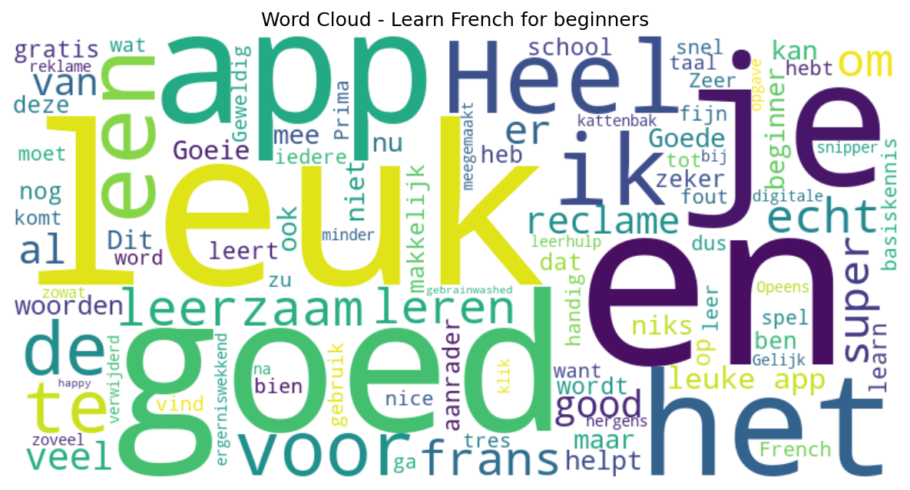

# Learn French for beginners

## 📱 App Information

| **Attribute** | **Google Play** | **App Store** |
|---------------|-----------------|---------------|
| **Title** | Learn French for beginners | N/A |
| **Package/ID** | com.gonliapps.learnfrenchfree.game | N/A |
| **Rating** | 4.6666665 | N/A |
| **Total Ratings** | 43,079 | N/A |
| **Installs** | 5,000,000+ | N/A |
| **Genre** | Education | N/A |

## 📝 Description

🇫🇷 How to Learn French! The French game for beginners  🇫🇷

● Learning app Free


● Offline


● Lessons and exercises to practice ( read, write and speak ) this language by yourself

● 4  activities and exam - test for each topic.

● 36 topics and 3 levels
Basic: Alphabet letters , Numbers , Colors , Verbs , Food …
Intermediate: Week Days , Animals , Clothes , Body …
Advanced : Sports , House , Christmas , Music , …

500 words with image and audio , to study vocabulary 

Native French pronunciation ( France )

Learning French fast at home with our course in your mobile / tablet 

You will not need an English to French translation or a dictionary anymore!

Learn to speak French, English , Spanish, Portuguese, Italian, German with our apps

One of the best games to learn languages


Copyright:
IMPORTANT: We are owners and have copyright of all sounds words
Images have been obtained under licensed Creative Commons CC0

## 📊 Reviews Analytics

**Total Reviews:** 100 (100 analyzed)
**Rating Distribution:** 86 positive (4-5★), 5 neutral (3★), 9 negative (1-2★)
**Average Sentiment:** 0.08 (-1=very negative, +1=very positive)
**Primary Language:** nl
**Key Insights:** Average rating: 4.4/5.0 | Overall sentiment: neutral (score: 0.08) | Reviews in 8 languages, primarily nl (48 reviews) | Reviews from 1 platform(s): google | Key themes: goed, leuk, app


### 🔑 Key Themes & Phrases

- **goed** (relevance: 0.092)
- **leuk** (relevance: 0.078)
- **app** (relevance: 0.077)
- **en** (relevance: 0.057)
- **heel** (relevance: 0.047)
- **je** (relevance: 0.047)
- **voor** (relevance: 0.042)
- **leerzaam** (relevance: 0.041)

### ⭐ Rating Breakdown

- **5 ★★★★★**: 74 reviews (74.0%)
- **4 ★★★★☆**: 12 reviews (12.0%)
- **3 ★★★☆☆**: 5 reviews (5.0%)
- **2 ★★☆☆☆**: 1 reviews (1.0%)
- **1 ★☆☆☆☆**: 8 reviews (8.0%)

### 🌍 Languages in Reviews

- **nl**: 48 reviews
- **unknown**: 24 reviews
- **af**: 12 reviews
- **en**: 7 reviews
- **no**: 4 reviews

### 📱 Platform Distribution

- **google**: 100 reviews

## 📈 Visualizations

### Analytics Charts


### Word Cloud


## 💬 Sample Reviews

**Review 1** (★★★★★ - google - 2025-11-02T15:51:22)
> goed

**Review 2** (★★★★★ - google - 2023-12-12T20:13:01)
> Leuk en leerzaam

**Review 3** (★★★★★ - google - 2021-03-29T16:02:23)
> Wooooiooow

**Review 4** (★★★★ - google - 2019-12-28T17:01:15)
> Leuk om te doen is goed

**Review 5** (★★★★ - google - 2019-03-18T03:59:51)
> okay

## 🔧 Raw JSON Data

<details>
<summary>Click to expand raw app data</summary>

```json
{
  "name": "Learn French for beginners",
  "google_package": "com.gonliapps.learnfrenchfree.game",
  "google": {
    "title": "Learn French for beginners",
    "description": "🇫🇷 How to Learn French! The French game for beginners  🇫🇷\r\n\r\n● Learning app Free
\r\n\r\n● Offline
\r\n\r\n● Lessons and exercises to practice ( read, write and speak ) this language by yourself\r\n\r\n● 4  activities and exam - test for each topic.\r\n\r\n● 36 topics and 3 levels\r\nBasic: Alphabet letters , Numbers , Colors , Verbs , Food …\r\nIntermediate: Week Days , Animals , Clothes , Body …\r\nAdvanced : Sports , House , Christmas , Music , …\r\n\r\n500 words with image and audio , to study vocabulary \r\n\r\nNative French pronunciation ( France )\r\n\r\nLearning French fast at home with our course in your mobile / tablet \r\n\r\nYou will not need an English to French translation or a dictionary anymore!\r\n\r\nLearn to speak French, English , Spanish, Portuguese, Italian, German with our apps\r\n\r\nOne of the best games to learn languages\r\n\r\n\r\nCopyright:\r\nIMPORTANT: We are owners and have copyright of all sounds words\r\nImages have been obtained under licensed Creative Commons CC0",
    "rating": 4.6666665,
    "rating_text": null,
    "ratings_total": 43079,
    "ratings_histogram": [
      1668,
      333,
      1334,
      4004,
      35704
    ],
    "installs": "5,000,000+",
    "genre": "Education"
  },
  "apple": null,
  "reviews": [
    {
      "platform": "google",
      "rating": 5,
      "review": "goed",
      "date": "2025-11-02T15:51:22"
    },
    {
      "platform": "google",
      "rating": 5,
      "review": "nice for beginner",
      "date": "2025-10-12T08:19:01"
    },
    {
      "platform": "google",
      "rating": 5,
      "review": "😘😘",
      "date": "2025-09-24T17:05:57"
    },
    {
      "platform": "google",
      "rating": 1,
      "review": "Opeens bij iedere klik reclame.. ergerniswekkend veel. Gelijk verwijderd want zoveel reclame heb ik nog nergens meegemaakt. Was een goede app en leerhulp.. maar is nu digitale kattenbak snipper.",
      "date": "2025-08-18T01:14:01"
    },
    {
      "platform": "google",
      "rating": 3,
      "review": "makkelijk en snel woorden leren, minder fijn dat na iedere opgave reklame komt, je wordt zowat gebrainwashed",
      "date": "2025-05-24T20:26:25"
    },
    {
      "platform": "google",
      "rating": 5,
      "review": "Very good and you learn words very good I am very happy 😃😁",
      "date": "2025-02-10T17:59:27"
    },
    {
      "platform": "google",
      "rating": 5,
      "review": "Goeie app als je snel woorden wilt leren en gratis dus dat is ook heel fijn",
      "date": "2025-02-08T19:16:28"
    },
    {
      "platform": "google",
      "rating": 5,
      "review": "sympa et facile",
      "date": "2024-12-17T23:08:32"
    },
    {
      "platform": "google",
      "rating": 5,
      "review": "Goede ap voor je woordenschat. Alleen de reclame is vervelend",
      "date": "2024-12-13T11:22:41"
    },
    {
      "platform": "google",
      "rating": 5,
      "review": "Leerzaam en gratis",
      "date": "2024-11-23T12:58:49"
    },
    {
      "platform": "google",
      "rating": 5,
      "review": "Het is makkelijk om thuis te leren en ook leuk die taal is heel mooi dus ja leuk.",
      "date": "2024-10-21T16:14:08"
    },
    {
      "platform": "google",
      "rating": 5,
      "review": "👌",
      "date": "2024-10-07T16:56:19"
    },
    {
      "platform": "google",
      "rating": 5,
      "review": "Deze app is goed voor beginners",
      "date": "2024-08-31T05:15:37"
    },
    {
      "platform": "google",
      "rating": 5,
      "review": "Super",
      "date": "2024-08-19T17:50:45"
    },
    {
      "platform": "google",
      "rating": 5,
      "review": "A very good app to leatn French",
      "date": "2024-07-09T10:55:26"
    },
    {
      "platform": "google",
      "rating": 5,
      "review": "Good App",
      "date": "2024-07-08T23:56:53"
    },
    {
      "platform": "google",
      "rating": 5,
      "review": "Goed en leuk hahah",
      "date": "2024-07-06T19:03:43"
    },
    {
      "platform": "google",
      "rating": 5,
      "review": "Makkelijk leuk en handig voor jong en oud merci",
      "date": "2024-07-02T17:55:24"
    },
    {
      "platform": "google",
      "rating": 5,
      "review": "Ik ga er veel en leuke dingen me leren",
      "date": "2024-06-08T16:21:14"
    },
    {
      "platform": "google",
      "rating": 5,
      "review": "Heerlijke app voor deze mooie taal France",
      "date": "2024-05-24T10:41:54"
    },
    {
      "platform": "google",
      "rating": 5,
      "review": "Nice app",
      "date": "2024-05-21T22:11:12"
    },
    {
      "platform": "google",
      "rating": 5,
      "review": "Easyto learn",
      "date": "2024-04-21T22:41:39"
    },
    {
      "platform": "google",
      "rating": 5,
      "review": "Leuk. Net begonnen. Kan blijven herhalen tot je het denkt te weten.",
      "date": "2024-04-02T09:25:00"
    },
    {
      "platform": "google",
      "rating": 5,
      "review": "Geweldig. De reclames moet je maar voor lief nemen. Gratis en heel goed.",
      "date": "2024-03-19T23:31:14"
    },
    {
      "platform": "google",
      "rating": 3,
      "review": "te veel reclame",
      "date": "2024-03-12T01:30:19"
    },
    {
      "platform": "google",
      "rating": 5,
      "review": "Leuk en leerzaam",
      "date": "2023-12-12T20:13:01"
    },
    {
      "platform": "google",
      "rating": 5,
      "review": "Het is super leuk om Frans te leren praten ♥️☺️😇😄",
      "date": "2023-07-30T12:24:10"
    },
    {
      "platform": "google",
      "rating": 5,
      "review": "Is een goeie app",
      "date": "2023-07-23T18:06:46"
    },
    {
      "platform": "google",
      "rating": 5,
      "review": "Prima! Werkt heel goed, de moeite waard!",
      "date": "2023-07-23T17:08:36"
    },
    {
      "platform": "google",
      "rating": 2,
      "review": "Betaal premium app ,kleuter methode",
      "date": "2023-05-20T19:59:06"
    },
    {
      "platform": "google",
      "rating": 5,
      "review": "Je wordt echt beter",
      "date": "2023-03-02T18:21:47"
    },
    {
      "platform": "google",
      "rating": 5,
      "review": "It works👌",
      "date": "2023-01-27T17:05:09"
    },
    {
      "platform": "google",
      "rating": 5,
      "review": "Goede hulp",
      "date": "2022-12-29T19:03:53"
    },
    {
      "platform": "google",
      "rating": 5,
      "review": "0p een dag heb ik 20 woorden geleerd",
      "date": "2022-09-17T17:27:36"
    },
    {
      "platform": "google",
      "rating": 5,
      "review": "Super leuk",
      "date": "2022-09-14T14:04:39"
    },
    {
      "platform": "google",
      "rating": 5,
      "review": "leerrijk",
      "date": "2022-08-13T18:42:58"
    },
    {
      "platform": "google",
      "rating": 3,
      "review": "Pretty ok thoug",
      "date": "2022-08-04T23:38:18"
    },
    {
      "platform": "google",
      "rating": 5,
      "review": "ganz einfach zu lernen. Allerdings ohne Artikel zu den Worten",
      "date": "2022-07-12T08:16:26"
    },
    {
      "platform": "google",
      "rating": 5,
      "review": "Leuk",
      "date": "2022-06-16T03:15:26"
    },
    {
      "platform": "google",
      "rating": 5,
      "review": "Gemakkelijk in gebruik",
      "date": "2022-05-17T08:57:41"
    },
    {
      "platform": "google",
      "rating": 5,
      "review": "Je leet echt wat ik ben nu kwart frans woehoe",
      "date": "2022-04-15T11:50:17"
    },
    {
      "platform": "google",
      "rating": 5,
      "review": "Goede Appe",
      "date": "2022-04-01T22:17:20"
    },
    {
      "platform": "google",
      "rating": 5,
      "review": "Leuk als je met frans begint om eea te oefenen",
      "date": "2022-03-17T18:50:35"
    },
    {
      "platform": "google",
      "rating": 5,
      "review": "Heel goed",
      "date": "2022-03-11T01:52:39"
    },
    {
      "platform": "google",
      "rating": 5,
      "review": "Heel leuk en leerzaam",
      "date": "2021-12-10T15:37:56"
    },
    {
      "platform": "google",
      "rating": 5,
      "review": "Los van de ellenlange advertenties is het tot nog toe redelijk goed gevallen.",
      "date": "2021-10-21T16:23:58"
    },
    {
      "platform": "google",
      "rating": 5,
      "review": "Super leervol",
      "date": "2021-08-09T11:22:05"
    },
    {
      "platform": "google",
      "rating": 5,
      "review": "Dit is echt leerzaam normaal op school haat ik het meest frans maar dit maakt frans intresanter😇😇😇😇😇😇😇😇😇😇😇😇😇😇😇😇😇😇😇😇😇😇😇😇😇😇😇😇",
      "date": "2021-08-02T16:16:45"
    },
    {
      "platform": "google",
      "rating": 5,
      "review": "Geweldig",
      "date": "2021-07-15T18:23:56"
    },
    {
      "platform": "google",
      "rating": 5,
      "review": "Heel goed om de leren",
      "date": "2021-07-12T10:34:07"
    },
    {
      "platform": "google",
      "rating": 5,
      "review": "Wooooiooow",
      "date": "2021-03-29T16:02:23"
    },
    {
      "platform": "google",
      "rating": 5,
      "review": "Goed om de basiskennis weer mee op te frissen !!",
      "date": "2021-02-01T19:27:42"
    },
    {
      "platform": "google",
      "rating": 5,
      "review": "Leuk leerzaam",
      "date": "2020-12-30T21:19:35"
    },
    {
      "platform": "google",
      "rating": 5,
      "review": "Eenvoudig in gebruik, maar super 👍",
      "date": "2020-11-17T10:59:15"
    },
    {
      "platform": "google",
      "rating": 1,
      "review": "I have paid for the app. Suddenly i reversed to advertist add version. Don t like that! I feel misled, robbed.",
      "date": "2020-11-14T22:10:53"
    },
    {
      "platform": "google",
      "rating": 5,
      "review": "Goeie app",
      "date": "2020-11-13T14:12:56"
    },
    {
      "platform": "google",
      "rating": 4,
      "review": "Het helpt heel goed",
      "date": "2020-11-08T13:55:33"
    },
    {
      "platform": "google",
      "rating": 5,
      "review": "Echt een leuke app je leert er veel van het helpt. Zeker een aanrader😃",
      "date": "2020-10-26T18:51:41"
    },
    {
      "platform": "google",
      "rating": 5,
      "review": "Heel goed dankjewel nu ben ik voorbereid voor mijn toets van morgen",
      "date": "2020-10-05T14:05:22"
    },
    {
      "platform": "google",
      "rating": 3,
      "review": "NIET GOED",
      "date": "2020-09-26T10:20:46"
    },
    {
      "platform": "google",
      "rating": 5,
      "review": "Basis goed opfezet",
      "date": "2020-09-13T17:56:37"
    },
    {
      "platform": "google",
      "rating": 5,
      "review": "Heel fijne app. Ik heb ook Duits en Italiaans van deze app. Echt een aanrader! Enige basiskennis is wel vereist.",
      "date": "2020-07-11T14:52:24"
    },
    {
      "platform": "google",
      "rating": 5,
      "review": "Ik vind het super goed en leuk ik ga naar het vijfde leerjaar en kan nu al een beetje Frans",
      "date": "2020-07-11T09:31:18"
    },
    {
      "platform": "google",
      "rating": 1,
      "review": "Stomme aap je leert niks 👎😡😠",
      "date": "2020-07-06T19:13:03"
    },
    {
      "platform": "google",
      "rating": 5,
      "review": "Heel leerzaam",
      "date": "2020-06-28T11:52:09"
    },
    {
      "platform": "google",
      "rating": 1,
      "review": "Domding kan niet silikteeren welke klas en contact",
      "date": "2020-06-08T00:15:39"
    },
    {
      "platform": "google",
      "rating": 4,
      "review": "Qwerty",
      "date": "2020-06-03T08:36:27"
    },
    {
      "platform": "google",
      "rating": 5,
      "review": "Heel leuke app",
      "date": "2020-04-19T09:44:47"
    },
    {
      "platform": "google",
      "rating": 5,
      "review": "Het was leuk om te leeren",
      "date": "2020-04-14T22:26:56"
    },
    {
      "platform": "google",
      "rating": 5,
      "review": "Zeer goed",
      "date": "2020-04-11T15:35:41"
    },
    {
      "platform": "google",
      "rating": 1,
      "review": "Hier leer je niks mee",
      "date": "2020-02-24T13:43:23"
    },
    {
      "platform": "google",
      "rating": 4,
      "review": "Leuke app. Zowel voor de kids als voor de mama",
      "date": "2020-02-01T15:10:17"
    },
    {
      "platform": "google",
      "rating": 5,
      "review": "Good one",
      "date": "2020-01-19T21:11:08"
    },
    {
      "platform": "google",
      "rating": 5,
      "review": "Handig als je nooit frans hebt gehad",
      "date": "2020-01-15T01:50:16"
    },
    {
      "platform": "google",
      "rating": 4,
      "review": "Goog",
      "date": "2020-01-02T02:33:51"
    },
    {
      "platform": "google",
      "rating": 4,
      "review": "Leuk om te doen is goed",
      "date": "2019-12-28T17:01:15"
    },
    {
      "platform": "google",
      "rating": 1,
      "review": "Dit is top en krijg goeie punten",
      "date": "2019-12-11T15:16:12"
    },
    {
      "platform": "google",
      "rating": 5,
      "review": "Zeer prettig",
      "date": "2019-11-25T07:17:29"
    },
    {
      "platform": "google",
      "rating": 4,
      "review": "Niet veel woorden",
      "date": "2019-11-06T21:58:26"
    },
    {
      "platform": "google",
      "rating": 4,
      "review": "Ik leer frans op school en ik ben zeker dat dit mij een extra voorsprong PS. Het helpt echt!!!!",
      "date": "2019-09-28T19:56:58"
    },
    {
      "platform": "google",
      "rating": 5,
      "review": "goed,duidelijk",
      "date": "2019-09-10T18:26:46"
    },
    {
      "platform": "google",
      "rating": 5,
      "review": "Best free app to learn french, c\"est tres bien",
      "date": "2019-09-06T21:39:41"
    },
    {
      "platform": "google",
      "rating": 5,
      "review": "Heel leuk voor beginners",
      "date": "2019-08-21T17:17:23"
    },
    {
      "platform": "google",
      "rating": 5,
      "review": "goed",
      "date": "2019-08-15T17:11:06"
    },
    {
      "platform": "google",
      "rating": 5,
      "review": "Superhandig voor de middelbare school, echt 5 sterren🤩🤩🤩🤩🤩",
      "date": "2019-08-08T10:37:56"
    },
    {
      "platform": "google",
      "rating": 3,
      "review": "helpt",
      "date": "2019-07-06T08:43:45"
    },
    {
      "platform": "google",
      "rating": 4,
      "review": "tres bien",
      "date": "2019-06-26T12:30:10"
    },
    {
      "platform": "google",
      "rating": 5,
      "review": "👍👍",
      "date": "2019-06-14T12:14:41"
    },
    {
      "platform": "google",
      "rating": 1,
      "review": "je leert er niks mee want er wordt totaal geen uitleg gegeven en als je iets fout hebt komt er niet eens te staan wat het juiste antwoord is😠👎",
      "date": "2019-06-06T17:56:51"
    },
    {
      "platform": "google",
      "rating": 5,
      "review": "leuk spel",
      "date": "2019-05-26T17:11:06"
    },
    {
      "platform": "google",
      "rating": 1,
      "review": "echt een kut spel legt niks uit je word er gewoon ingegooit en moet huilen van je fout. jeu de kloten première classe",
      "date": "2019-05-18T19:42:18"
    },
    {
      "platform": "google",
      "rating": 5,
      "review": "leerzaam, goed voor beginners!",
      "date": "2019-05-09T22:18:07"
    },
    {
      "platform": "google",
      "rating": 5,
      "review": "erg leuk",
      "date": "2019-05-04T22:25:41"
    },
    {
      "platform": "google",
      "rating": 4,
      "review": "ik vind het een lesprogramma",
      "date": "2019-04-25T08:17:31"
    },
    {
      "platform": "google",
      "rating": 4,
      "review": "leuke app en het leren gaat vlot",
      "date": "2019-04-23T20:45:24"
    },
    {
      "platform": "google",
      "rating": 5,
      "review": "leuk en leerzaam",
      "date": "2019-04-18T09:43:33"
    },
    {
      "platform": "google",
      "rating": 5,
      "review": "leuke app om mee te beginnen.",
      "date": "2019-04-11T14:05:59"
    },
    {
      "platform": "google",
      "rating": 4,
      "review": "Prima leuk en leerzaam",
      "date": "2019-04-10T07:30:31"
    },
    {
      "platform": "google",
      "rating": 5,
      "review": "super leuk dan kan je ook nog Engels leren hetvis zeker een aanrader",
      "date": "2019-04-09T20:43:11"
    },
    {
      "platform": "google",
      "rating": 4,
      "review": "okay",
      "date": "2019-03-18T03:59:51"
    }
  ]
}
```

</details>

---
*Report generated on 2025-11-08 13:50:12 using advanced analytics*
