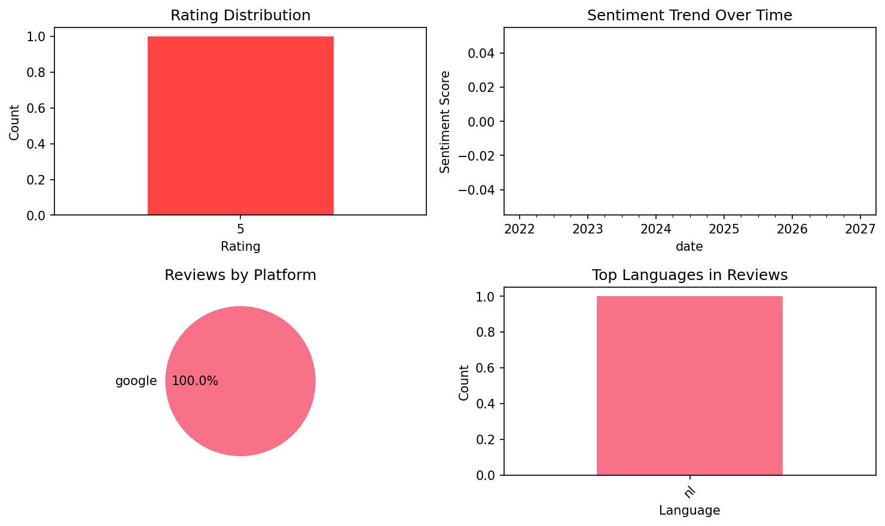

# English Grammar Tests

## 📱 App Information

| **Attribute** | **Google Play** | **App Store** |
|---------------|-----------------|---------------|
| **Title** | English Grammar Tests | N/A |
| **Package/ID** | com.holucent.grammarf | N/A |
| **Rating** | 4.58 | N/A |
| **Total Ratings** | 2,916 | N/A |
| **Installs** | 500,000+ | N/A |
| **Genre** | Education | N/A |

## 📝 Description

Learn English grammar right from your phone with this app perfect for all non-native speakers. Thousands of questions with instant explanation, sorted by topic:

- Nouns (plural, countable and uncountable, partitives/quantifiers...)
- Articles (a, an, the, zero article)
- Adjectives and adverbs (comparative and superlative. As or than? Good or well? Enough or enough of?)
- Pronouns (Subject, reflex and possessive pronouns. There or it? Some or any? Or none?)
- Tenses and verbs (Past, present and future tenses. )
- Irregular verbs (begin - began - begun 
 bring - brought - brought)
- Verb patterns (Verbs followed by a to-infinitive or by -ing/gerund)
- Questions, auxiliary and phrasal verbs (Question tags, indirect questions. Verbs with prepositions.)
- Word order (Order of words in sentences. )
- Reported speech (Indirect speech and change of tenses.)
- Prepositions (Time and place prepositions (at, on, in). Until or by? Verbs with prepositions.)
- Word formation (prefixes: in or im, suffixes: ible or able, compound words...)
- Idiomatic expressions (idioms, similes, proverbs and binomials)
- Clauses and conjunctions (Conditional and wish clauses)

Use Study plan, track statistics and see your results. 

You can also try our online tests at https://www.eductify.com/

## 📊 Reviews Analytics

**Total Reviews:** 1 (1 analyzed)
**Rating Distribution:** 1 positive (4-5★), 0 neutral (3★), 0 negative (1-2★)
**Average Sentiment:** 0.00 (-1=very negative, +1=very positive)
**Primary Language:** nl
**Key Insights:** Average rating: 5.0/5.0 | Reviews from 1 platform(s): google

### ⭐ Rating Breakdown

- **5 ★★★★★**: 1 reviews (100.0%)

### 🌍 Languages in Reviews

- **nl**: 1 reviews

### 📱 Platform Distribution

- **google**: 1 reviews

## 📈 Visualizations

### Analytics Charts


## 💬 Sample Reviews

**Review 1** (★★★★★ - google - 2024-07-27T23:13:52)
> In deze spel kan je snel leren praten in Engels

## 🔧 Raw JSON Data

<details>
<summary>Click to expand raw app data</summary>

```json
{
  "name": "English Grammar Tests",
  "google_package": "com.holucent.grammarf",
  "google": {
    "title": "English Grammar Tests",
    "description": "Learn English grammar right from your phone with this app perfect for all non-native speakers. Thousands of questions with instant explanation, sorted by topic:\r\n\r\n- Nouns (plural, countable and uncountable, partitives/quantifiers...)\r\n- Articles (a, an, the, zero article)\r\n- Adjectives and adverbs (comparative and superlative. As or than? Good or well? Enough or enough of?)\r\n- Pronouns (Subject, reflex and possessive pronouns. There or it? Some or any? Or none?)\r\n- Tenses and verbs (Past, present and future tenses. )\r\n- Irregular verbs (begin - began - begun \r\n bring - brought - brought)\r\n- Verb patterns (Verbs followed by a to-infinitive or by -ing/gerund)\r\n- Questions, auxiliary and phrasal verbs (Question tags, indirect questions. Verbs with prepositions.)\r\n- Word order (Order of words in sentences. )\r\n- Reported speech (Indirect speech and change of tenses.)\r\n- Prepositions (Time and place prepositions (at, on, in). Until or by? Verbs with prepositions.)\r\n- Word formation (prefixes: in or im, suffixes: ible or able, compound words...)\r\n- Idiomatic expressions (idioms, similes, proverbs and binomials)\r\n- Clauses and conjunctions (Conditional and wish clauses)\r\n\r\nUse Study plan, track statistics and see your results. \r\n\r\nYou can also try our online tests at https://www.eductify.com/",
    "rating": 4.58,
    "rating_text": null,
    "ratings_total": 2916,
    "ratings_histogram": [
      132,
      22,
      66,
      375,
      2253
    ],
    "installs": "500,000+",
    "genre": "Education"
  },
  "apple": null,
  "reviews": [
    {
      "platform": "google",
      "rating": 5,
      "review": "In deze spel kan je snel leren praten in Engels",
      "date": "2024-07-27T23:13:52"
    }
  ]
}
```

</details>

---
*Report generated on 2025-11-08 13:50:35 using advanced analytics*
