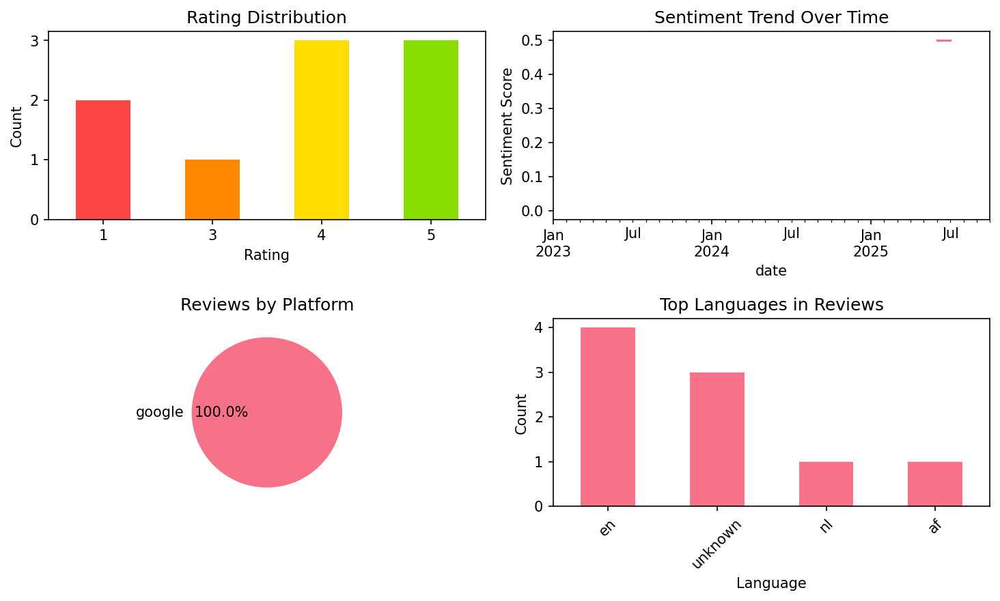

# Vocabulary - Learn words daily

## 📱 App Information

| **Attribute** | **Google Play** | **App Store** |
|---------------|-----------------|---------------|
| **Title** | Vocabulary - Learn words daily | N/A |
| **Package/ID** | com.hrd.vocabulary | N/A |
| **Rating** | 4.6952615 | N/A |
| **Total Ratings** | 89,419 | N/A |
| **Installs** | 1,000,000+ | N/A |
| **Genre** | Education | N/A |

## 📝 Description

Ready to elevate your word power? The key to successfully expanding your vocabulary is learning new words in a way that stimulates your attention. Studies show that the most effective way of learning new words is with an app that’s specifically designed for that.


With the Vocabulary app, you can:

- Learn new words with minimal time investment, simply scrolling through your phone
- Choose your own level of difficulty, based on your current English language mastery
- Select Vocabulary categories that best suit your needs and interests
- Speak and write more concisely and confidently, with the right word at your fingertips
- Meet your linguistic goals at your own pace
- Customize the app’s features and make it work for you

The Vocabulary app will turn learning and retaining new words into a fun activity that will allow you to “wow” your friends and co-workers.

*It works on Wear OS: you can use it on your watch.

## 📊 Reviews Analytics

**Total Reviews:** 9 (9 analyzed)
**Rating Distribution:** 6 positive (4-5★), 1 neutral (3★), 2 negative (1-2★)
**Average Sentiment:** 0.19 (-1=very negative, +1=very positive)
**Primary Language:** en
**Key Insights:** Average rating: 3.6/5.0 | Overall sentiment: positive (score: 0.19) | Reviews in 4 languages, primarily en (4 reviews) | Reviews from 1 platform(s): google | Key themes: words, app


### 🔑 Key Themes & Phrases

- **words** (relevance: 0.369)
- **app** (relevance: 0.278)

### ⭐ Rating Breakdown

- **5 ★★★★★**: 3 reviews (33.3%)
- **4 ★★★★☆**: 3 reviews (33.3%)
- **3 ★★★☆☆**: 1 reviews (11.1%)
- **1 ★☆☆☆☆**: 2 reviews (22.2%)

### 🌍 Languages in Reviews

- **en**: 4 reviews
- **unknown**: 3 reviews
- **nl**: 1 reviews
- **af**: 1 reviews

### 📱 Platform Distribution

- **google**: 9 reviews

## 📈 Visualizations

### Analytics Charts


### Word Cloud


## 💬 Sample Reviews

**Review 1** (★★★ - google - 2025-10-02T11:09:11)
> Hello, I do like the interface of the app, but it just repeats the same words in the exercises. I tried to fix it but dot know how. Maybe its a bug?

**Review 2** (★★★★★ - google - 2025-06-05T14:13:56)
> amazing app for words you never heard but are important

**Review 3** (★★★★ - google - 2024-01-19T13:18:09)
> nice to learn new words

**Review 4** (★★★★ - google - 2023-06-17T11:00:53)
> aesthetic

**Review 5** (★★★★★ - google - 2023-01-21T21:49:26)
> Good application, it gives u very useful words wich u can actually use in rl.

## 🔧 Raw JSON Data

<details>
<summary>Click to expand raw app data</summary>

```json
{
  "name": "Vocabulary - Learn words daily",
  "google_package": "com.hrd.vocabulary",
  "google": {
    "title": "Vocabulary - Learn words daily",
    "description": "Ready to elevate your word power? The key to successfully expanding your vocabulary is learning new words in a way that stimulates your attention. Studies show that the most effective way of learning new words is with an app that’s specifically designed for that.\r\n\r\n\r\nWith the Vocabulary app, you can:\r\n\r\n- Learn new words with minimal time investment, simply scrolling through your phone\r\n- Choose your own level of difficulty, based on your current English language mastery\r\n- Select Vocabulary categories that best suit your needs and interests\r\n- Speak and write more concisely and confidently, with the right word at your fingertips\r\n- Meet your linguistic goals at your own pace\r\n- Customize the app’s features and make it work for you\r\n\r\nThe Vocabulary app will turn learning and retaining new words into a fun activity that will allow you to “wow” your friends and co-workers.\r\n\r\n*It works on Wear OS: you can use it on your watch.",
    "rating": 4.6952615,
    "rating_text": null,
    "ratings_total": 89419,
    "ratings_histogram": [
      2479,
      1163,
      2187,
      9421,
      74145
    ],
    "installs": "1,000,000+",
    "genre": "Education"
  },
  "apple": null,
  "reviews": [
    {
      "platform": "google",
      "rating": 3,
      "review": "Hello, I do like the interface of the app, but it just repeats the same words in the exercises. I tried to fix it but dot know how. Maybe its a bug?",
      "date": "2025-10-02T11:09:11"
    },
    {
      "platform": "google",
      "rating": 5,
      "review": "enjoyable",
      "date": "2025-07-27T14:14:11"
    },
    {
      "platform": "google",
      "rating": 5,
      "review": "amazing app for words you never heard but are important",
      "date": "2025-06-05T14:13:56"
    },
    {
      "platform": "google",
      "rating": 4,
      "review": "De app ziet er keurig uit, maar sommige woorden hebben een te beknopte uitleg en de stem is een beetje saai. Desondanks vind ik het nu al een geweldige app!",
      "date": "2024-08-25T22:13:03"
    },
    {
      "platform": "google",
      "rating": 4,
      "review": "nice to learn new words",
      "date": "2024-01-19T13:18:09"
    },
    {
      "platform": "google",
      "rating": 1,
      "review": "3 advertenties in 1 minuut",
      "date": "2023-10-12T20:30:51"
    },
    {
      "platform": "google",
      "rating": 4,
      "review": "aesthetic",
      "date": "2023-06-17T11:00:53"
    },
    {
      "platform": "google",
      "rating": 1,
      "review": "Betalend",
      "date": "2023-03-27T21:31:33"
    },
    {
      "platform": "google",
      "rating": 5,
      "review": "Good application, it gives u very useful words wich u can actually use in rl.",
      "date": "2023-01-21T21:49:26"
    }
  ]
}
```

</details>

---
*Report generated on 2025-11-08 13:50:37 using advanced analytics*
