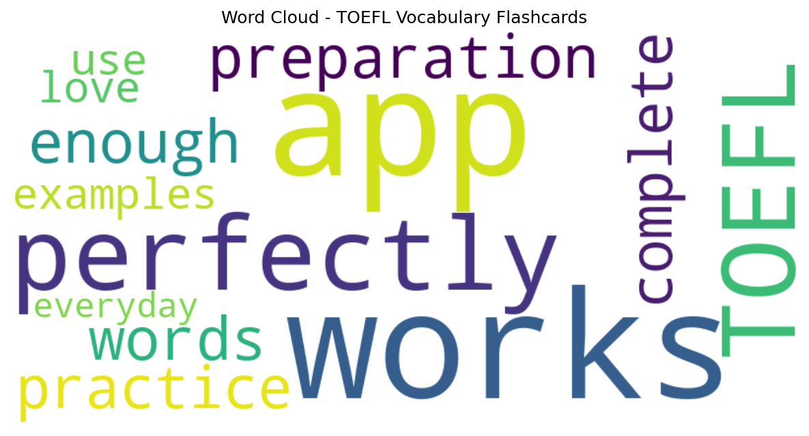

# TOEFL Vocabulary Flashcards

## 📱 App Information

| **Attribute** | **Google Play** | **App Store** |
|---------------|-----------------|---------------|
| **Title** | TOEFL Vocabulary Flashcards | N/A |
| **Package/ID** | com.magoosh.toefl.flashcards.vocabulary | N/A |
| **Rating** | 4.76 | N/A |
| **Total Ratings** | 6,475 | N/A |
| **Installs** | 500,000+ | N/A |
| **Genre** | Education | N/A |

## 📝 Description

Don't just stare at wordlists—master the 600 most important TOEFL vocabulary words with the highly-rated free flashcards for your Android phone or tablet. Practice every day to improve your vocab knowledge.

- 600+ vocab words picked by an expert TOEFL tutor
- Definitions and example sentences for every word
- Decks for every difficulty level
- Track your progress as you study
- Smart algorithm focuses your practice for efficient learning

This app gives you free access to all of Magoosh’s TOEFL flashcards. Sign in with a Magoosh account (or create a new one) to save your progress to the web. You can continue your practice online at https://toefl.magoosh.com/flashcards/vocabulary

Written by TOEFL experts
------------------------
The entire TOEFL wordlist is selected and defined with usage examples by Magoosh’s expert TOEFL tutors, led by Chris Lele and Lucas Fink. Chris has been teaching the TOEFL for more than 10 years, runs a popular vocabulary series on YouTube and he’s also written an eBook on vocabulary. He is unbeatable in Scrabble, or any other word game for that matter. Lucas studied creative writing at Bard College and has been teaching English grammar and standardized tests since 2008.

Review that really sticks
-------------------------
Academic research has found that memories are formed by repeated exposure to new information, so Magoosh’s flashcard app uses a spaced repetition system. Words you are learning will reappear frequently (occurring less frequently the better you know them) and words you already know won’t be repeated. The TOEFL word list is also culled to only 600 so that you don't waste time learning unimportant words.

About Magoosh
-------------
We're an online test prep company with a focus on teaching the TOEFL through videos and personalized customer support.

In addition to our online course, we blog about TOEFL strategies and test-taking tips at https://magoosh.com/toefl

More TOEFL study tools
----------------------
When you’re ready to practice for the full TOEFL exam, Magoosh’s website has a complete online video course covering everything on the test. Visit https://toefl.magoosh.com for more information.

(Magoosh also has apps for studying for the GMAT and GRE. Search the store for "magoosh gmat" or "magoosh gre" to find them)

Have any questions? Please ask!
-------------------------------
Student satisfaction is incredibly important to us. If you have any questions or comments, please send us an email at help@magoosh.com and we’ll get back to you as quickly as we can.

“I didn’t have much time to prepare, and Magoosh made it possible for me to succeed on the test in a short period of time. I looked at Kaplan, Barron’s, and Princeton Review products, and I can confidently say that Magoosh was definitely the best.”

“The team is really great and actually cares about your score as much as they would care about their own. Simply the best.”

Don’t wait until the last minute to start studying, start memorizing TOEFL words today!

## 📊 Reviews Analytics

**Total Reviews:** 2 (2 analyzed)
**Rating Distribution:** 2 positive (4-5★), 0 neutral (3★), 0 negative (1-2★)
**Average Sentiment:** 0.26 (-1=very negative, +1=very positive)
**Primary Language:** en
**Key Insights:** Average rating: 5.0/5.0 | Overall sentiment: positive (score: 0.26) | Reviews from 1 platform(s): google

### ⭐ Rating Breakdown

- **5 ★★★★★**: 2 reviews (100.0%)

### 🌍 Languages in Reviews

- **en**: 2 reviews

### 📱 Platform Distribution

- **google**: 2 reviews

## 📈 Visualizations

### Analytics Charts


### Word Cloud


## 💬 Sample Reviews

**Review 1** (★★★★★ - google - 2021-01-25T19:04:42)
> The app works perfectly for my TOEFL preparation. It has enough words to practice complete with examples.

**Review 2** (★★★★★ - google - 2017-09-08T20:32:36)
> I love it i use it everyday

## 🔧 Raw JSON Data

<details>
<summary>Click to expand raw app data</summary>

```json
{
  "name": "TOEFL Vocabulary Flashcards",
  "google_package": "com.magoosh.toefl.flashcards.vocabulary",
  "google": {
    "title": "TOEFL Vocabulary Flashcards",
    "description": "Don't just stare at wordlists—master the 600 most important TOEFL vocabulary words with the highly-rated free flashcards for your Android phone or tablet. Practice every day to improve your vocab knowledge.\r\n\r\n- 600+ vocab words picked by an expert TOEFL tutor\r\n- Definitions and example sentences for every word\r\n- Decks for every difficulty level\r\n- Track your progress as you study\r\n- Smart algorithm focuses your practice for efficient learning\r\n\r\nThis app gives you free access to all of Magoosh’s TOEFL flashcards. Sign in with a Magoosh account (or create a new one) to save your progress to the web. You can continue your practice online at https://toefl.magoosh.com/flashcards/vocabulary\r\n\r\nWritten by TOEFL experts\r\n------------------------\r\nThe entire TOEFL wordlist is selected and defined with usage examples by Magoosh’s expert TOEFL tutors, led by Chris Lele and Lucas Fink. Chris has been teaching the TOEFL for more than 10 years, runs a popular vocabulary series on YouTube and he’s also written an eBook on vocabulary. He is unbeatable in Scrabble, or any other word game for that matter. Lucas studied creative writing at Bard College and has been teaching English grammar and standardized tests since 2008.\r\n\r\nReview that really sticks\r\n-------------------------\r\nAcademic research has found that memories are formed by repeated exposure to new information, so Magoosh’s flashcard app uses a spaced repetition system. Words you are learning will reappear frequently (occurring less frequently the better you know them) and words you already know won’t be repeated. The TOEFL word list is also culled to only 600 so that you don't waste time learning unimportant words.\r\n\r\nAbout Magoosh\r\n-------------\r\nWe're an online test prep company with a focus on teaching the TOEFL through videos and personalized customer support.\r\n\r\nIn addition to our online course, we blog about TOEFL strategies and test-taking tips at https://magoosh.com/toefl\r\n\r\nMore TOEFL study tools\r\n----------------------\r\nWhen you’re ready to practice for the full TOEFL exam, Magoosh’s website has a complete online video course covering everything on the test. Visit https://toefl.magoosh.com for more information.\r\n\r\n(Magoosh also has apps for studying for the GMAT and GRE. Search the store for \"magoosh gmat\" or \"magoosh gre\" to find them)\r\n\r\nHave any questions? Please ask!\r\n-------------------------------\r\nStudent satisfaction is incredibly important to us. If you have any questions or comments, please send us an email at help@magoosh.com and we’ll get back to you as quickly as we can.\r\n\r\n“I didn’t have much time to prepare, and Magoosh made it possible for me to succeed on the test in a short period of time. I looked at Kaplan, Barron’s, and Princeton Review products, and I can confidently say that Magoosh was definitely the best.”\r\n\r\n“The team is really great and actually cares about your score as much as they would care about their own. Simply the best.”\r\n\r\nDon’t wait until the last minute to start studying, start memorizing TOEFL words today!",
    "rating": 4.76,
    "rating_text": null,
    "ratings_total": 6475,
    "ratings_histogram": [
      119,
      119,
      0,
      639,
      5565
    ],
    "installs": "500,000+",
    "genre": "Education"
  },
  "apple": null,
  "reviews": [
    {
      "platform": "google",
      "rating": 5,
      "review": "The app works perfectly for my TOEFL preparation. It has enough words to practice complete with examples.",
      "date": "2021-01-25T19:04:42"
    },
    {
      "platform": "google",
      "rating": 5,
      "review": "I love it i use it everyday",
      "date": "2017-09-08T20:32:36"
    }
  ]
}
```

</details>

---
*Report generated on 2025-11-08 13:51:18 using advanced analytics*
