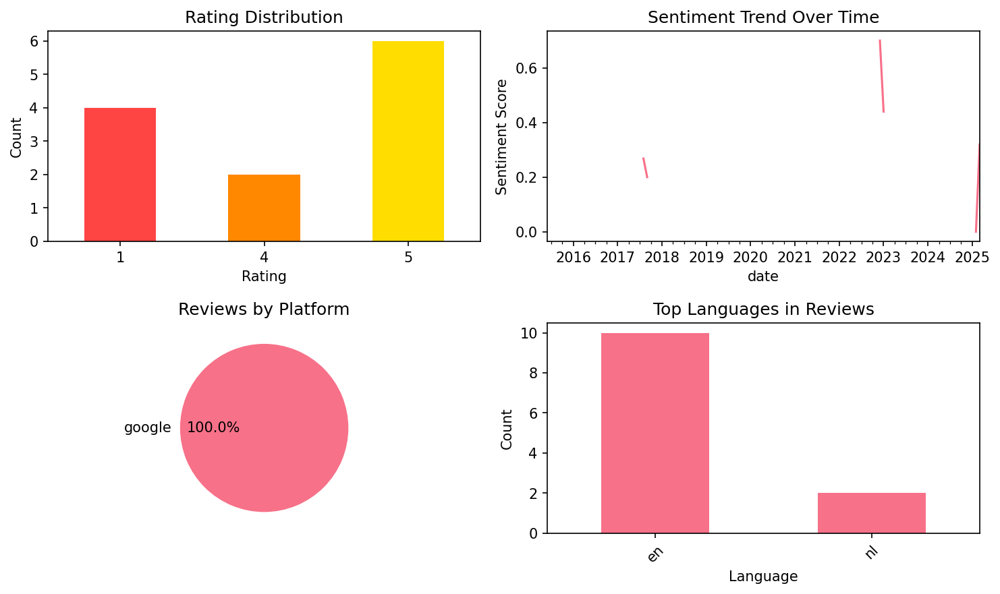

# Mango Languages Learning

## 📱 App Information

| **Attribute** | **Google Play** | **App Store** |
|---------------|-----------------|---------------|
| **Title** | Mango Languages Learning | N/A |
| **Package/ID** | com.mango.android | N/A |
| **Rating** | 4.802985 | N/A |
| **Total Ratings** | 22,511 | N/A |
| **Installs** | 1,000,000+ | N/A |
| **Genre** | Education | N/A |

## 📝 Description

Ready to have real conversations? Mango Languages prioritizes real language, real culture, and real progress. Our comprehensive learning platform offers conversational language lessons in 70+ languages, teaching vocabulary, pronunciation, grammar, and culture simultaneously.

From preparing for vacation or working abroad, to personal development and academic growth, our language courses are designed to take you wherever you wish to go.

HOW DOES MANGO WORK?

Learn languages from native speakers with courses that feature thousands of real recordings.
Enhance comprehension with interactive listening and reading activities and bolster your learning with personalized daily reviews.
Refine speaking skills with phonetic spellings, natural and slow pronunciations, and our pronunciation comparison tool.
Sync progress across all platforms and NO ADS, so you can learn anywhere, at any time, with no distractions.

WHY CHOOSE MANGO?

Practical, Authentic Content: The outcome of using Mango is the ability to speak and communicate in real conversations.

Linguist-Approved Language Courses: Each course is designed by expert linguists to provide high-quality instruction that produces real results.

Placement Tests: Not sure where to start? Use our placement tests in select languages to identify the best starting point.

Individualized Review: Our intelligent review system helps you retain knowledge through spaced repetition and adapts to your progress.

Practice with Flashcards: Supercharge your vocabulary with built-in flashcards or take it a step further and create your own lists!

On-The-Go Learning: Download lessons to your phone for offline access and take advantage of our hands-free audio feature!

HOW CAN I START?

When you sign up, you can find free access through a subscribing organization, like a public library, or you can subscribe with a 14-day free trial. Cancel at any time.

Serious about language learning? Our paid subscriptions include: 
Individual Plan: Access to all of our languages in one learning profile.
Family Plan: Access to all of our languages for you and up to five additional family members.

For questions or feedback, please contact support@mangolanguages.com

​​Available Courses for English Speakers:
• Arabic (Egyptian)
• Arabic (Iraqi)
• Arabic (Levantine)
• Arabic (Modern Standard)
• Armenian
• Azerbaijani
• Bengali
• Chaldean Aramaic
• Chinese (Cantonese)
• Chinese (Mandarin)
• Croatian
• Czech
• Cherokee
• Danish
• Dari
• Dutch
• Dzongkha
• Filipino (Tagalog)
• Finnish
• French
• French (Canadian)
• German
• Greek
• Greek (Ancient)
• Greek (Koine)
• Haitian Creole
• Hawaiian
• Hebrew (Modern)
• Hebrew (Biblical)
• Hindi
• Hungarian
• Icelandic
• Igbo
• Indonesian
• Irish
• Italian
• Japanese
• Javanese
• Kazakh
• Korean
• Latin
• Malay
• Malayalam
• Norwegian
• Pashto
• Persian (Farsi)
• Polish
• Portuguese (Brazilian)
• Potawatomi
• Punjabi (Pakistani)
• Romanian
• Russian
• Scottish Gaelic
• Serbian
• Shanghainese
• Slovak
• Spanish (Castilian)
• Spanish (Latin American)
• Swahili
• Swedish
• Tamil
• Telugu
• Thai
• Turkish
• Tuvan
• Ukrainian
• Urdu
• Uzbek
• Vietnamese
• Yiddish

Available Courses to Learn English:
• English for Arabic (Egyptian) Speakers
• English for Arabic (Modern Standard) Speakers
• English for Armenian Speakers
• English for Bengali Speakers
• English for Chinese (Cantonese) Speakers
• English for Chinese (Mandarin) Speakers
• English for French Speakers
• English for German Speakers
• English for Greek Speakers
• English for Haitian Creole Speakers
• English for Hmong Speakers
• English for Italian Speakers
• English for Japanese Speakers
• English for Korean Speakers
• English for Polish Speakers
• English for Portuguese (Brazilian) Speakers
• English for Russian Speakers
• English for Somali Speakers
• English for Spanish (Latin American) Speakers
• English for Turkish Speakers
• English for Vietnamese Speakers

Terms of use: https://mangolanguages.com/legal/terms-and-conditions/

## 📊 Reviews Analytics

**Total Reviews:** 12 (12 analyzed)
**Rating Distribution:** 8 positive (4-5★), 0 neutral (3★), 4 negative (1-2★)
**Average Sentiment:** 0.24 (-1=very negative, +1=very positive)
**Primary Language:** en
**Key Insights:** Average rating: 3.5/5.0 | Overall sentiment: positive (score: 0.24) | Reviews in 2 languages, primarily en (10 reviews) | Reviews from 1 platform(s): google | Key themes: nice, free, en


### 🔑 Key Themes & Phrases

- **nice** (relevance: 0.149)
- **free** (relevance: 0.142)
- **en** (relevance: 0.133)
- **app** (relevance: 0.116)
- **don** (relevance: 0.115)
- **like** (relevance: 0.113)
- **amazing** (relevance: 0.107)
- **herhalingen** (relevance: 0.096)

### ⭐ Rating Breakdown

- **5 ★★★★★**: 6 reviews (50.0%)
- **4 ★★★★☆**: 2 reviews (16.7%)
- **1 ★☆☆☆☆**: 4 reviews (33.3%)

### 🌍 Languages in Reviews

- **en**: 10 reviews
- **nl**: 2 reviews

### 📱 Platform Distribution

- **google**: 12 reviews

## 📈 Visualizations

### Analytics Charts


### Word Cloud


## 💬 Sample Reviews

**Review 1** (★★★★★ - google - 2025-03-22T10:51:14)
> It's really useful and easy to work with. there are many languages you can choose, and I love the flashcard function! I don't have this app very long, but I don't have any problems so far!

**Review 2** (★★★★ - google - 2023-01-23T17:04:09)
> Very nice and clear

**Review 3** (★★★★ - google - 2019-08-25T01:01:31)
> Nice app to learn talking russian. I use it a lot and can talk quit a bit thanks to this app. I love it. Wish they had more "listening to a conversation", like in chapter one and two. I miss it.

**Review 4** (★ - google - 2017-08-16T16:26:41)
> It is not for free when you don't live in the US

**Review 5** (★ - google - 2015-06-26T14:31:29)
> I am from Holland and can't make a account

## 🔧 Raw JSON Data

<details>
<summary>Click to expand raw app data</summary>

```json
{
  "name": "Mango Languages Learning",
  "google_package": "com.mango.android",
  "google": {
    "title": "Mango Languages Learning",
    "description": "Ready to have real conversations? Mango Languages prioritizes real language, real culture, and real progress. Our comprehensive learning platform offers conversational language lessons in 70+ languages, teaching vocabulary, pronunciation, grammar, and culture simultaneously.\r\n\r\nFrom preparing for vacation or working abroad, to personal development and academic growth, our language courses are designed to take you wherever you wish to go.\r\n\r\nHOW DOES MANGO WORK?\r\n\r\nLearn languages from native speakers with courses that feature thousands of real recordings.\r\nEnhance comprehension with interactive listening and reading activities and bolster your learning with personalized daily reviews.\r\nRefine speaking skills with phonetic spellings, natural and slow pronunciations, and our pronunciation comparison tool.\r\nSync progress across all platforms and NO ADS, so you can learn anywhere, at any time, with no distractions.\r\n\r\nWHY CHOOSE MANGO?\r\n\r\nPractical, Authentic Content: The outcome of using Mango is the ability to speak and communicate in real conversations.\r\n\r\nLinguist-Approved Language Courses: Each course is designed by expert linguists to provide high-quality instruction that produces real results.\r\n\r\nPlacement Tests: Not sure where to start? Use our placement tests in select languages to identify the best starting point.\r\n\r\nIndividualized Review: Our intelligent review system helps you retain knowledge through spaced repetition and adapts to your progress.\r\n\r\nPractice with Flashcards: Supercharge your vocabulary with built-in flashcards or take it a step further and create your own lists!\r\n\r\nOn-The-Go Learning: Download lessons to your phone for offline access and take advantage of our hands-free audio feature!\r\n\r\nHOW CAN I START?\r\n\r\nWhen you sign up, you can find free access through a subscribing organization, like a public library, or you can subscribe with a 14-day free trial. Cancel at any time.\r\n\r\nSerious about language learning? Our paid subscriptions include: \r\nIndividual Plan: Access to all of our languages in one learning profile.\r\nFamily Plan: Access to all of our languages for you and up to five additional family members.\r\n\r\nFor questions or feedback, please contact support@mangolanguages.com\r\n\r\n​​Available Courses for English Speakers:\r\n• Arabic (Egyptian)\r\n• Arabic (Iraqi)\r\n• Arabic (Levantine)\r\n• Arabic (Modern Standard)\r\n• Armenian\r\n• Azerbaijani\r\n• Bengali\r\n• Chaldean Aramaic\r\n• Chinese (Cantonese)\r\n• Chinese (Mandarin)\r\n• Croatian\r\n• Czech\r\n• Cherokee\r\n• Danish\r\n• Dari\r\n• Dutch\r\n• Dzongkha\r\n• Filipino (Tagalog)\r\n• Finnish\r\n• French\r\n• French (Canadian)\r\n• German\r\n• Greek\r\n• Greek (Ancient)\r\n• Greek (Koine)\r\n• Haitian Creole\r\n• Hawaiian\r\n• Hebrew (Modern)\r\n• Hebrew (Biblical)\r\n• Hindi\r\n• Hungarian\r\n• Icelandic\r\n• Igbo\r\n• Indonesian\r\n• Irish\r\n• Italian\r\n• Japanese\r\n• Javanese\r\n• Kazakh\r\n• Korean\r\n• Latin\r\n• Malay\r\n• Malayalam\r\n• Norwegian\r\n• Pashto\r\n• Persian (Farsi)\r\n• Polish\r\n• Portuguese (Brazilian)\r\n• Potawatomi\r\n• Punjabi (Pakistani)\r\n• Romanian\r\n• Russian\r\n• Scottish Gaelic\r\n• Serbian\r\n• Shanghainese\r\n• Slovak\r\n• Spanish (Castilian)\r\n• Spanish (Latin American)\r\n• Swahili\r\n• Swedish\r\n• Tamil\r\n• Telugu\r\n• Thai\r\n• Turkish\r\n• Tuvan\r\n• Ukrainian\r\n• Urdu\r\n• Uzbek\r\n• Vietnamese\r\n• Yiddish\r\n\r\nAvailable Courses to Learn English:\r\n• English for Arabic (Egyptian) Speakers\r\n• English for Arabic (Modern Standard) Speakers\r\n• English for Armenian Speakers\r\n• English for Bengali Speakers\r\n• English for Chinese (Cantonese) Speakers\r\n• English for Chinese (Mandarin) Speakers\r\n• English for French Speakers\r\n• English for German Speakers\r\n• English for Greek Speakers\r\n• English for Haitian Creole Speakers\r\n• English for Hmong Speakers\r\n• English for Italian Speakers\r\n• English for Japanese Speakers\r\n• English for Korean Speakers\r\n• English for Polish Speakers\r\n• English for Portuguese (Brazilian) Speakers\r\n• English for Russian Speakers\r\n• English for Somali Speakers\r\n• English for Spanish (Latin American) Speakers\r\n• English for Turkish Speakers\r\n• English for Vietnamese Speakers\r\n\r\nTerms of use: https://mangolanguages.com/legal/terms-and-conditions/",
    "rating": 4.802985,
    "rating_text": null,
    "ratings_total": 22511,
    "ratings_histogram": [
      251,
      166,
      368,
      2182,
      19536
    ],
    "installs": "1,000,000+",
    "genre": "Education"
  },
  "apple": null,
  "reviews": [
    {
      "platform": "google",
      "rating": 5,
      "review": "It's really useful and easy to work with. there are many languages you can choose, and I love the flashcard function! I don't have this app very long, but I don't have any problems so far!",
      "date": "2025-03-22T10:51:14"
    },
    {
      "platform": "google",
      "rating": 5,
      "review": "Simpel, veel herhalingen, je hebt de functie om een woord steed soonieyw te horen en ook de arabische versie te zien. Goede opbouw ook. Ik ben fan 😃",
      "date": "2025-02-23T19:39:36"
    },
    {
      "platform": "google",
      "rating": 5,
      "review": "Amazing language learning tool. Currently learning Levantine Arabic, quickest progress thus far!",
      "date": "2024-01-21T09:26:14"
    },
    {
      "platform": "google",
      "rating": 4,
      "review": "Very nice and clear",
      "date": "2023-01-23T17:04:09"
    },
    {
      "platform": "google",
      "rating": 5,
      "review": "Really nice app. Great lessons and good customer service",
      "date": "2022-12-03T18:50:33"
    },
    {
      "platform": "google",
      "rating": 5,
      "review": "Luid en duidelijk en genoeg herhalingen.",
      "date": "2020-11-18T02:18:33"
    },
    {
      "platform": "google",
      "rating": 4,
      "review": "Nice app to learn talking russian. I use it a lot and can talk quit a bit thanks to this app. I love it. Wish they had more \"listening to a conversation\", like in chapter one and two. I miss it.",
      "date": "2019-08-25T01:01:31"
    },
    {
      "platform": "google",
      "rating": 5,
      "review": "Amazing. You can learn so quickly and well in so many languages. It worked perfect for me. But its gets harder when some stuff are not so interesting. Wich made me skip parts and if you do that, its gonna be very hard to keep up. Also so expensive !!! 😭",
      "date": "2018-10-05T21:08:07"
    },
    {
      "platform": "google",
      "rating": 1,
      "review": "Seems like subscriptions are only available for people living in the US",
      "date": "2017-09-02T06:02:56"
    },
    {
      "platform": "google",
      "rating": 1,
      "review": "It is not for free when you don't live in the US",
      "date": "2017-08-16T16:26:41"
    },
    {
      "platform": "google",
      "rating": 1,
      "review": "Only the first lesson is free",
      "date": "2017-04-24T22:27:49"
    },
    {
      "platform": "google",
      "rating": 1,
      "review": "I am from Holland and can't make a account",
      "date": "2015-06-26T14:31:29"
    }
  ]
}
```

</details>

---
*Report generated on 2025-11-08 13:51:20 using advanced analytics*
