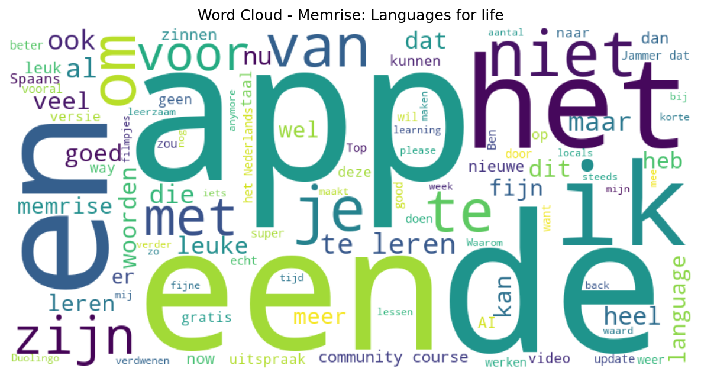

# Memrise: Languages for life

## 📱 App Information

| **Attribute** | **Google Play** | **App Store** |
|---------------|-----------------|---------------|
| **Title** | Memrise: Languages for life | N/A |
| **Package/ID** | com.memrise.android.memrisecompanion | N/A |
| **Rating** | 4.4617343 | N/A |
| **Total Ratings** | 1,571,537 | N/A |
| **Installs** | 10,000,000+ | N/A |
| **Genre** | Education | N/A |

## 📝 Description

Over 75 million people have already chosen Memrise to achieve their language goals— make it your resolution this year! Whether it’s finally speaking Spanish, brushing up on French, or mastering Japanese, Memrise makes learning authentic, engaging, and unforgettable.

Start 2025 strong by picking up a new language and sticking to it! With real-life conversations, cultural insights, and the confidence to speak like a local, Memrise is your ultimate partner for turning your resolution into reality.

Learn Spanish, Korean, Japanese or 31 other languages in lessons that teach you vocabulary, listening and speaking as if you were a local living in the country!

Choose a language from Spanish 🇪🇸🇲🇽,  Korean 🇰🇷, Japanese 🇯🇵, English 🇬🇧🇺🇸, French 🇫🇷, Italian 🇮🇹, Portuguese 🇵🇹🇧🇷, German 🇩🇪, Polish 🇵🇱, Russian 🇷🇺, Turkish 🇹🇷, Arabic, Chinese 🇨🇳, Dutch 🇳🇱, Danish 🇩🇰, Icelandic 🇮🇸, Mongolian🇲🇳, Norwegian 🇳🇴, Slovenian 🇸🇮  Yoruba 🇳🇬 Hindi 🇮🇳 Ukranian 🇺🇦 Thai 🇹🇭 Swahili 🇹🇿🇰🇪, Hebrew 🇮🇱 Greek 🇬🇷 Indonesian 🇮🇩, Welsh 🏴󠁧󠁢󠁷󠁬󠁳󠁿, 🇵🇭 Tagalog, 🇮🇷Persian, 🇻🇳 Vietnamese. Also added: Yoruba, Hausa, and Somali!

Memrise is the ultimate language-learning app for achieving your New Year’s goals. Whether you’re a beginner starting from scratch, an intermediate learner building confidence in listening and speaking, or an advanced learner perfecting your conversational skills, Memrise has everything you need to succeed.

Download Memrise and make this year the one where you confidently:

❤️ Connect with your partner and their family 
✈️ Have a better time while travelling 
💡 Sharpen your mind if you’re learning a language for brain health
📖 Prepare for a language exam 
💼 Connect with work colleagues 
🎨 Better understand different cultures 

<b>How does Memrise help you learn Spanish, Korean, Japanese, and more?</b>

-Choose from hundreds of lessons inspired by real-life scenarios to keep learning practical and relevant.
-Build your vocabulary with essential words and phrases locals actually use.
-Practice listening with thousands of videos featuring native speakers in everyday settings.
-Gain confidence speaking with AI Buddies: personalised language-learning bots. Practice sentence-building, grammar, conjugation, and all the essential skills to sound fluent in your new language.

😎 Tailored to your language level ability 
💪 Challenging but not overwhelming 

⭐ Helping 75+ million learners speak confidently 
⭐ 190,00 4.6 star ratings 
⭐ Featured in BBC World Service, Conde Nast Traveller, Lonely Planet and more.

<b>What other learners are saying</b> 

★★★★★ <i>"I've been using Memrise for about two years, studying European Portuguese. I have the paid version - it's a solid learning tool, and it has been my primary resource ever since got it. I find the Learn with Locals feature to be especially useful, more so as my Portuguese improves. My wife and I spent a couple of weeks in Portugal a few months ago, and we were able to handle all of our transactions - stores, restaurants, markets, car rental, etc!"</i> -Voloúre 

<b> Need to speak a new language soon? Get the practice you need with Memrise Pro </b> 

Memrise Pro ✓ Unlock all vocab lessons ✓ Unlock all native speaker videos ✓ Unlimited speaking practice ✓ Ad free 

Compare with our Free Plan - Limited vocab lessons - Limited videos and conversations ✕ Ad free 

*PLEASE READ: A Memrise Pro subscription is required in to access all learning features. These vary depending on your device's language and language pair. Once purchased, subscriptions will automatically renew unless cancelled before the end of the current payment period. Subscriptions can be managed in your Google Play Store account. To enable some features of the Memrise app we may need to ask for your permission. You can change permissions at any time in your settings. 

Privacy Policy: https://www.memrise.com/privacy/ 
Terms of Use: https://www.memrise.com/terms/safa

## 📊 Reviews Analytics

**Total Reviews:** 100 (100 analyzed)
**Rating Distribution:** 56 positive (4-5★), 8 neutral (3★), 36 negative (1-2★)
**Average Sentiment:** 0.08 (-1=very negative, +1=very positive)
**Primary Language:** nl
**Key Insights:** Average rating: 3.3/5.0 | Overall sentiment: neutral (score: 0.08) | Reviews in 6 languages, primarily nl (60 reviews) | Reviews from 1 platform(s): google | Key themes: app, en, een


### 🔑 Key Themes & Phrases

- **app** (relevance: 0.128)
- **en** (relevance: 0.068)
- **een** (relevance: 0.065)
- **het** (relevance: 0.063)
- **te** (relevance: 0.060)
- **niet** (relevance: 0.054)
- **om** (relevance: 0.044)
- **je** (relevance: 0.042)

### ⭐ Rating Breakdown

- **5 ★★★★★**: 38 reviews (38.0%)
- **4 ★★★★☆**: 18 reviews (18.0%)
- **3 ★★★☆☆**: 8 reviews (8.0%)
- **2 ★★☆☆☆**: 9 reviews (9.0%)
- **1 ★☆☆☆☆**: 27 reviews (27.0%)

### 🌍 Languages in Reviews

- **nl**: 60 reviews
- **en**: 25 reviews
- **unknown**: 7 reviews
- **af**: 6 reviews
- **it**: 1 reviews

### 📱 Platform Distribution

- **google**: 100 reviews

## 📈 Visualizations

### Analytics Charts


### Word Cloud


## 💬 Sample Reviews

**Review 1** (★★★★★ - google - 2025-10-26T11:46:54)
> Ik zocht een alternatief voor Duolingo die laatst aankwam met een gek energiesysteem wat het helemaal niet leuk maakte en toen zag ik dit en ja... zo fijn geen rare batterijen systeempjes of zo. heel blij mee.

**Review 2** (★★★★★ - google - 2025-04-21T17:47:12)
> Honestly, I have been very disappointed about the transformation of the app, for quite some time. But, after trying the new Pro version for a while, I must admit: this app is splendid. The AI Buddies, with which you can practice at your own level, are especially wonderful. I am very impressed. For m...

**Review 3** (★★★★★ - google - 2024-10-09T17:46:56)
> Great app, free and a nice yet simple way of studying words

**Review 4** (★★★★ - google - 2024-05-23T10:37:37)
> Het is een leuke manier om een taal te leren. de opbouw van woorden naar zinnen en afwisseling tussen tekst leren, mogelijkheid om tekst te vertalen, afwisseling met video's en het overhoren vind ik erg stimulerend. De vertaling naar het Nederlands klopt soms niet qua grammatica, maar de strekking i...

**Review 5** (★★★★★ - google - 2024-03-02T21:21:02)
> zeer duidelijke uitspraak ....met fantastische video's.....fijn om te leren

## 🔧 Raw JSON Data

<details>
<summary>Click to expand raw app data</summary>

```json
{
  "name": "Memrise: Languages for life",
  "google_package": "com.memrise.android.memrisecompanion",
  "google": {
    "title": "Memrise: Languages for life",
    "description": "Over 75 million people have already chosen Memrise to achieve their language goals— make it your resolution this year! Whether it’s finally speaking Spanish, brushing up on French, or mastering Japanese, Memrise makes learning authentic, engaging, and unforgettable.\r\n\r\nStart 2025 strong by picking up a new language and sticking to it! With real-life conversations, cultural insights, and the confidence to speak like a local, Memrise is your ultimate partner for turning your resolution into reality.\r\n\r\nLearn Spanish, Korean, Japanese or 31 other languages in lessons that teach you vocabulary, listening and speaking as if you were a local living in the country!\r\n\r\nChoose a language from Spanish 🇪🇸🇲🇽,  Korean 🇰🇷, Japanese 🇯🇵, English 🇬🇧🇺🇸, French 🇫🇷, Italian 🇮🇹, Portuguese 🇵🇹🇧🇷, German 🇩🇪, Polish 🇵🇱, Russian 🇷🇺, Turkish 🇹🇷, Arabic, Chinese 🇨🇳, Dutch 🇳🇱, Danish 🇩🇰, Icelandic 🇮🇸, Mongolian🇲🇳, Norwegian 🇳🇴, Slovenian 🇸🇮  Yoruba 🇳🇬 Hindi 🇮🇳 Ukranian 🇺🇦 Thai 🇹🇭 Swahili 🇹🇿🇰🇪, Hebrew 🇮🇱 Greek 🇬🇷 Indonesian 🇮🇩, Welsh 🏴󠁧󠁢󠁷󠁬󠁳󠁿, 🇵🇭 Tagalog, 🇮🇷Persian, 🇻🇳 Vietnamese. Also added: Yoruba, Hausa, and Somali!\r\n\r\nMemrise is the ultimate language-learning app for achieving your New Year’s goals. Whether you’re a beginner starting from scratch, an intermediate learner building confidence in listening and speaking, or an advanced learner perfecting your conversational skills, Memrise has everything you need to succeed.\r\n\r\nDownload Memrise and make this year the one where you confidently:\r\n\r\n❤️ Connect with your partner and their family \r\n✈️ Have a better time while travelling \r\n💡 Sharpen your mind if you’re learning a language for brain health\r\n📖 Prepare for a language exam \r\n💼 Connect with work colleagues \r\n🎨 Better understand different cultures \r\n\r\n<b>How does Memrise help you learn Spanish, Korean, Japanese, and more?</b>\r\n\r\n-Choose from hundreds of lessons inspired by real-life scenarios to keep learning practical and relevant.\r\n-Build your vocabulary with essential words and phrases locals actually use.\r\n-Practice listening with thousands of videos featuring native speakers in everyday settings.\r\n-Gain confidence speaking with AI Buddies: personalised language-learning bots. Practice sentence-building, grammar, conjugation, and all the essential skills to sound fluent in your new language.\r\n\r\n😎 Tailored to your language level ability \r\n💪 Challenging but not overwhelming \r\n\r\n⭐ Helping 75+ million learners speak confidently \r\n⭐ 190,00 4.6 star ratings \r\n⭐ Featured in BBC World Service, Conde Nast Traveller, Lonely Planet and more.\r\n\r\n<b>What other learners are saying</b> \r\n\r\n★★★★★ <i>\"I've been using Memrise for about two years, studying European Portuguese. I have the paid version - it's a solid learning tool, and it has been my primary resource ever since got it. I find the Learn with Locals feature to be especially useful, more so as my Portuguese improves. My wife and I spent a couple of weeks in Portugal a few months ago, and we were able to handle all of our transactions - stores, restaurants, markets, car rental, etc!\"</i> -Voloúre \r\n\r\n<b> Need to speak a new language soon? Get the practice you need with Memrise Pro </b> \r\n\r\nMemrise Pro ✓ Unlock all vocab lessons ✓ Unlock all native speaker videos ✓ Unlimited speaking practice ✓ Ad free \r\n\r\nCompare with our Free Plan - Limited vocab lessons - Limited videos and conversations ✕ Ad free \r\n\r\n*PLEASE READ: A Memrise Pro subscription is required in to access all learning features. These vary depending on your device's language and language pair. Once purchased, subscriptions will automatically renew unless cancelled before the end of the current payment period. Subscriptions can be managed in your Google Play Store account. To enable some features of the Memrise app we may need to ask for your permission. You can change permissions at any time in your settings. \r\n\r\nPrivacy Policy: https://www.memrise.com/privacy/ \r\nTerms of Use: https://www.memrise.com/terms/safa",
    "rating": 4.4617343,
    "rating_text": null,
    "ratings_total": 1571537,
    "ratings_histogram": [
      103434,
      32451,
      56434,
      221885,
      1157300
    ],
    "installs": "10,000,000+",
    "genre": "Education"
  },
  "apple": null,
  "reviews": [
    {
      "platform": "google",
      "rating": 5,
      "review": "Ik zocht een alternatief voor Duolingo die laatst aankwam met een gek energiesysteem wat het helemaal niet leuk maakte en toen zag ik dit en ja... zo fijn geen rare batterijen systeempjes of zo. heel blij mee.",
      "date": "2025-10-26T11:46:54"
    },
    {
      "platform": "google",
      "rating": 2,
      "review": "Ik herzie mijn review. Een aantal functies is verdwenen, AI-buddies, zinnen maken. w Waarom? Heel slecht voor een app waarvoor je betaalt! WAAR ZIJN DE AI BUDDIES?",
      "date": "2025-10-25T15:15:12"
    },
    {
      "platform": "google",
      "rating": 4,
      "review": "ik had een levenslang abonnement, maar met nieuwe smartphone is dit niet meer beschikbaar.",
      "date": "2025-10-20T14:22:47"
    },
    {
      "platform": "google",
      "rating": 1,
      "review": "geen hongaars",
      "date": "2025-10-11T22:48:05"
    },
    {
      "platform": "google",
      "rating": 4,
      "review": "Heel fijn en veelzijdig om Spaans te leren. Jammer dat de buddy's sinds vorige week zijn verdwenen. Ik mis de grammaticalessen, want dat maakt de leerervaring juist compleet. Please, let them Come back!",
      "date": "2025-10-10T18:08:19"
    },
    {
      "platform": "google",
      "rating": 1,
      "review": "kan je gebruiken als leerplan maar niet als je bepaalde stukken wil leren voor school ofzo.",
      "date": "2025-10-01T14:53:40"
    },
    {
      "platform": "google",
      "rating": 1,
      "review": "please add more languages! would love Norwegian and Italian",
      "date": "2025-09-29T15:10:41"
    },
    {
      "platform": "google",
      "rating": 3,
      "review": "good for language learning. chat bot is super politically correct and extreme leftist",
      "date": "2025-09-26T09:26:05"
    },
    {
      "platform": "google",
      "rating": 1,
      "review": "as a former premium user, without community courses, this app is not the same",
      "date": "2025-09-15T09:54:13"
    },
    {
      "platform": "google",
      "rating": 5,
      "review": "this is how learning should be. helps a lot to learn a new language",
      "date": "2025-08-31T12:39:34"
    },
    {
      "platform": "google",
      "rating": 1,
      "review": "Het was leerzaam, vooral de uitspraak \"leren met locals\", helaas komen er steeds meer onverstaanbare video's, niet voor beginners. Hier kan je niet van leren. Nu nog maar 1 ster, want er komen teveel taalfouten in voor die je niet kan melden.",
      "date": "2025-08-23T09:15:23"
    },
    {
      "platform": "google",
      "rating": 5,
      "review": "fijne app , eigen tempo, overzichtelijk",
      "date": "2025-07-26T19:10:34"
    },
    {
      "platform": "google",
      "rating": 2,
      "review": "Veel filmpjes met woorden laden niet bij mij. zowel op WiFi als op 5G. Heel vervelend.",
      "date": "2025-07-26T09:19:36"
    },
    {
      "platform": "google",
      "rating": 1,
      "review": "Mijn app wil niet werken. Zijn er mensen die dit probleem ervaren?",
      "date": "2025-07-23T19:33:46"
    },
    {
      "platform": "google",
      "rating": 1,
      "review": "The app doesn't work anymore after the update!!",
      "date": "2025-07-22T23:56:22"
    },
    {
      "platform": "google",
      "rating": 2,
      "review": "Beetje saai vooral de ai gesprekken die steeds hetzelfde zijn",
      "date": "2025-07-21T21:54:21"
    },
    {
      "platform": "google",
      "rating": 1,
      "review": "soms versta je de stem bij het leren van woorden niet. zoveel te verder je komt in de lessen zoveel te meerdere keren blokkeert de app en moet je hem sluiten en opnieuw starten. Als je de spraaktest doet lukt ook niet want hij ontvangt je stem zogezegd niet. Heb via hulp hier al 2 keer uitleg over gevraagd ik heb geen enkele reactie gehad. kortom deze app is zeker zijn geld niet waard .",
      "date": "2025-07-11T08:24:59"
    },
    {
      "platform": "google",
      "rating": 5,
      "review": "leuke en makkelijke app",
      "date": "2025-06-19T20:46:46"
    },
    {
      "platform": "google",
      "rating": 5,
      "review": "het is vermoeiend maar tof om een ander aspect te kennen dan duolingo",
      "date": "2025-06-10T18:59:04"
    },
    {
      "platform": "google",
      "rating": 5,
      "review": "wel een goed app",
      "date": "2025-06-01T21:12:45"
    },
    {
      "platform": "google",
      "rating": 3,
      "review": "leuke app, alleen jammer van de taalkeuzes die je kan kiezen. Verder wel leerzaam",
      "date": "2025-05-29T10:39:34"
    },
    {
      "platform": "google",
      "rating": 2,
      "review": "Dit was een fijne app om talen te leren. Gewoon woorden en zinnen leren, video's van locals etc. Met het omgooien van het systeem veel minder leuk en omslachtiger om mee te werken. Vroeger verwees ik iedereen die een taal wilde leren naar memrise, nu... Ben ik op zoek naar een alternatief",
      "date": "2025-05-26T11:18:41"
    },
    {
      "platform": "google",
      "rating": 2,
      "review": "price is way, way! to high 22 euro a month??!! that is absolutely not worth it",
      "date": "2025-05-18T16:23:29"
    },
    {
      "platform": "google",
      "rating": 3,
      "review": "Snelle en efficiënte app om in korte tijd veel woorden te leren mbv leuke video's. Ik merkte al gauw echt verschil. Helaas is het systeem van overhoring iets te makkelijk door multiple choice antwoorden en het 'bij hele zinnen altijd kunnen kiezen uit woorden om de zin te maken'. Optioneel zou het moeten zijn om alles altijd helemaal uit te moeten typen. Gemiste kans vind ik verder het gebrek aan werkwoordsvervoegingen van de belangrijkste werkwoorden. Beide punten zijn makkelijk te verbeteren.",
      "date": "2025-04-25T17:04:14"
    },
    {
      "platform": "google",
      "rating": 3,
      "review": "want to speak greek not wright",
      "date": "2025-04-23T19:06:15"
    },
    {
      "platform": "google",
      "rating": 5,
      "review": "Honestly, I have been very disappointed about the transformation of the app, for quite some time. But, after trying the new Pro version for a while, I must admit: this app is splendid. The AI Buddies, with which you can practice at your own level, are especially wonderful. I am very impressed. For me, in the first place, the one for verb conjugation. A very old fashioned, but extremely useful, method in a super modern form.",
      "date": "2025-04-21T17:47:12"
    },
    {
      "platform": "google",
      "rating": 5,
      "review": "Kunnen jullie ook een Pools keuze maken voor het Nederlands Alsjeblieft. Dat zal heel prettig zijn.",
      "date": "2025-04-16T19:28:54"
    },
    {
      "platform": "google",
      "rating": 5,
      "review": "Veel beter dan Duolingo!",
      "date": "2025-04-11T17:52:23"
    },
    {
      "platform": "google",
      "rating": 4,
      "review": "kunnen julie ook een thai keuze maken voor het nederlands.",
      "date": "2025-04-02T21:31:24"
    },
    {
      "platform": "google",
      "rating": 5,
      "review": "hele goede app, overzichtelijk en voldoende afwisselend aanbod. was niet eens nodig geweest om de betaalde versie te nemen maar het is het geld dubbel en dwars waard.",
      "date": "2025-04-02T20:12:24"
    },
    {
      "platform": "google",
      "rating": 5,
      "review": "fantastico. mi piace memrise. ora imprarlare molto verbi italiani Grazie mille",
      "date": "2025-03-22T19:33:53"
    },
    {
      "platform": "google",
      "rating": 5,
      "review": "verrassende leuke goede cursus. Je leert veel, vooral als je een foutje maakt. ben zeer tevreden.",
      "date": "2025-03-21T04:01:45"
    },
    {
      "platform": "google",
      "rating": 5,
      "review": "I am doingGerman English everything 🥰🥳😁",
      "date": "2025-03-07T04:44:42"
    },
    {
      "platform": "google",
      "rating": 2,
      "review": "Jammer dat Memrise niet alles juist vertaald. Ik heb een Italiaanse de ap laten zien, en die stond versteld van de hoeveelheid die de app je verkeerd aanleert.",
      "date": "2025-02-15T08:28:57"
    },
    {
      "platform": "google",
      "rating": 4,
      "review": "good app",
      "date": "2025-01-30T05:53:10"
    },
    {
      "platform": "google",
      "rating": 4,
      "review": "goed gekozen manier door ook te schrijven",
      "date": "2025-01-19T08:18:35"
    },
    {
      "platform": "google",
      "rating": 5,
      "review": "Leuke leerzame app",
      "date": "2025-01-12T08:48:31"
    },
    {
      "platform": "google",
      "rating": 3,
      "review": "Heel slimme app! De nieuwe versie is echter een stuk minder. De synchronisatie lijkt in nieuwere versies wel langzaam weer beter te werken.. Ik ben blij dat kiswahili weer een optie is..",
      "date": "2025-01-09T08:21:33"
    },
    {
      "platform": "google",
      "rating": 5,
      "review": "Gebruik deze app nu een week en vind deze heel goed omdat ze de keuze geven om te zeggen ik ken dit woord al en heb nu al veel meer geleerd in 1 week dan in 100 dagen op de app met de uil",
      "date": "2025-01-08T20:48:15"
    },
    {
      "platform": "google",
      "rating": 4,
      "review": "duidelijk ieerzaam het ligt kij wel.",
      "date": "2025-01-07T19:19:02"
    },
    {
      "platform": "google",
      "rating": 5,
      "review": "Snelle en leuke manierom Frans te leren! Vooral de filmpjes zijn leerzaam.",
      "date": "2024-12-29T15:28:42"
    },
    {
      "platform": "google",
      "rating": 4,
      "review": "Fijne app om te leren en te oefenen. Het zou wel fijn zijn als de bug met het intypen wordt opgelost. Daar zit nu vaak een vertraging in waardoor je onbedoeld fouten maakt.",
      "date": "2024-12-21T15:13:48"
    },
    {
      "platform": "google",
      "rating": 1,
      "review": "De hoeveelheid mails die je krijgt is echt spam. Deze manier van een taal leren gaat ook niet werken",
      "date": "2024-12-21T00:25:48"
    },
    {
      "platform": "google",
      "rating": 5,
      "review": "👍 top",
      "date": "2024-12-15T19:53:40"
    },
    {
      "platform": "google",
      "rating": 5,
      "review": "puik, hip en geweldig",
      "date": "2024-12-10T17:38:09"
    },
    {
      "platform": "google",
      "rating": 5,
      "review": "it helps",
      "date": "2024-11-16T08:23:50"
    },
    {
      "platform": "google",
      "rating": 5,
      "review": "Perfecte app om effectief talen te leren!alleen jammer dat je nuet alle functies gratis kan doen, maar voor de rest een echte aanrader!",
      "date": "2024-10-29T12:20:26"
    },
    {
      "platform": "google",
      "rating": 1,
      "review": "This app was really useful and then suddenly this aggressive monetization has stopped this app being useful. Would be a five star review but these changes have made me delete this app",
      "date": "2024-10-25T20:07:20"
    },
    {
      "platform": "google",
      "rating": 1,
      "review": "Can't find and use the Portuguese course I paid for. I can only practise by opening the memrise website in my browser.",
      "date": "2024-10-20T09:00:06"
    },
    {
      "platform": "google",
      "rating": 4,
      "review": "Prettige en vlotte app om een (in beginsel) taal te leren.",
      "date": "2024-10-09T22:17:57"
    },
    {
      "platform": "google",
      "rating": 5,
      "review": "Great app, free and a nice yet simple way of studying words",
      "date": "2024-10-09T17:46:56"
    },
    {
      "platform": "google",
      "rating": 5,
      "review": "werkt fiijn ,zeker met de chatbot functie",
      "date": "2024-10-05T10:20:28"
    },
    {
      "platform": "google",
      "rating": 5,
      "review": "leuk! naast drops en beter spellen Spaans geweldig om te doen nooit dat vreselijke duo lingo gedoe met die kinderlijke irritante stemmetjes.",
      "date": "2024-09-30T17:22:04"
    },
    {
      "platform": "google",
      "rating": 1,
      "review": "Nog niet bekend..?",
      "date": "2024-09-30T17:15:02"
    },
    {
      "platform": "google",
      "rating": 4,
      "review": "Leuk!!!",
      "date": "2024-09-30T14:05:49"
    },
    {
      "platform": "google",
      "rating": 5,
      "review": "good",
      "date": "2024-09-25T19:26:53"
    },
    {
      "platform": "google",
      "rating": 5,
      "review": "Mooie app ziet er goed uit en de opbouw is ook goed. Daarnaast fijn dat nederlandse vertaling in de app is verwerkt.",
      "date": "2024-09-24T23:48:02"
    },
    {
      "platform": "google",
      "rating": 5,
      "review": "heel leuk om met deze ap spaans te leren",
      "date": "2024-09-22T13:51:37"
    },
    {
      "platform": "google",
      "rating": 1,
      "review": "echt teveel herhaling steeds",
      "date": "2024-09-17T22:09:05"
    },
    {
      "platform": "google",
      "rating": 4,
      "review": "Some things behind paywall, but good to use free...",
      "date": "2024-09-15T22:02:23"
    },
    {
      "platform": "google",
      "rating": 5,
      "review": "Fijn om op korte momenten die ik over heb te kunnen oefenen. ⁸6 De methode werkt erg goed voor mij.",
      "date": "2024-08-27T07:03:10"
    },
    {
      "platform": "google",
      "rating": 1,
      "review": "Ik heb de app nu al ruim 6 keer verwijderd van mijn telefoon, maar telkens wordt het weer automatisch weer geupload! Hoe dan???",
      "date": "2024-08-21T17:09:32"
    },
    {
      "platform": "google",
      "rating": 4,
      "review": "Top app om een nieuwe taal te leren. Voornamelijk de uitspraak van locals helpt enorm - je hoort zo enkele gewoontes wat betreft uitspraak maar ook verschillende accenten. Daarentegen heb ik een punt van kritiek, en dat is het ontbreken van grammaticale lessen. Het zou fijn zijn om naast de woordenschat ook standaard regels te leren voor grammatica (werkwoordsvervoegingen, samenvoegen van voorzetsels en lidwoorden). Als dit toegevoegd wordt is het 5 sterren waard.",
      "date": "2024-08-20T12:27:55"
    },
    {
      "platform": "google",
      "rating": 5,
      "review": "De filmpjes met native speakers zijn perfect om goed te leren spreken.",
      "date": "2024-08-20T10:07:29"
    },
    {
      "platform": "google",
      "rating": 5,
      "review": "Goed opgebouwd, uitdagend! Top",
      "date": "2024-08-05T14:52:38"
    },
    {
      "platform": "google",
      "rating": 2,
      "review": "I miss the old menrise app... the ai stuff is NOT IT",
      "date": "2024-08-05T12:52:51"
    },
    {
      "platform": "google",
      "rating": 2,
      "review": "Waarom krijg ik de cursus Spaans in het Engels..?? Een tijd niet gebruikt en voorheen was het Nederlands-Spaans, lukt me niet om het te veranderen...",
      "date": "2024-07-31T18:59:01"
    },
    {
      "platform": "google",
      "rating": 1,
      "review": "Coming back to the app after a long time, but it is a broken experience now. Pushing the AI chat which is not even remotely suited to your language level and no way to skip it. Let.me just continue learning words and scenarios first! And what happened to the community courses? It is pretty much useless now - not sure why I paid so much for this",
      "date": "2024-07-25T22:27:38"
    },
    {
      "platform": "google",
      "rating": 1,
      "review": "Heeft geen eens europees portugees. Voor mij nutteloos",
      "date": "2024-07-20T12:35:20"
    },
    {
      "platform": "google",
      "rating": 5,
      "review": "geweldige manner om een nieuwe taal te leren, horen, lezen, spreken en Schriever.",
      "date": "2024-07-13T10:15:22"
    },
    {
      "platform": "google",
      "rating": 1,
      "review": "Ik kan geen nieuwe cursussen meer opzpeken behalve van een paar standaardtalen. Ook moet ik meerdere lessen doen om 5 woorden te onthouden volgens de app. Het kan beter",
      "date": "2024-06-20T23:51:24"
    },
    {
      "platform": "google",
      "rating": 4,
      "review": "Leuke app",
      "date": "2024-06-16T09:50:17"
    },
    {
      "platform": "google",
      "rating": 3,
      "review": "Ik dacht dat het gratis was!?",
      "date": "2024-06-15T14:03:42"
    },
    {
      "platform": "google",
      "rating": 3,
      "review": "verfrissend",
      "date": "2024-06-14T23:12:08"
    },
    {
      "platform": "google",
      "rating": 5,
      "review": "Top",
      "date": "2024-05-29T15:03:26"
    },
    {
      "platform": "google",
      "rating": 4,
      "review": "Het is een leuke manier om een taal te leren. de opbouw van woorden naar zinnen en afwisseling tussen tekst leren, mogelijkheid om tekst te vertalen, afwisseling met video's en het overhoren vind ik erg stimulerend. De vertaling naar het Nederlands klopt soms niet qua grammatica, maar de strekking is duidelijk.",
      "date": "2024-05-23T10:37:37"
    },
    {
      "platform": "google",
      "rating": 4,
      "review": "goeie app. heeft aandacht voor de uitspraak maar ook voor het schrijven. er mocht wel iets meer structuur ingezeten hebben. een start met persoonlijk voornaamwoord en vervoegingen van werkwoorden was niet slecht geweest. de app begint met het aanleren van vaak gebruikte woorden. heb momenteel maar de gratis versie. Is wel een kostelijk abonnement.",
      "date": "2024-05-17T06:58:23"
    },
    {
      "platform": "google",
      "rating": 5,
      "review": "Nice app. When you put more language? The Polish language please! :)",
      "date": "2024-05-15T13:09:57"
    },
    {
      "platform": "google",
      "rating": 5,
      "review": "leukste taalapp tot nu toe!",
      "date": "2024-05-14T10:46:52"
    },
    {
      "platform": "google",
      "rating": 1,
      "review": "It was a great app. But they added a AI conversation that you have to choose or go back to the main page. I do not know the Language even remotely well enough for that. Super annoying it even has to load the startmenu... Takes so much longer to get to the next session now.. dumb way to complicate your app",
      "date": "2024-05-04T12:08:42"
    },
    {
      "platform": "google",
      "rating": 1,
      "review": "removing community courses is just terrible.",
      "date": "2024-05-03T10:12:41"
    },
    {
      "platform": "google",
      "rating": 1,
      "review": "Because i write my own flashcards to learn, i cant acces them anymore through this app. Really a shame and a misstep from the company. Feels like a backstab to its users",
      "date": "2024-04-30T00:25:14"
    },
    {
      "platform": "google",
      "rating": 5,
      "review": "Recommended! It's a pity that there is no possibility to skip the AI conversation, this is too complicated when you don't know the language enough yet , hopefully Memrise can do something with this in a next update",
      "date": "2024-04-22T19:29:48"
    },
    {
      "platform": "google",
      "rating": 4,
      "review": "De AI gesprekken zijn veel te ingewikkeld, voor de rest echt een leuke app! Gratis is er genoeg te doen :)",
      "date": "2024-04-20T12:18:33"
    },
    {
      "platform": "google",
      "rating": 1,
      "review": "They removed the community courses. The app is essentially useless now since their courses really aren't that helpful",
      "date": "2024-04-17T09:16:06"
    },
    {
      "platform": "google",
      "rating": 1,
      "review": "De nieuwe update is niet super. Kan niet in 1 stuk door overhoren.. en regelmatig als je iets aan tikt tijdens overhoren pakt het niet. Kost veel tijd en frustratie. En waar is de woordenlijst??",
      "date": "2024-04-11T13:54:50"
    },
    {
      "platform": "google",
      "rating": 5,
      "review": "Simply the best!",
      "date": "2024-04-07T19:51:10"
    },
    {
      "platform": "google",
      "rating": 1,
      "review": "I used to love the app but this latest 'development' ruined it. The community courses were the best thing about memrise. How are you getting rid of the best thing about your app???",
      "date": "2024-04-03T23:02:29"
    },
    {
      "platform": "google",
      "rating": 1,
      "review": "Community courses are not available, so this app is now useless.",
      "date": "2024-04-03T07:22:48"
    },
    {
      "platform": "google",
      "rating": 4,
      "review": "werkt prettig 👍",
      "date": "2024-04-02T14:39:03"
    },
    {
      "platform": "google",
      "rating": 3,
      "review": "Bijzondere app... Je leert een aantal korte zinnen of woorden en krijgt dan een gespreksoefening met een bot met heel ingewikkelde zinnen. En driekwart van de onderwerpen zit achter een betaalmuur. Jammer. Wel fijn dat de letterlijke vertaling erbij staat zodat je snapt hoe een zin is opgebouwd.",
      "date": "2024-04-01T23:46:10"
    },
    {
      "platform": "google",
      "rating": 1,
      "review": "een aantal jaar geleden wilde ik naast een paar woordjes ook een kort gesprek in het italiaans kunnen voeren. Dankzij Memrise kon ik meer dan ik ooit gehoopt had, en nu wil ik meer! allemaal dankzij (de gratis versie van) Memrise! Update 2024: App zou verbeterd zijn... Drama! Ik wil de oude app terug! Cursussen zijn weg, voortgang verdwenen, terug naar niveau 0. Waarom in GODSNAAM hebben jullie dit veranderd????? Ik gaf 5 sterren, nu nog maar 1 omdat het ooit goed WAS!",
      "date": "2024-03-21T09:28:10"
    },
    {
      "platform": "google",
      "rating": 1,
      "review": "If the community course will no longer be available in the app, the app has no purpose for me anymore.",
      "date": "2024-03-20T06:59:07"
    },
    {
      "platform": "google",
      "rating": 2,
      "review": "Used to be 5 stars. Now they plan to remove all interesting stuff. I still gave 2 stars cause at least they refunded my subscription. It's very sad what happened to this app.",
      "date": "2024-03-19T13:52:45"
    },
    {
      "platform": "google",
      "rating": 4,
      "review": "Het leert heel ontspannen. Door de vele herhalingen komt het autimatisch in je geheugen. Ook mooi dat je verschillende accenten van het gesproken Frans hoort",
      "date": "2024-03-18T10:56:54"
    },
    {
      "platform": "google",
      "rating": 1,
      "review": "Jammer dat de app veranderd is. Vond de oude app veel leuker. Ben er nu ook mee gestopt.",
      "date": "2024-03-12T20:00:07"
    },
    {
      "platform": "google",
      "rating": 5,
      "review": "Duidelijk, meer hoeft dit niet te zijn",
      "date": "2024-03-08T22:51:52"
    },
    {
      "platform": "google",
      "rating": 4,
      "review": "Leuk en gevarieerd",
      "date": "2024-03-07T11:38:38"
    },
    {
      "platform": "google",
      "rating": 5,
      "review": "Dit is een goede app",
      "date": "2024-03-03T09:09:36"
    },
    {
      "platform": "google",
      "rating": 5,
      "review": "zeer duidelijke uitspraak ....met fantastische video's.....fijn om te leren",
      "date": "2024-03-02T21:21:02"
    }
  ]
}
```

</details>

---
*Report generated on 2025-11-08 13:51:23 using advanced analytics*
