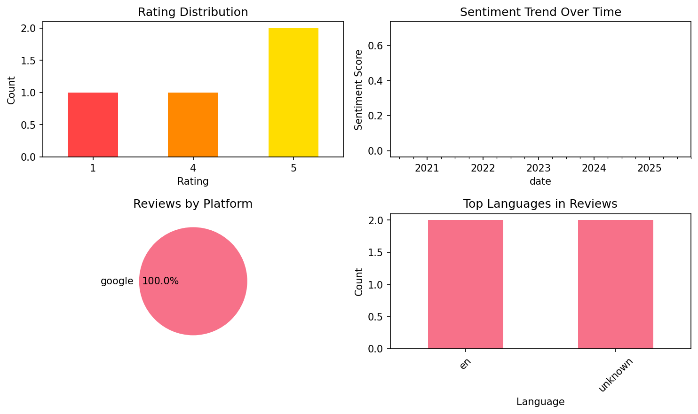

# PONS Vocabulary Trainer

## 📱 App Information

| **Attribute** | **Google Play** | **App Store** |
|---------------|-----------------|---------------|
| **Title** | PONS Vocabulary Trainer | N/A |
| **Package/ID** | com.nomtek | N/A |
| **Rating** | 3.9444444 | N/A |
| **Total Ratings** | 5,809 | N/A |
| **Installs** | 1,000,000+ | N/A |
| **Genre** | Education | N/A |

## 📝 Description

Do you learn new words, but forget them after a while? Then get the PONS Vocabulary Trainer on your smartphone. With this app you can practice your words anywhere - even when you’re offline. Thanks to its scientifically based 7-stage model, you learn your words in small chunks over a longer period of time until they’re guaranteed to stay in your memory. The app uses an intelligent algorithm to remind you when words are ready for repeating.

The training is divided into the phases memorizing, practicing and testing. Various exercises make learning fun, and you will always get feedback and tips from Ponsi, the motivated frog. You can also check your learning statistics to keep track of your performance.

The PONS Vocabulary Trainer is waiting for your words. You can 
- create your own lessons 
- buy ready-made lessons
- create study groups to share words and practice together
- transfer your words easily from the PONS Online dictionary
- Statistics and rankings so you can compete with your classmates.
- Calendar mode so you are prepared for the next vocabulary test.

The PONS vocabulary trainer - available for over 25 languages and also accessible as a web version in any browser at trainer.pons.com
 
About PONS: 
PONS has been developing green materials for learning languages for life for over 40 years: from classic dictionaries and grammar aids to audio and software language courses right up to free online services. 

www.pons.com

## 📊 Reviews Analytics

**Total Reviews:** 4 (4 analyzed)
**Rating Distribution:** 3 positive (4-5★), 0 neutral (3★), 1 negative (1-2★)
**Average Sentiment:** 0.23 (-1=very negative, +1=very positive)
**Primary Language:** en
**Key Insights:** Average rating: 3.8/5.0 | Overall sentiment: positive (score: 0.23) | Reviews in 2 languages, primarily en (2 reviews) | Reviews from 1 platform(s): google | Key themes: app


### 🔑 Key Themes & Phrases

- **app** (relevance: 0.500)

### ⭐ Rating Breakdown

- **5 ★★★★★**: 2 reviews (50.0%)
- **4 ★★★★☆**: 1 reviews (25.0%)
- **1 ★☆☆☆☆**: 1 reviews (25.0%)

### 🌍 Languages in Reviews

- **en**: 2 reviews
- **unknown**: 2 reviews

### 📱 Platform Distribution

- **google**: 4 reviews

## 📈 Visualizations

### Analytics Charts


### Word Cloud


## 💬 Sample Reviews

**Review 1** (★★★★★ - google - 2025-10-02T13:20:51)
> after being unable to use Pon's application I am now happily using the application. Thank for the quick respons!

**Review 2** (★ - google - 2024-06-01T23:25:27)
> Doesn't come with prefixed words.

**Review 3** (★★★★★ - google - 2023-06-26T01:59:06)
> Gute App

**Review 4** (★★★★ - google - 2020-05-19T01:55:57)
> Good app

## 🔧 Raw JSON Data

<details>
<summary>Click to expand raw app data</summary>

```json
{
  "name": "PONS Vocabulary Trainer",
  "google_package": "com.nomtek",
  "google": {
    "title": "PONS Vocabulary Trainer",
    "description": "Do you learn new words, but forget them after a while? Then get the PONS Vocabulary Trainer on your smartphone. With this app you can practice your words anywhere - even when you’re offline. Thanks to its scientifically based 7-stage model, you learn your words in small chunks over a longer period of time until they’re guaranteed to stay in your memory. The app uses an intelligent algorithm to remind you when words are ready for repeating.\r\n\r\nThe training is divided into the phases memorizing, practicing and testing. Various exercises make learning fun, and you will always get feedback and tips from Ponsi, the motivated frog. You can also check your learning statistics to keep track of your performance.\r\n\r\nThe PONS Vocabulary Trainer is waiting for your words. You can \r\n- create your own lessons \r\n- buy ready-made lessons\r\n- create study groups to share words and practice together\r\n- transfer your words easily from the PONS Online dictionary\r\n- Statistics and rankings so you can compete with your classmates.\r\n- Calendar mode so you are prepared for the next vocabulary test.\r\n\r\nThe PONS vocabulary trainer - available for over 25 languages and also accessible as a web version in any browser at trainer.pons.com\r\n \r\nAbout PONS: \r\nPONS has been developing green materials for learning languages for life for over 40 years: from classic dictionaries and grammar aids to audio and software language courses right up to free online services. \r\n\r\nwww.pons.com",
    "rating": 3.9444444,
    "rating_text": null,
    "ratings_total": 5809,
    "ratings_histogram": [
      920,
      283,
      283,
      637,
      3542
    ],
    "installs": "1,000,000+",
    "genre": "Education"
  },
  "apple": null,
  "reviews": [
    {
      "platform": "google",
      "rating": 5,
      "review": "after being unable to use Pon's application I am now happily using the application. Thank for the quick respons!",
      "date": "2025-10-02T13:20:51"
    },
    {
      "platform": "google",
      "rating": 1,
      "review": "Doesn't come with prefixed words.",
      "date": "2024-06-01T23:25:27"
    },
    {
      "platform": "google",
      "rating": 5,
      "review": "Gute App",
      "date": "2023-06-26T01:59:06"
    },
    {
      "platform": "google",
      "rating": 4,
      "review": "Good app",
      "date": "2020-05-19T01:55:57"
    }
  ]
}
```

</details>

---
*Report generated on 2025-11-08 13:51:36 using advanced analytics*
