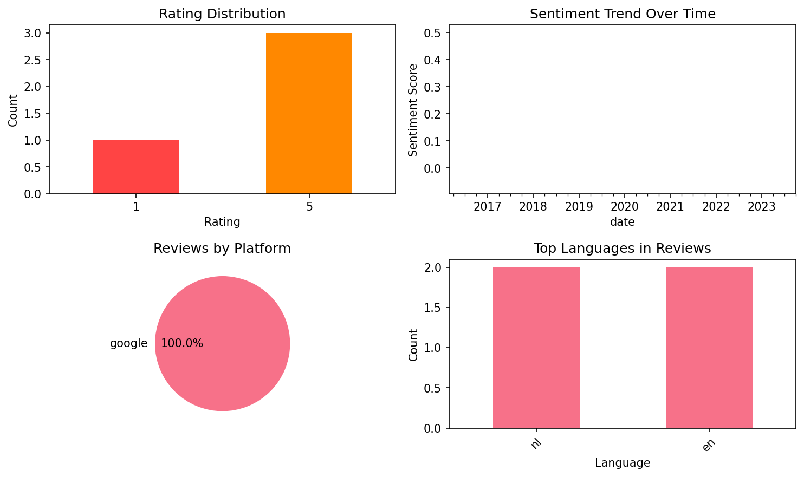
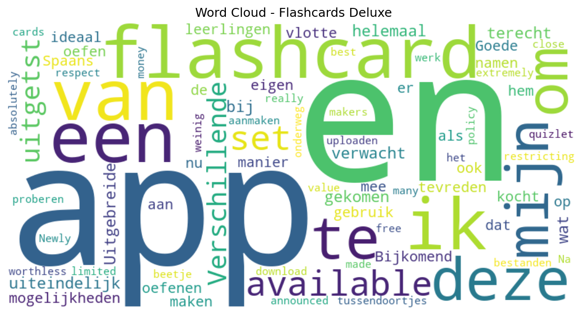

# Flashcards Deluxe

## 📱 App Information

| **Attribute** | **Google Play** | **App Store** |
|---------------|-----------------|---------------|
| **Title** | Flashcards Deluxe | N/A |
| **Package/ID** | com.orangeorapple.flashcards | N/A |
| **Rating** | 4.49 | N/A |
| **Total Ratings** | 2,367 | N/A |
| **Installs** | 100,000+ | N/A |
| **Genre** | Education | N/A |

## 📝 Description

Flashcards Deluxe is an easy to use yet powerful and full-featured flashcard app which you can use to study just about anything you want.


(There is a free lite version available.)

Features:

• Two smart study modes that automatically focus more on the cards you miss: Leitner and a more advanced Spaced Repetition mode
• Text to speech (TTS) audio in 18 languages (no internet connection needed to study) 
• Multiple choice option 
• Spelling tests (listen to audio and use keyboard to answer) 
• Searchable listing of your cards that allows you to easily look up other terms as you study 
• Organize decks in folders and combine decks for studying 
• Several flashcard color themes to choose from (sky, wood, chalkboard, etc.) 
• Divide cards into categories 
• 1 to 5 sided cards 
• Include pictures and sounds. Zoom into pictures. Auto repeat sounds. 
• 3 response levels: Wrong, I kind of know, I know really well (vs the standard correct/wrong) - for more efficient studying 
• Easy navigation - swipe or tap to answer (customizable) 
• Draw self-graded answer with your finger (drawing not saved)
• Automatically turn cards off after getting them correct a certain number/percentage of reviews 
• Clean, efficient user interface, including full-screen and landscape viewing 
• Custom text and background colors 
• Browse mode that lets you easily navigate forward or back without keeping score 
• Slideshow mode 
• Large number of cards (10,000+) can be imported easily 
• Backup your flashcards to your computer 
• Dropbox and Google Drive support
• Very easy to get started, with lots of features and options for advanced users 
• Great support! I promptly respond to any questions or feedback you may have. Use my website's public forum or email me. 

You can create flashcards either on your computer or directly within the app. If you don't want to make your own, you can browse and download flashcards the app's Shared Library.

Please see our website at OrangeOrApple.com for more information. If you are not satisfied with the product for any reason, please let me know why and I'll try to help.

## 📊 Reviews Analytics

**Total Reviews:** 4 (4 analyzed)
**Rating Distribution:** 3 positive (4-5★), 0 neutral (3★), 1 negative (1-2★)
**Average Sentiment:** 0.11 (-1=very negative, +1=very positive)
**Primary Language:** nl
**Key Insights:** Average rating: 4.0/5.0 | Overall sentiment: positive (score: 0.11) | Reviews in 2 languages, primarily nl (2 reviews) | Reviews from 1 platform(s): google | Key themes: available, flashcard, app


### 🔑 Key Themes & Phrases

- **available** (relevance: 0.371)
- **flashcard** (relevance: 0.299)
- **app** (relevance: 0.258)
- **en** (relevance: 0.249)
- **van** (relevance: 0.188)
- **ik** (relevance: 0.188)
- **een** (relevance: 0.186)
- **te** (relevance: 0.124)

### ⭐ Rating Breakdown

- **5 ★★★★★**: 3 reviews (75.0%)
- **1 ★☆☆☆☆**: 1 reviews (25.0%)

### 🌍 Languages in Reviews

- **nl**: 2 reviews
- **en**: 2 reviews

### 📱 Platform Distribution

- **google**: 4 reviews

## 📈 Visualizations

### Analytics Charts


### Word Cloud


## 💬 Sample Reviews

**Review 1** (★★★★★ - google - 2023-10-20T11:50:08)
> Verschillende flashcard-apps uitgetst en uiteindelijk bij deze terecht gekomen. Deze is helemaal wat ik verwacht van een flashcard-app. Uitgebreide mogelijkheden en ideaal om op een vlotte manier eigen sets aan te maken. 100% tevreden!

**Review 2** (★★★★★ - google - 2020-05-02T09:44:29)
> Goede app. Ik kocht en gebruik hem om de namen van mijn leerlingen te oefenen. Bijkomend is dat ik nu ook mijn Spaans er mee oefen als tussendoortjes onderweg. Na een beetje proberen is het aanmaken en uploaden van bestanden weinig werk.

**Review 3** (★ - google - 2017-08-09T18:57:04)
> Newly announced restricting download policy with respect to quizlet has extremely limited the available set of cards. This really made the app close to worthless!

**Review 4** (★★★★★ - google - 2016-03-18T14:36:32)
> There are many free flashcard makers available but for me this is the best absolutely value for money.

## 🔧 Raw JSON Data

<details>
<summary>Click to expand raw app data</summary>

```json
{
  "name": "Flashcards Deluxe",
  "google_package": "com.orangeorapple.flashcards",
  "google": {
    "title": "Flashcards Deluxe",
    "description": "Flashcards Deluxe is an easy to use yet powerful and full-featured flashcard app which you can use to study just about anything you want.\r\n\r\n\r\n(There is a free lite version available.)\r\n\r\nFeatures:\r\n\r\n• Two smart study modes that automatically focus more on the cards you miss: Leitner and a more advanced Spaced Repetition mode\r\n• Text to speech (TTS) audio in 18 languages (no internet connection needed to study) \r\n• Multiple choice option \r\n• Spelling tests (listen to audio and use keyboard to answer) \r\n• Searchable listing of your cards that allows you to easily look up other terms as you study \r\n• Organize decks in folders and combine decks for studying \r\n• Several flashcard color themes to choose from (sky, wood, chalkboard, etc.) \r\n• Divide cards into categories \r\n• 1 to 5 sided cards \r\n• Include pictures and sounds. Zoom into pictures. Auto repeat sounds. \r\n• 3 response levels: Wrong, I kind of know, I know really well (vs the standard correct/wrong) - for more efficient studying \r\n• Easy navigation - swipe or tap to answer (customizable) \r\n• Draw self-graded answer with your finger (drawing not saved)\r\n• Automatically turn cards off after getting them correct a certain number/percentage of reviews \r\n• Clean, efficient user interface, including full-screen and landscape viewing \r\n• Custom text and background colors \r\n• Browse mode that lets you easily navigate forward or back without keeping score \r\n• Slideshow mode \r\n• Large number of cards (10,000+) can be imported easily \r\n• Backup your flashcards to your computer \r\n• Dropbox and Google Drive support\r\n• Very easy to get started, with lots of features and options for advanced users \r\n• Great support! I promptly respond to any questions or feedback you may have. Use my website's public forum or email me. \r\n\r\nYou can create flashcards either on your computer or directly within the app. If you don't want to make your own, you can browse and download flashcards the app's Shared Library.\r\n\r\nPlease see our website at OrangeOrApple.com for more information. If you are not satisfied with the product for any reason, please let me know why and I'll try to help.",
    "rating": 4.49,
    "rating_text": null,
    "ratings_total": 2367,
    "ratings_histogram": [
      209,
      23,
      69,
      139,
      1914
    ],
    "installs": "100,000+",
    "genre": "Education"
  },
  "apple": null,
  "reviews": [
    {
      "platform": "google",
      "rating": 5,
      "review": "Verschillende flashcard-apps uitgetst en uiteindelijk bij deze terecht gekomen. Deze is helemaal wat ik verwacht van een flashcard-app. Uitgebreide mogelijkheden en ideaal om op een vlotte manier eigen sets aan te maken. 100% tevreden!",
      "date": "2023-10-20T11:50:08"
    },
    {
      "platform": "google",
      "rating": 5,
      "review": "Goede app. Ik kocht en gebruik hem om de namen van mijn leerlingen te oefenen. Bijkomend is dat ik nu ook mijn Spaans er mee oefen als tussendoortjes onderweg. Na een beetje proberen is het aanmaken en uploaden van bestanden weinig werk.",
      "date": "2020-05-02T09:44:29"
    },
    {
      "platform": "google",
      "rating": 1,
      "review": "Newly announced restricting download policy with respect to quizlet has extremely limited the available set of cards. This really made the app close to worthless!",
      "date": "2017-08-09T18:57:04"
    },
    {
      "platform": "google",
      "rating": 5,
      "review": "There are many free flashcard makers available but for me this is the best absolutely value for money.",
      "date": "2016-03-18T14:36:32"
    }
  ]
}
```

</details>

---
*Report generated on 2025-11-08 13:51:38 using advanced analytics*
