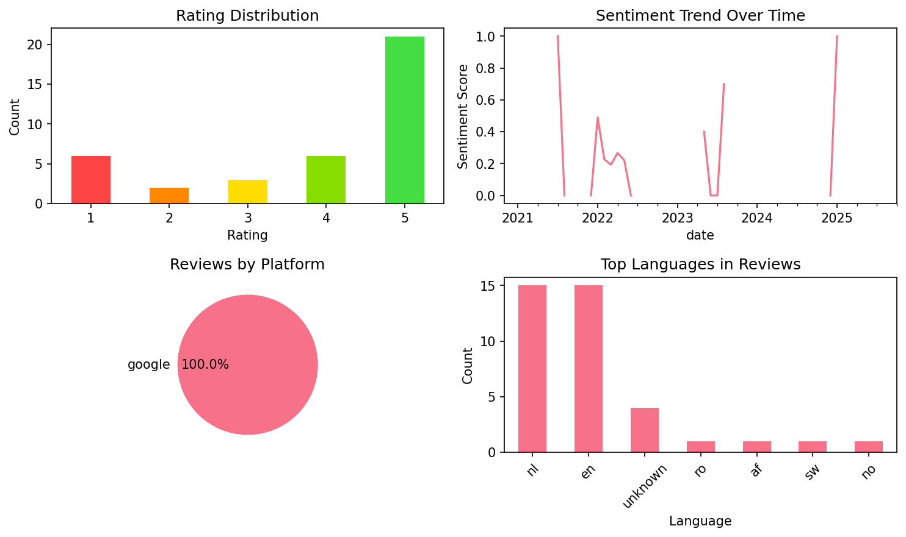

# Vaia: Study, Notes, Flashcards

## 📱 App Information

| **Attribute** | **Google Play** | **App Store** |
|---------------|-----------------|---------------|
| **Title** | Vaia: Study, Notes, Flashcards | N/A |
| **Package/ID** | com.studysmarter | N/A |
| **Rating** | 4.351852 | N/A |
| **Total Ratings** | 29,210 | N/A |
| **Installs** | 5,000,000+ | N/A |
| **Genre** | Education | N/A |

## 📝 Description

Vaia: We've got all the tools you need to succeed in your studies. Say goodbye to endless hours of cramming and hello to smarter, stress-free learning. Unlock millions of expert-verified resources, create flashcards & notes IN SECONDS with AI and plan your revision with the smart to-do list—all powered by AI for the best study experience 🚀 
 
<i>„IMAGINE QUIZLET, ANKI, MEMRISE, CHEGG, COURSEHERO, AND ALL OTHER STUDY APPS IN ONE APP - THAT’S VAIA - Amelia</i>

ALL-IN-ONE STUDY APP means:
 
<b> ✔️AI Flashcards</b>
<b> ✔️Explanations</b>
<b> ✔️AI Homework Scanner</b>
<b> ✔️Exam Mockups</b>
<b> ✔️Study Notes</b>
<b> ✔️Study Guides</b>
<b> ✔️Study Planner</b>
<b> ✔️Spaced Repetition & Active Recall</b>
<b> ✔️Textbooks</b>
<b> ✔️Textbook Solutions</b>

► AI-POWERED LEARNING🤖
► 94% OF USERS ACHIEVE BETTER GRADES WITHIN NO TIME! 📈
► COMPLETELY FOR FREE!🤩 

• AI-powered learning: ace your exams with exam mockups, explanations & AI-generated content
• Study with shared flashcards or use our flashcard maker
• Learn from millions of study sets created by students just like you
• Study using Spaced Repetition mode for scientifically proven study success
• Create your schedule with our Study Plan and keep track of your progress

Overview:
✨ AI creates flashcards from any of your doc
📚 Get high-quality study material & homework help
🤖 Ace your exams with the exam mockups
📅 Create your individual study plan
📱 Study your flashcards & notes via smartphone or PC
🤝 Benefit from countless shared flashcards and notes
🤓 Study with the intelligent algorithms
📊 Track & improve your study progress
📑 Every subject explained - just find your topic and ace your test!

🏆  Award-winning App: Named <b>Best Educational App Worldwide<b> by Wharton-QS Reimagine Education Awards 🏆

That's what our users say:
<i>„My life got a lot less stressful ever since I found this app! Couldn't imagine my education without it anymore“</i> - <b>Dylan</b>

THE FREE STUDY APP FOR UNI
» For studying your bachelors or master's degree 
» Revise faster: Speed up your exam prep & achieve success with the study plan
» Access millions of flashcards and notes shared by other students
» Always on track thanks to comprehensive statistics and feedback
» Efficient studying with intelligent query modes such as spaced repetition or AI mock exams
 
THE FREE STUDY APP FOR SCHOOL
» For studying in school or college
» As a study aid for better organization & revision help
» The perfect addition to your homework
 
THE FREE STUDY APP FOR EVERYONE
» Save time by having access to shared revision cards on almost all topics
» Convert your own study materials into flashcards and study notes
» Smart reminders for improved discipline and learn motivation
» Spaced Repetition & Active Recall mode for effective learning and quicker memorization
» Scanning feature to upload own physical study materials
» Sketch feature to annotate your flashcards with hand-drawn notes 
» Homework help. Have all your study materials always with you

<b>Detailed features:</b>

FLASHCARDS & STUDY NOTES
» Use our flashcard maker on your laptop or mobile phone
» Generate flashcards with the help of AI: Create flashcards with one click. With the power of AI, creating learning materials has never been easier.
» Quickly create study notes and flashcards based on your lecture slides
» Revision planner for improved discipline and motivation
» Access millions of shared flashcards and notes
» Make use of various quiz modes such as Spaced Repetition to study, memorize & revise faster
» Comprehensive design options through pictures/screenshots, multiple-choice, sketch painting, etc.
» All your study materials in one app: online & offline

STUDY PLANNER
» Set goals, create a study plan, and track your results
» Check your study statistics and get reminded
» Stress - free revision

AVAILABLE WITH PREMIUM:
» Offline mode
» No ads

Let’s study together! 🚀👨‍🎓

TERMS AND CONDITIONS: https://www.hellovaia.com/privacy/</b></b>

## 📊 Reviews Analytics

**Total Reviews:** 38 (38 analyzed)
**Rating Distribution:** 27 positive (4-5★), 3 neutral (3★), 8 negative (1-2★)
**Average Sentiment:** 0.24 (-1=very negative, +1=very positive)
**Primary Language:** nl
**Key Insights:** Average rating: 3.9/5.0 | Overall sentiment: positive (score: 0.24) | Reviews in 7 languages, primarily nl (15 reviews) | Reviews from 1 platform(s): google | Key themes: app, het, ik


### 🔑 Key Themes & Phrases

- **app** (relevance: 0.124)
- **het** (relevance: 0.085)
- **ik** (relevance: 0.082)
- **amazing** (relevance: 0.067)
- **learning** (relevance: 0.056)
- **really** (relevance: 0.056)
- **good** (relevance: 0.053)
- **een** (relevance: 0.050)

### ⭐ Rating Breakdown

- **5 ★★★★★**: 21 reviews (55.3%)
- **4 ★★★★☆**: 6 reviews (15.8%)
- **3 ★★★☆☆**: 3 reviews (7.9%)
- **2 ★★☆☆☆**: 2 reviews (5.3%)
- **1 ★☆☆☆☆**: 6 reviews (15.8%)

### 🌍 Languages in Reviews

- **nl**: 15 reviews
- **en**: 15 reviews
- **unknown**: 4 reviews
- **ro**: 1 reviews
- **af**: 1 reviews

### 📱 Platform Distribution

- **google**: 38 reviews

## 📈 Visualizations

### Analytics Charts


### Word Cloud


## 💬 Sample Reviews

**Review 1** (★★ - google - 2025-10-01T23:01:50)
> ik vind het jammer dat je maar een aantal limit kunt gebruiken

**Review 2** (★ - google - 2023-01-16T14:24:44)
> Foutmelding, geraak niet meer op mijn account... al mijn samenvattingen weg!

**Review 3** (★★★ - google - 2022-04-16T11:49:04)
> Het is een handige app alleen het naar deel is dat het niet in het Nederlands gezet kan worden😥

**Review 4** (★ - google - 2022-02-27T11:25:20)
> Ik installeer de app maar het opent niet dus ik kan ook geen goede beoordeling geven

**Review 5** (★★★★ - google - 2020-11-23T08:44:51)
> Mijn account lag er een dag uit, gelukkig nu niet meer! Het is een fijne app voor samenvattingen, maar ik zou je samenvattingen wel in word zetten voorals de site er weer uit ligt... top app en toen ik problemen had kreeg ik meteen reactie van de ontwikkelaar!

## 🔧 Raw JSON Data

<details>
<summary>Click to expand raw app data</summary>

```json
{
  "name": "Vaia: Study, Notes, Flashcards",
  "google_package": "com.studysmarter",
  "google": {
    "title": "Vaia: Study, Notes, Flashcards",
    "description": "Vaia: We've got all the tools you need to succeed in your studies. Say goodbye to endless hours of cramming and hello to smarter, stress-free learning. Unlock millions of expert-verified resources, create flashcards & notes IN SECONDS with AI and plan your revision with the smart to-do list—all powered by AI for the best study experience 🚀 \r\n \r\n<i>„IMAGINE QUIZLET, ANKI, MEMRISE, CHEGG, COURSEHERO, AND ALL OTHER STUDY APPS IN ONE APP - THAT’S VAIA - Amelia</i>\r\n\r\nALL-IN-ONE STUDY APP means:\r\n \r\n<b> ✔️AI Flashcards</b>\r\n<b> ✔️Explanations</b>\r\n<b> ✔️AI Homework Scanner</b>\r\n<b> ✔️Exam Mockups</b>\r\n<b> ✔️Study Notes</b>\r\n<b> ✔️Study Guides</b>\r\n<b> ✔️Study Planner</b>\r\n<b> ✔️Spaced Repetition & Active Recall</b>\r\n<b> ✔️Textbooks</b>\r\n<b> ✔️Textbook Solutions</b>\r\n\r\n► AI-POWERED LEARNING🤖\r\n► 94% OF USERS ACHIEVE BETTER GRADES WITHIN NO TIME! 📈\r\n► COMPLETELY FOR FREE!🤩 \r\n\r\n• AI-powered learning: ace your exams with exam mockups, explanations & AI-generated content\r\n• Study with shared flashcards or use our flashcard maker\r\n• Learn from millions of study sets created by students just like you\r\n• Study using Spaced Repetition mode for scientifically proven study success\r\n• Create your schedule with our Study Plan and keep track of your progress\r\n\r\nOverview:\r\n✨ AI creates flashcards from any of your doc\r\n📚 Get high-quality study material & homework help\r\n🤖 Ace your exams with the exam mockups\r\n📅 Create your individual study plan\r\n📱 Study your flashcards & notes via smartphone or PC\r\n🤝 Benefit from countless shared flashcards and notes\r\n🤓 Study with the intelligent algorithms\r\n📊 Track & improve your study progress\r\n📑 Every subject explained - just find your topic and ace your test!\r\n\r\n🏆  Award-winning App: Named <b>Best Educational App Worldwide<b> by Wharton-QS Reimagine Education Awards 🏆\r\n\r\nThat's what our users say:\r\n<i>„My life got a lot less stressful ever since I found this app! Couldn't imagine my education without it anymore“</i> - <b>Dylan</b>\r\n\r\nTHE FREE STUDY APP FOR UNI\r\n» For studying your bachelors or master's degree \r\n» Revise faster: Speed up your exam prep & achieve success with the study plan\r\n» Access millions of flashcards and notes shared by other students\r\n» Always on track thanks to comprehensive statistics and feedback\r\n» Efficient studying with intelligent query modes such as spaced repetition or AI mock exams\r\n \r\nTHE FREE STUDY APP FOR SCHOOL\r\n» For studying in school or college\r\n» As a study aid for better organization & revision help\r\n» The perfect addition to your homework\r\n \r\nTHE FREE STUDY APP FOR EVERYONE\r\n» Save time by having access to shared revision cards on almost all topics\r\n» Convert your own study materials into flashcards and study notes\r\n» Smart reminders for improved discipline and learn motivation\r\n» Spaced Repetition & Active Recall mode for effective learning and quicker memorization\r\n» Scanning feature to upload own physical study materials\r\n» Sketch feature to annotate your flashcards with hand-drawn notes \r\n» Homework help. Have all your study materials always with you\r\n\r\n<b>Detailed features:</b>\r\n\r\nFLASHCARDS & STUDY NOTES\r\n» Use our flashcard maker on your laptop or mobile phone\r\n» Generate flashcards with the help of AI: Create flashcards with one click. With the power of AI, creating learning materials has never been easier.\r\n» Quickly create study notes and flashcards based on your lecture slides\r\n» Revision planner for improved discipline and motivation\r\n» Access millions of shared flashcards and notes\r\n» Make use of various quiz modes such as Spaced Repetition to study, memorize & revise faster\r\n» Comprehensive design options through pictures/screenshots, multiple-choice, sketch painting, etc.\r\n» All your study materials in one app: online & offline\r\n\r\nSTUDY PLANNER\r\n» Set goals, create a study plan, and track your results\r\n» Check your study statistics and get reminded\r\n» Stress - free revision\r\n\r\nAVAILABLE WITH PREMIUM:\r\n» Offline mode\r\n» No ads\r\n\r\nLet’s study together! 🚀👨‍🎓\r\n\r\nTERMS AND CONDITIONS: https://www.hellovaia.com/privacy/</b></b>",
    "rating": 4.351852,
    "rating_text": null,
    "ratings_total": 29210,
    "ratings_histogram": [
      2959,
      515,
      1058,
      3230,
      21364
    ],
    "installs": "5,000,000+",
    "genre": "Education"
  },
  "apple": null,
  "reviews": [
    {
      "platform": "google",
      "rating": 2,
      "review": "ik vind het jammer dat je maar een aantal limit kunt gebruiken",
      "date": "2025-10-01T23:01:50"
    },
    {
      "platform": "google",
      "rating": 5,
      "review": "Its great for flash cards!!!",
      "date": "2025-01-16T14:23:03"
    },
    {
      "platform": "google",
      "rating": 4,
      "review": "Should let you choose the book your learning about",
      "date": "2024-12-26T23:23:22"
    },
    {
      "platform": "google",
      "rating": 5,
      "review": "Het helpt me bij het studeren",
      "date": "2024-10-26T19:56:00"
    },
    {
      "platform": "google",
      "rating": 4,
      "review": "Overall better than Quizlet. Positive: AI features, User friendlier, Search button, summary, PDF files, doesn't delete your words when tabbing out. The downside: ads, UI is sensitive, less community and quizlet auto-translates",
      "date": "2023-12-28T02:56:58"
    },
    {
      "platform": "google",
      "rating": 4,
      "review": "all good",
      "date": "2023-08-17T18:37:15"
    },
    {
      "platform": "google",
      "rating": 1,
      "review": "I can't upload files",
      "date": "2023-07-23T17:49:42"
    },
    {
      "platform": "google",
      "rating": 1,
      "review": "Cant use the links of my friends wich is the only reason i downloaded this...",
      "date": "2023-06-16T07:51:00"
    },
    {
      "platform": "google",
      "rating": 3,
      "review": "I really like the app. Maybe you can add something that I can fill out my school schedule and add my homework so that I have some kind of to-do list with my homework and tests",
      "date": "2023-05-08T19:01:41"
    },
    {
      "platform": "google",
      "rating": 1,
      "review": "Foutmelding, geraak niet meer op mijn account... al mijn samenvattingen weg!",
      "date": "2023-01-16T14:24:44"
    },
    {
      "platform": "google",
      "rating": 5,
      "review": "Leuk en handig",
      "date": "2023-01-13T19:00:00"
    },
    {
      "platform": "google",
      "rating": 5,
      "review": "Absolutely amazing, helped me out so so much :)",
      "date": "2022-11-28T12:34:09"
    },
    {
      "platform": "google",
      "rating": 1,
      "review": "Ik kan niet meer inloggen en de app stuurt mij geen mail om mij te kunnen inloggen dus ben al mijn samenvattingen kwijt geweldig",
      "date": "2022-06-16T15:49:05"
    },
    {
      "platform": "google",
      "rating": 5,
      "review": "This is really usefull for learning languages, science, history and lots more! I really enjoy it!",
      "date": "2022-05-01T13:34:09"
    },
    {
      "platform": "google",
      "rating": 5,
      "review": "Heel goede app vind ik 5 sterren🌟",
      "date": "2022-05-01T10:28:30"
    },
    {
      "platform": "google",
      "rating": 5,
      "review": "Goeie app,je kan er goed mee studeren Je weet dan ook zeker dat je het snapt Als ik een 10 haal voor mijn tozts heb ik het aan deze app te danken",
      "date": "2022-04-24T11:43:00"
    },
    {
      "platform": "google",
      "rating": 5,
      "review": "De aap is prima.Alleen ik heb een probleem ik kan niet markeren.🥲",
      "date": "2022-04-24T10:27:03"
    },
    {
      "platform": "google",
      "rating": 5,
      "review": "This app just got me straight A´s i am the top off class now! :)",
      "date": "2022-04-21T17:37:14"
    },
    {
      "platform": "google",
      "rating": 5,
      "review": "super",
      "date": "2022-04-18T13:49:37"
    },
    {
      "platform": "google",
      "rating": 3,
      "review": "Het is een handige app alleen het naar deel is dat het niet in het Nederlands gezet kan worden😥",
      "date": "2022-04-16T11:49:04"
    },
    {
      "platform": "google",
      "rating": 5,
      "review": "Very handy! Would be nice though if, when learning a particularly large badge of words, they would be divided into smaller practicing pools.",
      "date": "2022-04-12T11:21:52"
    },
    {
      "platform": "google",
      "rating": 5,
      "review": "het is super goed ik heb morgen mijn toets en ik heb deze app gevonden om te leren voor mijn toets! en ik heb vooral geen zin voor al dat schrijf gedoe 😒 5 sterren waard! Groetjes anoniem!",
      "date": "2022-04-11T18:19:34"
    },
    {
      "platform": "google",
      "rating": 4,
      "review": "It's ok ig",
      "date": "2022-03-27T17:52:54"
    },
    {
      "platform": "google",
      "rating": 1,
      "review": "Sucks",
      "date": "2022-03-20T15:14:14"
    },
    {
      "platform": "google",
      "rating": 5,
      "review": "het bespaard echt UREN TIJD, echt waar als je goede punten wilt halen is dit het!!!",
      "date": "2022-03-17T18:50:55"
    },
    {
      "platform": "google",
      "rating": 5,
      "review": "Its so good",
      "date": "2022-03-07T18:17:30"
    },
    {
      "platform": "google",
      "rating": 5,
      "review": "I never really study for a test but I downloaded the app and now I actually study and it's fun to make the note for the studying",
      "date": "2022-03-04T13:02:02"
    },
    {
      "platform": "google",
      "rating": 3,
      "review": "Goede app, maar ik kan geen flashcard maken ook al heb ik er nog geen",
      "date": "2022-02-27T22:29:40"
    },
    {
      "platform": "google",
      "rating": 1,
      "review": "Ik installeer de app maar het opent niet dus ik kan ook geen goede beoordeling geven",
      "date": "2022-02-27T11:25:20"
    },
    {
      "platform": "google",
      "rating": 4,
      "review": "Its very helpfull",
      "date": "2022-02-21T21:34:33"
    },
    {
      "platform": "google",
      "rating": 5,
      "review": "I was bad at learing French and Deutch.... no problems with that anymore! Download this app and you will get better grades.",
      "date": "2022-02-18T16:01:18"
    },
    {
      "platform": "google",
      "rating": 5,
      "review": "Its amazing !!!",
      "date": "2022-02-07T17:33:26"
    },
    {
      "platform": "google",
      "rating": 5,
      "review": "Im following some online courses and this is a great tool for making and keeping a record about the most important concepts and ideas, plus for study after every chapter. Amazing!",
      "date": "2022-01-24T15:07:41"
    },
    {
      "platform": "google",
      "rating": 5,
      "review": "Een fantastische app en heel handig als je wilt studeren voor een toets. Zo kun je in elk geval je notities niet vergeten",
      "date": "2021-12-07T13:49:15"
    },
    {
      "platform": "google",
      "rating": 5,
      "review": "Idk",
      "date": "2021-08-09T01:43:40"
    },
    {
      "platform": "google",
      "rating": 5,
      "review": "Best app ever !",
      "date": "2021-07-07T15:21:21"
    },
    {
      "platform": "google",
      "rating": 2,
      "review": "Waarom moet ik een account maken? Zonder enige privacy?",
      "date": "2021-02-13T23:50:25"
    },
    {
      "platform": "google",
      "rating": 4,
      "review": "Mijn account lag er een dag uit, gelukkig nu niet meer! Het is een fijne app voor samenvattingen, maar ik zou je samenvattingen wel in word zetten voorals de site er weer uit ligt... top app en toen ik problemen had kreeg ik meteen reactie van de ontwikkelaar!",
      "date": "2020-11-23T08:44:51"
    }
  ]
}
```

</details>

---
*Report generated on 2025-11-08 13:52:12 using advanced analytics*
