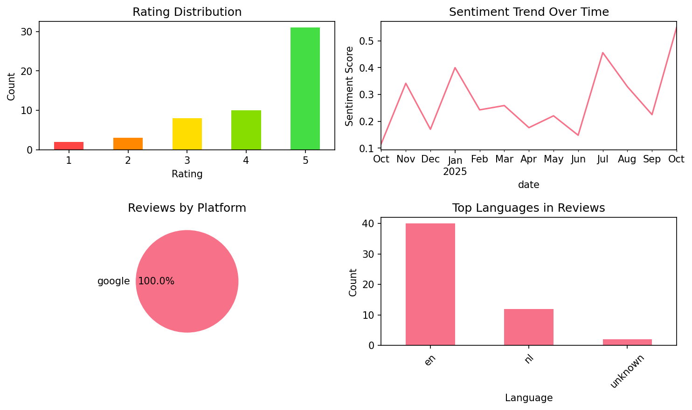
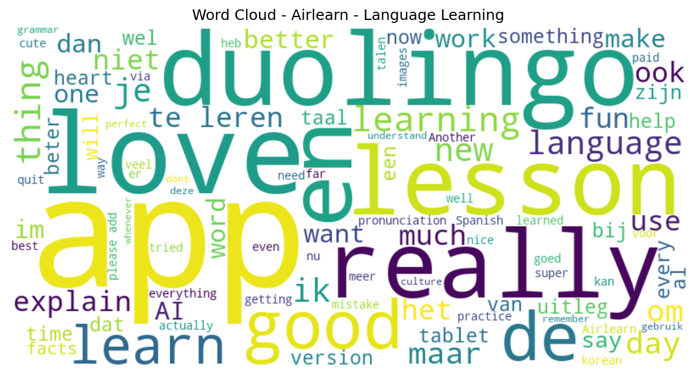

# Airlearn - Language Learning

## 📱 App Information

| **Attribute** | **Google Play** | **App Store** |
|---------------|-----------------|---------------|
| **Title** | Airlearn - Language Learning | N/A |
| **Package/ID** | com.unacademy.antonio | N/A |
| **Rating** | 4.5967503 | N/A |
| **Total Ratings** | 22,311 | N/A |
| **Installs** | 1,000,000+ | N/A |
| **Genre** | Education | N/A |

## 📝 Description

Airlearn: Learn Spanish, German, French, Italian, Dutch, Portuguese, Japanese, Korean, Chinese, Hindi, English, Turkish, and Russian in one intuitive app. Enjoy short lessons, cultural insights, and fun practice slides that make language learning stress-free and engaging.

OUR APPROACH
• Learn First, Practice Next: We teach key grammar, vocabulary, and cultural context before you dive into quizzes. Gain real understanding instead of guessing.  
• Rich Cultural Insights: Explore history, customs, and local expressions. Language is more than words—Airlearn helps you appreciate its cultural essence.  
• Clean & Minimalist: No overblown gamification or cluttered screens. Lessons stay focused, so you can learn at your own pace without distractions.  
• Weekly Leagues & XP: Motivate yourself by competing with others studying the same language. Earn XP from each lesson and climb the leaderboard for extra fun.

WHY AIRLEARN
• Concise Lessons: Each module covers grammar rules, vocabulary, and examples in bite-sized slides.  
• Practical Dialogues: From casual greetings to deeper conversations, practice relevant situations.  
• Spaced Repetition: Lock new words into long-term memory with our smart revision approach.  
• Track Progress: Daily goals, streaks, and achievements keep your momentum alive.  
• Community Feel: Join like-minded learners, share study tips, and celebrate mutual achievements.

DIVE INTO 12 LANGUAGES
1. Spanish: Vibrant dialogues for travel, work, or fun.  
2. German: Master precise grammar for Europe’s economic hub.  
3. French: Absorb its romantic flair and cultural legacy.  
4. Italian: Savor the melodic flow and culinary charm.  
5. Dutch: Expand career options in a globalized world.  
6. Portuguese: Explore Brazil’s rich diversity or Portugal’s historic roots.  
7. Japanese: Conquer kanji, hiragana, and katakana with confidence.  
8. Korean: Learn Hangeul, K-pop phrases, and daily expressions.  
9. Chinese: Build listening and reading skills in one of the world’s most spoken tongues.  
10. Hindi: Unlock India’s cultural treasure, cinema, and business potential.  
11. English: Hone global communication for travel, work, or personal growth.  
12. Russian: Tackle Cyrillic and immerse in a language of literary tradition.

HOW IT WORKS  
1. Install Airlearn: Begin with the basics or jump into advanced modules anytime.  
2. Learn: Study essential grammar and vocabulary in short, clear lessons.  
3. Practice: Tackle engaging quizzes and drills to reinforce your knowledge.  
4. Compete: Earn XP and measure your progress in our fun Weekly League.  
5. Flourish: Speak, read, and write with newfound fluency and cultural understanding.

WHAT SETS US APART
• Genuine Learning: We prioritize understanding over memorization.  
• All Levels Welcome: From novices to pros, our modules adapt to you.  
• Regular Updates: New lessons and features keep it fresh.  
• Lifestyle Friendly: Learn anytime—during breaks, commutes, or weekends.

GET STARTED FOR FREE
Airlearn transforms language study into an immersive experience. Whether you’re planning a trip, boosting your résumé, or simply curious about global cultures, we’ll guide you step by step. Enjoy short lessons that fit smoothly into your day, gather XP, and watch your language skills skyrocket.

Join thousands of motivated learners worldwide. Download Airlearn now for Spanish, German, French, Italian, Dutch, Portuguese, Japanese, Korean, Chinese, Hindi, English, or Russian. Experience the spark of real progress, gain cultural know-how, and feel the thrill of community-powered learning. Go beyond translations—master languages in a way that truly sticks. With Airlearn, you’ll open doors to new friendships, opportunities, and an expanded worldview. Welcome to your next adventure in language mastery!

## 📊 Reviews Analytics

**Total Reviews:** 54 (54 analyzed)
**Rating Distribution:** 41 positive (4-5★), 8 neutral (3★), 5 negative (1-2★)
**Average Sentiment:** 0.25 (-1=very negative, +1=very positive)
**Primary Language:** en
**Key Insights:** Average rating: 4.2/5.0 | Overall sentiment: positive (score: 0.25) | Reviews in 3 languages, primarily en (40 reviews) | Reviews from 1 platform(s): google | Key themes: app, love, good


### 🔑 Key Themes & Phrases

- **app** (relevance: 0.130)
- **love** (relevance: 0.079)
- **good** (relevance: 0.070)
- **learn** (relevance: 0.060)
- **duolingo** (relevance: 0.060)
- **really** (relevance: 0.055)
- **like** (relevance: 0.052)
- **good app** (relevance: 0.051)

### ⭐ Rating Breakdown

- **5 ★★★★★**: 31 reviews (57.4%)
- **4 ★★★★☆**: 10 reviews (18.5%)
- **3 ★★★☆☆**: 8 reviews (14.8%)
- **2 ★★☆☆☆**: 3 reviews (5.6%)
- **1 ★☆☆☆☆**: 2 reviews (3.7%)

### 🌍 Languages in Reviews

- **en**: 40 reviews
- **nl**: 12 reviews
- **unknown**: 2 reviews

### 📱 Platform Distribution

- **google**: 54 reviews

## 📈 Visualizations

### Analytics Charts


### Word Cloud


## 💬 Sample Reviews

**Review 1** (★★★ - google - 2025-10-01T21:18:04)
> perfect app! i really like the facts which helps me remember it better. the ai calls dont work whenever i say something I cant continue. i would like to do more with pronunciation in depth

**Review 2** (★★ - google - 2025-06-23T19:13:43)
> the way it makes you learn languages is overall beter then duolingo i feel like, however you can only do like 5 lessons a day without getting the subscription.

**Review 3** (★★★★★ - google - 2025-05-07T22:03:28)
> i just started this learning app, i already find it better then Doulingo, the explainations is a big plus. there is only 1 down side for me and others that have an basic knowledge off Spanish or more, there is no test in the beginning to see how far you are so you can start more at your own level! u...

**Review 4** (★★★★★ - google - 2025-03-02T14:26:32)
> i love the app

**Review 5** (★★★★★ - google - 2024-10-21T13:12:48)
> This is a clear app. It explains everything you learn with tips to remember it. Only from English to French or Spanish, but more will follow. The AI voice is female with a French accent. Lessons are logical and quick. Well worth the Pro version. Customer support is very good. The widget is cute!

## 🔧 Raw JSON Data

<details>
<summary>Click to expand raw app data</summary>

```json
{
  "name": "Airlearn - Language Learning",
  "google_package": "com.unacademy.antonio",
  "google": {
    "title": "Airlearn - Language Learning",
    "description": "Airlearn: Learn Spanish, German, French, Italian, Dutch, Portuguese, Japanese, Korean, Chinese, Hindi, English, Turkish, and Russian in one intuitive app. Enjoy short lessons, cultural insights, and fun practice slides that make language learning stress-free and engaging.\r\n\r\nOUR APPROACH\r\n• Learn First, Practice Next: We teach key grammar, vocabulary, and cultural context before you dive into quizzes. Gain real understanding instead of guessing.  \r\n• Rich Cultural Insights: Explore history, customs, and local expressions. Language is more than words—Airlearn helps you appreciate its cultural essence.  \r\n• Clean & Minimalist: No overblown gamification or cluttered screens. Lessons stay focused, so you can learn at your own pace without distractions.  \r\n• Weekly Leagues & XP: Motivate yourself by competing with others studying the same language. Earn XP from each lesson and climb the leaderboard for extra fun.\r\n\r\nWHY AIRLEARN\r\n• Concise Lessons: Each module covers grammar rules, vocabulary, and examples in bite-sized slides.  \r\n• Practical Dialogues: From casual greetings to deeper conversations, practice relevant situations.  \r\n• Spaced Repetition: Lock new words into long-term memory with our smart revision approach.  \r\n• Track Progress: Daily goals, streaks, and achievements keep your momentum alive.  \r\n• Community Feel: Join like-minded learners, share study tips, and celebrate mutual achievements.\r\n\r\nDIVE INTO 12 LANGUAGES\r\n1. Spanish: Vibrant dialogues for travel, work, or fun.  \r\n2. German: Master precise grammar for Europe’s economic hub.  \r\n3. French: Absorb its romantic flair and cultural legacy.  \r\n4. Italian: Savor the melodic flow and culinary charm.  \r\n5. Dutch: Expand career options in a globalized world.  \r\n6. Portuguese: Explore Brazil’s rich diversity or Portugal’s historic roots.  \r\n7. Japanese: Conquer kanji, hiragana, and katakana with confidence.  \r\n8. Korean: Learn Hangeul, K-pop phrases, and daily expressions.  \r\n9. Chinese: Build listening and reading skills in one of the world’s most spoken tongues.  \r\n10. Hindi: Unlock India’s cultural treasure, cinema, and business potential.  \r\n11. English: Hone global communication for travel, work, or personal growth.  \r\n12. Russian: Tackle Cyrillic and immerse in a language of literary tradition.\r\n\r\nHOW IT WORKS  \r\n1. Install Airlearn: Begin with the basics or jump into advanced modules anytime.  \r\n2. Learn: Study essential grammar and vocabulary in short, clear lessons.  \r\n3. Practice: Tackle engaging quizzes and drills to reinforce your knowledge.  \r\n4. Compete: Earn XP and measure your progress in our fun Weekly League.  \r\n5. Flourish: Speak, read, and write with newfound fluency and cultural understanding.\r\n\r\nWHAT SETS US APART\r\n• Genuine Learning: We prioritize understanding over memorization.  \r\n• All Levels Welcome: From novices to pros, our modules adapt to you.  \r\n• Regular Updates: New lessons and features keep it fresh.  \r\n• Lifestyle Friendly: Learn anytime—during breaks, commutes, or weekends.\r\n\r\nGET STARTED FOR FREE\r\nAirlearn transforms language study into an immersive experience. Whether you’re planning a trip, boosting your résumé, or simply curious about global cultures, we’ll guide you step by step. Enjoy short lessons that fit smoothly into your day, gather XP, and watch your language skills skyrocket.\r\n\r\nJoin thousands of motivated learners worldwide. Download Airlearn now for Spanish, German, French, Italian, Dutch, Portuguese, Japanese, Korean, Chinese, Hindi, English, or Russian. Experience the spark of real progress, gain cultural know-how, and feel the thrill of community-powered learning. Go beyond translations—master languages in a way that truly sticks. With Airlearn, you’ll open doors to new friendships, opportunities, and an expanded worldview. Welcome to your next adventure in language mastery!",
    "rating": 4.5967503,
    "rating_text": null,
    "ratings_total": 22311,
    "ratings_histogram": [
      822,
      360,
      822,
      2964,
      17333
    ],
    "installs": "1,000,000+",
    "genre": "Education"
  },
  "apple": null,
  "reviews": [
    {
      "platform": "google",
      "rating": 3,
      "review": "perfect app! i really like the facts which helps me remember it better. the ai calls dont work whenever i say something I cant continue. i would like to do more with pronunciation in depth",
      "date": "2025-10-01T21:18:04"
    },
    {
      "platform": "google",
      "rating": 1,
      "review": "uses plagiarized aka AI images. yikes. you can't be a Duolingo replacement if you commit the same crimes as them.",
      "date": "2025-09-29T18:49:49"
    },
    {
      "platform": "google",
      "rating": 5,
      "review": "best language learning app imo. way better than duolingo, airlearn actually explains grammar and gives fun facts about culture and values. 10/10",
      "date": "2025-09-23T20:52:39"
    },
    {
      "platform": "google",
      "rating": 3,
      "review": "doesn't help me remembering words and the audio recorder appearantly can't understand me when my pronunciation is perfect. I expected more of it.",
      "date": "2025-08-23T20:41:12"
    },
    {
      "platform": "google",
      "rating": 4,
      "review": "the best app after duolingo and I loved it",
      "date": "2025-08-16T20:02:04"
    },
    {
      "platform": "google",
      "rating": 5,
      "review": "ik gebruik deze app om koreans te leren en het helpt en hielp me heel goed💋",
      "date": "2025-08-03T14:39:03"
    },
    {
      "platform": "google",
      "rating": 4,
      "review": "zitten nog wat kleine bugs in maar verder een uitstekende app om een nieuwe taal te leren.",
      "date": "2025-08-01T09:18:09"
    },
    {
      "platform": "google",
      "rating": 5,
      "review": "good app",
      "date": "2025-07-27T11:52:07"
    },
    {
      "platform": "google",
      "rating": 5,
      "review": "I ABSOLUTELY LOVE THIS APP!! every single time someone asks me for any good apps i recommand this immediately. im so glad they added the category thing. makes things 10x easier. i love them so much! i have depression and im working on slowly getting my streak back. this app is extremely helpful, thx ❤️",
      "date": "2025-07-27T01:20:32"
    },
    {
      "platform": "google",
      "rating": 1,
      "review": "Another AI app. (Even if it's *JUST* the artwork- artists deserve to get jobs and paid for them like any other profession?)",
      "date": "2025-07-14T15:50:55"
    },
    {
      "platform": "google",
      "rating": 5,
      "review": "Very pleasant!",
      "date": "2025-07-13T08:59:51"
    },
    {
      "platform": "google",
      "rating": 3,
      "review": "I love the app, but I can't download it on my samsung tablet",
      "date": "2025-06-28T15:52:32"
    },
    {
      "platform": "google",
      "rating": 5,
      "review": "je hoeft niet bang te zijn dat je fouten maakt want het is niet zoals duolingo dar je dan af bent en je leert hoe de taal in het echt is. soms herhaald hij wel veel maar das alleen maar goed. als je een taal wilt leren gebruik deze app",
      "date": "2025-06-28T12:27:56"
    },
    {
      "platform": "google",
      "rating": 2,
      "review": "the way it makes you learn languages is overall beter then duolingo i feel like, however you can only do like 5 lessons a day without getting the subscription.",
      "date": "2025-06-23T19:13:43"
    },
    {
      "platform": "google",
      "rating": 5,
      "review": "tot nu toe leuker dan de gemiddelde apps zoals Duolingo en leerzamer",
      "date": "2025-06-17T00:53:04"
    },
    {
      "platform": "google",
      "rating": 4,
      "review": "It is a very good way of learning. It combines practice with theory. Not 5 stars because there is no repeat button for the sentences, after answering. You get to hear the sentence only ones. That makes it harder to practice the correct pronunciation.",
      "date": "2025-06-05T22:45:42"
    },
    {
      "platform": "google",
      "rating": 4,
      "review": "Very nice app so far. Only thing I'm noticing is is that there isn't really an actual \"ending\" to a lesson? But whenever I feel like I've learned enough for that day and I want to quit it says \"are you sure you want to quit? Only a few more slides to go. Quitting now will mean you'll lose all XP from this lesson\". So I'm doing lessons but not getting XP for it because there is no clear ending to a lesson and it says that EVERY time I want to quit the app for a bit.",
      "date": "2025-06-02T18:30:58"
    },
    {
      "platform": "google",
      "rating": 5,
      "review": "leuke manier om een taal te leren. er zijn meer van dit soort Apps. pluspunt hier is de begeleidende stem en de uitleg van grammatica en context. minder geschikt voor gevorderde sprekers omdat iedereen bij hetzelfde instapniveau begint, geen differentiatie",
      "date": "2025-05-24T10:59:52"
    },
    {
      "platform": "google",
      "rating": 2,
      "review": "its okay but im quitting because you use AI for the voices and pictures and I will not support that! Also, yes, it does explain but it also forces you to do 5 lessons, every time you open app, it opens a lesson and there are no consequences so its easy to just click randomly without actually paying attention to what youre learning",
      "date": "2025-05-23T00:13:26"
    },
    {
      "platform": "google",
      "rating": 3,
      "review": "I have a brand new Galaxy S9 tablet with Android 14 and One UI 6.0 that can't download the app because it's not compatible. It works one my phone which is a 3 year old Galaxy A12 which runs om Android 13 and One UI 5.1. Could it be that my tablet is \"too new\" for the app? I really don't get this.... Dissapointed that I can't use the app on my tablet, I bought it to have a bigger screen and better learning experience. I have some other language apps who work just fine...",
      "date": "2025-05-20T21:22:11"
    },
    {
      "platform": "google",
      "rating": 5,
      "review": "I've tried this app for a couple of days now and I really like it so far. Also usefull tips from the culture. Paid version is not expensive. Also like the images that are shown to help you learn the language. I think even more fun and helpful than duolingo",
      "date": "2025-05-17T00:10:46"
    },
    {
      "platform": "google",
      "rating": 5,
      "review": "nice to learn",
      "date": "2025-05-16T20:02:12"
    },
    {
      "platform": "google",
      "rating": 5,
      "review": "veel beter dan duolingo, goede uitleg",
      "date": "2025-05-13T18:04:17"
    },
    {
      "platform": "google",
      "rating": 2,
      "review": "spijtig dat de app niet in het Nederlands kan staan, hierdoor ga ik ze ook niet gebruiken",
      "date": "2025-05-13T06:57:33"
    },
    {
      "platform": "google",
      "rating": 5,
      "review": "Nu al beter dan Duolingo. Veel meer uitleg!!!! Eén nadeel voor de Nederlanders, je leert de talen vanuit het Engels. En er zijn nog weinig talen beschikbaar",
      "date": "2025-05-11T15:28:03"
    },
    {
      "platform": "google",
      "rating": 5,
      "review": "Erg leuk en makkelijk om te leren. Variatie en goede uitleg bij alles. Ook Fun Facts bij de lessen. Ik heb ook de betaalde versie van DuoLingo, maar ik leer liever via Airlearn. Via Airlearn heb ik ook woordjes geleerd die ik via DuoLingo niet had geleerd en ik was al best ver met mijn Duits bij DuoLingo. Enige minpuntje is wel dat je maar 5 gratis lessen per dag krijgt. Maar daar tegenover staat wel de goedkope abonnementskosten. Dus natuurlijk heb ik nu ook de betaalde versie van dit! 👍🏾",
      "date": "2025-05-11T09:54:14"
    },
    {
      "platform": "google",
      "rating": 5,
      "review": "love that they explain everything",
      "date": "2025-05-08T16:44:41"
    },
    {
      "platform": "google",
      "rating": 5,
      "review": "i just started this learning app, i already find it better then Doulingo, the explainations is a big plus. there is only 1 down side for me and others that have an basic knowledge off Spanish or more, there is no test in the beginning to see how far you are so you can start more at your own level! update, thank you very much for responding, you care what ppl say, also something that duoling lacks. wen i finish Spanish, i will try an other language. i give you 5 stars now",
      "date": "2025-05-07T22:03:28"
    },
    {
      "platform": "google",
      "rating": 3,
      "review": "tried duo for a while but didn't work that well. this does they explain things really good the things I struggled with now I understand. but I do find it really sad you can only do 5 lessons a day if you don't have money to get the paid version",
      "date": "2025-05-06T00:10:14"
    },
    {
      "platform": "google",
      "rating": 5,
      "review": "it's fun and amazing and I have been learning Japanese for 2 months and I can speak it i didn't expect that I would speak Japanese good app ngl",
      "date": "2025-05-04T16:32:00"
    },
    {
      "platform": "google",
      "rating": 5,
      "review": "So much fun and I love the accent of the \"teacher\".",
      "date": "2025-04-30T16:43:31"
    },
    {
      "platform": "google",
      "rating": 3,
      "review": "This is a good learning app like Duolingo and I like how they teach me (language) but, I saw after 2 lessons that I had 3 hearts left. And then I realized that every (1) lesson costs 1 heart and that's the thing I really hate it. So if it can, please change it to when I get a mistake that 1 heart got removed. (sorry if I have bad english 😭)",
      "date": "2025-04-30T15:41:50"
    },
    {
      "platform": "google",
      "rating": 4,
      "review": "awesome, i wanted to try new languages for a long time so i tried duolingo, but this is much much better.",
      "date": "2025-04-20T18:57:44"
    },
    {
      "platform": "google",
      "rating": 5,
      "review": "The app seems cute! Please add Dutch soon so that I can review properly ♡ edit: works amazingly for Dutch, could use a bit of grammar checking though",
      "date": "2025-04-10T21:23:05"
    },
    {
      "platform": "google",
      "rating": 3,
      "review": "they dont have turkish",
      "date": "2025-04-06T09:20:21"
    },
    {
      "platform": "google",
      "rating": 5,
      "review": "i want to live in korean super badly but i need to learn the language first and this helps me out super well",
      "date": "2025-04-04T08:21:43"
    },
    {
      "platform": "google",
      "rating": 4,
      "review": "Goed om te leren. Je kan wel niet uit het Nederlands leren maar dat kan geen kwaad voor mij",
      "date": "2025-03-30T16:23:46"
    },
    {
      "platform": "google",
      "rating": 4,
      "review": "It is a very good app that really focuses on teaching the new words.",
      "date": "2025-03-28T21:26:33"
    },
    {
      "platform": "google",
      "rating": 5,
      "review": "You don't have the \"You cannot use this app if you haven't got an subscription\". You can actually learn something from this app.",
      "date": "2025-03-20T17:23:37"
    },
    {
      "platform": "google",
      "rating": 5,
      "review": "I love this app i learn so many new thing that i don't even learn when i use duoling",
      "date": "2025-03-09T09:28:16"
    },
    {
      "platform": "google",
      "rating": 5,
      "review": "i love the app",
      "date": "2025-03-02T14:26:32"
    },
    {
      "platform": "google",
      "rating": 5,
      "review": "Mooie app",
      "date": "2025-02-26T21:56:51"
    },
    {
      "platform": "google",
      "rating": 4,
      "review": "its a good app to learn, i only dislike it that that i can only do a few lessons per day",
      "date": "2025-02-25T18:39:22"
    },
    {
      "platform": "google",
      "rating": 5,
      "review": "I love it, i love how cute it is, i love the layout, i love how words get introduced, i love the blue silly cat, i love the images, i love everything!!!, although i would definitely prefer if it was maybe possible to have it like seperated into the sections, so like you know what each word is apart of. i love the app, my mom also loves it. Another thing that i thought of, maybe a bulld in review system so that people can practice all the new things they learned.",
      "date": "2025-02-21T20:26:16"
    },
    {
      "platform": "google",
      "rating": 5,
      "review": "Heel fijn om mee te leren, premium is ook goedkoop.",
      "date": "2025-02-21T12:50:36"
    },
    {
      "platform": "google",
      "rating": 5,
      "review": "This app is so good i only have it for 2 days and i learned so much",
      "date": "2025-02-17T21:02:49"
    },
    {
      "platform": "google",
      "rating": 5,
      "review": "Its a really good app and helped me a lot",
      "date": "2025-02-16T16:56:22"
    },
    {
      "platform": "google",
      "rating": 4,
      "review": "Love it. Really wish that for the Korean one i had a option to not have the romanized version of the word visible. As im really trying to learn hangul and I keep looking at the romanization",
      "date": "2025-02-15T13:09:23"
    },
    {
      "platform": "google",
      "rating": 3,
      "review": "Overall nice, just really dissapointed that you can only make 5 mistakes a day. You need to make mistakes in order to learn. I get that you guys need to earn money, but please add a feature where you can practise for new hearts.",
      "date": "2025-02-13T21:32:42"
    },
    {
      "platform": "google",
      "rating": 4,
      "review": "It's great, but please add italian",
      "date": "2025-01-25T16:35:16"
    },
    {
      "platform": "google",
      "rating": 5,
      "review": "Just started, it looks so fun! I hope you'll add Polish soon, as i'm currently learning it with another creature 😉 and im into something new",
      "date": "2024-12-22T22:30:11"
    },
    {
      "platform": "google",
      "rating": 5,
      "review": "Super cool learning app explains stuff",
      "date": "2024-11-29T05:04:36"
    },
    {
      "platform": "google",
      "rating": 5,
      "review": "Leuker en beter dan Dualingo. Zou fijn zijn als er meer talen beschikbaar komen.",
      "date": "2024-10-22T14:21:06"
    },
    {
      "platform": "google",
      "rating": 5,
      "review": "This is a clear app. It explains everything you learn with tips to remember it. Only from English to French or Spanish, but more will follow. The AI voice is female with a French accent. Lessons are logical and quick. Well worth the Pro version. Customer support is very good. The widget is cute!",
      "date": "2024-10-21T13:12:48"
    }
  ]
}
```

</details>

---
*Report generated on 2025-11-08 13:52:19 using advanced analytics*
