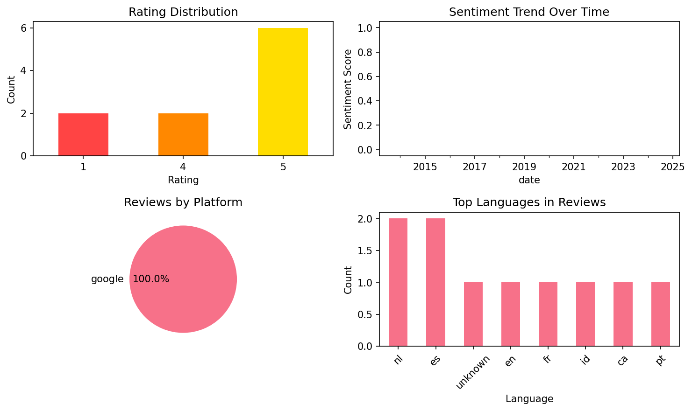
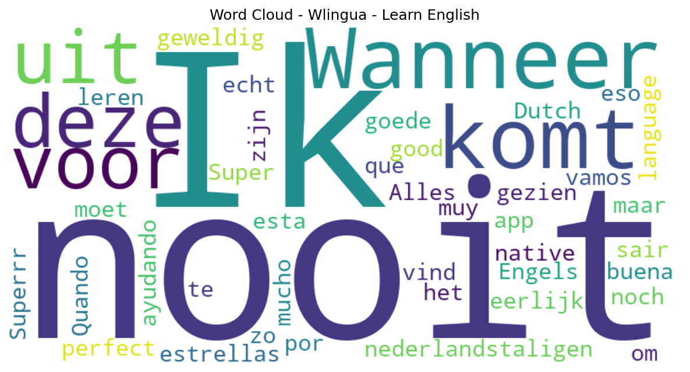

# Wlingua - Learn English

## 📱 App Information

| **Attribute** | **Google Play** | **App Store** |
|---------------|-----------------|---------------|
| **Title** | Wlingua - Learn English | N/A |
| **Package/ID** | com.wlingua.curso | N/A |
| **Rating** | 4.7473683 | N/A |
| **Total Ratings** | 444,374 | N/A |
| **Installs** | 10,000,000+ | N/A |
| **Genre** | Education | N/A |

## 📝 Description

<b>Learning English has never been so easy.</b>
It's perfect for you, whether you already have a beginner, basic, intermediate, or advanced level of English. Thanks to our online English courses, you’ll notice your English improving very quickly. Millions of students have already tried our courses. Would you like to join them?

<h1><b>Our Online English Courses:</b></h1>
<b>English Course</b>
In this course you will learn English from scratch. Guaranteed! Regardless of the level you start from, it is designed to help you learn English from day one.

<b>Advanced English Course</b>
In this course, you will continue to improve your English until you master it like a native. An advanced English course with detailed explanations written in English that will leave you speechless. Ideal for challenge lovers.

<b>B2 First Course</b>
This course is designed for people who are going to take the B2 First exam. You will find a multitude of practices for the sections of the test like, Use of English, Reading, and Listening.

<b>English Irregular Verbs Course</b>
In this course you will practice irregular English verbs. This is extra practice recommended for people who are already doing the General English course.

<b>British and American English Pronunciation Courses</b>
The English alphabet has 26 letters, but more than 40 different sounds! In the pronunciation courses you will be able to learn to distinguish them, see example words of each of them, and practice all of them using various exercises.

<b>English Phrasal Verbs Course</b>
In this course you will study the most used phrasal verbs in everyday life. You will learn the meaning of more than 290 phrasal verbs and will be provided with example sentences and extra practice exercises. Designed for people who are already in the last level of the General English course, and who can already get by with English. All explanations are in English.

And much more…
You will also find additional courses to improve your English in the workplace. 
On the Phone Course
Writing Course
Speaking Course
Logistics Course

<h1><b>Our Learning Method:</b></h1>
A learning process designed for you that is both easy and guided: You’ll feel like you’re learning more and more English every day. Every sentence, exercise, review, and reading has been carefully selected for you.

Audio clips in British English and American English: A wide variety of accents with clear, crisp pronunciation. Recorded by professional narrators.

Linked concepts: Each word is linked to its use or precise meaning. When you click on the words in each sentence, exercise, or reading, their meaning or an explanation of their use will appear.

Vocabulary: Learn the meaning, pronunciation, and use of words with activities adapted to your progress.

Grammar exercises: Practice your grammar with exercises linked to explanations.

Vocabulary topics: Words are grouped by topic categories.

Spaced reviews: Review the vocabulary and grammar at increasingly long intervals.

Search function: Find whatever you’re looking for, including vocabulary and grammar.

Reading comprehension texts (readings): Learn and practice with conversations, news, emails, and interviews, among others.

Certificates: Earn a certificate that proves your knowledge at the end of each level.

Account types:
✔ Basic: With a Basic account, the course is free, but has some limitations.
✔ Premium: With a Premium account, you’ll have access to all course content and activities.

Download our app to learn English!

## 📊 Reviews Analytics

**Total Reviews:** 10 (10 analyzed)
**Rating Distribution:** 8 positive (4-5★), 0 neutral (3★), 2 negative (1-2★)
**Average Sentiment:** 0.29 (-1=very negative, +1=very positive)
**Primary Language:** nl
**Key Insights:** Average rating: 4.0/5.0 | Overall sentiment: positive (score: 0.29) | Reviews in 8 languages, primarily nl (2 reviews) | Reviews from 1 platform(s): google | Key themes: nooit


### 🔑 Key Themes & Phrases

- **nooit** (relevance: 0.200)

### ⭐ Rating Breakdown

- **5 ★★★★★**: 6 reviews (60.0%)
- **4 ★★★★☆**: 2 reviews (20.0%)
- **1 ★☆☆☆☆**: 2 reviews (20.0%)

### 🌍 Languages in Reviews

- **nl**: 2 reviews
- **es**: 2 reviews
- **unknown**: 1 reviews
- **en**: 1 reviews
- **fr**: 1 reviews

### 📱 Platform Distribution

- **google**: 10 reviews

## 📈 Visualizations

### Analytics Charts


### Word Cloud


## 💬 Sample Reviews

**Review 1** (★ - google - 2025-04-09T11:29:24)
> Wanneer komt deze uit voor nederlandstaligen?

**Review 2** (★ - google - 2024-09-21T16:17:11)
> No Dutch as native language

**Review 3** (★★★★★ - google - 2017-05-13T14:53:50)
> Super!!!!!

**Review 4** (★★★★★ - google - 2015-09-29T21:17:14)
> Quando que vamos sair

**Review 5** (★★★★★ - google - 2013-03-23T22:10:24)
> muy buena por eso 5 estrellas

## 🔧 Raw JSON Data

<details>
<summary>Click to expand raw app data</summary>

```json
{
  "name": "Wlingua - Learn English",
  "google_package": "com.wlingua.curso",
  "google": {
    "title": "Wlingua - Learn English",
    "description": "<b>Learning English has never been so easy.</b>\r\nIt's perfect for you, whether you already have a beginner, basic, intermediate, or advanced level of English. Thanks to our online English courses, you’ll notice your English improving very quickly. Millions of students have already tried our courses. Would you like to join them?\r\n\r\n<h1><b>Our Online English Courses:</b></h1>\r\n<b>English Course</b>\r\nIn this course you will learn English from scratch. Guaranteed! Regardless of the level you start from, it is designed to help you learn English from day one.\r\n\r\n<b>Advanced English Course</b>\r\nIn this course, you will continue to improve your English until you master it like a native. An advanced English course with detailed explanations written in English that will leave you speechless. Ideal for challenge lovers.\r\n\r\n<b>B2 First Course</b>\r\nThis course is designed for people who are going to take the B2 First exam. You will find a multitude of practices for the sections of the test like, Use of English, Reading, and Listening.\r\n\r\n<b>English Irregular Verbs Course</b>\r\nIn this course you will practice irregular English verbs. This is extra practice recommended for people who are already doing the General English course.\r\n\r\n<b>British and American English Pronunciation Courses</b>\r\nThe English alphabet has 26 letters, but more than 40 different sounds! In the pronunciation courses you will be able to learn to distinguish them, see example words of each of them, and practice all of them using various exercises.\r\n\r\n<b>English Phrasal Verbs Course</b>\r\nIn this course you will study the most used phrasal verbs in everyday life. You will learn the meaning of more than 290 phrasal verbs and will be provided with example sentences and extra practice exercises. Designed for people who are already in the last level of the General English course, and who can already get by with English. All explanations are in English.\r\n\r\nAnd much more…\r\nYou will also find additional courses to improve your English in the workplace. \r\nOn the Phone Course\r\nWriting Course\r\nSpeaking Course\r\nLogistics Course\r\n\r\n<h1><b>Our Learning Method:</b></h1>\r\nA learning process designed for you that is both easy and guided: You’ll feel like you’re learning more and more English every day. Every sentence, exercise, review, and reading has been carefully selected for you.\r\n\r\nAudio clips in British English and American English: A wide variety of accents with clear, crisp pronunciation. Recorded by professional narrators.\r\n\r\nLinked concepts: Each word is linked to its use or precise meaning. When you click on the words in each sentence, exercise, or reading, their meaning or an explanation of their use will appear.\r\n\r\nVocabulary: Learn the meaning, pronunciation, and use of words with activities adapted to your progress.\r\n\r\nGrammar exercises: Practice your grammar with exercises linked to explanations.\r\n\r\nVocabulary topics: Words are grouped by topic categories.\r\n\r\nSpaced reviews: Review the vocabulary and grammar at increasingly long intervals.\r\n\r\nSearch function: Find whatever you’re looking for, including vocabulary and grammar.\r\n\r\nReading comprehension texts (readings): Learn and practice with conversations, news, emails, and interviews, among others.\r\n\r\nCertificates: Earn a certificate that proves your knowledge at the end of each level.\r\n\r\nAccount types:\r\n✔ Basic: With a Basic account, the course is free, but has some limitations.\r\n✔ Premium: With a Premium account, you’ll have access to all course content and activities.\r\n\r\nDownload our app to learn English!",
    "rating": 4.7473683,
    "rating_text": null,
    "ratings_total": 444374,
    "ratings_histogram": [
      7482,
      2332,
      9815,
      55655,
      369057
    ],
    "installs": "10,000,000+",
    "genre": "Education"
  },
  "apple": null,
  "reviews": [
    {
      "platform": "google",
      "rating": 1,
      "review": "Wanneer komt deze uit voor nederlandstaligen?",
      "date": "2025-04-09T11:29:24"
    },
    {
      "platform": "google",
      "rating": 4,
      "review": "Very good",
      "date": "2024-09-29T21:26:32"
    },
    {
      "platform": "google",
      "rating": 1,
      "review": "No Dutch as native language",
      "date": "2024-09-21T16:17:11"
    },
    {
      "platform": "google",
      "rating": 4,
      "review": "Alles is nooit perfect",
      "date": "2022-04-16T09:16:51"
    },
    {
      "platform": "google",
      "rating": 5,
      "review": "Ik moet eerlijk zijn maar noch nooit zo goede app gezien om Engels te leren, ik vind het echt geweldig. 🤩🤩😀",
      "date": "2021-10-24T18:13:37"
    },
    {
      "platform": "google",
      "rating": 5,
      "review": "Super!!!!!",
      "date": "2017-05-13T14:53:50"
    },
    {
      "platform": "google",
      "rating": 5,
      "review": "Superrr!!!",
      "date": "2016-11-08T22:11:34"
    },
    {
      "platform": "google",
      "rating": 5,
      "review": "Quando que vamos sair",
      "date": "2015-09-29T21:17:14"
    },
    {
      "platform": "google",
      "rating": 5,
      "review": "Me esta ayudando mucho",
      "date": "2014-07-11T23:23:10"
    },
    {
      "platform": "google",
      "rating": 5,
      "review": "muy buena por eso 5 estrellas",
      "date": "2013-03-23T22:10:24"
    }
  ]
}
```

</details>

---
*Report generated on 2025-11-08 13:52:23 using advanced analytics*
