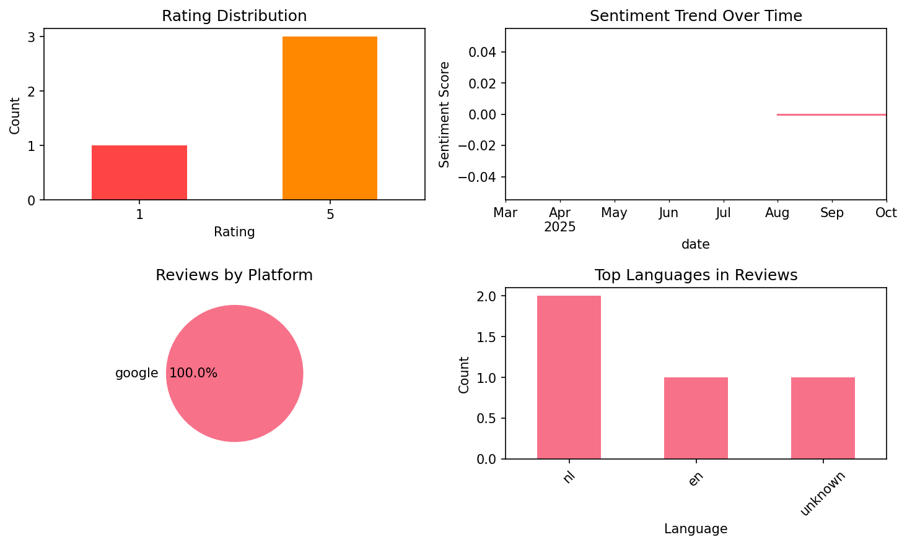
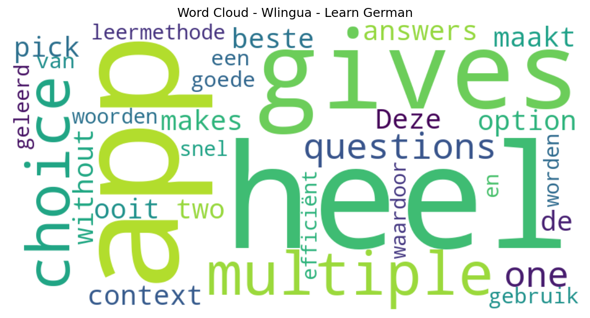

# Wlingua - Learn German

## 📱 App Information

| **Attribute** | **Google Play** | **App Store** |
|---------------|-----------------|---------------|
| **Title** | Wlingua - Learn German | N/A |
| **Package/ID** | com.wlingua.german.course | N/A |
| **Rating** | 4.82 | N/A |
| **Total Ratings** | 9,311 | N/A |
| **Installs** | 100,000+ | N/A |
| **Genre** | Education | N/A |

## 📝 Description

<b>Learning German has never been so easy.</b>
It's perfect for you, whether you already have a beginner, basic, intermediate, or advanced level of German. Thanks to our online German course, you’ll notice your German improving very quickly. Millions of students have already tried our courses. Would you like to join them?

<h1><b>Our Online German Course:</b></h1>
<b>German Course</b>
In this course you will learn German from scratch. Guaranteed! Regardless of the level you start from, it is designed to help you learn German from day one.

<h1><b>Our Learning Method:</b></h1>
A learning process designed for you that is both easy and guided: You’ll feel like you’re learning more and more German every day. Every sentence, exercise, review, and reading has been carefully selected for you.

Audio clips in German: A wide variety of accents with clear, crisp pronunciation. Recorded by professional narrators.

Linked concepts: Each word is linked to its use or precise meaning. When you click on the words in each sentence, exercise, or reading, their meaning or an explanation of their use will appear.

Lesson structure: Concepts are introduced progressively throughout the course. Only concepts that are explained in the course are used to create the content (sentences, exercises or readings).

Vocabulary: Learn the meaning, pronunciation, and use of words with activities adapted to your progress.

Grammar exercises: Practice your grammar with exercises linked to explanations.

Vocabulary topics: Words are grouped by topic categories.

Spaced reviews: Review the vocabulary and grammar at increasingly long intervals.

Search function: Find whatever you’re looking for, including vocabulary and grammar.

Reading comprehension texts (readings): Learn and practice with conversations, news, emails, and interviews, among others.

Certificates: Earn a certificate that proves your knowledge at the end of each level.

Account types:
✔ Basic: With a Basic account, the course is free, but has some limitations.
✔ Premium: With a Premium account, you’ll have access to all course content and activities.

At Wlingua, we work hard every day to offer you a quality German app that will help you in your work, with that upcoming exam, on your vacation, in communicating with people from around the world...

Download our app to learn German!

## 📊 Reviews Analytics

**Total Reviews:** 4 (4 analyzed)
**Rating Distribution:** 3 positive (4-5★), 0 neutral (3★), 1 negative (1-2★)
**Average Sentiment:** 0.00 (-1=very negative, +1=very positive)
**Primary Language:** nl
**Key Insights:** Average rating: 4.0/5.0 | Reviews in 3 languages, primarily nl (2 reviews) | Reviews from 1 platform(s): google | Key themes: app


### 🔑 Key Themes & Phrases

- **app** (relevance: 0.500)

### ⭐ Rating Breakdown

- **5 ★★★★★**: 3 reviews (75.0%)
- **1 ★☆☆☆☆**: 1 reviews (25.0%)

### 🌍 Languages in Reviews

- **nl**: 2 reviews
- **en**: 1 reviews
- **unknown**: 1 reviews

### 📱 Platform Distribution

- **google**: 4 reviews

## 📈 Visualizations

### Analytics Charts


### Word Cloud


## 💬 Sample Reviews

**Review 1** (★ - google - 2025-10-26T13:54:04)
> gives multiple choice questions with only one option and makes you pick between two answers without context

**Review 2** (★★★★★ - google - 2025-09-21T13:27:51)
> 🎯💯👌💪💪💪👍👍👍

**Review 3** (★★★★★ - google - 2025-08-14T21:47:35)
> de beste app ooit!!🔥✨️

**Review 4** (★★★★★ - google - 2025-03-01T08:49:50)
> Deze app maakt gebruik van een heel goede leermethode, waardoor woorden heel snel en efficiënt geleerd worden

## 🔧 Raw JSON Data

<details>
<summary>Click to expand raw app data</summary>

```json
{
  "name": "Wlingua - Learn German",
  "google_package": "com.wlingua.german.course",
  "google": {
    "title": "Wlingua - Learn German",
    "description": "<b>Learning German has never been so easy.</b>\r\nIt's perfect for you, whether you already have a beginner, basic, intermediate, or advanced level of German. Thanks to our online German course, you’ll notice your German improving very quickly. Millions of students have already tried our courses. Would you like to join them?\r\n\r\n<h1><b>Our Online German Course:</b></h1>\r\n<b>German Course</b>\r\nIn this course you will learn German from scratch. Guaranteed! Regardless of the level you start from, it is designed to help you learn German from day one.\r\n\r\n<h1><b>Our Learning Method:</b></h1>\r\nA learning process designed for you that is both easy and guided: You’ll feel like you’re learning more and more German every day. Every sentence, exercise, review, and reading has been carefully selected for you.\r\n\r\nAudio clips in German: A wide variety of accents with clear, crisp pronunciation. Recorded by professional narrators.\r\n\r\nLinked concepts: Each word is linked to its use or precise meaning. When you click on the words in each sentence, exercise, or reading, their meaning or an explanation of their use will appear.\r\n\r\nLesson structure: Concepts are introduced progressively throughout the course. Only concepts that are explained in the course are used to create the content (sentences, exercises or readings).\r\n\r\nVocabulary: Learn the meaning, pronunciation, and use of words with activities adapted to your progress.\r\n\r\nGrammar exercises: Practice your grammar with exercises linked to explanations.\r\n\r\nVocabulary topics: Words are grouped by topic categories.\r\n\r\nSpaced reviews: Review the vocabulary and grammar at increasingly long intervals.\r\n\r\nSearch function: Find whatever you’re looking for, including vocabulary and grammar.\r\n\r\nReading comprehension texts (readings): Learn and practice with conversations, news, emails, and interviews, among others.\r\n\r\nCertificates: Earn a certificate that proves your knowledge at the end of each level.\r\n\r\nAccount types:\r\n✔ Basic: With a Basic account, the course is free, but has some limitations.\r\n✔ Premium: With a Premium account, you’ll have access to all course content and activities.\r\n\r\nAt Wlingua, we work hard every day to offer you a quality German app that will help you in your work, with that upcoming exam, on your vacation, in communicating with people from around the world...\r\n\r\nDownload our app to learn German!",
    "rating": 4.82,
    "rating_text": null,
    "ratings_total": 9311,
    "ratings_histogram": [
      66,
      66,
      166,
      634,
      8276
    ],
    "installs": "100,000+",
    "genre": "Education"
  },
  "apple": null,
  "reviews": [
    {
      "platform": "google",
      "rating": 1,
      "review": "gives multiple choice questions with only one option and makes you pick between two answers without context",
      "date": "2025-10-26T13:54:04"
    },
    {
      "platform": "google",
      "rating": 5,
      "review": "🎯💯👌💪💪💪👍👍👍",
      "date": "2025-09-21T13:27:51"
    },
    {
      "platform": "google",
      "rating": 5,
      "review": "de beste app ooit!!🔥✨️",
      "date": "2025-08-14T21:47:35"
    },
    {
      "platform": "google",
      "rating": 5,
      "review": "Deze app maakt gebruik van een heel goede leermethode, waardoor woorden heel snel en efficiënt geleerd worden",
      "date": "2025-03-01T08:49:50"
    }
  ]
}
```

</details>

---
*Report generated on 2025-11-08 13:52:27 using advanced analytics*
