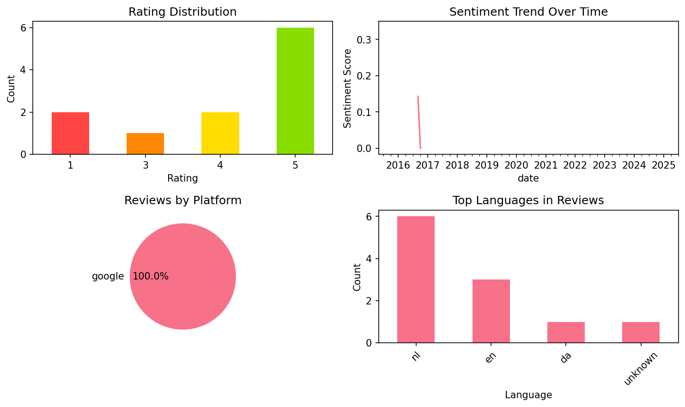

# Learn French with Le Monde

## 📱 App Information

| **Attribute** | **Google Play** | **App Store** |
|---------------|-----------------|---------------|
| **Title** | Learn French with Le Monde | N/A |
| **Package/ID** | fr.lemonde.ftqmobile | N/A |
| **Rating** | 4.45 | N/A |
| **Total Ratings** | 7,044 | N/A |
| **Installs** | 1,000,000+ | N/A |
| **Genre** | Education | N/A |

## 📝 Description

Frantastique provides daily personalized French lessons. Test Frantastique for free and get a level assessment and a personalized pedagogical report! It’s the easiest, friendliest way to learn French: 

. More than 2,000,000 people use our method
. Long-term results 
. A personalized approach 
. Modern and business French 
. Adapted for post-beginners (from 15 years old)

Personalized French Content: Frantastique lessons are based on your needs, your requests, and your level. You’ll come across professional scenarios, a variety of accents, exercises and plenty of humor. 10 to 15 minutes daily is all it takes! 

Motivation, Humor and French Culture: Discover the diversity and richness of French culture around the world with the help of Victor Hugo and friends. Every day, you'll come across different accents, songs, and films in addition to original stories and texts. 

Tailored Corrections: After clicking the 'send' button, you will receive a correction with your daily score, explanations of your answers, scripts of dialogues or videos, the vocabulary you have requested and more. 

Progress: Each Frantastique lesson is built dynamically to focus on points of difficulty and your own requests, to ensure you've committed information to your long-term memory. Your French will improve effortlessly, daily and over the long term! 


You can try Frantastique for 7 days free of charge. This test is limited to the first seven days of the program, and is absolutely free and non-binding. Under no circumstances will you be registered for the full, paying version of our lessons without your explicit consent. We guarantee the confidentiality of your personal details. 

Frantastique is designed, edited and developed in its entirety by A9 SAS Gymglish.

## 📊 Reviews Analytics

**Total Reviews:** 11 (11 analyzed)
**Rating Distribution:** 8 positive (4-5★), 1 neutral (3★), 2 negative (1-2★)
**Average Sentiment:** 0.09 (-1=very negative, +1=very positive)
**Primary Language:** nl
**Key Insights:** Average rating: 3.9/5.0 | Overall sentiment: neutral (score: 0.09) | Reviews in 4 languages, primarily nl (6 reviews) | Reviews from 1 platform(s): google | Key themes: app, een, goed


### 🔑 Key Themes & Phrases

- **app** (relevance: 0.197)
- **een** (relevance: 0.157)
- **goed** (relevance: 0.129)
- **informatief** (relevance: 0.129)
- **way** (relevance: 0.113)
- **goede** (relevance: 0.113)
- **zit goed** (relevance: 0.092)
- **zit** (relevance: 0.092)

### ⭐ Rating Breakdown

- **5 ★★★★★**: 6 reviews (54.5%)
- **4 ★★★★☆**: 2 reviews (18.2%)
- **3 ★★★☆☆**: 1 reviews (9.1%)
- **1 ★☆☆☆☆**: 2 reviews (18.2%)

### 🌍 Languages in Reviews

- **nl**: 6 reviews
- **en**: 3 reviews
- **da**: 1 reviews
- **unknown**: 1 reviews

### 📱 Platform Distribution

- **google**: 11 reviews

## 📈 Visualizations

### Analytics Charts


### Word Cloud


## 💬 Sample Reviews

**Review 1** (★ - google - 2025-07-26T19:33:01)
> 7 dagen gratis

**Review 2** (★★★★ - google - 2018-11-25T16:01:37)
> Ok

**Review 3** (★ - google - 2016-09-14T08:08:21)
> The app get"s stuck in it's own "do you like me then rate me pop up". It keeps popping up with no way to get past it. No other option then to delete the app. Bummer!

**Review 4** (★★★★ - google - 2015-10-24T13:35:03)
> Informatief

**Review 5** (★★★★★ - google - 2015-05-27T09:13:19)
> A different way to learn french. I learned a lot here. Great app!

## 🔧 Raw JSON Data

<details>
<summary>Click to expand raw app data</summary>

```json
{
  "name": "Learn French with Le Monde",
  "google_package": "fr.lemonde.ftqmobile",
  "google": {
    "title": "Learn French with Le Monde",
    "description": "Frantastique provides daily personalized French lessons. Test Frantastique for free and get a level assessment and a personalized pedagogical report! It’s the easiest, friendliest way to learn French: \r\n\r\n. More than 2,000,000 people use our method\r\n. Long-term results \r\n. A personalized approach \r\n. Modern and business French \r\n. Adapted for post-beginners (from 15 years old)\r\n\r\nPersonalized French Content: Frantastique lessons are based on your needs, your requests, and your level. You’ll come across professional scenarios, a variety of accents, exercises and plenty of humor. 10 to 15 minutes daily is all it takes! \r\n\r\nMotivation, Humor and French Culture: Discover the diversity and richness of French culture around the world with the help of Victor Hugo and friends. Every day, you'll come across different accents, songs, and films in addition to original stories and texts. \r\n\r\nTailored Corrections: After clicking the 'send' button, you will receive a correction with your daily score, explanations of your answers, scripts of dialogues or videos, the vocabulary you have requested and more. \r\n\r\nProgress: Each Frantastique lesson is built dynamically to focus on points of difficulty and your own requests, to ensure you've committed information to your long-term memory. Your French will improve effortlessly, daily and over the long term! \r\n\r\n\r\nYou can try Frantastique for 7 days free of charge. This test is limited to the first seven days of the program, and is absolutely free and non-binding. Under no circumstances will you be registered for the full, paying version of our lessons without your explicit consent. We guarantee the confidentiality of your personal details. \r\n\r\nFrantastique is designed, edited and developed in its entirety by A9 SAS Gymglish.",
    "rating": 4.45,
    "rating_text": null,
    "ratings_total": 7044,
    "ratings_histogram": [
      418,
      418,
      130,
      628,
      5420
    ],
    "installs": "1,000,000+",
    "genre": "Education"
  },
  "apple": null,
  "reviews": [
    {
      "platform": "google",
      "rating": 1,
      "review": "7 dagen gratis",
      "date": "2025-07-26T19:33:01"
    },
    {
      "platform": "google",
      "rating": 3,
      "review": "Een goede les app. Voor zo ver ik kan zien. Wel één nadeel. Er staat niet aangegeven dat er in app aankopen gedaan moeten worden. Een domper. Graag een melding in de app store.",
      "date": "2019-01-15T11:14:50"
    },
    {
      "platform": "google",
      "rating": 4,
      "review": "Ok",
      "date": "2018-11-25T16:01:37"
    },
    {
      "platform": "google",
      "rating": 5,
      "review": "Eerste indruk prima. Een speelse benadering",
      "date": "2018-11-01T23:53:30"
    },
    {
      "platform": "google",
      "rating": 5,
      "review": "Mooie filmpje, goede uitleg",
      "date": "2016-10-26T07:39:05"
    },
    {
      "platform": "google",
      "rating": 1,
      "review": "The app get\"s stuck in it's own \"do you like me then rate me pop up\". It keeps popping up with no way to get past it. No other option then to delete the app. Bummer!",
      "date": "2016-09-14T08:08:21"
    },
    {
      "platform": "google",
      "rating": 5,
      "review": "Zit goed in elkaar, is leerzaam, onderhoudend, informatief en met humor gemaakt.",
      "date": "2016-04-10T18:21:08"
    },
    {
      "platform": "google",
      "rating": 5,
      "review": "Zit goed in mekaar, heldere feedback",
      "date": "2016-01-05T08:39:50"
    },
    {
      "platform": "google",
      "rating": 4,
      "review": "Informatief",
      "date": "2015-10-24T13:35:03"
    },
    {
      "platform": "google",
      "rating": 5,
      "review": "Onderhoudend, en erg goed opgebouwd.",
      "date": "2015-10-23T10:37:45"
    },
    {
      "platform": "google",
      "rating": 5,
      "review": "A different way to learn french. I learned a lot here. Great app!",
      "date": "2015-05-27T09:13:19"
    }
  ]
}
```

</details>

---
*Report generated on 2025-11-08 13:52:45 using advanced analytics*
