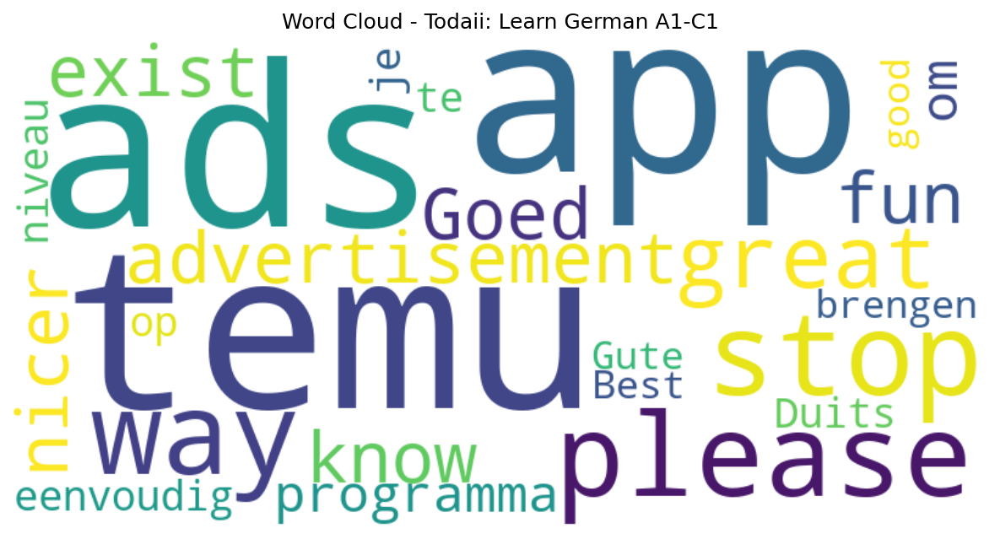

# Todaii: Learn German A1-C1

## 📱 App Information

| **Attribute** | **Google Play** | **App Store** |
|---------------|-----------------|---------------|
| **Title** | Todaii: Learn German A1-C1 | N/A |
| **Package/ID** | mobi.eup.easygerman | N/A |
| **Rating** | 4.56 | N/A |
| **Total Ratings** | 8,303 | N/A |
| **Installs** | 500,000+ | N/A |
| **Genre** | Education | N/A |

## 📝 Description

<h2>Learn German in context - READING, LISTENING, SPEAKING and GOETHE</h2>

Whether you study to a higher grade, a career boost, study abroad or to get confident having new conversations, Todaii German can help you become better.

Why choose Todaii German to learn German?
📚 <b>Reading practice</b> - Learn German through real content
- Improve German reading skills with content selected from levels A1 to C1
- Topics include German culture, daily life, technology, entertainment, and more.
- Integrated 1-touch lookup right in the reading, helping you deeply understand the semantics of words and sentences when needed.
- Practice with Quiz to help consolidate skills and memorize lesson content
- Practice reading and pronunciation of each word, each sentence

💡<b>A.I. Pronunciation Scoring</b> - Improve your pronunciation, speak German confidently
- Recognize and analyze your pronunciation of each word using A.I. technology
- Compare with native pronunciation to detect mistakes
- Provide accurate scores after each practice to track progress

🔍<b>German Dictionary</b> - Easy lookup and learn German vocabulary
- Smart, fast, and accurate dictionary similar to top German dictionary apps
- Look up vocabulary, idioms, sentence structures, and grammar breakdowns.
- All features are designed to help you learn German vocabulary and grammar naturally.

🎓 <b>Mock tests for GOETHE A1-C1</b> – Learn German for exam success
- Practice tests to help you prepare for popular German proficiency exams
- Detailed answer explanations help you understand your strengths and weaknesses

🎧 <b>Listening practice</b> - Learn German by listening to native video
- Practice listening skills through hot videos and podcasts, with transcripts to help you understand each sentence.
- Audio with reading exercises to practice listening skills with high-quality voices
- Easily adjust playback speed, suitable for each learner's level
- Attractive videos and podcasts, help you practice listening skills, supplement vocabulary and grammar in real contexts.
- Detailed transcripts included, easy to follow lesson content.

📔 <b>Vocabulary builder</b> – Memorize German words effectively
- Words are curated from real reading materials
- Easy-to-use flashcards to help you review anytime
- Specialized vocabulary such as nursing, restaurant, hotel, sales..., helps you study according to your personal needs. 
- Smart review function with flashcard vocabulary games, word connection, speaking, word arrangement for long-term memory.

Application for:
- Learners self-studying German from beginner to advanced
- Those wanting to expand vocabulary quickly
- Anyone preparing for German language exams (Goethe, TELC, ÖSD, etc.)
- Learners looking to improve reading, listening, speaking, and pronunciation skills
- Whether you're just starting or already have some experience, Todaii German is your trusted app to learn German in a fun, structured, and effective way
- Let Todaii German be your companion on your journey to learn German and connect deeply with the language and culture of Germany!

📩 For feedback or questions, contact us at: todai.easylife@gmail.com
Your support helps us make Todaii German better every day.

## 📊 Reviews Analytics

**Total Reviews:** 5 (5 analyzed)
**Rating Distribution:** 5 positive (4-5★), 0 neutral (3★), 0 negative (1-2★)
**Average Sentiment:** 0.49 (-1=very negative, +1=very positive)
**Primary Language:** unknown
**Key Insights:** Average rating: 4.6/5.0 | Overall sentiment: positive (score: 0.49) | Reviews in 4 languages, primarily unknown (2 reviews) | Reviews from 1 platform(s): google | Key themes: app


### 🔑 Key Themes & Phrases

- **app** (relevance: 0.600)

### ⭐ Rating Breakdown

- **5 ★★★★★**: 3 reviews (60.0%)
- **4 ★★★★☆**: 2 reviews (40.0%)

### 🌍 Languages in Reviews

- **unknown**: 2 reviews
- **en**: 1 reviews
- **nl**: 1 reviews
- **no**: 1 reviews

### 📱 Platform Distribution

- **google**: 5 reviews

## 📈 Visualizations

### Analytics Charts


### Word Cloud


## 💬 Sample Reviews

**Review 1** (★★★★ - google - 2025-05-27T10:05:47)
> great app but please stop with the temu advertisement. we know they exist. there are way nicer ads. way more fun ads then temu. please.. stop with the temu ads.

**Review 2** (★★★★ - google - 2023-07-11T07:05:07)
> Goed programma om eenvoudig je Duits op niveau te brengen

**Review 3** (★★★★★ - google - 2023-06-26T00:24:05)
> Gute App

**Review 4** (★★★★★ - google - 2023-06-04T20:54:58)
> Very good

**Review 5** (★★★★★ - google - 2023-02-10T16:46:53)
> Best app ever

## 🔧 Raw JSON Data

<details>
<summary>Click to expand raw app data</summary>

```json
{
  "name": "Todaii: Learn German A1-C1",
  "google_package": "mobi.eup.easygerman",
  "google": {
    "title": "Todaii: Learn German A1-C1",
    "description": "<h2>Learn German in context - READING, LISTENING, SPEAKING and GOETHE</h2>\r\n\r\nWhether you study to a higher grade, a career boost, study abroad or to get confident having new conversations, Todaii German can help you become better.\r\n\r\nWhy choose Todaii German to learn German?\r\n📚 <b>Reading practice</b> - Learn German through real content\r\n- Improve German reading skills with content selected from levels A1 to C1\r\n- Topics include German culture, daily life, technology, entertainment, and more.\r\n- Integrated 1-touch lookup right in the reading, helping you deeply understand the semantics of words and sentences when needed.\r\n- Practice with Quiz to help consolidate skills and memorize lesson content\r\n- Practice reading and pronunciation of each word, each sentence\r\n\r\n💡<b>A.I. Pronunciation Scoring</b> - Improve your pronunciation, speak German confidently\r\n- Recognize and analyze your pronunciation of each word using A.I. technology\r\n- Compare with native pronunciation to detect mistakes\r\n- Provide accurate scores after each practice to track progress\r\n\r\n🔍<b>German Dictionary</b> - Easy lookup and learn German vocabulary\r\n- Smart, fast, and accurate dictionary similar to top German dictionary apps\r\n- Look up vocabulary, idioms, sentence structures, and grammar breakdowns.\r\n- All features are designed to help you learn German vocabulary and grammar naturally.\r\n\r\n🎓 <b>Mock tests for GOETHE A1-C1</b> – Learn German for exam success\r\n- Practice tests to help you prepare for popular German proficiency exams\r\n- Detailed answer explanations help you understand your strengths and weaknesses\r\n\r\n🎧 <b>Listening practice</b> - Learn German by listening to native video\r\n- Practice listening skills through hot videos and podcasts, with transcripts to help you understand each sentence.\r\n- Audio with reading exercises to practice listening skills with high-quality voices\r\n- Easily adjust playback speed, suitable for each learner's level\r\n- Attractive videos and podcasts, help you practice listening skills, supplement vocabulary and grammar in real contexts.\r\n- Detailed transcripts included, easy to follow lesson content.\r\n\r\n📔 <b>Vocabulary builder</b> – Memorize German words effectively\r\n- Words are curated from real reading materials\r\n- Easy-to-use flashcards to help you review anytime\r\n- Specialized vocabulary such as nursing, restaurant, hotel, sales..., helps you study according to your personal needs. \r\n- Smart review function with flashcard vocabulary games, word connection, speaking, word arrangement for long-term memory.\r\n\r\nApplication for:\r\n- Learners self-studying German from beginner to advanced\r\n- Those wanting to expand vocabulary quickly\r\n- Anyone preparing for German language exams (Goethe, TELC, ÖSD, etc.)\r\n- Learners looking to improve reading, listening, speaking, and pronunciation skills\r\n- Whether you're just starting or already have some experience, Todaii German is your trusted app to learn German in a fun, structured, and effective way\r\n- Let Todaii German be your companion on your journey to learn German and connect deeply with the language and culture of Germany!\r\n\r\n📩 For feedback or questions, contact us at: todai.easylife@gmail.com\r\nYour support helps us make Todaii German better every day.",
    "rating": 4.56,
    "rating_text": null,
    "ratings_total": 8303,
    "ratings_histogram": [
      485,
      220,
      220,
      397,
      6889
    ],
    "installs": "500,000+",
    "genre": "Education"
  },
  "apple": null,
  "reviews": [
    {
      "platform": "google",
      "rating": 4,
      "review": "great app but please stop with the temu advertisement. we know they exist. there are way nicer ads. way more fun ads then temu. please.. stop with the temu ads.",
      "date": "2025-05-27T10:05:47"
    },
    {
      "platform": "google",
      "rating": 4,
      "review": "Goed programma om eenvoudig je Duits op niveau te brengen",
      "date": "2023-07-11T07:05:07"
    },
    {
      "platform": "google",
      "rating": 5,
      "review": "Gute App",
      "date": "2023-06-26T00:24:05"
    },
    {
      "platform": "google",
      "rating": 5,
      "review": "Very good",
      "date": "2023-06-04T20:54:58"
    },
    {
      "platform": "google",
      "rating": 5,
      "review": "Best app ever",
      "date": "2023-02-10T16:46:53"
    }
  ]
}
```

</details>

---
*Report generated on 2025-11-08 13:52:52 using advanced analytics*
