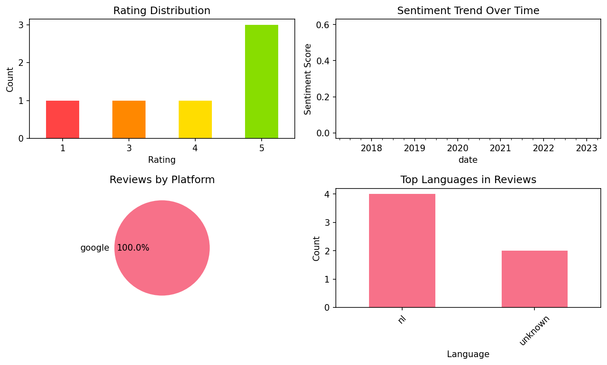

# Learn French – Studycat

## 📱 App Information

| **Attribute** | **Google Play** | **App Store** |
|---------------|-----------------|---------------|
| **Title** | Learn French – Studycat | N/A |
| **Package/ID** | net.studycat.funfrench | N/A |
| **Rating** | 4.35 | N/A |
| **Total Ratings** | 1,397 | N/A |
| **Installs** | 100,000+ | N/A |
| **Genre** | Education | N/A |

## 📝 Description

From the award-winning creators of Studycat for Schools, comes Learn French! The #1 way for kids to learn français!

From preschool and beyond, Learn French by Studycat inspires children's innate love of learning with interactive games and activities.

Our bite-sized lessons will keep your child motivated while they discover a new language and build bilingual skills for a lifetime!

WHY STUDYCAT?

• Learn French, in French. All our activities focus on virtual language immersion, which means your child won't be hearing any English, only French! This might be confusing at first, but trust us, it's the best way to learn.

• Everyday Language. Our lessons teach words and expressions that kids can apply in their everyday lives, so they can get a head start developing their bilingual abilities.

• Get Talking Fast. With our interactive speaking challenges, kids will be encouraged to speak entire words and phrases on their own! The earlier kids start their language-learning journey, the more likely they are to reach proficiency quickly.

• Vocal Variety. Our characters' voices use different tones, expressions, and accents so that kids can pick up on the subtleties of pronunciation from different speakers.

• Designed by Experts. All our activities are designed by language and early-education experts. Thoughtfully developed lessons will build your child's confidence with every step.

• Learner Profiles (coming soon). Create up to four personalized profiles for different family members, allowing tailored learning paths and individual progress tracking.

• Safe for Kids & Ad-Free. Parents can rest easy knowing that there are no pesky ads to distract children from their learning. All content is appropriate for ages 3 and up.

• Offline Learning. On a plane, at a restaurant, or in a park? No problem! Learn French by Studycat is available for both online and offline use.

WHAT ARE PARENTS SAYING?

“As a parent trying to raise bilingual children at home, Studycat is a helpful app to start them off and create excitement about the language.” — Fluent in 3 Months

“Everything has been thought out carefully and the games and activities are really engaging.” — Bilingual Kidspot

“The concept is so simple but extremely effective. I even found myself learning at the same time.” — Bump, Baby & You

--

If you like Learn French by Studycat, try it out for 7 days free! Empower your child to learn like never before, and get extras like printable worksheets.

If you choose to subscribe, payment will be charged to your Apple account, and your account will be charged for renewal within 24-hours prior to the end of the current period.
Auto-renewal may be turned off at any time by going to your settings in the App Store after purchase. Any unused portion of a free trial period, if offered, will be forfeited when the user purchases a subscription to that publication, where applicable.

Privacy Policy: https://studycat.com/about/privacy-policy/
Terms of Use: https://studycat.com/about/terms-of-use/

## 📊 Reviews Analytics

**Total Reviews:** 6 (6 analyzed)
**Rating Distribution:** 4 positive (4-5★), 1 neutral (3★), 1 negative (1-2★)
**Average Sentiment:** 0.24 (-1=very negative, +1=very positive)
**Primary Language:** nl
**Key Insights:** Average rating: 3.8/5.0 | Overall sentiment: positive (score: 0.24) | Reviews in 2 languages, primarily nl (4 reviews) | Reviews from 1 platform(s): google | Key themes: je, maar, het


### 🔑 Key Themes & Phrases

- **je** (relevance: 0.285)
- **maar** (relevance: 0.185)
- **het** (relevance: 0.181)
- **veel** (relevance: 0.177)
- **voor** (relevance: 0.122)
- **een** (relevance: 0.122)

### ⭐ Rating Breakdown

- **5 ★★★★★**: 3 reviews (50.0%)
- **4 ★★★★☆**: 1 reviews (16.7%)
- **3 ★★★☆☆**: 1 reviews (16.7%)
- **1 ★☆☆☆☆**: 1 reviews (16.7%)

### 🌍 Languages in Reviews

- **nl**: 4 reviews
- **unknown**: 2 reviews

### 📱 Platform Distribution

- **google**: 6 reviews

## 📈 Visualizations

### Analytics Charts


### Word Cloud


## 💬 Sample Reviews

**Review 1** (★★★★ - google - 2023-05-27T07:24:34)
> Je kunt er veel woordjes ben leren, maar je hebt er wel een abonnement voor nodig

**Review 2** (★ - google - 2023-05-14T09:14:01)
> Het kost gewoon veel geld

**Review 3** (★★★ - google - 2019-05-07T11:00:11)
> Fijne app, hier betaal ik graag een beetje voor. MAAR... als ik zie staan "koop pakket met 10 lessen" en ik betaal hiervoor, dan verwacht ik ook effectief 10 lessen. Het hoofdstuk "fruit" heeft bijvoorbeeld maar 5 lessen, geen 10. Dit houdt mij tegen om meer hoofdstukken te kopen, ook al zit deze ap...

**Review 4** (★★★★★ - google - 2018-12-05T15:14:58)
> Mega cool

**Review 5** (★★★★★ - google - 2017-03-05T12:06:03)
> Nice

## 🔧 Raw JSON Data

<details>
<summary>Click to expand raw app data</summary>

```json
{
  "name": "Learn French – Studycat",
  "google_package": "net.studycat.funfrench",
  "google": {
    "title": "Learn French – Studycat",
    "description": "From the award-winning creators of Studycat for Schools, comes Learn French! The #1 way for kids to learn français!\r\n\r\nFrom preschool and beyond, Learn French by Studycat inspires children's innate love of learning with interactive games and activities.\r\n\r\nOur bite-sized lessons will keep your child motivated while they discover a new language and build bilingual skills for a lifetime!\r\n\r\nWHY STUDYCAT?\r\n\r\n• Learn French, in French. All our activities focus on virtual language immersion, which means your child won't be hearing any English, only French! This might be confusing at first, but trust us, it's the best way to learn.\r\n\r\n• Everyday Language. Our lessons teach words and expressions that kids can apply in their everyday lives, so they can get a head start developing their bilingual abilities.\r\n\r\n• Get Talking Fast. With our interactive speaking challenges, kids will be encouraged to speak entire words and phrases on their own! The earlier kids start their language-learning journey, the more likely they are to reach proficiency quickly.\r\n\r\n• Vocal Variety. Our characters' voices use different tones, expressions, and accents so that kids can pick up on the subtleties of pronunciation from different speakers.\r\n\r\n• Designed by Experts. All our activities are designed by language and early-education experts. Thoughtfully developed lessons will build your child's confidence with every step.\r\n\r\n• Learner Profiles (coming soon). Create up to four personalized profiles for different family members, allowing tailored learning paths and individual progress tracking.\r\n\r\n• Safe for Kids & Ad-Free. Parents can rest easy knowing that there are no pesky ads to distract children from their learning. All content is appropriate for ages 3 and up.\r\n\r\n• Offline Learning. On a plane, at a restaurant, or in a park? No problem! Learn French by Studycat is available for both online and offline use.\r\n\r\nWHAT ARE PARENTS SAYING?\r\n\r\n“As a parent trying to raise bilingual children at home, Studycat is a helpful app to start them off and create excitement about the language.” — Fluent in 3 Months\r\n\r\n“Everything has been thought out carefully and the games and activities are really engaging.” — Bilingual Kidspot\r\n\r\n“The concept is so simple but extremely effective. I even found myself learning at the same time.” — Bump, Baby & You\r\n\r\n--\r\n\r\nIf you like Learn French by Studycat, try it out for 7 days free! Empower your child to learn like never before, and get extras like printable worksheets.\r\n\r\nIf you choose to subscribe, payment will be charged to your Apple account, and your account will be charged for renewal within 24-hours prior to the end of the current period.\r\nAuto-renewal may be turned off at any time by going to your settings in the App Store after purchase. Any unused portion of a free trial period, if offered, will be forfeited when the user purchases a subscription to that publication, where applicable.\r\n\r\nPrivacy Policy: https://studycat.com/about/privacy-policy/\r\nTerms of Use: https://studycat.com/about/terms-of-use/",
    "rating": 4.35,
    "rating_text": null,
    "ratings_total": 1397,
    "ratings_histogram": [
      87,
      76,
      32,
      174,
      982
    ],
    "installs": "100,000+",
    "genre": "Education"
  },
  "apple": null,
  "reviews": [
    {
      "platform": "google",
      "rating": 4,
      "review": "Je kunt er veel woordjes ben leren, maar je hebt er wel een abonnement voor nodig",
      "date": "2023-05-27T07:24:34"
    },
    {
      "platform": "google",
      "rating": 1,
      "review": "Het kost gewoon veel geld",
      "date": "2023-05-14T09:14:01"
    },
    {
      "platform": "google",
      "rating": 5,
      "review": "Luek moet je ok doen",
      "date": "2021-01-09T08:08:47"
    },
    {
      "platform": "google",
      "rating": 3,
      "review": "Fijne app, hier betaal ik graag een beetje voor. MAAR... als ik zie staan \"koop pakket met 10 lessen\" en ik betaal hiervoor, dan verwacht ik ook effectief 10 lessen. Het hoofdstuk \"fruit\" heeft bijvoorbeeld maar 5 lessen, geen 10. Dit houdt mij tegen om meer hoofdstukken te kopen, ook al zit deze app heel goed in elkaar. Kan u dit verklaren?",
      "date": "2019-05-07T11:00:11"
    },
    {
      "platform": "google",
      "rating": 5,
      "review": "Mega cool",
      "date": "2018-12-05T15:14:58"
    },
    {
      "platform": "google",
      "rating": 5,
      "review": "Nice",
      "date": "2017-03-05T12:06:03"
    }
  ]
}
```

</details>

---
*Report generated on 2025-11-08 13:52:55 using advanced analytics*
