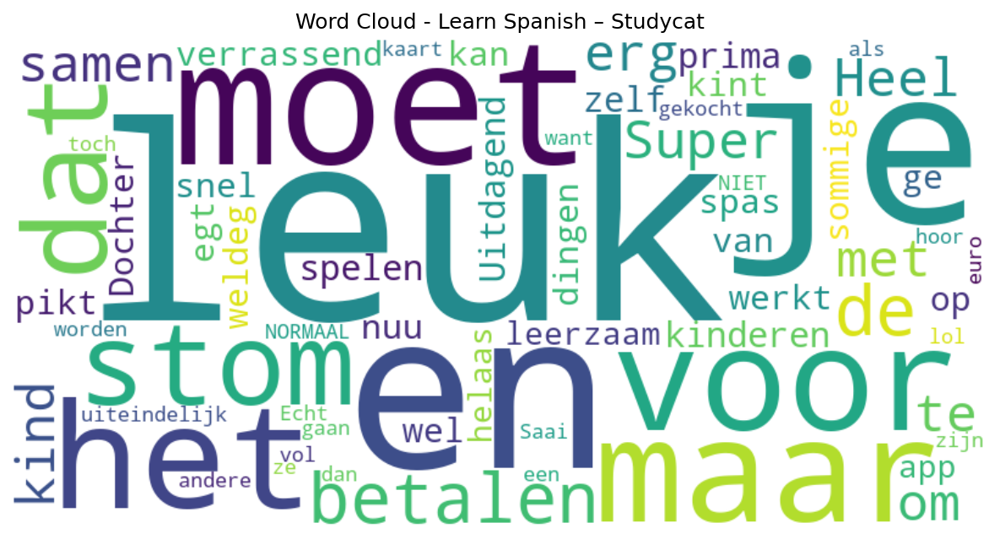

# Learn Spanish – Studycat

## 📱 App Information

| **Attribute** | **Google Play** | **App Store** |
|---------------|-----------------|---------------|
| **Title** | Learn Spanish – Studycat | N/A |
| **Package/ID** | net.studycat.funspanish | N/A |
| **Rating** | 4.4257426 | N/A |
| **Total Ratings** | 2,495 | N/A |
| **Installs** | 100,000+ | N/A |
| **Genre** | Education | N/A |

## 📝 Description

From the award-winning creators of Studycat for Schools, comes Learn Spanish! The #1 way for kids to learn español!

From preschool and beyond, Learn Spanish by Studycat inspires children's innate love of learning with interactive games and activities.

Our bite-sized lessons will keep your child motivated while they discover a new language and build bilingual skills for a lifetime!

WHY STUDYCAT?

• Learn Spanish, in Spanish. All our activities focus on virtual language immersion, which means your child won't be hearing any English, only Spanish! This might be confusing at first, but trust us, it's the best way to learn.

• Everyday Language. Our lessons teach words and expressions that kids can apply in their everyday lives, so they can get a head start developing their bilingual abilities.

• Get Talking Fast. With our interactive speaking challenges, kids will be encouraged to speak entire words and phrases on their own! The earlier kids start their language-learning journey, the more likely they are to reach proficiency quickly.

• Vocal Variety. Our characters' voices use different tones, expressions, and accents so that kids can pick up on the subtleties of pronunciation from different speakers.

• Designed by Experts. All our activities are designed by language and early-education experts. Thoughtfully developed lessons will build your child's confidence with every step.

• Learner Profiles. Create up to four personalized profiles for different family members, allowing tailored learning paths and individual progress tracking.

• Safe for Kids & Ad-Free. Parents can rest easy knowing that there are no pesky ads to distract children from their learning. All content is appropriate for ages 3 and up.

• Offline Learning. On a plane, at a restaurant, or in a park? No problem! Learn Spanish by Studycat is available for both online and offline use.

WHAT ARE PARENTS SAYING?

“Children can follow their natural curiosity and walk away with a basic Spanish vocabulary and not even realize it!” — Spanish Hackers

“As a parent trying to raise bilingual children at home, Learn Spanish by Studycat is a helpful app to start them off and create excitement about the language.” — Fluent in 3 Months

“Everything has been thought out carefully and the games and activities are really engaging.” — Bilingual Kidspot

--

If you like Learn Spanish by Studycat, try it out for 7 days free! Empower your child to learn like never before, and get extras like printable worksheets and animated stories.

If you choose to subscribe, payment will be charged to your Apple account, and your account will be charged for renewal within 24-hours prior to the end of the current period.
Auto-renewal may be turned off at any time by going to your settings in the App Store after purchase. Any unused portion of a free trial period, if offered, will be forfeited when the user purchases a subscription to that publication, where applicable.

Privacy Policy: https://studycat.com/about/privacy-policy/
Terms of Use: https://studycat.com/about/terms-of-use/

## 📊 Reviews Analytics

**Total Reviews:** 9 (9 analyzed)
**Rating Distribution:** 6 positive (4-5★), 1 neutral (3★), 2 negative (1-2★)
**Average Sentiment:** 0.14 (-1=very negative, +1=very positive)
**Primary Language:** nl
**Key Insights:** Average rating: 3.7/5.0 | Overall sentiment: positive (score: 0.14) | Reviews in 3 languages, primarily nl (6 reviews) | Reviews from 1 platform(s): google | Key themes: leuk, en, het


### 🔑 Key Themes & Phrases

- **leuk** (relevance: 0.239)
- **en** (relevance: 0.185)
- **het** (relevance: 0.153)
- **je** (relevance: 0.148)
- **moet** (relevance: 0.138)
- **voor** (relevance: 0.090)
- **stom** (relevance: 0.082)
- **dat** (relevance: 0.082)

### ⭐ Rating Breakdown

- **5 ★★★★★**: 4 reviews (44.4%)
- **4 ★★★★☆**: 2 reviews (22.2%)
- **3 ★★★☆☆**: 1 reviews (11.1%)
- **1 ★☆☆☆☆**: 2 reviews (22.2%)

### 🌍 Languages in Reviews

- **nl**: 6 reviews
- **unknown**: 2 reviews
- **af**: 1 reviews

### 📱 Platform Distribution

- **google**: 9 reviews

## 📈 Visualizations

### Analytics Charts


### Word Cloud


## 💬 Sample Reviews

**Review 1** (★★★★★ - google - 2022-05-22T21:38:35)
> Heel erg leuk!

**Review 2** (★★★★ - google - 2017-02-09T10:37:41)
> Dochter van 3 pikt het snel op.

**Review 3** (★★★★★ - google - 2016-09-16T15:06:36)
> egt ge weldeg  me kint kan nuu spas

**Review 4** (★★★★★ - google - 2015-01-20T21:16:03)
> lol

**Review 5** (★ - google - 2014-01-30T18:52:28)
> Echt stom hoor want als je een kaart vol is dan moet je de andere gaan betalen en ze zijn 9,99 euro dat is NIET NORMAAL! !

## 🔧 Raw JSON Data

<details>
<summary>Click to expand raw app data</summary>

```json
{
  "name": "Learn Spanish – Studycat",
  "google_package": "net.studycat.funspanish",
  "google": {
    "title": "Learn Spanish – Studycat",
    "description": "From the award-winning creators of Studycat for Schools, comes Learn Spanish! The #1 way for kids to learn español!\r\n\r\nFrom preschool and beyond, Learn Spanish by Studycat inspires children's innate love of learning with interactive games and activities.\r\n\r\nOur bite-sized lessons will keep your child motivated while they discover a new language and build bilingual skills for a lifetime!\r\n\r\nWHY STUDYCAT?\r\n\r\n• Learn Spanish, in Spanish. All our activities focus on virtual language immersion, which means your child won't be hearing any English, only Spanish! This might be confusing at first, but trust us, it's the best way to learn.\r\n\r\n• Everyday Language. Our lessons teach words and expressions that kids can apply in their everyday lives, so they can get a head start developing their bilingual abilities.\r\n\r\n• Get Talking Fast. With our interactive speaking challenges, kids will be encouraged to speak entire words and phrases on their own! The earlier kids start their language-learning journey, the more likely they are to reach proficiency quickly.\r\n\r\n• Vocal Variety. Our characters' voices use different tones, expressions, and accents so that kids can pick up on the subtleties of pronunciation from different speakers.\r\n\r\n• Designed by Experts. All our activities are designed by language and early-education experts. Thoughtfully developed lessons will build your child's confidence with every step.\r\n\r\n• Learner Profiles. Create up to four personalized profiles for different family members, allowing tailored learning paths and individual progress tracking.\r\n\r\n• Safe for Kids & Ad-Free. Parents can rest easy knowing that there are no pesky ads to distract children from their learning. All content is appropriate for ages 3 and up.\r\n\r\n• Offline Learning. On a plane, at a restaurant, or in a park? No problem! Learn Spanish by Studycat is available for both online and offline use.\r\n\r\nWHAT ARE PARENTS SAYING?\r\n\r\n“Children can follow their natural curiosity and walk away with a basic Spanish vocabulary and not even realize it!” — Spanish Hackers\r\n\r\n“As a parent trying to raise bilingual children at home, Learn Spanish by Studycat is a helpful app to start them off and create excitement about the language.” — Fluent in 3 Months\r\n\r\n“Everything has been thought out carefully and the games and activities are really engaging.” — Bilingual Kidspot\r\n\r\n--\r\n\r\nIf you like Learn Spanish by Studycat, try it out for 7 days free! Empower your child to learn like never before, and get extras like printable worksheets and animated stories.\r\n\r\nIf you choose to subscribe, payment will be charged to your Apple account, and your account will be charged for renewal within 24-hours prior to the end of the current period.\r\nAuto-renewal may be turned off at any time by going to your settings in the App Store after purchase. Any unused portion of a free trial period, if offered, will be forfeited when the user purchases a subscription to that publication, where applicable.\r\n\r\nPrivacy Policy: https://studycat.com/about/privacy-policy/\r\nTerms of Use: https://studycat.com/about/terms-of-use/",
    "rating": 4.4257426,
    "rating_text": null,
    "ratings_total": 2495,
    "ratings_histogram": [
      172,
      47,
      122,
      344,
      1803
    ],
    "installs": "100,000+",
    "genre": "Education"
  },
  "apple": null,
  "reviews": [
    {
      "platform": "google",
      "rating": 5,
      "review": "Heel erg leuk!",
      "date": "2022-05-22T21:38:35"
    },
    {
      "platform": "google",
      "rating": 5,
      "review": "Super leuk om samen met je kind te spelen en prima voor kinderen zelf. Uitdagend en verrassend.",
      "date": "2019-11-03T11:11:38"
    },
    {
      "platform": "google",
      "rating": 4,
      "review": "Dochter van 3 pikt het snel op.",
      "date": "2017-02-09T10:37:41"
    },
    {
      "platform": "google",
      "rating": 4,
      "review": "Leuk maar stom dat je voor sommige dingen moet betalen maar het werkt wel",
      "date": "2016-10-23T18:18:51"
    },
    {
      "platform": "google",
      "rating": 5,
      "review": "egt ge weldeg  me kint kan nuu spas",
      "date": "2016-09-16T15:06:36"
    },
    {
      "platform": "google",
      "rating": 3,
      "review": "Leuk en leerzaam, helaas moet de app uiteindelijk toch gekocht worden.",
      "date": "2016-04-23T19:10:29"
    },
    {
      "platform": "google",
      "rating": 5,
      "review": "lol",
      "date": "2015-01-20T21:16:03"
    },
    {
      "platform": "google",
      "rating": 1,
      "review": "Saai",
      "date": "2014-03-25T19:50:34"
    },
    {
      "platform": "google",
      "rating": 1,
      "review": "Echt stom hoor want als je een kaart vol is dan moet je de andere gaan betalen en ze zijn 9,99 euro dat is NIET NORMAAL! !",
      "date": "2014-01-30T18:52:28"
    }
  ]
}
```

</details>

---
*Report generated on 2025-11-08 13:52:58 using advanced analytics*
